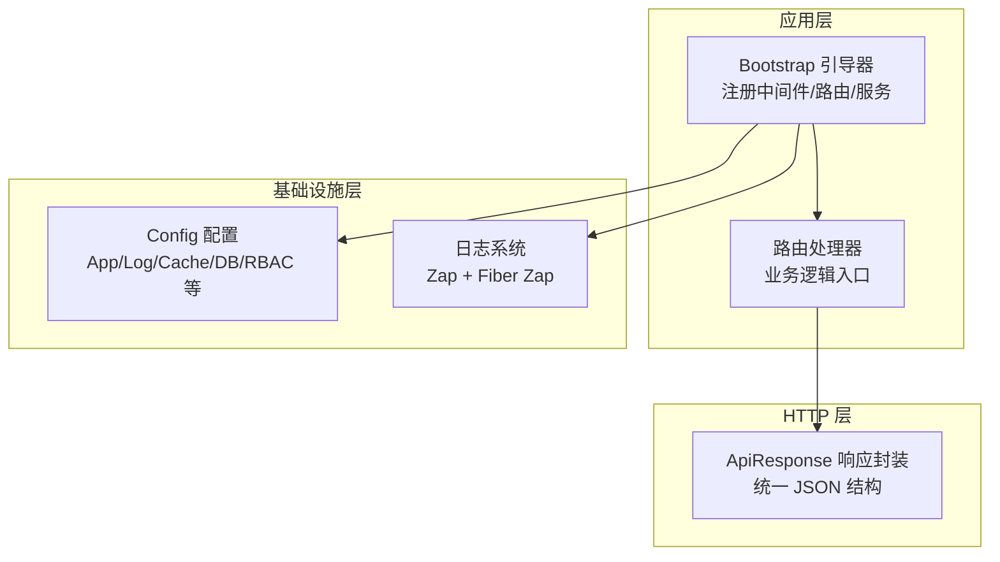
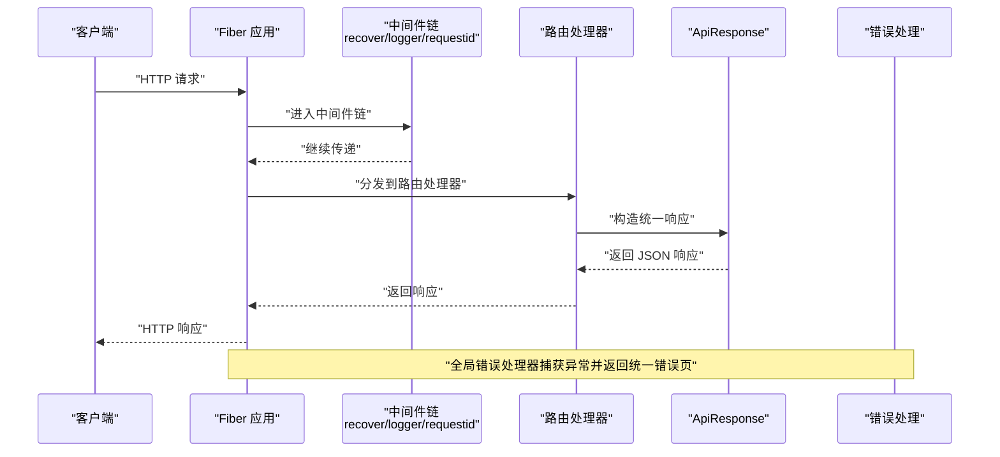
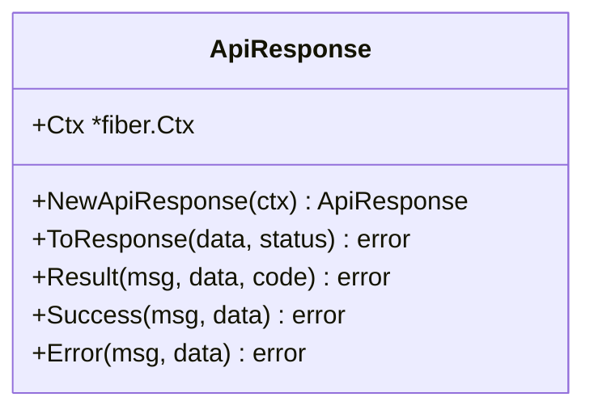
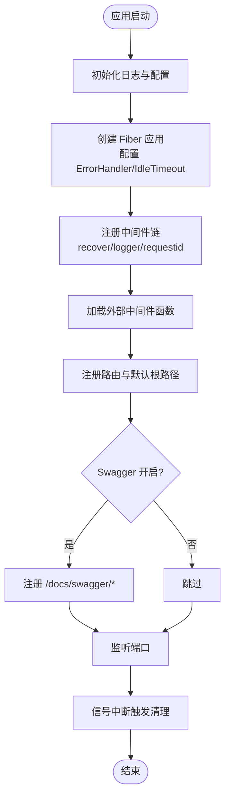
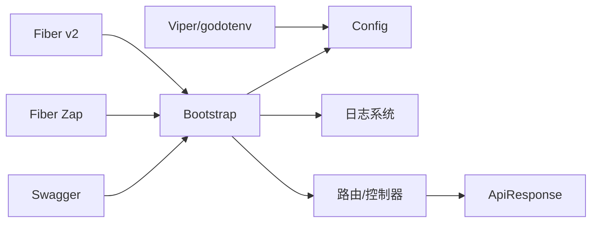

# HTTP响应处理

<cite>
**本文引用的文件**
- [http/ApiResponse.go](file://http/ApiResponse.go)
- [bootstrap/bootstrap.go](file://bootstrap/bootstrap.go)
- [config/config.go](file://config/config.go)
- [log/log.go](file://log/log.go)
- [README.md](file://README.md)
- [go.mod](file://go.mod)
</cite>

## 目录
1. [简介](#简介)
2. [项目结构](#项目结构)
3. [核心组件](#核心组件)
4. [架构总览](#架构总览)
5. [详细组件分析](#详细组件分析)
6. [依赖分析](#依赖分析)
7. [性能考量](#性能考量)
8. [故障排查指南](#故障排查指南)
9. [结论](#结论)
10. [附录](#附录)

## 简介
本技术文档聚焦于 CMF 的 HTTP 响应处理系统，围绕 API 响应标准化的设计理念与实现机制展开，系统性阐述统一响应格式、状态码管理与错误消息格式化策略。文档还涵盖响应压缩、CORS 处理与跨域安全考虑，帮助开发者构建一致、可预测且可靠的 API 接口，提升用户体验与系统稳定性。

## 项目结构
CMF 采用模块化设计，HTTP 响应处理位于 http 包；应用引导与中间件由 bootstrap 包负责；配置由 config 包提供；日志通过 log 包集成 Fiber Zap；技术栈与依赖在 go.mod 中声明。

图表来源
- [bootstrap/bootstrap.go:155-215](file://bootstrap/bootstrap.go#L155-L215)
- [http/ApiResponse.go:1-44](file://http/ApiResponse.go#L1-L44)
- [config/config.go:37-97](file://config/config.go#L37-L97)
- [log/log.go:14-83](file://log/log.go#L14-L83)

章节来源
- [README.md:55-75](file://README.md#L55-L75)
- [go.mod:1-26](file://go.mod#L1-L26)

## 核心组件
- ApiResponse 统一响应封装：提供 Result/Success/Error 三类便捷方法，统一输出 code/msg/data 结构，便于前端解析与状态判断。
- Bootstrap 引导器：集中初始化 Fiber 应用、注册中间件（恢复、日志、请求 ID）、错误处理、路由注册与 Swagger 文档。
- Config 配置：集中管理应用、日志、数据库、缓存、Redis、文件系统与 RBAC 等配置项。
- 日志系统：基于 Zap 的结构化日志，支持控制台与文件输出、日志轮转与压缩。

章节来源
- [http/ApiResponse.go:7-43](file://http/ApiResponse.go#L7-L43)
- [bootstrap/bootstrap.go:37-215](file://bootstrap/bootstrap.go#L37-L215)
- [config/config.go:37-97](file://config/config.go#L37-L97)
- [log/log.go:14-83](file://log/log.go#L14-L83)

## 架构总览
下图展示了从请求进入应用到响应返回的关键流程，以及错误处理与中间件链路。

图表来源
- [bootstrap/bootstrap.go:168-193](file://bootstrap/bootstrap.go#L168-L193)
- [bootstrap/bootstrap.go:258-277](file://bootstrap/bootstrap.go#L258-L277)
- [http/ApiResponse.go:15-43](file://http/ApiResponse.go#L15-L43)

## 详细组件分析

### ApiResponse 统一响应封装
- 设计理念
  - 统一响应结构：code/msg/data，便于前端一致性处理。
  - 状态码管理：Result 固定 200 状态码，具体业务状态由 code 字段表达；Success/Error 仅改变 code 值。
  - 空数据处理：ToResponse 对空 data 自动补位为对象，避免空指针。
- 方法族
  - ToResponse：设置状态码并输出 JSON。
  - Result：构造统一结构并调用 ToResponse。
  - Success/Error：分别以 code=1/0 快速返回成功/失败。
- 适用场景
  - 业务接口统一返回格式，减少前端分支判断复杂度。
  - 与全局错误处理配合，确保异常也走统一响应通道。

图表来源
- [http/ApiResponse.go:7-43](file://http/ApiResponse.go#L7-L43)

章节来源
- [http/ApiResponse.go:11-43](file://http/ApiResponse.go#L11-L43)

### Bootstrap 引导器与中间件链
- 初始化 Fiber 应用：配置 IdleTimeout、ErrorHandler。
- 中间件链：recover（异常恢复）、logger（结构化日志）、requestid（请求追踪）。
- 错误处理：根据 fiber.Error 的 Code 返回对应状态码，若找不到页面则降级返回固定文本。
- 路由注册：遍历注册的 RouteRegisterFunc，最后注册默认根路径与 Swagger 文档路由。
- 服务注册：将 Config、Cache、Filesystem 注册为单例服务，供后续模块使用。

图表来源
- [bootstrap/bootstrap.go:155-215](file://bootstrap/bootstrap.go#L155-L215)
- [bootstrap/bootstrap.go:217-277](file://bootstrap/bootstrap.go#L217-L277)

章节来源
- [bootstrap/bootstrap.go:155-215](file://bootstrap/bootstrap.go#L155-L215)
- [bootstrap/bootstrap.go:217-277](file://bootstrap/bootstrap.go#L217-L277)

### 配置与日志
- 配置结构：App、Log、Database、Cache、Redis、Filesystem、Casbin 等。
- 默认值：通过 viper.SetDefault 提供合理默认，支持 .env 与 YAML 配置文件。
- 日志：Zap + Fiber Zap，支持控制台与文件输出、日志轮转与压缩，按配置动态启用。

章节来源
- [config/config.go:37-97](file://config/config.go#L37-L97)
- [config/config.go:131-202](file://config/config.go#L131-L202)
- [log/log.go:14-83](file://log/log.go#L14-L83)

## 依赖分析
- 核心依赖
  - Fiber v2：Web 框架与中间件生态。
  - Fiber Zap：结构化日志中间件。
  - Swagger：API 文档生成与展示。
  - Viper/godotenv：配置管理与环境变量加载。
- 内部耦合
  - Bootstrap 通过服务注册模式向各模块提供单例服务（Config/Cache/Filesystem）。
  - ApiResponse 依赖 Fiber 上下文，面向控制器/路由层提供统一响应能力。
- 外部集成
  - 日志系统与 Fiber 集成，确保中间件链中的日志一致性。
  - Swagger 与配置联动，按开关决定是否暴露文档路由。

图表来源
- [go.mod:1-26](file://go.mod#L1-L26)
- [bootstrap/bootstrap.go:155-215](file://bootstrap/bootstrap.go#L155-L215)
- [config/config.go:102-220](file://config/config.go#L102-L220)
- [log/log.go:14-83](file://log/log.go#L14-L83)
- [http/ApiResponse.go:3-5](file://http/ApiResponse.go#L3-L5)

章节来源
- [go.mod:1-26](file://go.mod#L1-L26)
- [bootstrap/bootstrap.go:155-215](file://bootstrap/bootstrap.go#L155-L215)
- [config/config.go:102-220](file://config/config.go#L102-L220)
- [log/log.go:14-83](file://log/log.go#L14-L83)
- [http/ApiResponse.go:3-5](file://http/ApiResponse.go#L3-L5)

## 性能考量
- 响应序列化：统一 JSON 输出，减少序列化开销与格式差异带来的解析成本。
- 中间件链：recover/logger/requestid 为轻量中间件，对性能影响较小；可通过配置调整日志级别与输出目标。
- 错误处理：全局错误处理器避免重复错误响应逻辑，降低路由层负担。
- 日志轮转：文件日志采用 lumberjack 轮转与压缩，兼顾磁盘空间与读取效率。
- 建议
  - 对高频接口可结合缓存策略与响应压缩（需在中间件链中引入压缩中间件）进一步优化。
  - 合理设置 IdleTimeout 与并发限制，避免资源浪费。

[本节为通用性能建议，无需特定文件引用]

## 故障排查指南
- 统一错误响应
  - 全局错误处理器会根据 fiber.Error 的 Code 返回对应状态码；若找不到对应错误页，将降级返回固定文本。
  - 建议在业务层抛出带状态码的 fiber.Error，以便统一处理。
- 日志定位
  - 使用 requestid 中间件追踪请求链路；结合结构化日志快速定位问题。
  - 检查日志输出配置（控制台/文件），确认日志轮转参数是否合理。
- 路由与文档
  - 确认 Swagger 开关与文档路由是否正确注册。
  - 检查路由注册顺序与中间件是否阻断了后续处理。
- 配置校验
  - 确认 .env 与配置文件路径正确，必要时打印当前配置以核对。

章节来源
- [bootstrap/bootstrap.go:168-193](file://bootstrap/bootstrap.go#L168-L193)
- [bootstrap/bootstrap.go:258-277](file://bootstrap/bootstrap.go#L258-L277)
- [log/log.go:14-83](file://log/log.go#L14-L83)

## 结论
CMF 的 HTTP 响应处理通过 ApiResponse 实现统一的 JSON 结构与状态码管理，结合 Bootstrap 的中间件链与全局错误处理，形成一致、可预测且可靠的 API 接口体验。配合结构化日志与配置体系，开发者可以快速构建高性能、易维护的 Web 应用。

[本节为总结性内容，无需特定文件引用]

## 附录

### API 响应结构与状态码约定
- 统一响应结构
  - code：业务状态码（1 表示成功，0 表示失败）
  - msg：人类可读的消息
  - data：业务数据（对象或数组）
- 状态码管理
  - Result 固定返回 200；业务状态由 code 字段表达。
  - Success：code=1，msg 为成功消息，data 为业务数据。
  - Error：code=0，msg 为错误消息，data 为错误上下文或空对象。
- 错误消息格式化
  - 建议在业务层将错误转换为统一的错误对象，包含 code/msg/data，交由 ApiResponse 输出。
  - 对于异常，使用 fiber.Error 并设置合适的状态码，由全局错误处理器统一渲染。

章节来源
- [http/ApiResponse.go:25-43](file://http/ApiResponse.go#L25-L43)

### CORS 处理与跨域安全
- 当前实现
  - 未内置 CORS 中间件；如需跨域支持，请在中间件链中引入 CORS 中间件，并严格限定允许的源、方法与头。
- 安全建议
  - 仅允许受信域名；避免使用通配符。
  - 明确允许的 HTTP 方法与自定义头，最小化暴露面。
  - 对敏感操作启用预检请求（OPTIONS）并进行鉴权与校验。

[本节为概念性指导，无需特定文件引用]

### 响应压缩与性能优化
- 压缩中间件
  - 建议在中间件链中引入压缩中间件，对大体积 JSON 响应进行压缩，降低带宽占用。
- 优化建议
  - 对高频接口启用缓存；对长列表分页返回；避免不必要的字段传输。
  - 合理设置 IdleTimeout 与并发限制，避免资源浪费。

[本节为通用优化建议，无需特定文件引用]