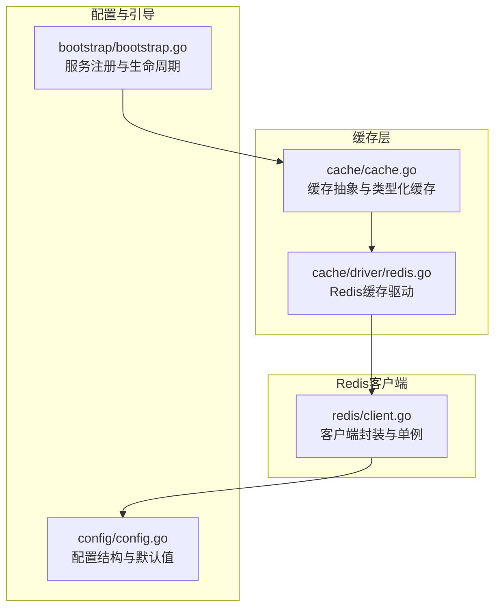
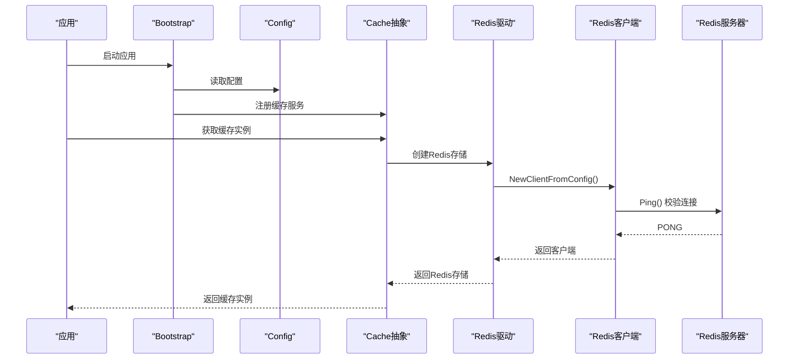
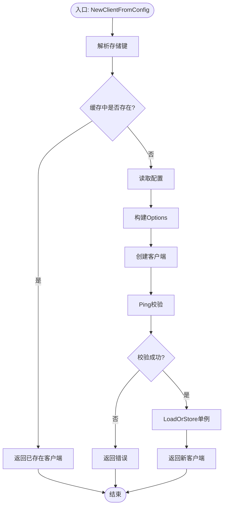
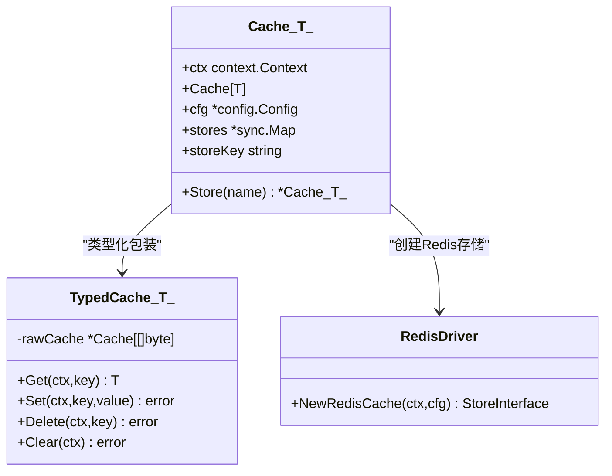
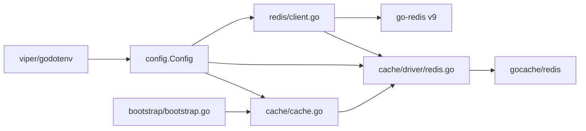

# Redis客户端

<cite>
**本文引用的文件**
- [redis/client.go](file://redis/client.go)
- [cache/driver/redis.go](file://cache/driver/redis.go)
- [cache/cache.go](file://cache/cache.go)
- [config/config.go](file://config/config.go)
- [bootstrap/bootstrap.go](file://bootstrap/bootstrap.go)
- [README.md](file://README.md)
- [go.mod](file://go.mod)
</cite>

## 目录
1. [简介](#简介)
2. [项目结构](#项目结构)
3. [核心组件](#核心组件)
4. [架构总览](#架构总览)
5. [详细组件分析](#详细组件分析)
6. [依赖分析](#依赖分析)
7. [性能考虑](#性能考虑)
8. [故障排查指南](#故障排查指南)
9. [结论](#结论)
10. [附录](#附录)

## 简介
本技术文档围绕 CMF 框架中的 Redis 客户端实现展开，重点阐述以下方面：
- 设计理念与连接池管理机制
- 配置选项、连接参数与超时设置
- 单例客户端与并发安全
- 与缓存层的集成方式
- 性能监控、故障处理与连接池优化策略
- 使用 Redis 进行缓存、会话存储与消息传递的最佳实践

说明：当前仓库实现主要基于 go-redis v9 客户端，支持单机模式；对于集群与哨兵模式，需结合 go-redis 的高级特性进行扩展。

## 项目结构
Redis 客户端相关代码集中在以下模块：
- redis 包：Redis 客户端封装与单例管理
- cache 包：缓存抽象与 Redis 驱动集成
- config 包：配置结构与默认值
- bootstrap 包：服务注册与生命周期管理
- README 与 go.mod：技术栈与依赖说明

图表来源
- [redis/client.go:1-119](file://redis/client.go#L1-L119)
- [cache/driver/redis.go:1-25](file://cache/driver/redis.go#L1-L25)
- [cache/cache.go:1-144](file://cache/cache.go#L1-L144)
- [config/config.go:1-288](file://config/config.go#L1-L288)
- [bootstrap/bootstrap.go:1-278](file://bootstrap/bootstrap.go#L1-L278)

章节来源
- [README.md:50-75](file://README.md#L50-L75)
- [go.mod:1-26](file://go.mod#L1-L26)

## 核心组件
- Redis 客户端封装与单例
  - Options：集中定义连接与池化参数
  - NewClient：基于 go-redis v9 创建客户端
  - NewClientFromConfig：从全局配置创建并校验连接，使用 sync.Map 维持单例
- 缓存层集成
  - cache/driver/redis.go：基于 gocache 的 Redis 存储适配器
  - cache/cache.go：通用缓存抽象、类型化缓存与多存储切换
- 配置系统
  - config/config.go：Redis 配置结构、默认值与环境变量映射
- 引导与服务注册
  - bootstrap/bootstrap.go：注册配置与缓存服务，便于全局获取

章节来源
- [redis/client.go:14-118](file://redis/client.go#L14-L118)
- [cache/driver/redis.go:13-24](file://cache/driver/redis.go#L13-L24)
- [cache/cache.go:15-144](file://cache/cache.go#L15-L144)
- [config/config.go:10-97](file://config/config.go#L10-L97)
- [bootstrap/bootstrap.go:47-66](file://bootstrap/bootstrap.go#L47-L66)

## 架构总览
Redis 客户端在 CMF 中的职责是为上层缓存与业务逻辑提供稳定、高性能的底层连接。整体交互如下：

图表来源
- [bootstrap/bootstrap.go:57-66](file://bootstrap/bootstrap.go#L57-L66)
- [cache/cache.go:24-55](file://cache/cache.go#L24-L55)
- [cache/driver/redis.go:13-24](file://cache/driver/redis.go#L13-L24)
- [redis/client.go:58-118](file://redis/client.go#L58-L118)

## 详细组件分析

### Redis 客户端封装与单例管理
- 设计要点
  - Options 聚合连接与池化参数，直接映射到 go-redis v9 的 redis.Options
  - NewClient 对 go-redis 的 NewClient 进行轻量封装，便于统一管理
  - NewClientFromConfig 从全局配置读取参数，支持 TLS、Ping 校验与单例模式
  - 使用 sync.Map 作为全局客户端缓存，避免重复创建与资源浪费
- 关键流程
  - 解析默认或传入的存储键
  - 从配置表中读取对应连接参数
  - 构造 Options 并创建客户端
  - 执行 Ping 校验，失败则返回错误
  - 使用 LoadOrStore 保证单例，避免并发竞争导致的重复实例

图表来源
- [redis/client.go:58-118](file://redis/client.go#L58-L118)

章节来源
- [redis/client.go:14-118](file://redis/client.go#L14-L118)

### 缓存层与 Redis 驱动集成
- 缓存抽象
  - cache/cache.go 提供通用缓存接口与类型化缓存（TypedCache），通过 JSON 序列化支持任意类型
  - 支持多存储切换（Store），内部共享同一 sync.Map 存储不同存储实例
- Redis 驱动
  - cache/driver/redis.go 基于 gocache 的 Redis 存储适配器，结合 TTL 配置
  - 通过 NewRedisCache 获取 Redis 客户端并创建存储实例

图表来源
- [cache/cache.go:15-144](file://cache/cache.go#L15-L144)
- [cache/driver/redis.go:13-24](file://cache/driver/redis.go#L13-L24)

章节来源
- [cache/cache.go:15-144](file://cache/cache.go#L15-L144)
- [cache/driver/redis.go:13-24](file://cache/driver/redis.go#L13-L24)

### 配置系统与默认值
- 配置结构
  - Redis 结构体包含地址、认证、DB、超时、池化参数与 TLS 开关
  - Config 结构体包含 Redis.Default 与 Redis.Connections 映射
- 默认值
  - 提供完整的默认值，涵盖连接超时、读写超时、池大小、空闲连接数、空闲与生命周期等
  - 默认不启用 TLS，可在配置中开启

章节来源
- [config/config.go:10-24](file://config/config.go#L10-L24)
- [config/config.go:74-77](file://config/config.go#L74-L77)
- [config/config.go:149-163](file://config/config.go#L149-L163)

### 引导与服务注册
- Bootstrap 在启动阶段注册配置与缓存服务，便于后续模块通过服务容器获取
- 缓存服务在注册时即创建默认存储（如 Redis），确保应用启动后即可使用

章节来源
- [bootstrap/bootstrap.go:47-66](file://bootstrap/bootstrap.go#L47-L66)

## 依赖分析
- 外部依赖
  - go-redis v9：Redis 客户端核心
  - gocache 与 gocache/store/redis：缓存抽象与 Redis 存储适配
  - viper 与 godotenv：配置加载与环境变量支持
- 内部依赖
  - redis/client.go 依赖 config.Config
  - cache/driver/redis.go 依赖 redis/client.go 与 config.Config
  - cache/cache.go 依赖 driver/redis.go 与 config.Config
  - bootstrap/bootstrap.go 依赖 cache/cache.go 与 config.Config

图表来源
- [go.mod:5-26](file://go.mod#L5-L26)
- [config/config.go:10-97](file://config/config.go#L10-L97)
- [redis/client.go:10-11](file://redis/client.go#L10-L11)
- [cache/driver/redis.go:7-10](file://cache/driver/redis.go#L7-L10)
- [cache/cache.go:9-12](file://cache/cache.go#L9-L12)
- [bootstrap/bootstrap.go:19-22](file://bootstrap/bootstrap.go#L19-L22)

章节来源
- [go.mod:1-26](file://go.mod#L1-L26)

## 性能考虑
- 连接池参数
  - PoolSize：根据并发请求量与 CPU 核心数合理设置，避免过大导致内存占用过高
  - MinIdleConns/MaxIdleConns：维持一定数量的空闲连接，降低频繁创建销毁开销
  - ConnMaxIdleTime/ConnMaxLifetime：控制连接生命周期，防止长时间占用导致资源泄漏
- 超时设置
  - DialTimeout：连接建立超时，建议与网络延迟匹配
  - ReadTimeout/WriteTimeout：读写超时，避免阻塞线程
- 单例与并发
  - 使用 sync.Map 保证单例，减少重复创建
  - go-redis v9 内部已具备高并发能力，无需额外加锁
- 类型化缓存
  - TypedCache 通过 JSON 序列化/反序列化，注意序列化成本与数据体积
- 监控与观测
  - 建议结合 Prometheus 或应用日志统计连接池命中率、错误率与延迟分布
  - 对关键路径增加超时与重试策略（需在业务层实现）

[本节为通用性能建议，不直接分析具体文件]

## 故障排查指南
- 连接失败
  - 检查 Redis 地址、认证信息与网络连通性
  - 查看 NewClientFromConfig 的 Ping 校验是否报错
- 单例异常
  - 确认是否多次调用 NewClientFromConfig 且传入相同存储键
  - 若出现重复实例，检查 LoadOrStore 的并发竞争
- 配置问题
  - 确认 config.Config 中 Redis.Default 与 Connections 键一致
  - 检查默认值是否覆盖预期，必要时通过环境变量或配置文件调整
- 缓存不可用
  - 确认缓存驱动已注册为 Redis
  - 检查 TTL 设置与序列化/反序列化过程

章节来源
- [redis/client.go:58-118](file://redis/client.go#L58-L118)
- [cache/cache.go:24-55](file://cache/cache.go#L24-L55)
- [config/config.go:149-163](file://config/config.go#L149-L163)

## 结论
CMF 的 Redis 客户端实现以简洁、稳健为核心目标：通过 Options 统一参数管理、NewClientFromConfig 提供从配置创建与校验能力、sync.Map 保障单例与并发安全。配合 gocache 的 Redis 驱动与缓存抽象，开发者可以快速在应用中启用高性能缓存。对于集群与哨兵模式，可在现有封装基础上扩展 go-redis 的高级特性，以满足更高可用与扩展性需求。

[本节为总结性内容，不直接分析具体文件]

## 附录

### Redis 配置选项与含义
- addr：Redis 服务器地址，格式为 host:port
- username/password：认证凭据
- db：数据库索引
- dial_timeout/read_timeout/write_timeout：连接、读、写超时（秒）
- pool_size/min_idle_conns/max_idle_conns：连接池大小与空闲连接范围
- conn_max_idle_time/conn_max_lifetime：连接最大空闲时间（分钟）与最大生命周期（小时）
- use_tls：是否启用 TLS 加密连接

章节来源
- [config/config.go:10-24](file://config/config.go#L10-L24)
- [config/config.go:149-163](file://config/config.go#L149-L163)

### 使用示例与最佳实践
- 缓存使用
  - 通过 Bootstrap 注册的缓存服务获取实例
  - 使用 TypedCache 进行类型安全的读写
  - 合理设置默认 TTL，避免缓存污染
- 会话存储
  - 建议将 Session 存储在 Redis 中，结合 TTL 控制过期
  - 使用独立的 DB 或键空间，避免与其他缓存冲突
- 消息传递
  - 可使用 Redis Streams 或 Pub/Sub 实现异步消息
  - 注意消息确认与重试策略，避免丢失
- 连接池优化
  - 根据 QPS 与响应时间调整 pool_size 与空闲连接数
  - 合理设置超时，避免长尾请求拖累整体性能
  - 定期巡检连接状态与错误日志

[本节为通用实践建议，不直接分析具体文件]