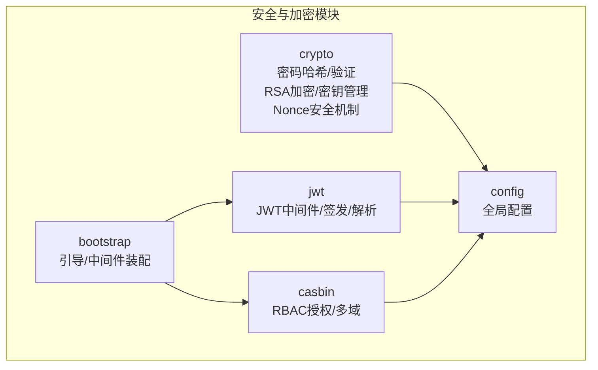
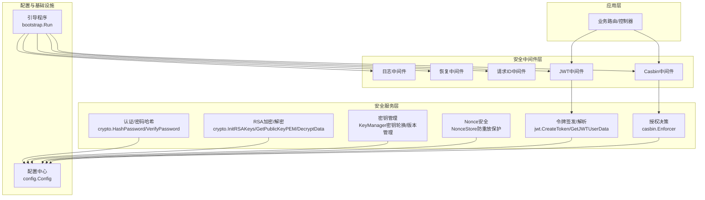
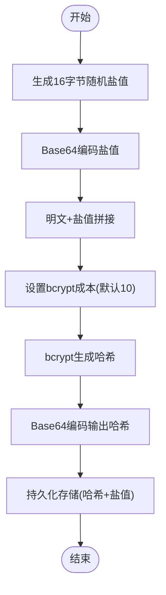
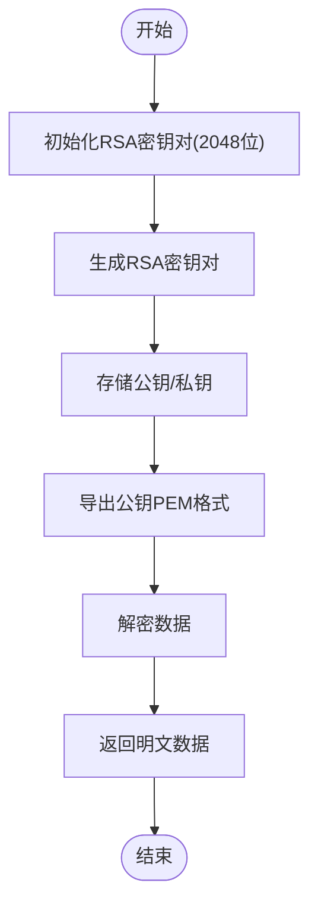
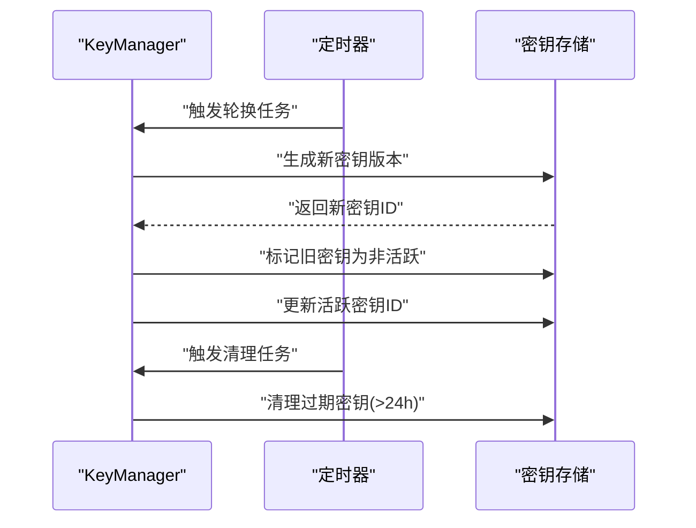
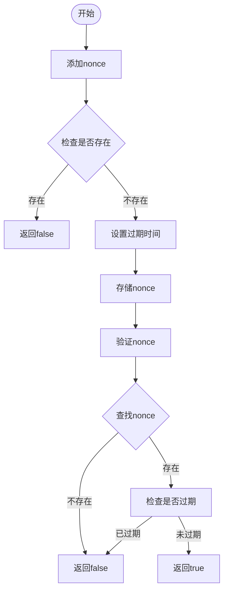
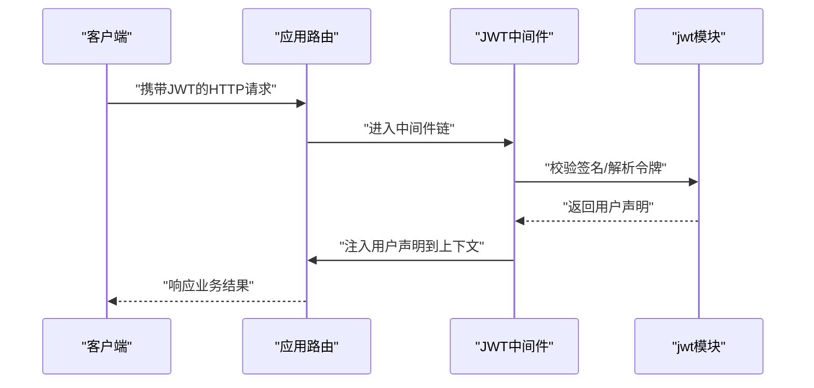
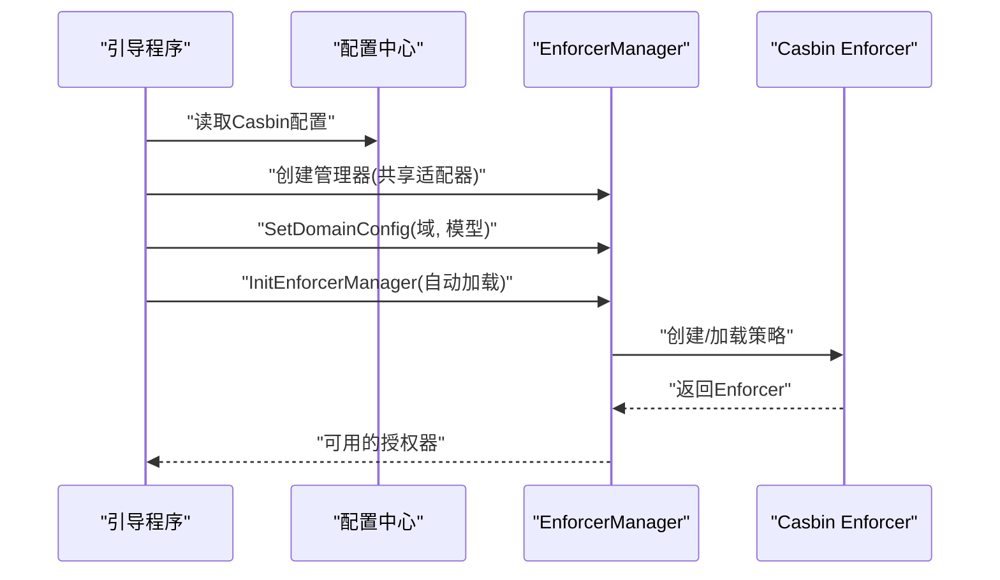
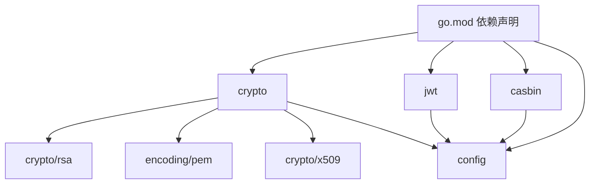

# 安全与加密

<cite>
**本文引用的文件**
- [crypto.go](file://crypto/crypto.go)
- [key_manager.go](file://crypto/key_manager.go)
- [nonce.go](file://crypto/nonce.go)
- [jwt.go](file://jwt/jwt.go)
- [casbin.go](file://casbin/casbin.go)
- [enforcer_manager.go](file://casbin/enforcer_manager.go)
- [errors.go](file://casbin/errors.go)
- [config.go](file://config/config.go)
- [bootstrap.go](file://bootstrap/bootstrap.go)
- [go.mod](file://go.mod)
- [README.md](file://README.md)
</cite>

## 更新摘要
**变更内容**
- 新增完整的RSA加密框架，支持RSA密钥对生成、公钥PEM格式导出和数据解密
- 新增KeyManager企业级密钥管理系统，支持密钥版本管理、自动轮换和过期清理
- 新增NonceStore防重放攻击保护机制，支持nonce验证和时间戳校验
- 扩展加密工具功能，将RSA与传统bcrypt密码哈希相结合
- 增强安全基础设施，提供更全面的企业级安全解决方案

## 目录
1. [简介](#简介)
2. [项目结构](#项目结构)
3. [核心组件](#核心组件)
4. [架构总览](#架构总览)
5. [详细组件分析](#详细组件分析)
6. [依赖关系分析](#依赖关系分析)
7. [性能考量](#性能考量)
8. [故障排查指南](#故障排查指南)
9. [结论](#结论)
10. [附录](#附录)

## 简介
本文件聚焦于 CMF 安全与加密模块，系统阐述密码加密算法选择与实现、密钥与盐值管理、哈希验证机制、JWT 签名与中间件、以及基于 Casbin 的 RBAC 授权与安全配置。**最新更新**包含了全新的RSA加密框架、企业级密钥管理系统和nonce安全机制，为企业级应用提供更全面的安全保障。文档面向开发者与安全工程师，提供可操作的最佳实践、常见漏洞防护与合规建议，帮助构建安全可靠的应用系统。

## 项目结构
围绕安全与加密的关键模块如下：
- crypto：密码哈希与验证（基于 bcrypt）、RSA加密框架、密钥管理、nonce安全机制
- jwt：JWT 中间件与令牌签发、解析
- casbin：基于 Casbin 的 RBAC 授权与多域策略管理
- config：全局配置（含应用密钥、登录过期等）
- bootstrap：应用引导与中间件装配（含恢复、日志、请求 ID）

**图表来源**
- [crypto.go:1-168](file://crypto/crypto.go#L1-L168)
- [key_manager.go:1-193](file://crypto/key_manager.go#L1-L193)
- [nonce.go:1-109](file://crypto/nonce.go#L1-L109)
- [jwt.go:1-25](file://jwt/jwt.go#L1-L25)
- [casbin.go:1-79](file://casbin/casbin.go#L1-L79)
- [config.go:37-97](file://config/config.go#L37-L97)
- [bootstrap.go:155-215](file://bootstrap/bootstrap.go#L155-L215)

**章节来源**
- [README.md:55-75](file://README.md#L55-L75)
- [go.mod:1-26](file://go.mod#L1-L26)

## 核心组件
- 密码加密与验证（crypto）：提供基于 bcrypt 的密码哈希与验证流程，内置随机盐值生成与 base64 编解码。
- **RSA加密框架**：提供RSA密钥对生成、公钥PEM格式导出、数据解密等完整RSA加密功能。
- **密钥管理系统（KeyManager）**：企业级密钥管理，支持密钥版本控制、自动轮换、过期清理和并发安全。
- **Nonce安全机制（NonceStore）**：防重放攻击保护，支持nonce验证、时间戳校验和过期清理。
- JWT 认证（jwt）：提供 JWT 中间件、令牌签发与用户数据提取。
- 授权控制（casbin）：基于 Casbin 的 RBAC 授权，支持多域模型与策略适配器。
- 配置中心（config）：集中管理应用密钥、登录过期、Casbin 多域等安全相关配置。
- 引导与中间件（bootstrap）：统一装配恢复、日志、请求 ID 等中间件，保障安全可观测性。

**章节来源**
- [crypto.go:10-168](file://crypto/crypto.go#L10-L168)
- [key_manager.go:24-193](file://crypto/key_manager.go#L24-L193)
- [nonce.go:8-109](file://crypto/nonce.go#L8-L109)
- [jwt.go:9-24](file://jwt/jwt.go#L9-L24)
- [casbin.go:12-78](file://casbin/casbin.go#L12-L78)
- [config.go:37-97](file://config/config.go#L37-L97)
- [bootstrap.go:189-195](file://bootstrap/bootstrap.go#L189-L195)

## 架构总览
下图展示安全与加密模块在应用中的交互关系与职责边界，**新增了RSA加密框架、密钥管理和nonce安全机制**：

**图表来源**
- [bootstrap.go:189-195](file://bootstrap/bootstrap.go#L189-L195)
- [jwt.go:9-24](file://jwt/jwt.go#L9-L24)
- [casbin.go:16-21](file://casbin/casbin.go#L16-L21)
- [crypto.go:19-168](file://crypto/crypto.go#L19-L168)
- [key_manager.go:38-193](file://crypto/key_manager.go#L38-L193)
- [nonce.go:20-109](file://crypto/nonce.go#L20-L109)
- [config.go:37-97](file://config/config.go#L37-L97)

## 详细组件分析

### 组件一：密码加密与验证（crypto）
- 设计要点
  - 使用 bcrypt 对"明文密码+盐值"进行哈希，避免独立存储盐值导致的重复风险。
  - 盐值通过安全随机源生成并以 base64 编码存储，便于跨系统传输与持久化。
  - 支持可选的成本参数，平衡安全性与性能。
  - 验证流程严格区分"不匹配"与"异常错误"，避免泄露验证细节。
- 关键流程
  - 哈希流程：生成随机盐值 → base64 编码盐值 → 明文+盐值拼接 → bcrypt 哈希 → base64 编码结果
  - 验证流程：base64 解码存储的哈希 → 明文+盐值拼接 → bcrypt 对比 → 返回布尔结果
- 安全建议
  - 成本参数建议不低于 12；在高并发场景评估 CPU 资源与延迟。
  - 不要将盐值与哈希分离存储；若需迁移，保持"盐值+哈希"的整体存储策略一致。
  - 定期轮换应用密钥（用于签名 JWT 等），并与密码哈希策略协同。

**图表来源**
- [crypto.go:19-47](file://crypto/crypto.go#L19-L47)

**章节来源**
- [crypto.go:10-79](file://crypto/crypto.go#L10-L79)

### 组件二：RSA加密框架（crypto）
- 设计要点
  - 单例模式管理RSA密钥对，确保全局唯一性和线程安全。
  - 支持2048位RSA密钥生成，符合现代安全标准。
  - 提供公钥PEM格式导出，便于与其他系统集成。
  - 支持Base64编码密文的解密，使用PKCS1v15填充方案。
- 关键流程
  - 初始化：首次调用时生成RSA密钥对 → 存储公钥和私钥 → 线程安全初始化
  - 公钥导出：序列化公钥 → PEM编码 → 返回PEM格式字符串
  - 数据解密：Base64解码密文 → RSA私钥解密 → 返回明文数据
- 安全建议
  - 私钥应妥善保管，建议使用硬件安全模块(HSM)或密钥管理服务。
  - 公钥可以公开分发，但应定期轮换以应对潜在的安全威胁。
  - 解密操作应在安全的环境中执行，避免内存泄漏和侧信道攻击。

**图表来源**
- [crypto.go:92-168](file://crypto/crypto.go#L92-L168)

**章节来源**
- [crypto.go:92-168](file://crypto/crypto.go#L92-L168)

### 组件三：密钥管理系统（KeyManager）
- 设计要点
  - 企业级密钥管理，支持多版本密钥并存和切换。
  - 自动密钥轮换机制，支持配置轮换间隔和密钥有效期。
  - 过期密钥清理功能，确保系统资源的有效利用。
  - 并发安全的读写锁保护，支持高并发场景下的密钥管理。
- 关键流程
  - 初始化：创建密钥管理器 → 生成初始密钥 → 启动轮换和清理定时任务
  - 密钥生成：标记当前密钥为非活跃 → 生成新密钥对 → 设置过期时间 → 更新活跃密钥
  - 密钥轮换：定时触发 → 生成新密钥 → 保留最近24小时密钥
  - 密钥清理：定期清理过期超过24小时的密钥版本
- 安全建议
  - 密钥轮换周期应根据业务安全需求配置，建议不超过90天。
  - 密钥有效期应设置合理的上限，避免长期有效的密钥带来安全风险。
  - 密钥版本信息应记录详细的元数据，便于审计和追踪。

**图表来源**
- [key_manager.go:38-193](file://crypto/key_manager.go#L38-L193)

**章节来源**
- [key_manager.go:24-193](file://crypto/key_manager.go#L24-L193)

### 组件四：Nonce安全机制（NonceStore）
- 设计要点
  - 防重放攻击的核心机制，通过唯一nonce标识防止消息重放。
  - 支持配置过期时间，默认5分钟，可根据业务需求调整。
  - 时间戳校验功能，支持配置时间窗口防止时钟偏移影响。
  - 定时清理过期nonce，避免内存无限增长。
- 关键流程
  - 添加nonce：检查是否存在 → 不存在则添加 → 设置过期时间 → 返回true
  - 验证nonce：查找nonce → 检查是否存在 → 检查是否过期 → 返回验证结果
  - 时间戳验证：计算当前时间差 → 检查是否在有效窗口内
  - 定时清理：定期遍历存储 → 删除过期nonce
- 安全建议
  - nonce长度应足够长以防止碰撞，建议至少16字节。
  - 过期时间应根据业务响应时间和网络延迟合理设置。
  - 时间窗口应考虑分布式系统中的时钟同步误差。

**图表来源**
- [nonce.go:20-109](file://crypto/nonce.go#L20-L109)

**章节来源**
- [nonce.go:8-109](file://crypto/nonce.go#L8-L109)

### 组件五：JWT 认证（jwt）
- 设计要点
  - 基于 HS256 签名算法，使用配置中心提供的密钥进行签发与校验。
  - 提供中间件封装，自动解析请求中的 JWT 并注入用户声明。
  - 提供从上下文提取用户声明的便捷方法，便于后续授权与审计。
- 关键流程
  - 中间件：校验签名 → 解析令牌 → 注入用户声明到上下文
  - 签发：构造声明 → 使用密钥签名 → 返回令牌字符串
  - 提取：从上下文 locals 中取出用户令牌 → 转换为 MapClaims

**图表来源**
- [jwt.go:9-24](file://jwt/jwt.go#L9-L24)

**章节来源**
- [jwt.go:1-25](file://jwt/jwt.go#L1-L25)
- [config.go:37-48](file://config/config.go#L37-L48)

### 组件六：RBAC 授权（casbin）
- 设计要点
  - 通过 EnforcerManager 管理多域 Enforcer 实例，支持模型文件或模型文本两种方式。
  - 使用共享策略适配器，结合模型与策略加载，实现统一授权决策。
  - 提供初始化函数，根据配置动态设置域与自动加载策略。
- 关键流程
  - 初始化：读取配置 → 设置域配置 → 自动加载（可选）→ 创建 Enforcer
  - 多域：双重检查锁定模式，保证并发安全地创建与获取 Enforcer
  - 授权：通过 Enforcer 进行策略匹配与决策

**图表来源**
- [casbin.go:48-78](file://casbin/casbin.go#L48-L78)
- [enforcer_manager.go:99-143](file://casbin/enforcer_manager.go#L99-L143)

**章节来源**
- [casbin.go:1-79](file://casbin/casbin.go#L1-L79)
- [enforcer_manager.go:1-226](file://casbin/enforcer_manager.go#L1-L226)
- [errors.go:1-31](file://casbin/errors.go#L1-L31)

### 组件七：配置与密钥管理（config）
- 设计要点
  - 集中定义应用密钥、登录过期时间、Casbin 多域等安全相关配置。
  - 支持环境变量与默认值，便于不同环境部署。
  - 提供保存配置的能力，便于运行时调整（需配合权限控制）。
- 安全建议
  - 应用密钥应定期轮换，避免硬编码在源码中。
  - 登录过期与刷新过期应结合业务风险合理设置。
  - Casbin 多域模型与策略应版本化管理，变更需审计与回滚预案。

**章节来源**
- [config.go:37-97](file://config/config.go#L37-L97)
- [config.go:131-202](file://config/config.go#L131-L202)

### 组件八：引导与中间件（bootstrap）
- 设计要点
  - 统一注册恢复、日志、请求 ID 中间件，提升安全可观测性与稳定性。
  - 通过服务容器注册配置、缓存、文件系统等核心服务，便于模块间解耦。
- 安全建议
  - 错误处理器应避免泄露内部错误细节。
  - 日志应脱敏敏感字段，防止日志泄露。

**章节来源**
- [bootstrap.go:189-195](file://bootstrap/bootstrap.go#L189-L195)
- [bootstrap.go:218-226](file://bootstrap/bootstrap.go#L218-L226)

## 依赖关系分析
- 外部依赖
  - bcrypt：密码哈希与对比
  - golang-jwt：JWT 签名与解析
  - casbin：RBAC 授权引擎
  - viper/godotenv：配置加载与环境变量
  - **crypto/rsa：RSA加密解密**
  - **crypto/x509：X.509证书和公钥序列化**
  - **encoding/pem：PEM格式编码解码**
- 内部依赖
  - crypto 依赖 config 的密钥与成本参数
  - **crypto 新增依赖 RSA 和PEM编码**
  - jwt 依赖 config 的密钥与过期配置
  - casbin 依赖 config 的多域模型配置

**图表来源**
- [go.mod:5-26](file://go.mod#L5-L26)
- [crypto.go:3-13](file://crypto/crypto.go#L3-L13)
- [jwt.go:3-7](file://jwt/jwt.go#L3-L7)
- [casbin.go:3-10](file://casbin/casbin.go#L3-L10)
- [config.go:3-9](file://config/config.go#L3-L9)

**章节来源**
- [go.mod:1-103](file://go.mod#L1-L103)

## 性能考量
- bcrypt 成本参数
  - 成本越高，安全性越高，CPU 开销越大。建议在生产环境不低于 12，并结合基准测试评估延迟。
- **RSA加密性能**
  - RSA加密解密开销较大，适合小数据量加密和密钥交换。
  - 建议使用RSA加密对称密钥，再使用对称加密算法处理大量数据。
  - 密钥长度2048位提供足够的安全性，但会增加计算开销。
- **密钥管理性能**
  - KeyManager使用并发安全的数据结构，支持高并发场景。
  - 定时任务采用ticker机制，避免阻塞主业务逻辑。
  - 密钥轮换和清理任务异步执行，不影响请求处理性能。
- **Nonce存储性能**
  - 使用map存储nonce，查找和插入操作均为O(1)。
  - 定时清理任务每分钟执行一次，平衡内存使用和清理频率。
  - 过期时间默认5分钟，可根据业务需求调整。
- JWT 签名
  - HS256 为对称算法，性能较好；若跨服务或跨系统，可考虑 RS256 并引入密钥轮换策略。
- Casbin 多域
  - 使用 EnforcerManager 的双重检查锁定与共享适配器，降低并发冲突与资源占用。
- 日志与中间件
  - 合理配置日志级别与输出位置，避免磁盘 IO 影响性能。

## 故障排查指南
- 密码验证失败
  - 检查存储的哈希与盐值是否完整；确认 bcrypt 对比错误是否为"不匹配"而非异常。
  - 确认成本参数与历史数据一致，避免迁移后验证失败。
- **RSA解密失败**
  - 检查密钥是否正确初始化；确认使用正确的私钥进行解密。
  - 验证Base64编码的密文格式是否正确；检查填充方案是否匹配。
  - 确认密钥长度和算法参数是否正确。
- **密钥管理异常**
  - 检查密钥轮换定时任务是否正常运行；确认密钥版本状态。
  - 验证密钥过期时间设置是否合理；检查密钥清理功能。
  - 确认并发访问时的锁机制是否正常工作。
- **Nonce验证失败**
  - 检查nonce是否已过期；确认时间窗口设置是否合适。
  - 验证时间戳格式和时区设置；检查系统时钟同步。
  - 确认nonce存储是否正常工作；检查内存泄漏问题。
- JWT 令牌无效
  - 校验密钥是否正确；确认签名算法与签发方一致；检查过期时间与系统时间。
- Casbin 授权异常
  - 检查模型文件/文本是否正确；确认策略已加载；核对域配置与自动加载开关。
- 配置读取问题
  - 确认环境变量前缀与文件路径；检查默认值与实际值是否冲突。

**章节来源**
- [crypto.go:59-168](file://crypto/crypto.go#L59-L168)
- [key_manager.go:115-193](file://crypto/key_manager.go#L115-L193)
- [nonce.go:51-109](file://crypto/nonce.go#L51-L109)
- [jwt.go:9-24](file://jwt/jwt.go#L9-L24)
- [casbin.go:48-78](file://casbin/casbin.go#L48-L78)
- [enforcer_manager.go:99-143](file://casbin/enforcer_manager.go#L99-L143)
- [errors.go:5-24](file://casbin/errors.go#L5-L24)

## 结论
CMF 的安全与加密模块以 bcrypt、JWT、Casbin 为核心，**新增的RSA加密框架、密钥管理系统和nonce安全机制**进一步增强了企业级安全能力。通过KeyManager的密钥轮换、NonceStore的防重放保护，以及完整的RSA加密功能，系统形成了多层次、全方位的安全防护体系。遵循本文的安全最佳实践与配置建议，可在保证性能的同时显著提升系统的抗攻击能力与合规水平。

## 附录
- **安全审计清单**
  - 密钥轮换策略与密钥管理流程
  - 密码哈希成本参数与迁移计划
  - JWT 密钥与过期策略审计
  - Casbin 模型与策略版本化与回滚
  - RSA密钥管理与轮换策略
  - Nonce存储与防重放机制审计
  - 日志脱敏与错误处理策略
- **合规性建议**
  - 数据最小化与保留期限
  - 用户知情权与数据可携权
  - 安全事件响应与报告机制
  - 第三方组件供应链安全扫描
  - **密钥管理合规性要求**
  - **防重放攻击合规性检查**
  - **加密算法使用合规性**
- **部署建议**
  - 生产环境建议启用密钥轮换和nonce清理定时任务
  - RSA密钥应使用硬件安全模块(HSM)进行存储
  - Nonce过期时间应根据业务SLA合理配置
  - 监控密钥管理器的性能指标和错误率