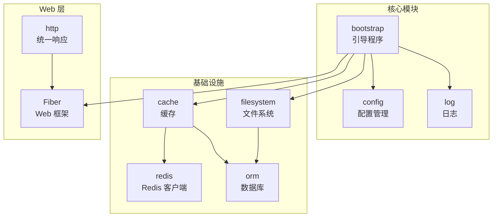
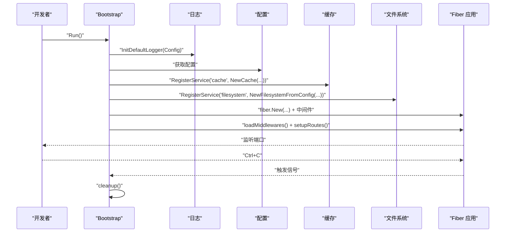
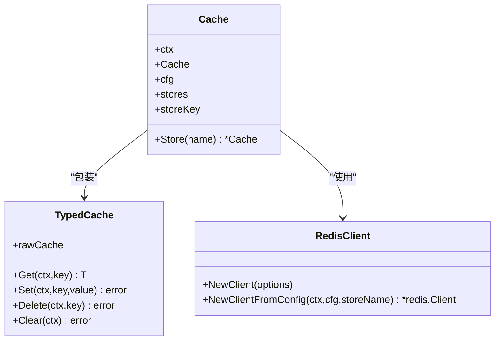
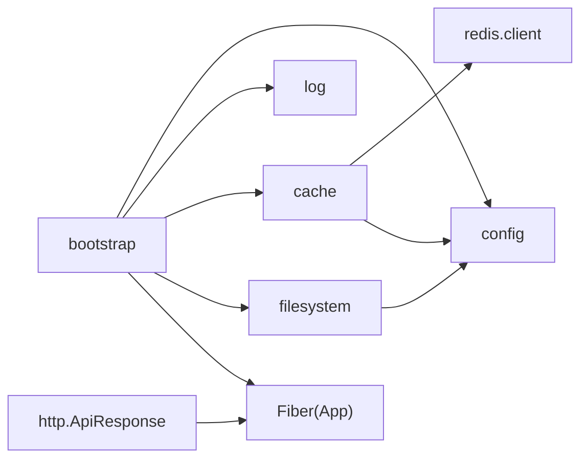

# 快速开始

<cite>
**本文引用的文件**
- [README.md](file://README.md)
- [go.mod](file://go.mod)
- [bootstrap/bootstrap.go](file://bootstrap/bootstrap.go)
- [config/config.go](file://config/config.go)
- [cache/cache.go](file://cache/cache.go)
- [cache/driver/redis.go](file://cache/driver/redis.go)
- [redis/client.go](file://redis/client.go)
- [orm/orm.go](file://orm/orm.go)
- [filesystem/filesystem.go](file://filesystem/filesystem.go)
- [log/log.go](file://log/log.go)
- [http/ApiResponse.go](file://http/ApiResponse.go)
</cite>

## 目录
1. [简介](#简介)
2. [项目结构](#项目结构)
3. [核心组件](#核心组件)
4. [架构总览](#架构总览)
5. [详细组件分析](#详细组件分析)
6. [依赖关系分析](#依赖关系分析)
7. [性能考虑](#性能考虑)
8. [故障排除指南](#故障排除指南)
9. [结论](#结论)
10. [附录](#附录)

## 简介
本指南面向首次接触 CMF 框架的开发者，帮助你在最短时间内完成环境准备、安装依赖、启动应用并运行第一个 Hello World 示例。你将学习到：
- 环境要求与外部依赖（Go 版本、Redis、数据库）
- 基础配置项与默认值
- 使用 Bootstrap 引导程序注册服务、配置中间件与路由
- 通过最小示例体验核心功能（缓存、文件系统、日志、HTTP 响应）

## 项目结构
CMF 采用模块化设计，核心目录与职责概览如下：
- bootstrap：应用引导与服务容器
- config：配置管理（Viper + godotenv）
- cache：缓存抽象与驱动（BigCache、Redis）
- redis：Redis 客户端封装与单例
- orm：数据库连接与 DSN 生成
- filesystem：文件系统抽象（本地/S3）
- log：日志初始化（Zap + Fiberzap）
- http：统一响应封装
- jwt、casbin、validate、crypto、storage/local 等：按需扩展模块

**图表来源**
- [bootstrap/bootstrap.go:155-215](file://bootstrap/bootstrap.go#L155-L215)
- [config/config.go:102-220](file://config/config.go#L102-L220)
- [cache/cache.go:24-55](file://cache/cache.go#L24-L55)
- [redis/client.go:56-118](file://redis/client.go#L56-L118)
- [orm/orm.go:10-34](file://orm/orm.go#L10-L34)
- [filesystem/filesystem.go:156-190](file://filesystem/filesystem.go#L156-L190)
- [http/ApiResponse.go:15-43](file://http/ApiResponse.go#L15-L43)

**章节来源**
- [README.md:55-79](file://README.md#L55-L79)
- [go.mod:1-103](file://go.mod#L1-L103)

## 核心组件
- 引导程序（Bootstrap）：负责初始化日志、注册服务（配置、缓存、文件系统）、加载中间件、注册路由、启动 Fiber 服务与优雅退出。
- 配置（Config）：支持 .env 与 YAML，提供应用、日志、数据库、缓存、Redis、文件系统、Casbin 等默认配置。
- 缓存（Cache）：抽象层，支持 memory（BigCache）与 redis 驱动；TypedCache 提供类型安全的 JSON 序列化/反序列化。
- Redis 客户端：从配置创建单例客户端，支持 TLS、连接池与超时配置。
- 数据库（ORM）：根据配置生成 DSN，支持 mysql/postgres/sqlite。
- 文件系统：抽象存储适配器，支持本地与 S3；可选“主存储+本地”双写。
- 日志（Log）：基于 Zap，支持控制台与文件输出、滚动切割。
- HTTP 响应（ApiResponse）：统一返回结构（code/msg/data）。

**章节来源**
- [bootstrap/bootstrap.go:37-147](file://bootstrap/bootstrap.go#L37-L147)
- [config/config.go:37-97](file://config/config.go#L37-L97)
- [cache/cache.go:15-144](file://cache/cache.go#L15-L144)
- [redis/client.go:14-118](file://redis/client.go#L14-L118)
- [orm/orm.go:10-63](file://orm/orm.go#L10-L63)
- [filesystem/filesystem.go:62-190](file://filesystem/filesystem.go#L62-L190)
- [log/log.go:14-83](file://log/log.go#L14-L83)
- [http/ApiResponse.go:7-43](file://http/ApiResponse.go#L7-L43)

## 架构总览
下图展示了应用启动的关键流程：引导程序初始化配置与服务，加载中间件，注册路由，启动服务监听，以及优雅退出时的清理流程。

**图表来源**
- [bootstrap/bootstrap.go:155-215](file://bootstrap/bootstrap.go#L155-L215)
- [bootstrap/bootstrap.go:217-242](file://bootstrap/bootstrap.go#L217-L242)
- [bootstrap/bootstrap.go:258-277](file://bootstrap/bootstrap.go#L258-L277)
- [log/log.go:80-83](file://log/log.go#L80-L83)

**章节来源**
- [bootstrap/bootstrap.go:155-277](file://bootstrap/bootstrap.go#L155-L277)
- [log/log.go:14-83](file://log/log.go#L14-L83)

## 详细组件分析

### 环境与依赖要求
- Go 版本：1.25.1
- 外部依赖（至少满足）：
  - Redis：分布式缓存与会话存储
  - 数据库：MySQL、PostgreSQL 或 SQLite
  - 可选：S3 兼容存储（用于文件系统）

**章节来源**
- [go.mod:3](file://go.mod#L3)
- [README.md:50-53](file://README.md#L50-L53)

### 配置与默认值
- 支持 .env 与 YAML；默认配置项覆盖范围广，包括应用、日志、数据库、缓存、Redis、文件系统、Casbin。
- 关键默认值（节选）：
  - 应用：名称、端口、调试、Swagger、登录过期等
  - 缓存：默认 memory 驱动，Redis 驱动默认 TTL
  - Redis：默认连接 localhost:6379，连接池、超时、TLS 等
  - 日志：控制台与文件输出、滚动切割参数
  - 数据库：默认 mysql，主机、端口、用户、密码、库名、表前缀
  - 文件系统：默认 local，可选 S3，支持“主存储+本地”双写

**章节来源**
- [config/config.go:102-220](file://config/config.go#L102-L220)
- [config/config.go:131-202](file://config/config.go#L131-L202)
- [config/config.go:204-220](file://config/config.go#L204-L220)

### 缓存与 Redis
- 缓存抽象层支持 memory（BigCache）与 redis 驱动；默认使用配置中的 default store。
- TypedCache 提供类型安全的 JSON 序列化/反序列化。
- Redis 客户端从配置创建，支持 TLS、连接池与超时；使用 sync.Map 维护单例并 Ping 校验连通性。

**图表来源**
- [cache/cache.go:15-144](file://cache/cache.go#L15-L144)
- [cache/driver/redis.go:13-24](file://cache/driver/redis.go#L13-L24)
- [redis/client.go:35-118](file://redis/client.go#L35-L118)

**章节来源**
- [cache/cache.go:15-144](file://cache/cache.go#L15-L144)
- [cache/driver/redis.go:13-24](file://cache/driver/redis.go#L13-L24)
- [redis/client.go:56-118](file://redis/client.go#L56-L118)

### 数据库连接
- 根据配置生成 DSN，支持 mysql/postgres/sqlite。
- 支持多连接选择与表前缀。

**章节来源**
- [orm/orm.go:18-63](file://orm/orm.go#L18-L63)

### 文件系统
- 抽象存储适配器，支持本地与 S3；可选“主存储+本地”双写。
- 单例模式：使用 sync.Map 缓存驱动实例。

**章节来源**
- [filesystem/filesystem.go:62-190](file://filesystem/filesystem.go#L62-L190)

### 日志
- 基于 Zap，支持控制台与文件输出、滚动切割；默认使用 InitDefaultLogger 从配置初始化。

**章节来源**
- [log/log.go:14-83](file://log/log.go#L14-L83)

### HTTP 响应
- 统一响应结构：code/msg/data；支持 Success/Error 快捷方法。

**章节来源**
- [http/ApiResponse.go:7-43](file://http/ApiResponse.go#L7-L43)

## 依赖关系分析
下图展示关键模块间的依赖关系与耦合度。

**图表来源**
- [bootstrap/bootstrap.go:47-66](file://bootstrap/bootstrap.go#L47-L66)
- [cache/cache.go:24-55](file://cache/cache.go#L24-L55)
- [redis/client.go:56-118](file://redis/client.go#L56-L118)
- [filesystem/filesystem.go:156-190](file://filesystem/filesystem.go#L156-L190)
- [http/ApiResponse.go:15-43](file://http/ApiResponse.go#L15-L43)

**章节来源**
- [bootstrap/bootstrap.go:47-66](file://bootstrap/bootstrap.go#L47-L66)
- [cache/cache.go:24-55](file://cache/cache.go#L24-L55)
- [redis/client.go:56-118](file://redis/client.go#L56-L118)
- [filesystem/filesystem.go:156-190](file://filesystem/filesystem.go#L156-L190)
- [http/ApiResponse.go:15-43](file://http/ApiResponse.go#L15-L43)

## 性能考虑
- 使用 Fiber 作为 Web 框架，具备高性能特性。
- 缓存层默认 memory 驱动适合单机场景；生产推荐 Redis 驱动并合理设置连接池与超时。
- 日志采用结构化 JSON 输出与滚动切割，避免阻塞 IO。
- 文件系统支持 S3，适合云原生部署与高可用存储。

[本节为通用指导，无需特定文件引用]

## 故障排除指南
- 启动报错：服务未注册或类型不匹配
  - 症状：panic 提示服务未注册或类型不匹配
  - 处理：确认在引导阶段已 RegisterService，并在使用时使用 MustGetServiceTyped 获取正确类型
  - 参考：[bootstrap/bootstrap.go:118-141](file://bootstrap/bootstrap.go#L118-L141)
- Redis 连接失败
  - 症状：NewClientFromConfig 返回连接失败错误
  - 处理：检查 Redis 地址、认证、TLS、连接池与超时配置；确认 Redis 服务可达
  - 参考：[redis/client.go:104-107](file://redis/client.go#L104-L107)
- 缓存驱动未找到
  - 症状：panic 提示 cache driver not found
  - 处理：检查配置中 cache.default 与对应 stores 的 driver 设置
  - 参考：[cache/cache.go:29-40](file://cache/cache.go#L29-L40)
- 数据库 DSN 无效
  - 症状：打开数据库失败
  - 处理：核对 driver、主机、端口、用户、密码、库名与 SSL 模式
  - 参考：[orm/orm.go:18-34](file://orm/orm.go#L18-L34)
- 文件系统驱动不支持
  - 症状：返回不支持的存储驱动类型
  - 处理：仅支持 local 与 s3；确认 filesystem.disks 配置
  - 参考：[filesystem/filesystem.go:132-134](file://filesystem/filesystem.go#L132-L134)
- 日志输出异常
  - 症状：无日志或日志未落盘
  - 处理：检查 InitDefaultLogger 的参数与文件路径权限
  - 参考：[log/log.go:80-83](file://log/log.go#L80-L83)

**章节来源**
- [bootstrap/bootstrap.go:118-141](file://bootstrap/bootstrap.go#L118-L141)
- [redis/client.go:104-107](file://redis/client.go#L104-L107)
- [cache/cache.go:29-40](file://cache/cache.go#L29-L40)
- [orm/orm.go:18-34](file://orm/orm.go#L18-L34)
- [filesystem/filesystem.go:132-134](file://filesystem/filesystem.go#L132-L134)
- [log/log.go:80-83](file://log/log.go#L80-L83)

## 结论
通过本指南，你已掌握：
- 环境与依赖要求
- 基础配置与默认值
- 使用 Bootstrap 注册服务、中间件与路由
- 运行 Hello World 并体验核心模块（缓存、文件系统、日志、HTTP 响应）

建议在本地先完成 Redis 与数据库的最小化配置，再逐步接入业务路由与中间件。

[本节为总结，无需特定文件引用]

## 附录

### 快速开始步骤
- 准备环境
  - 安装 Go 1.25.1 或以上版本
  - 启动 Redis 服务
  - 准备数据库（MySQL/PostgreSQL/SQLite）
- 克隆仓库并安装依赖
  - 运行 go mod tidy（如需）
- 配置文件
  - 在项目根目录创建 .env，设置数据库与 Redis 连接信息
  - 如需 YAML 配置，放置 config/config.yml
- 启动应用
  - 运行可执行文件，应用将在配置端口启动
- 访问
  - 访问根路径 / 查看 Hello world
  - 若开启调试或 Swagger，访问 /docs/swagger/* 查看接口文档

**章节来源**
- [README.md:77-80](file://README.md#L77-L80)
- [bootstrap/bootstrap.go:155-215](file://bootstrap/bootstrap.go#L155-L215)

### Hello World 示例（流程说明）
- 在引导阶段，setupRoutes 会注册默认根路由返回“Hello world!”
- 你可以在此基础上注册自己的路由与控制器

**章节来源**
- [bootstrap/bootstrap.go:258-277](file://bootstrap/bootstrap.go#L258-L277)

### 常见初始配置要点
- 应用：name、port、debug、swagger、secret、登录过期
- 日志：file_path、console_output、file_output、max_size/backups/age
- 数据库：default、connections.*.driver/host/port/user/password/name/ssl_mode/table_prefix
- 缓存：default、stores.*.driver/default_ttl
- Redis：default、connections.*.addr/username/password/db/pool/min_idle/max_idle/conn_max_idle_time/conn_max_lifetime/use_tls
- 文件系统：default、is_and_local、disks.*.driver/options

**章节来源**
- [config/config.go:37-97](file://config/config.go#L37-L97)
- [config/config.go:131-202](file://config/config.go#L131-L202)