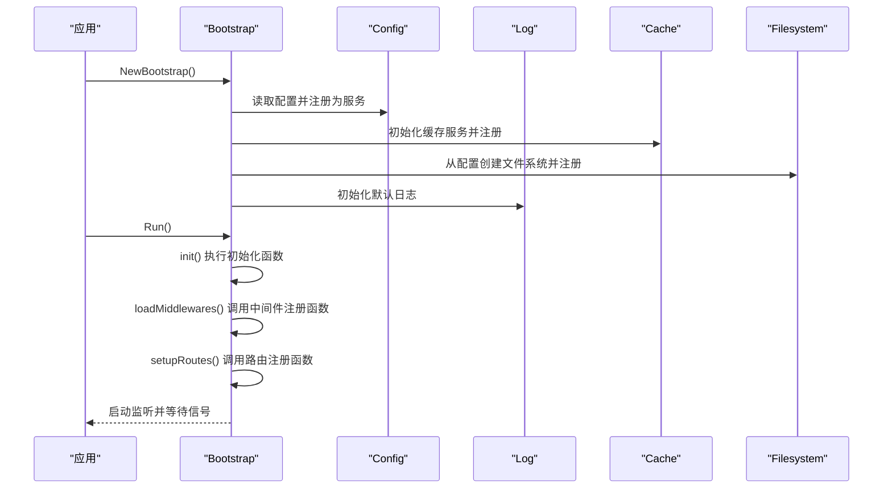
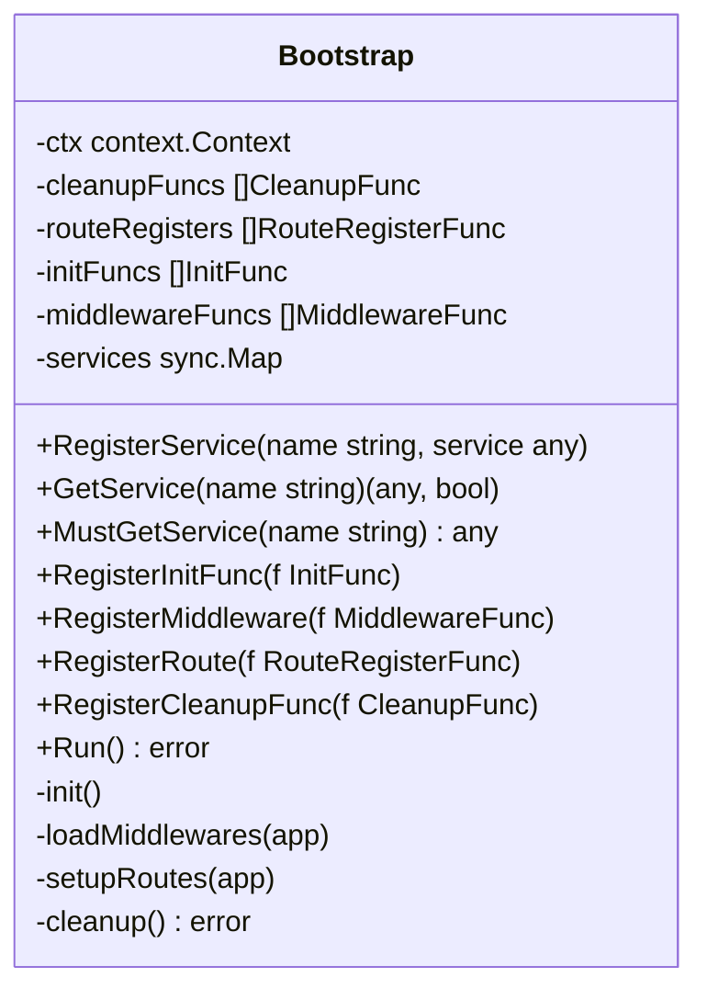
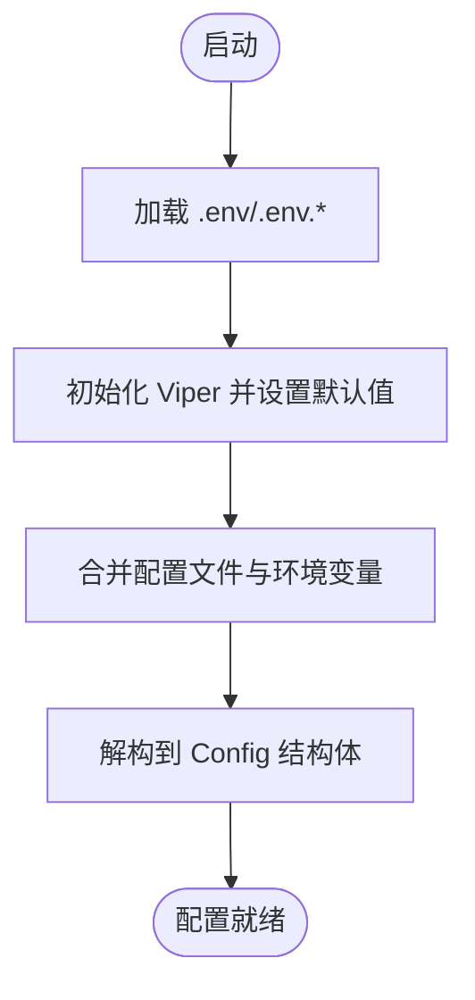
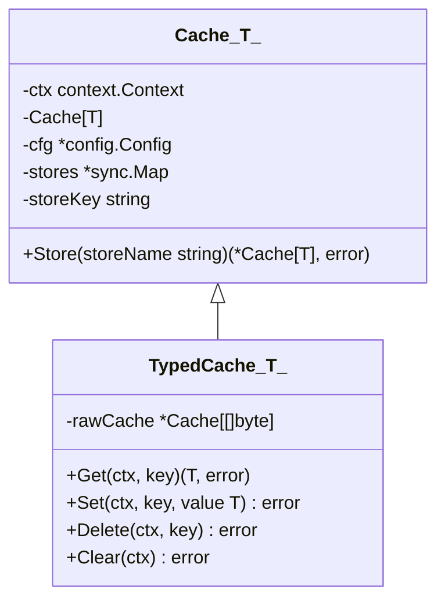
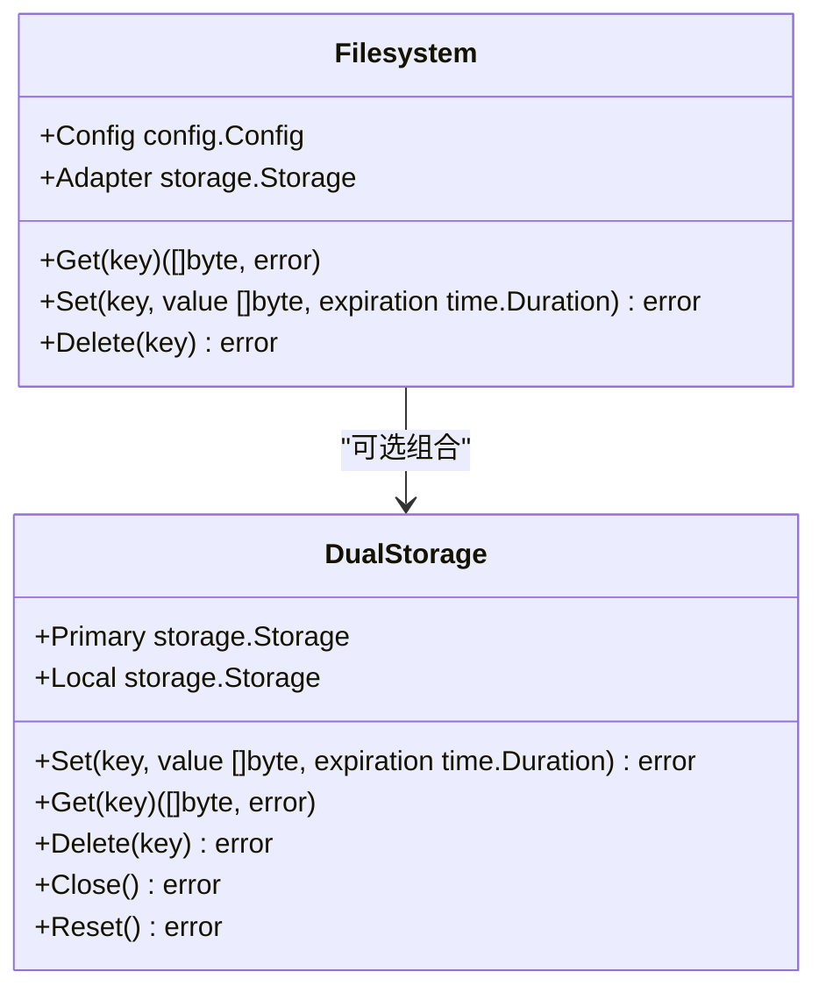
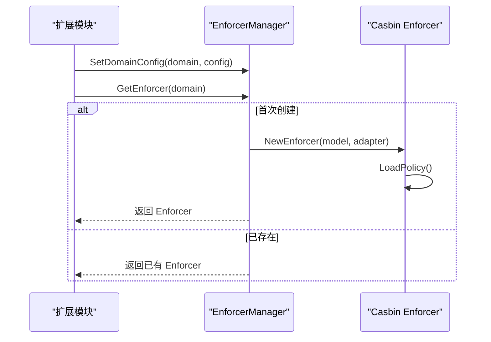
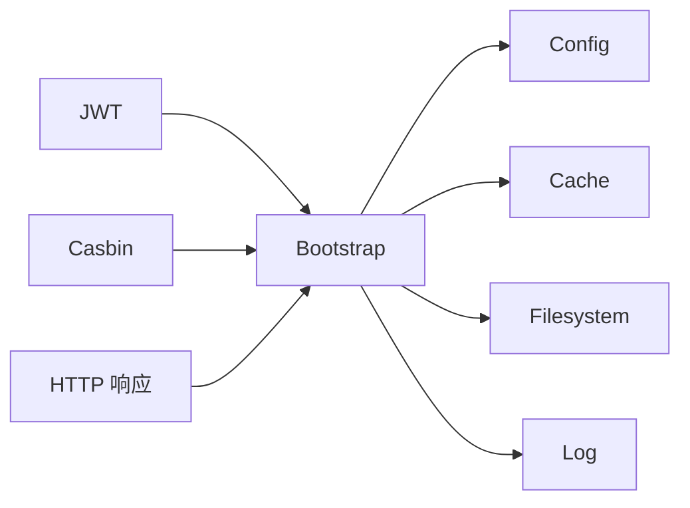

# 扩展开发

<cite>
**本文引用的文件**
- [bootstrap/bootstrap.go](file://bootstrap/bootstrap.go)
- [config/config.go](file://config/config.go)
- [cache/cache.go](file://cache/cache.go)
- [filesystem/filesystem.go](file://filesystem/filesystem.go)
- [log/log.go](file://log/log.go)
- [casbin/casbin.go](file://casbin/casbin.go)
- [casbin/enforcer_manager.go](file://casbin/enforcer_manager.go)
- [jwt/jwt.go](file://jwt/jwt.go)
- [http/ApiResponse.go](file://http/ApiResponse.go)
- [README.md](file://README.md)
- [go.mod](file://go.mod)
</cite>

## 目录
1. [简介](#简介)
2. [项目结构](#项目结构)
3. [核心组件](#核心组件)
4. [架构总览](#架构总览)
5. [详细组件分析](#详细组件分析)
6. [依赖分析](#依赖分析)
7. [性能考虑](#性能考虑)
8. [故障排查指南](#故障排查指南)
9. [结论](#结论)
10. [附录](#附录)

## 简介
本指南面向希望基于 CMF 框架进行扩展开发的工程师，系统讲解如何开发自定义中间件、服务扩展与插件式功能模块；深入解析 Bootstrap 引导程序的服务注册机制与依赖注入模式；明确扩展点的识别与利用方式（中间件注册、路由扩展、初始化函数），并提供完整开发流程、测试策略、版本兼容性与发布管理建议，帮助快速构建定制化解决方案与企业级应用。

## 项目结构
CMF 采用模块化设计，核心围绕引导程序、配置中心、日志、缓存、文件系统、权限控制、认证与 HTTP 响应封装等模块组织。扩展开发的关键入口集中在引导程序与配置模块，通过统一的服务容器与回调注册机制实现松耦合扩展。

```mermaid
graph TB
subgraph "引导层"
B["Bootstrap<br/>服务注册/依赖注入"]
end
subgraph "核心服务"
Cfg["Config<br/>配置中心"]
Log["Log<br/>日志初始化"]
Cache["Cache<br/>缓存服务"]
FS["Filesystem<br/>文件系统"]
end
subgraph "扩展接口"
MW["MiddlewareFunc<br/>中间件注册"]
RT["RouteRegisterFunc<br/>路由注册"]
INIT["InitFunc<br/>初始化函数"]
CLN["CleanupFunc<br/>清理函数"]
end
subgraph "业务模块"
JWT["JWT 认证"]
RBAC["Casbin 权限控制"]
HTTP["HTTP 响应封装"]
end
B --> Cfg
B --> Log
B --> Cache
B --> FS
B <-- MW
B <-- RT
B <-- INIT
B <-- CLN
JWT --> B
RBAC --> B
HTTP --> B
```

图表来源
- [bootstrap/bootstrap.go:37-91](file://bootstrap/bootstrap.go#L37-L91)
- [config/config.go:37-97](file://config/config.go#L37-L97)
- [cache/cache.go:15-55](file://cache/cache.go#L15-L55)
- [filesystem/filesystem.go:62-86](file://filesystem/filesystem.go#L62-L86)
- [log/log.go:14-83](file://log/log.go#L14-L83)
- [jwt/jwt.go:9-24](file://jwt/jwt.go#L9-L24)
- [casbin/casbin.go:16-45](file://casbin/casbin.go#L16-L45)
- [http/ApiResponse.go:7-44](file://http/ApiResponse.go#L7-L44)

章节来源
- [README.md:55-75](file://README.md#L55-L75)
- [bootstrap/bootstrap.go:47-66](file://bootstrap/bootstrap.go#L47-L66)
- [config/config.go:102-121](file://config/config.go#L102-L121)

## 核心组件
- 引导程序 Bootstrap：负责服务注册、中间件加载、路由装配、初始化与清理；提供类型安全的服务获取与泛型辅助。
- 配置中心 Config：集中管理应用、日志、数据库、缓存、Redis、文件系统、Casbin 等配置，并提供默认值与环境变量注入。
- 日志模块 Log：基于 Zap 与 Fiberzap，支持控制台与文件输出、日志轮转与结构化日志。
- 缓存模块 Cache：抽象缓存存储，支持内存与 Redis，提供类型安全的 TypedCache。
- 文件系统模块 Filesystem：抽象存储适配器，支持本地与 S3，支持“主存储+本地”双写模式。
- 权限控制 Casbin：提供中间件与多域 Enforcer 管理器，支持模型文件或文本两种方式。
- 认证 JWT：提供中间件与令牌签发、用户数据提取。
- HTTP 响应封装：统一响应结构，简化业务返回。

章节来源
- [bootstrap/bootstrap.go:37-147](file://bootstrap/bootstrap.go#L37-L147)
- [config/config.go:37-97](file://config/config.go#L37-L97)
- [log/log.go:14-83](file://log/log.go#L14-L83)
- [cache/cache.go:15-144](file://cache/cache.go#L15-L144)
- [filesystem/filesystem.go:62-191](file://filesystem/filesystem.go#L62-L191)
- [casbin/casbin.go:12-55](file://casbin/casbin.go#L12-L55)
- [casbin/enforcer_manager.go:19-190](file://casbin/enforcer_manager.go#L19-L190)
- [jwt/jwt.go:9-24](file://jwt/jwt.go#L9-L24)
- [http/ApiResponse.go:7-44](file://http/ApiResponse.go#L7-L44)

## 架构总览
CMF 的扩展机制建立在“引导程序 + 服务容器 + 回调注册”的基础上。应用启动时，引导程序注册核心服务（配置、缓存、文件系统），随后加载中间件、执行初始化函数、装配路由；扩展模块通过注册回调参与生命周期，实现插件化能力。



图表来源
- [bootstrap/bootstrap.go:47-66](file://bootstrap/bootstrap.go#L47-L66)
- [bootstrap/bootstrap.go:229-242](file://bootstrap/bootstrap.go#L229-L242)
- [bootstrap/bootstrap.go:217-226](file://bootstrap/bootstrap.go#L217-L226)
- [bootstrap/bootstrap.go:258-277](file://bootstrap/bootstrap.go#L258-L277)
- [log/log.go:79-83](file://log/log.go#L79-L83)

## 详细组件分析

### 引导程序与服务容器
- 服务注册：通过服务名与实例注册到 sync.Map，实现并发安全的单例容器。
- 类型安全获取：提供 MustGetServiceTyped 泛型方法，避免运行时类型断言风险。
- 生命周期回调：支持初始化、中间件、路由、清理四类回调，扩展模块按需注册。
- 默认中间件：内置 recover、logger、requestid，保障稳定性与可观测性。
- 错误处理：统一 Fiber 错误处理器，结合状态码返回静态页面或默认错误消息。



图表来源
- [bootstrap/bootstrap.go:37-147](file://bootstrap/bootstrap.go#L37-L147)

章节来源
- [bootstrap/bootstrap.go:37-147](file://bootstrap/bootstrap.go#L37-L147)
- [bootstrap/bootstrap.go:155-215](file://bootstrap/bootstrap.go#L155-L215)

### 配置中心与默认值
- 支持环境变量注入与 .env 文件加载，提供丰富的默认配置（应用、日志、数据库、缓存、Redis、文件系统、Casbin）。
- 提供读取与保存配置的方法，便于动态调整与持久化。



图表来源
- [config/config.go:102-121](file://config/config.go#L102-L121)
- [config/config.go:131-202](file://config/config.go#L131-L202)
- [config/config.go:214-220](file://config/config.go#L214-L220)

章节来源
- [config/config.go:102-220](file://config/config.go#L102-L220)

### 日志模块
- 基于 Zap 与 Fiberzap，支持控制台与文件输出，文件输出使用 lumberjack 实现滚动。
- 提供默认初始化方法，直接使用配置中的日志参数。

章节来源
- [log/log.go:14-83](file://log/log.go#L14-L83)

### 缓存模块
- 支持内存与 Redis 两种存储驱动，通过配置选择默认存储。
- 提供 Store 切换与 TypedCache 类型安全封装，内部以 JSON 序列化/反序列化实现泛型缓存。



图表来源
- [cache/cache.go:15-93](file://cache/cache.go#L15-L93)
- [cache/cache.go:95-144](file://cache/cache.go#L95-L144)

章节来源
- [cache/cache.go:15-144](file://cache/cache.go#L15-L144)

### 文件系统模块
- 支持本地与 S3 驱动，通过配置选择默认磁盘。
- 提供“主存储+本地”双写适配器，满足高可用与本地回退需求。
- 使用 sync.Map 维护驱动单例，避免重复创建。



图表来源
- [filesystem/filesystem.go:62-86](file://filesystem/filesystem.go#L62-L86)
- [filesystem/filesystem.go:17-61](file://filesystem/filesystem.go#L17-L61)

章节来源
- [filesystem/filesystem.go:62-191](file://filesystem/filesystem.go#L62-L191)

### 权限控制（Casbin）
- 提供中间件与 Enforcer 管理器，支持多域/多租户。
- 支持模型文件与模型文本两种方式创建 Enforcer，并在创建时加载策略。
- 提供并发安全的域级 Enforcer 管理。



图表来源
- [casbin/enforcer_manager.go:97-147](file://casbin/enforcer_manager.go#L97-L147)
- [casbin/enforcer_manager.go:150-187](file://casbin/enforcer_manager.go#L150-L187)

章节来源
- [casbin/casbin.go:16-55](file://casbin/casbin.go#L16-L55)
- [casbin/enforcer_manager.go:19-190](file://casbin/enforcer_manager.go#L19-L190)

### 认证（JWT）
- 提供 JWT 中间件与令牌签发、用户数据提取工具方法。
- 中间件基于签名密钥进行校验，扩展模块可直接接入路由。

章节来源
- [jwt/jwt.go:9-24](file://jwt/jwt.go#L9-L24)

### HTTP 响应封装
- 统一响应结构（code/msg/data），简化业务返回。
- 支持成功与错误两类便捷方法。

章节来源
- [http/ApiResponse.go:7-44](file://http/ApiResponse.go#L7-L44)

## 依赖分析
- 引导程序依赖配置、缓存、文件系统、日志模块，形成核心服务闭环。
- 扩展模块通过回调注册参与生命周期，避免强耦合。
- 外部依赖集中在 Fiber、Viper、Zap、Casbin、JWT、Redis、S3 等生态组件。



图表来源
- [bootstrap/bootstrap.go:47-66](file://bootstrap/bootstrap.go#L47-L66)
- [go.mod:5-26](file://go.mod#L5-L26)

章节来源
- [go.mod:5-26](file://go.mod#L5-L26)

## 性能考虑
- 使用 Fiber 作为 Web 框架，具备高性能特性；建议在扩展中避免阻塞操作，必要时使用异步任务或连接池。
- 缓存层采用 BigCache 与 Redis，建议合理设置 TTL 与容量，避免内存与网络抖动。
- 文件系统支持 S3，注意网络延迟与重试策略；双写模式提升可靠性但增加写放大，需权衡。
- 日志采用结构化输出与滚动，建议根据业务量调整文件大小与保留策略。

## 故障排查指南
- 启动失败：检查配置文件与 .env 是否正确加载，确认默认值是否覆盖预期。
- 中间件异常：查看中间件注册顺序与错误处理逻辑，确保 recover 与 logger 生效。
- 缓存不可用：核对缓存驱动配置与连接参数，检查 Store 切换是否正确。
- 文件系统异常：确认磁盘驱动与凭据配置，S3 场景检查 Endpoint 与 Region。
- 权限控制不生效：核对模型文件/文本与策略加载，确认域配置与适配器正确。
- JWT 校验失败：检查签名密钥与令牌有效期。

章节来源
- [bootstrap/bootstrap.go:168-187](file://bootstrap/bootstrap.go#L168-L187)
- [config/config.go:131-202](file://config/config.go#L131-L202)
- [cache/cache.go:57-93](file://cache/cache.go#L57-L93)
- [filesystem/filesystem.go:105-144](file://filesystem/filesystem.go#L105-L144)
- [casbin/enforcer_manager.go:48-95](file://casbin/enforcer_manager.go#L48-L95)
- [jwt/jwt.go:9-24](file://jwt/jwt.go#L9-L24)

## 结论
CMF 框架通过 Bootstrap 的服务容器与回调注册机制，提供了清晰的扩展点与插件化能力。开发者可在中间件、路由、初始化与清理阶段灵活注入功能，结合配置中心、缓存、文件系统、权限控制与认证模块，快速构建企业级应用。遵循本文的最佳实践与排错建议，可显著提升扩展开发效率与系统稳定性。

## 附录

### 扩展开发步骤清单
- 明确扩展职责与边界，确定参与生命周期阶段（中间件/路由/初始化/清理）。
- 在引导程序中注册服务或回调，使用类型安全获取方法。
- 通过配置中心读取参数，避免硬编码。
- 单元测试覆盖关键路径，集成测试验证端到端行为。
- 版本兼容性：遵循 go.mod 依赖版本范围，避免破坏性变更。
- 发布管理：使用语义化版本，记录变更日志，提供迁移指引。

### 关键扩展点速览
- 中间件注册：RegisterMiddleware，接收 Fiber 应用与配置。
- 路由扩展：RegisterRoute，接收 Fiber 应用与配置。
- 初始化函数：RegisterInitFunc，执行一次性初始化。
- 清理函数：RegisterCleanupFunc，优雅关闭资源。
- 服务注册：RegisterService，注册单例服务实例。

章节来源
- [bootstrap/bootstrap.go:68-86](file://bootstrap/bootstrap.go#L68-L86)
- [bootstrap/bootstrap.go:88-91](file://bootstrap/bootstrap.go#L88-L91)
- [bootstrap/bootstrap.go:217-226](file://bootstrap/bootstrap.go#L217-L226)
- [bootstrap/bootstrap.go:258-277](file://bootstrap/bootstrap.go#L258-L277)
- [bootstrap/bootstrap.go:229-242](file://bootstrap/bootstrap.go#L229-L242)
- [bootstrap/bootstrap.go:248-256](file://bootstrap/bootstrap.go#L248-L256)