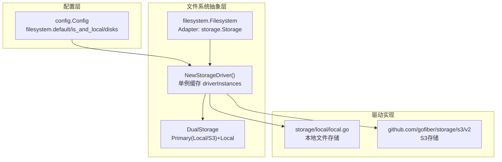
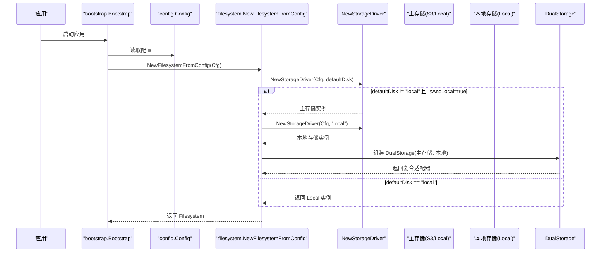
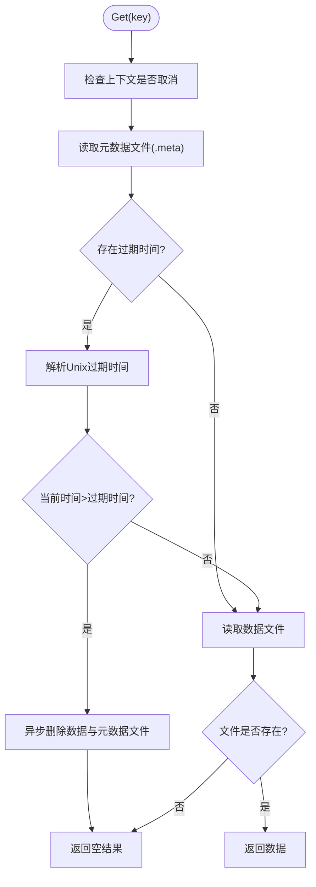
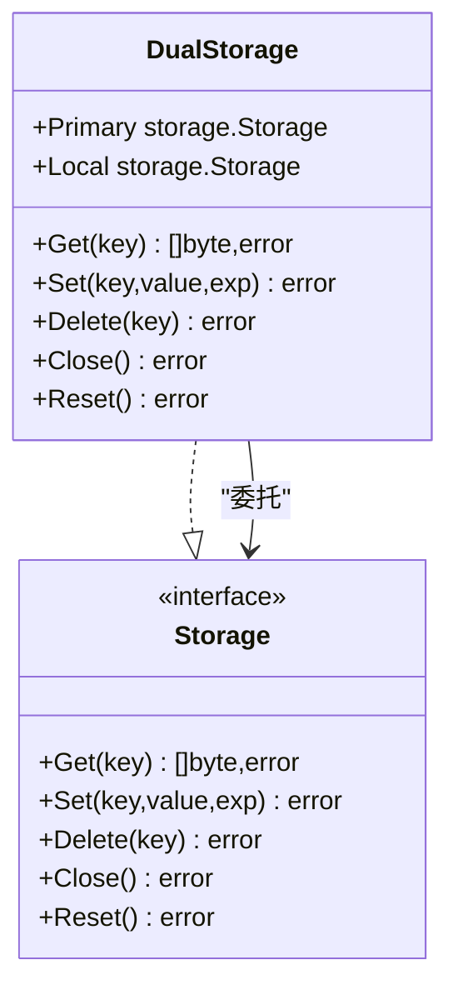
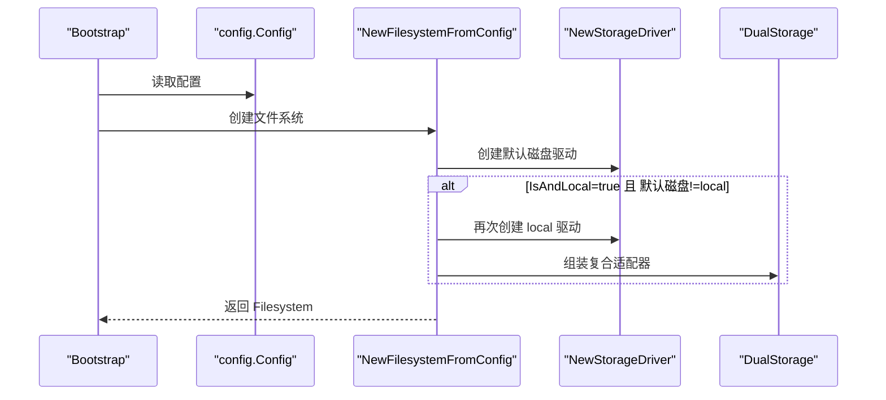
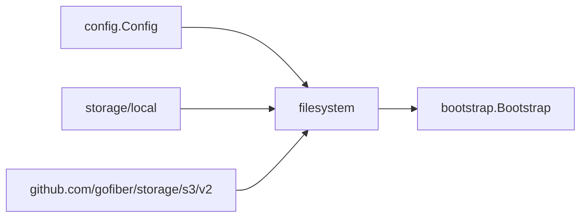

# 数据存储

<cite>
**本文引用的文件**
- [storage/local/local.go](file://storage/local/local.go)
- [filesystem/filesystem.go](file://filesystem/filesystem.go)
- [config/config.go](file://config/config.go)
- [bootstrap/bootstrap.go](file://bootstrap/bootstrap.go)
- [README.md](file://README.md)
- [go.mod](file://go.mod)
</cite>

## 目录
1. [简介](#简介)
2. [项目结构](#项目结构)
3. [核心组件](#核心组件)
4. [架构总览](#架构总览)
5. [详细组件分析](#详细组件分析)
6. [依赖分析](#依赖分析)
7. [性能考量](#性能考量)
8. [故障排查指南](#故障排查指南)
9. [结论](#结论)
10. [附录](#附录)

## 简介
本技术文档围绕 CMF 数据存储系统展开，重点阐释文件系统抽象层的设计理念与实现，以及如何通过统一接口同时支持本地存储与云存储（S3）。文档覆盖以下主题：
- 存储驱动的实现机制与扩展方式（单一存储与复合存储）
- 文件上传、下载、删除与元数据管理的完整流程
- 存储配置与性能优化建议
- 存储安全、备份策略与故障恢复机制
- 开发者如何选择合适的存储方案并正确实现文件管理功能

## 项目结构
CMF 的数据存储体系由“配置层”“文件系统抽象层”“具体驱动实现”三部分组成：
- 配置层：集中定义文件系统默认磁盘、是否启用“本地同步”、各磁盘驱动类型与选项
- 文件系统抽象层：提供统一的存储接口与工厂方法，负责根据配置创建驱动实例，并在必要时组合为复合存储
- 具体驱动实现：本地文件系统与 S3 驱动，均实现统一的存储接口

图表来源
- [filesystem/filesystem.go:88-144](file://filesystem/filesystem.go#L88-L144)
- [config/config.go:79-86](file://config/config.go#L79-L86)
- [storage/local/local.go:11-45](file://storage/local/local.go#L11-L45)

章节来源
- [README.md:55-75](file://README.md#L55-L75)
- [config/config.go:79-86](file://config/config.go#L79-L86)
- [filesystem/filesystem.go:88-144](file://filesystem/filesystem.go#L88-L144)

## 核心组件
- 统一存储接口：抽象层通过接口定义 Get/Set/Delete/Reset/Close 等能力，屏蔽底层差异
- 单例驱动工厂：NewStorageDriver 基于磁盘键（应用名+磁盘名）缓存驱动实例，避免重复创建
- 复合存储适配器：DualStorage 在主存储（如 S3）之外再同步到本地存储，提升可用性与灾备能力
- 文件系统封装：Filesystem 暴露简洁的 Get/Set/Delete 接口，内部委托 Adapter 实现

章节来源
- [filesystem/filesystem.go:62-86](file://filesystem/filesystem.go#L62-L86)
- [filesystem/filesystem.go:14-15](file://filesystem/filesystem.go#L14-L15)
- [filesystem/filesystem.go:17-60](file://filesystem/filesystem.go#L17-L60)

## 架构总览
下图展示了从配置到具体驱动再到文件系统封装的整体流程，以及在“本地同步”模式下的复合存储路径。

图表来源
- [bootstrap/bootstrap.go:59-64](file://bootstrap/bootstrap.go#L59-L64)
- [filesystem/filesystem.go:156-190](file://filesystem/filesystem.go#L156-L190)
- [filesystem/filesystem.go:88-144](file://filesystem/filesystem.go#L88-L144)

## 详细组件分析

### 本地存储驱动（storage/local）
- 设计要点
  - 以键到文件路径的映射方式持久化原始字节数据
  - 采用“键+.meta”的配套文件记录过期时间，实现 TTL 管理
  - 支持上下文感知的读写与删除，便于取消与超时控制
  - 提供 Reset 清空基础目录下所有文件（含.meta），用于运维重置
- 关键行为
  - Get：先检查元数据过期，过期则异步触发删除并返回空；否则读取原始数据
  - Set：写入数据文件；若设置过期时间则写入元数据文件
  - Delete：同时删除数据文件与元数据文件
  - Reset：遍历基础目录，删除所有非目录条目
- 并发与健壮性
  - 通过上下文检查避免阻塞
  - 删除操作对“文件不存在”错误进行宽容处理，仅在非预期错误时返回

图表来源
- [storage/local/local.go:59-98](file://storage/local/local.go#L59-L98)

章节来源
- [storage/local/local.go:11-45](file://storage/local/local.go#L11-L45)
- [storage/local/local.go:59-98](file://storage/local/local.go#L59-L98)
- [storage/local/local.go:109-143](file://storage/local/local.go#L109-L143)
- [storage/local/local.go:147-178](file://storage/local/local.go#L147-L178)
- [storage/local/local.go:181-211](file://storage/local/local.go#L181-L211)

### S3 存储驱动（github.com/gofiber/storage/s3/v2）
- 设计要点
  - 通过统一配置对象传递凭证、区域、桶、端点等参数
  - 与本地驱动一致，遵循相同的接口契约，便于替换与组合
- 使用场景
  - 适合高可用、跨地域、弹性扩展的文件存储需求
  - 可与本地驱动组合，实现“主存储+本地同步”的复合模式

章节来源
- [filesystem/filesystem.go:120-130](file://filesystem/filesystem.go#L120-L130)
- [go.mod:16-17](file://go.mod#L16-L17)

### 复合存储适配器（DualStorage）
- 设计要点
  - 同步写入主存储与本地存储，读取优先主存储
  - 删除时分别对主存储与本地存储执行删除，首个错误即返回
  - Close/Reset 委托主存储，确保一致性
- 适用场景
  - 业务需要主存储（如 S3）作为主要持久化，同时保留本地副本用于快速回退或离线访问

图表来源
- [filesystem/filesystem.go:17-60](file://filesystem/filesystem.go#L17-L60)

章节来源
- [filesystem/filesystem.go:17-60](file://filesystem/filesystem.go#L17-L60)
- [filesystem/filesystem.go:170-183](file://filesystem/filesystem.go#L170-L183)

### 文件系统抽象层（filesystem）
- 设计要点
  - Filesystem 暴露简洁 API，内部持有 Adapter（storage.Storage）
  - NewStorageDriver 负责根据配置创建驱动实例，并使用 sync.Map 缓存单例
  - NewFilesystemFromConfig 支持“本地同步”模式，自动组合 DualStorage
- 生命周期
  - 启动阶段由 Bootstrap 注册 Filesystem 服务，供业务模块通过服务容器获取

图表来源
- [bootstrap/bootstrap.go:59-64](file://bootstrap/bootstrap.go#L59-L64)
- [filesystem/filesystem.go:156-190](file://filesystem/filesystem.go#L156-L190)
- [filesystem/filesystem.go:88-144](file://filesystem/filesystem.go#L88-L144)

章节来源
- [filesystem/filesystem.go:62-86](file://filesystem/filesystem.go#L62-L86)
- [filesystem/filesystem.go:88-144](file://filesystem/filesystem.go#L88-L144)
- [filesystem/filesystem.go:156-190](file://filesystem/filesystem.go#L156-L190)
- [bootstrap/bootstrap.go:59-64](file://bootstrap/bootstrap.go#L59-L64)

## 依赖分析
- 外部依赖
  - gofiber/storage 与 gofiber/storage/s3/v2：提供统一存储接口与 S3 驱动
  - viper/godotenv：配置加载与环境变量注入
- 内部耦合
  - filesystem 依赖 config 与 storage/local
  - bootstrap 在启动时注册 Filesystem 服务，形成服务容器依赖

图表来源
- [filesystem/filesystem.go:88-144](file://filesystem/filesystem.go#L88-L144)
- [bootstrap/bootstrap.go:59-64](file://bootstrap/bootstrap.go#L59-L64)

章节来源
- [go.mod:5-26](file://go.mod#L5-L26)
- [filesystem/filesystem.go:88-144](file://filesystem/filesystem.go#L88-L144)
- [bootstrap/bootstrap.go:59-64](file://bootstrap/bootstrap.go#L59-L64)

## 性能考量
- 单例驱动缓存
  - NewStorageDriver 使用 sync.Map 以“应用名+磁盘名”为键缓存驱动实例，避免重复初始化带来的开销
- 上下文与取消
  - 所有读写删除均支持上下文，可在高并发场景下及时响应取消信号
- 本地同步模式
  - DualStorage 在写入主存储后同步写入本地，可降低主存储不可用时的影响，但会增加写放大与延迟
- 元数据过期
  - 本地驱动通过“.meta”文件记录过期时间，过期检测逻辑简单高效，但需注意异步删除对并发读取的影响

章节来源
- [filesystem/filesystem.go:14-15](file://filesystem/filesystem.go#L14-L15)
- [filesystem/filesystem.go:88-144](file://filesystem/filesystem.go#L88-L144)
- [storage/local/local.go:59-98](file://storage/local/local.go#L59-L98)
- [storage/local/local.go:109-143](file://storage/local/local.go#L109-L143)

## 故障排查指南
- 配置问题
  - 磁盘配置不存在：NewStorageDriver 会在找不到磁盘时返回错误
  - 驱动类型不支持：遇到未知驱动类型会返回错误
- 本地存储异常
  - 目录不存在或权限不足：New 会尝试创建基础目录，但后续读写仍可能出现错误
  - 删除失败：Delete 对“文件不存在”错误进行宽容处理，仅在非预期错误时返回
- S3 存储异常
  - 凭证、区域、桶或端点配置错误会导致初始化失败
- 复合存储异常
  - Delete 返回首个错误，若主存储删除成功而本地删除失败，需单独排查本地存储状态

章节来源
- [filesystem/filesystem.go:100-103](file://filesystem/filesystem.go#L100-L103)
- [filesystem/filesystem.go:132-134](file://filesystem/filesystem.go#L132-L134)
- [storage/local/local.go:37-40](file://storage/local/local.go#L37-L40)
- [storage/local/local.go:163-169](file://storage/local/local.go#L163-L169)

## 结论
CMF 的数据存储系统通过统一接口与工厂模式实现了对本地与 S3 的无缝支持，并以复合存储适配器提供“主存储+本地同步”的增强能力。其设计强调：
- 易扩展：新增驱动只需实现统一接口
- 易切换：通过配置即可在本地与 S3 之间切换
- 易运维：提供 Reset 与元数据过期机制，便于清理与回收
- 易集成：Bootstrap 将 Filesystem 注册为服务，便于业务模块获取

## 附录

### 存储配置清单
- 文件系统默认磁盘：filesystem.default
- 是否启用本地同步：filesystem.is_and_local
- 磁盘定义：filesystem.disks.{disk}.driver 与 options
  - 本地磁盘 options.root
  - S3 磁盘 options.access_key/secret_key/region/bucket/endpoint

章节来源
- [config/config.go:181-191](file://config/config.go#L181-L191)
- [config/config.go:79-86](file://config/config.go#L79-L86)

### 安全与合规建议
- 凭证管理
  - 使用环境变量或密钥管理服务注入 S3 凭证，避免硬编码
- 访问控制
  - 限制 S3 桶策略与 IAM 角色权限，遵循最小权限原则
- 数据传输
  - 启用 TLS 与 HTTPS，确保数据在传输过程中的机密性与完整性
- 审计与日志
  - 记录存储操作日志，便于审计与故障定位

### 备份与恢复策略
- 本地存储
  - 定期备份基础目录，结合快照或归档策略
- S3 存储
  - 启用版本控制与生命周期策略，定期跨区域复制
- 复合存储
  - 优先从主存储恢复，若主存储不可用，可回退至本地副本

### 扩展与定制
- 新增驱动
  - 实现统一接口，通过 NewStorageDriver 的 switch 分支接入
- 自定义元数据
  - 在本地驱动基础上扩展“.meta”文件格式，支持更多属性（如哈希、MIME 类型等）