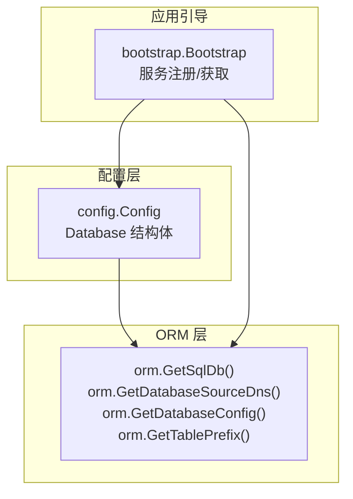
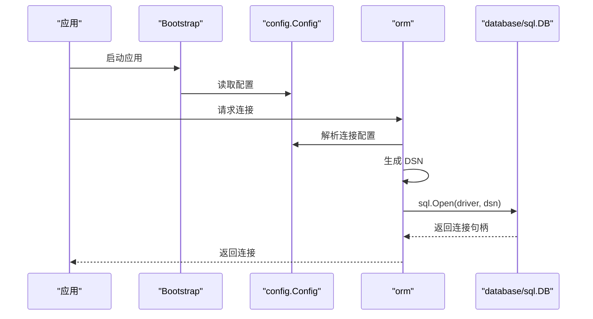
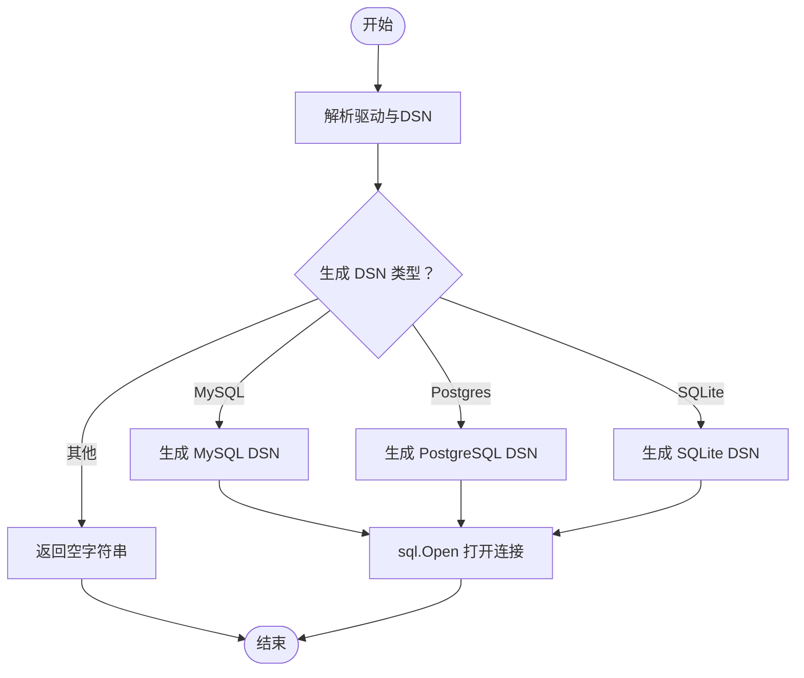
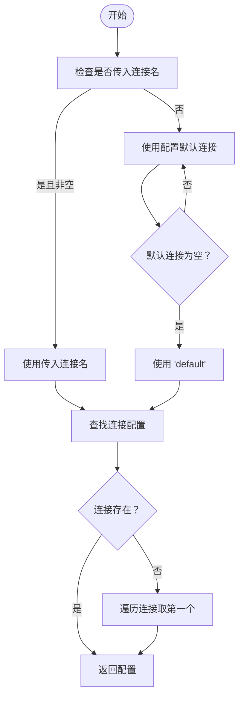
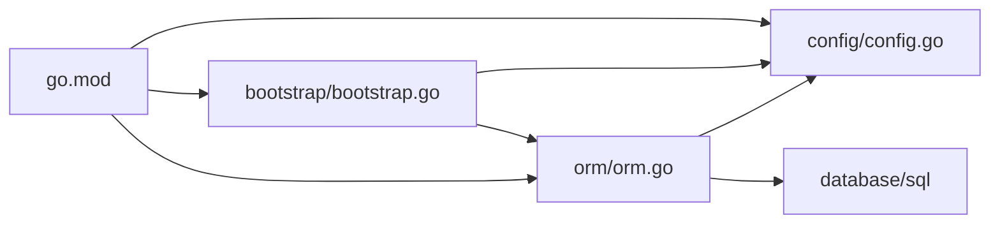
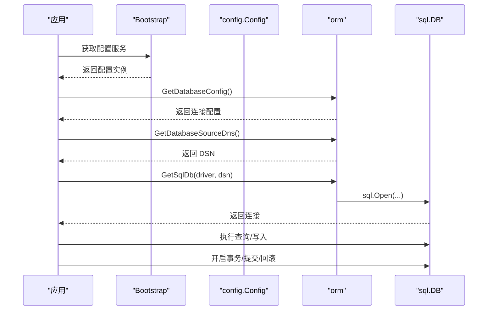

# 数据库ORM

<cite>
**本文引用的文件**
- [orm/orm.go](file://orm/orm.go)
- [config/config.go](file://config/config.go)
- [bootstrap/bootstrap.go](file://bootstrap/bootstrap.go)
- [README.md](file://README.md)
- [go.mod](file://go.mod)
</cite>

## 目录
1. [简介](#简介)
2. [项目结构](#项目结构)
3. [核心组件](#核心组件)
4. [架构总览](#架构总览)
5. [详细组件分析](#详细组件分析)
6. [依赖分析](#依赖分析)
7. [性能考虑](#性能考虑)
8. [故障排查指南](#故障排查指南)
9. [结论](#结论)
10. [附录](#附录)

## 简介
本文件面向开发者，系统性阐述 CMF 数据库 ORM 模块的设计理念与实现要点，重点覆盖：
- 设计理念与数据库连接管理机制
- 对 MySQL、PostgreSQL、SQLite 的支持现状与差异
- 表前缀支持与连接池管理
- 事务处理机制与最佳实践
- 数据库配置示例与连接字符串格式
- 在应用中使用 ORM 进行数据操作的方法
- 查询优化建议、索引设计原则与性能监控方法

## 项目结构
CMF 的数据库 ORM 能力由独立的 orm 包提供，配合 config 包的配置模型与 bootstrap 启动流程，形成“配置驱动 + 低层 SQL 驱动”的轻量 ORM 支持方案。

图表来源
- [config/config.go:26-62](file://config/config.go#L26-L62)
- [orm/orm.go:10-62](file://orm/orm.go#L10-L62)
- [bootstrap/bootstrap.go:38-141](file://bootstrap/bootstrap.go#L38-L141)

章节来源
- [README.md:50-75](file://README.md#L50-L75)
- [go.mod:5-26](file://go.mod#L5-L26)

## 核心组件
- 数据库连接工厂与连接字符串生成
  - 通过统一的工厂函数创建底层 sql.DB 连接，并根据配置生成不同数据库的连接字符串。
- 配置解析与连接选择
  - 支持多连接配置与默认连接选择逻辑；当指定连接不存在时回退至首个可用连接。
- 表前缀支持
  - 提供便捷方法获取当前连接的表前缀，便于在应用层拼接表名。

章节来源
- [orm/orm.go:10-62](file://orm/orm.go#L10-L62)
- [config/config.go:26-62](file://config/config.go#L26-L62)

## 架构总览
ORM 层围绕“配置驱动 + 低层 SQL 驱动”展开：应用通过配置中心读取数据库连接信息，ORM 层负责将配置转换为具体驱动所需的 DSN，并创建 sql.DB 连接对象。事务与连接池管理由 database/sql 标准库承担，ORM 层不直接封装这些细节。

图表来源
- [bootstrap/bootstrap.go:155-215](file://bootstrap/bootstrap.go#L155-L215)
- [config/config.go:171-179](file://config/config.go#L171-L179)
- [orm/orm.go:10-34](file://orm/orm.go#L10-L34)

## 详细组件分析

### 组件一：数据库连接工厂与连接字符串生成
- 功能职责
  - 依据传入的驱动名与 DSN 创建底层数据库连接。
  - 根据配置生成不同数据库的连接字符串（MySQL、PostgreSQL、SQLite）。
- 关键点
  - 驱动名与 DSN 的组合由上层决定，ORM 层仅负责生成符合各驱动要求的 DSN。
  - 当未识别的驱动时，返回空字符串，便于上层做错误处理。
- 使用建议
  - 在应用启动阶段或业务入口处调用工厂函数创建连接。
  - 对于生产环境，建议结合连接池参数与超时设置，确保稳定性与性能。

图表来源
- [orm/orm.go:10-34](file://orm/orm.go#L10-L34)

章节来源
- [orm/orm.go:10-34](file://orm/orm.go#L10-L34)

### 组件二：连接配置解析与默认连接选择
- 功能职责
  - 从配置中解析出当前使用的数据库连接配置。
  - 支持通过可变参数指定连接名称；若未指定或不存在，则回退到配置中的默认连接，再不存在则使用“default”。
- 关键点
  - 若指定的连接不存在，会遍历所有可用连接并取第一个作为后备。
  - 该逻辑确保了在多连接场景下的健壮性与灵活性。
- 使用建议
  - 在多租户或多数据库场景中，优先显式传入连接名称，避免回退行为带来的不确定性。

图表来源
- [orm/orm.go:36-57](file://orm/orm.go#L36-L57)

章节来源
- [orm/orm.go:36-57](file://orm/orm.go#L36-L57)

### 组件三：表前缀支持
- 功能职责
  - 提供便捷方法获取当前连接的表前缀，便于在应用层统一拼接表名。
- 关键点
  - 表前缀来源于配置中的 Database.TablePrefix 字段。
  - 该能力与连接选择逻辑一致，支持多连接场景。
- 使用建议
  - 在构建 SQL 语句时，优先使用表前缀，确保多租户或多实例隔离。

章节来源
- [orm/orm.go:59-62](file://orm/orm.go#L59-L62)
- [config/config.go:34](file://config/config.go#L34)

### 组件四：配置模型与默认值
- 功能职责
  - 定义 Database 结构体，包含驱动、主机、端口、用户、密码、数据库名、SSL 模式、表前缀等字段。
  - 提供默认配置，包括默认连接、默认驱动、默认主机、端口、用户、密码、数据库名、SSL 模式、表前缀等。
- 关键点
  - 默认值集中在初始化逻辑中，便于快速启动与演示。
  - 支持通过环境变量与 .env 文件覆盖默认值。
- 使用建议
  - 生产环境务必覆盖默认凭据与连接参数，避免明文默认值暴露风险。

章节来源
- [config/config.go:26-62](file://config/config.go#L26-L62)
- [config/config.go:171-179](file://config/config.go#L171-L179)

## 依赖分析
- ORM 层依赖
  - config 包：用于读取数据库连接配置与默认值。
  - database/sql：用于创建底层连接对象。
- 启动流程依赖
  - bootstrap 包：负责服务注册与获取，应用通过服务容器获取配置后，再调用 ORM 层创建连接。
- 外部依赖
  - go.mod 中声明了 viper、godotenv 等用于配置管理与环境变量加载。

图表来源
- [orm/orm.go:3-8](file://orm/orm.go#L3-L8)
- [config/config.go:3-8](file://config/config.go#L3-L8)
- [bootstrap/bootstrap.go:20-23](file://bootstrap/bootstrap.go#L20-L23)
- [go.mod:5-26](file://go.mod#L5-L26)

章节来源
- [go.mod:5-26](file://go.mod#L5-L26)

## 性能考虑
- 连接池与超时
  - ORM 层未直接封装连接池参数，实际的连接池与超时设置应由上层在创建 sql.DB 后进行配置（例如 SetMaxOpenConns、SetMaxIdleConns、SetConnMaxLifetime、SetConnMaxIdleTime 等）。这些参数直接影响吞吐与资源占用。
- 事务处理
  - 事务应在业务层显式开启与提交/回滚，避免长事务占用连接与锁资源。
- 查询优化
  - 使用 EXPLAIN/EXPLAIN QUERY PLAN 分析慢查询，确保关键查询命中索引。
  - 避免 SELECT *，只选择必要列。
  - 合理分页，避免 OFFSET 过大导致扫描成本高。
- 索引设计
  - 唯一索引用于唯一性约束；复合索引用于常见过滤条件组合。
  - 避免冗余索引，定期评估索引使用率。
- 监控与告警
  - 结合数据库自带的慢查询日志与性能视图，建立阈值告警。
  - 在应用侧记录关键 SQL 的耗时与错误码，辅助定位问题。

## 故障排查指南
- 连接失败
  - 检查驱动名与 DSN 是否正确生成（可通过打印 DSN 核对）。
  - 确认主机、端口、用户、密码、数据库名等配置项是否正确。
- 连接池耗尽
  - 检查业务层是否存在长时间持有连接的未关闭事务或查询。
  - 调整连接池参数，确保最大连接数与空闲连接数满足峰值需求。
- 多连接选择异常
  - 确认传入的连接名称是否存在于配置 Connections 中。
  - 若未指定连接名称，确认默认连接是否正确设置。
- 表前缀导致的 SQL 错误
  - 确认表前缀是否与数据库实际表名一致，避免大小写或拼写错误。
- 事务未提交/回滚
  - 确保在业务层显式调用 Commit 或 Rollback，避免因 panic 导致回滚未执行。

章节来源
- [orm/orm.go:10-34](file://orm/orm.go#L10-L34)
- [orm/orm.go:36-57](file://orm/orm.go#L36-L57)
- [config/config.go:171-179](file://config/config.go#L171-L179)

## 结论
CMF 的数据库 ORM 模块采用“配置驱动 + 低层 SQL 驱动”的轻量设计，提供：
- 统一的连接工厂与 DSN 生成
- 多连接与默认连接选择逻辑
- 表前缀支持
- 与配置系统的无缝集成

在实际工程中，建议：
- 显式配置连接池参数与超时策略
- 在业务层严格管理事务生命周期
- 建立完善的查询与索引治理流程
- 结合数据库与应用侧监控，持续优化性能

## 附录

### 数据库支持与连接字符串格式
- MySQL
  - DSN 示例：用户名:密码@tcp(主机:端口)/数据库名?charset=utf8mb4&parseTime=True&loc=Local
  - 说明：包含字符集、时间解析与时区设置，提升兼容性与性能。
- PostgreSQL
  - DSN 示例：user=用户名 password=密码 host=主机 port=端口 dbname=数据库名
  - 说明：遵循 PostgreSQL 官方 DSN 规范。
- SQLite
  - DSN 示例：文件路径（如 ./data/db.sqlite）
  - 说明：SQLite 无需网络端口，直接使用文件路径即可。

章节来源
- [orm/orm.go:24-30](file://orm/orm.go#L24-L30)

### 数据库配置示例与覆盖方式
- 默认配置
  - 默认连接名为 default，驱动为 mysql，主机 localhost，端口 3306，用户 root，密码 123456，数据库 cmf，SSL 模式 false，表前缀 cmf_。
- 覆盖方式
  - 通过环境变量与 .env 文件覆盖默认值，启动时由配置系统自动加载。
  - 在应用启动时，bootstrap 会将配置注册为服务，ORM 层通过配置读取连接信息。

章节来源
- [config/config.go:171-179](file://config/config.go#L171-L179)
- [bootstrap/bootstrap.go:54-66](file://bootstrap/bootstrap.go#L54-L66)

### 在应用中使用 ORM 的步骤
- 步骤一：获取配置
  - 通过服务容器获取 config.Config 实例。
- 步骤二：解析连接配置
  - 调用 ORM 层的连接配置解析函数，确定当前使用的连接。
- 步骤三：生成 DSN
  - 根据配置生成对应驱动的 DSN。
- 步骤四：创建连接
  - 调用 ORM 层的连接工厂函数创建 sql.DB。
- 步骤五：执行业务操作
  - 在业务层使用 sql.DB 执行查询与写入，并显式管理事务。

图表来源
- [bootstrap/bootstrap.go:54-66](file://bootstrap/bootstrap.go#L54-L66)
- [config/config.go:171-179](file://config/config.go#L171-L179)
- [orm/orm.go:10-34](file://orm/orm.go#L10-L34)