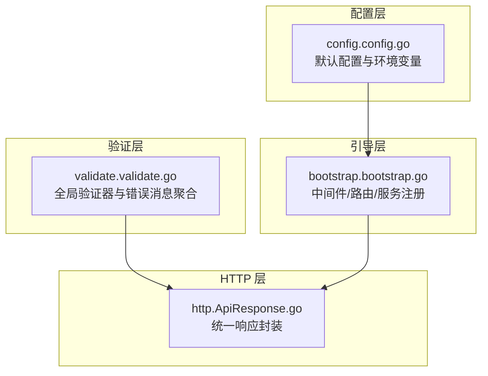
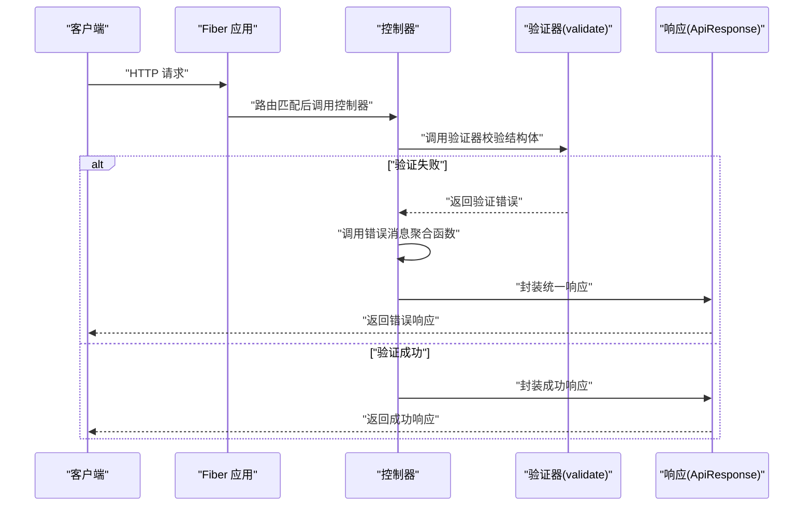
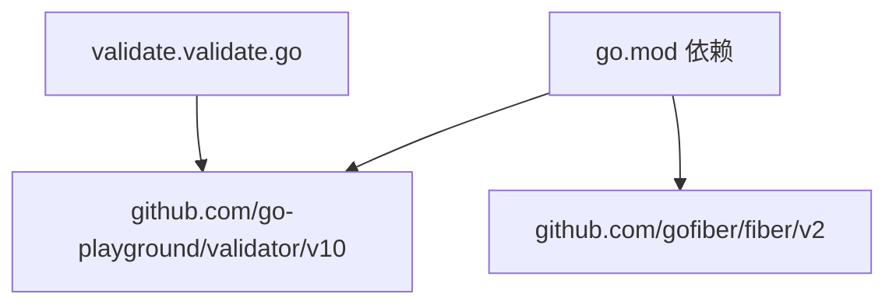

# 数据验证

<cite>
**本文引用的文件**
- [validate.go](file://validate/validate.go)
- [bootstrap.go](file://bootstrap/bootstrap.go)
- [ApiResponse.go](file://http/ApiResponse.go)
- [README.md](file://README.md)
- [config.go](file://config/config.go)
- [go.mod](file://go.mod)
</cite>

## 目录
1. [简介](#简介)
2. [项目结构](#项目结构)
3. [核心组件](#核心组件)
4. [架构总览](#架构总览)
5. [组件详解](#组件详解)
6. [依赖关系分析](#依赖关系分析)
7. [性能考量](#性能考量)
8. [故障排查指南](#故障排查指南)
9. [结论](#结论)
10. [附录](#附录)

## 简介
本技术文档围绕 CMF 数据验证系统展开，重点阐释基于 Go Playground Validator 的验证器设计理念与结构化验证机制，并结合框架中的实际实现，说明如何使用验证器进行数据校验、如何定义验证规则与自定义错误消息、如何在 HTTP 层统一处理验证错误以及如何进行性能优化与最佳实践。文档面向不同层次的开发者，既提供高层概览，也给出可操作的实现指引。

## 项目结构
CMF 采用模块化组织方式，验证能力位于独立的 validate 包中，通过全局验证器实例与错误消息聚合函数对外提供能力；HTTP 层通过 ApiResponse 统一输出响应；应用引导通过 Bootstrap 负责中间件、路由与服务注册；配置由 config 包提供默认值与环境变量解析。

图表来源
- [validate.go:1-58](file://validate/validate.go#L1-L58)
- [ApiResponse.go:1-44](file://http/ApiResponse.go#L1-L44)
- [bootstrap.go:1-278](file://bootstrap/bootstrap.go#L1-L278)
- [config.go:1-288](file://config/config.go#L1-L288)

章节来源
- [README.md:55-75](file://README.md#L55-L75)
- [go.mod:1-26](file://go.mod#L1-L26)

## 核心组件
- 全局验证器
  - 通过初始化函数创建并启用 RequiredStruct 行为，确保结构体字段在验证时遵循严格规则。
  - 位于 [validate.go:16-20](file://validate/validate.go#L16-L20)。

- 自定义验证接口与消息映射
  - 定义了 Validator 接口与 ValidatorMessages 映射类型，允许业务模型实现自定义错误消息。
  - 位于 [validate.go:10-14](file://validate/validate.go#L10-L14)。

- 错误消息聚合函数
  - 将验证错误转换为统一格式的字符串，优先使用模型自定义消息，否则回退至默认消息。
  - 位于 [validate.go:30-57](file://validate/validate.go#L30-L57)。

- HTTP 响应封装
  - 提供 Result/Success/Error 等方法，便于在控制器中统一返回结构化响应。
  - 位于 [ApiResponse.go:25-43](file://http/ApiResponse.go#L25-L43)。

- 应用引导与中间件
  - Bootstrap 负责中间件链（恢复、日志、请求 ID）与路由注册，便于在请求生命周期内进行统一处理。
  - 位于 [bootstrap.go:188-195](file://bootstrap/bootstrap.go#L188-L195)。

章节来源
- [validate.go:10-57](file://validate/validate.go#L10-L57)
- [ApiResponse.go:25-43](file://http/ApiResponse.go#L25-L43)
- [bootstrap.go:188-195](file://bootstrap/bootstrap.go#L188-L195)

## 架构总览
验证流程在请求进入控制器前，由中间件或控制器直接调用全局验证器进行结构体校验；若出现验证错误，通过错误消息聚合函数生成统一的错误字符串；随后由 HTTP 层将结果包装为统一响应返回给客户端。

图表来源
- [validate.go:30-57](file://validate/validate.go#L30-L57)
- [ApiResponse.go:25-43](file://http/ApiResponse.go#L25-L43)
- [bootstrap.go:188-195](file://bootstrap/bootstrap.go#L188-L195)

## 组件详解

### 验证器与错误消息聚合
- 设计理念
  - 通过全局验证器实例集中管理验证行为，避免重复初始化。
  - 通过 Validator 接口与消息映射，实现“模型即规则”的声明式验证，提升可维护性与可读性。
  - 错误消息聚合函数负责将多条验证错误合并为统一字符串，便于前端或调用方消费。

- 关键实现要点
  - 全局验证器初始化与 RequiredStruct 启用：[validate.go:18-20](file://validate/validate.go#L18-L20)。
  - 自定义错误消息优先级：先尝试从模型实现的消息映射中查找，再回退默认消息：[validate.go:38-48](file://validate/validate.go#L38-L48)。
  - 统一错误字符串拼接与兜底文案：[validate.go:50-57](file://validate/validate.go#L50-L57)。

- 使用建议
  - 在结构体上添加标签以声明验证规则，结合 RequiredStruct 行为确保必填字段被正确校验。
  - 对于复杂业务场景，建议在结构体实现 Validator 接口，提供细粒度的错误消息映射。

章节来源
- [validate.go:10-57](file://validate/validate.go#L10-L57)

### HTTP 响应与错误处理
- 统一响应封装
  - 通过 ApiResponse 的 Result/Success/Error 方法，将业务状态码、消息与数据封装为统一 JSON 结构，便于前后端约定。
  - 位于 [ApiResponse.go:25-43](file://http/ApiResponse.go#L25-L43)。

- 错误处理集成
  - 在控制器中，当验证失败时，可先调用错误消息聚合函数生成错误字符串，再通过 ApiResponse.Error 输出统一格式的错误响应。
  - 位于 [ApiResponse.go:40-42](file://http/ApiResponse.go#L40-L42)。

章节来源
- [ApiResponse.go:25-43](file://http/ApiResponse.go#L25-L43)

### 应用引导与中间件
- 中间件链
  - Bootstrap 在应用启动时注册 recover、logger、requestid 等中间件，有助于在验证失败时记录上下文并保持稳定性。
  - 位于 [bootstrap.go:188-195](file://bootstrap/bootstrap.go#L188-L195)。

- 路由与服务
  - Bootstrap 提供 RegisterService/GetService 等能力，便于在验证器之外扩展缓存、文件系统等服务，形成统一的服务容器。
  - 位于 [bootstrap.go:88-126](file://bootstrap/bootstrap.go#L88-L126)。

章节来源
- [bootstrap.go:88-126](file://bootstrap/bootstrap.go#L88-L126)
- [bootstrap.go:188-195](file://bootstrap/bootstrap.go#L188-L195)

### 配置与默认值
- 配置加载
  - config 包提供默认配置与环境变量解析，Bootstrap 在启动时将配置注册为服务，验证器可间接受益于整体配置体系。
  - 位于 [config.go:131-220](file://config/config.go#L131-L220)。

- 验证器初始化
  - validate 包在 init 中创建全局验证器实例，无需外部传参，简化使用成本。
  - 位于 [validate.go:18-20](file://validate/validate.go#L18-L20)。

章节来源
- [config.go:131-220](file://config/config.go#L131-L220)
- [validate.go:18-20](file://validate/validate.go#L18-L20)

## 依赖关系分析
- 外部依赖
  - Go Playground Validator：提供结构体验证能力与错误类型。
  - Fiber：提供 Web 框架与中间件生态。
  - Viper/godotenv：提供配置加载与环境变量解析。
  - 其他：Zap、Casbin、Redis、S3 等，虽非验证直接依赖，但为整体系统提供支撑。

图表来源
- [validate.go:3-8](file://validate/validate.go#L3-L8)
- [go.mod:5-26](file://go.mod#L5-L26)

章节来源
- [go.mod:5-26](file://go.mod#L5-L26)
- [validate.go:3-8](file://validate/validate.go#L3-L8)

## 性能考量
- 全局验证器复用
  - 通过全局实例减少重复初始化开销，提高验证吞吐。
  - 参考：[validate.go:16-20](file://validate/validate.go#L16-L20)。

- 错误消息聚合的字符串拼接
  - 聚合函数对多条错误进行一次拼接，避免多次 I/O；建议在高并发场景下避免在热路径中频繁创建临时对象。
  - 参考：[validate.go:50-57](file://validate/validate.go#L50-L57)。

- 中间件链的顺序与开销
  - recover、logger、requestid 等中间件会增加少量开销，建议在生产环境根据需求裁剪或调整日志级别。
  - 参考：[bootstrap.go:188-195](file://bootstrap/bootstrap.go#L188-L195)。

- 配置加载与服务注册
  - 配置仅在启动时加载，运行时不会重复解析，有利于降低运行时负担。
  - 参考：[config.go:131-220](file://config/config.go#L131-L220)。

## 故障排查指南
- 常见问题与定位
  - 验证未触发或规则无效
    - 检查结构体字段是否正确标注验证标签，确认 RequiredStruct 行为生效。
    - 参考：[validate.go:18-20](file://validate/validate.go#L18-L20)。
  - 错误消息不符合预期
    - 确认结构体是否实现 Validator 接口并返回正确的消息映射键值。
    - 参考：[validate.go:38-48](file://validate/validate.go#L38-L48)。
  - 统一响应未按预期返回
    - 检查控制器是否正确调用错误消息聚合函数与 ApiResponse.Error。
    - 参考：[ApiResponse.go:40-42](file://http/ApiResponse.go#L40-L42)。
  - 中间件导致的异常
    - 检查中间件链顺序与日志输出，必要时在开发环境开启更详细的日志。
    - 参考：[bootstrap.go:188-195](file://bootstrap/bootstrap.go#L188-L195)。

章节来源
- [validate.go:18-57](file://validate/validate.go#L18-L57)
- [ApiResponse.go:40-42](file://http/ApiResponse.go#L40-L42)
- [bootstrap.go:188-195](file://bootstrap/bootstrap.go#L188-L195)

## 结论
CMF 的数据验证体系以全局验证器为核心，结合自定义错误消息映射与统一响应封装，形成了清晰、可扩展且易维护的验证层。通过 Bootstrap 的中间件与服务注册机制，验证逻辑能够自然融入整个应用生命周期。建议在实际项目中：
- 为每个业务模型实现 Validator 接口，明确错误消息语义；
- 在控制器中统一调用验证器与错误消息聚合函数；
- 在生产环境合理配置中间件与日志，平衡可观测性与性能；
- 利用配置系统集中管理验证相关的全局设置。

## 附录
- 快速开始
  - 在结构体上添加验证标签；
  - 在控制器中调用验证器进行校验；
  - 使用错误消息聚合函数生成统一错误字符串；
  - 通过 ApiResponse 输出统一响应。

- 相关实现位置
  - 全局验证器与错误聚合：[validate.go:10-57](file://validate/validate.go#L10-L57)
  - 统一响应封装：[ApiResponse.go:25-43](file://http/ApiResponse.go#L25-L43)
  - 中间件与引导：[bootstrap.go:188-195](file://bootstrap/bootstrap.go#L188-L195)
  - 默认配置与环境变量：[config.go:131-220](file://config/config.go#L131-L220)