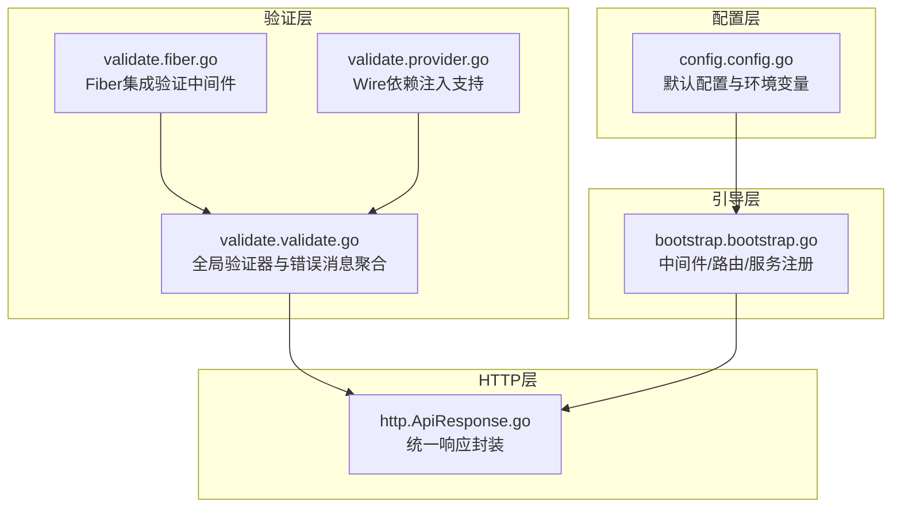
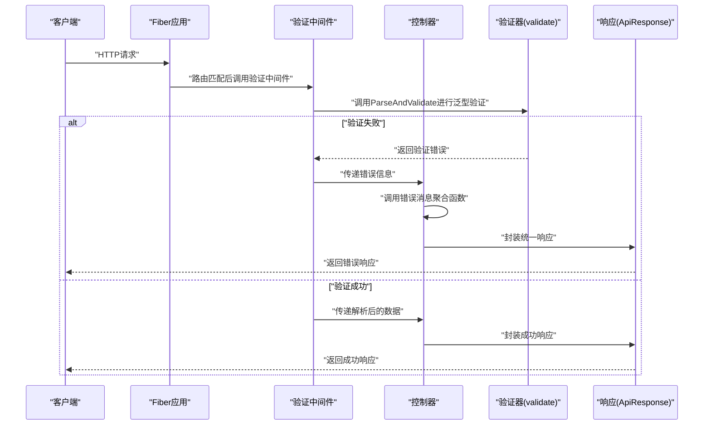
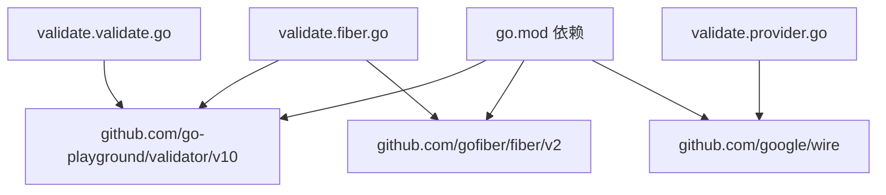

# 数据验证

<cite>
**本文引用的文件**
- [validate.go](file://validate/validate.go)
- [fiber.go](file://validate/fiber.go)
- [provider.go](file://validate/provider.go)
- [bootstrap.go](file://bootstrap/bootstrap.go)
- [ApiResponse.go](file://http/ApiResponse.go)
- [README.md](file://README.md)
- [config.go](file://config/config.go)
- [go.mod](file://go.mod)
</cite>

## 更新摘要
**变更内容**
- 新增Fiber集成验证中间件支持泛型验证
- 增强自定义验证器功能
- 扩展错误消息处理能力
- 新增Wire依赖注入支持

## 目录
1. [简介](#简介)
2. [项目结构](#项目结构)
3. [核心组件](#核心组件)
4. [架构总览](#架构总览)
5. [组件详解](#组件详解)
6. [Fiber集成验证中间件](#fiber集成验证中间件)
7. [自定义验证器实现](#自定义验证器实现)
8. [依赖关系分析](#依赖关系分析)
9. [性能考量](#性能考量)
10. [故障排查指南](#故障排查指南)
11. [结论](#结论)
12. [附录](#附录)

## 简介
本技术文档围绕 CMF 数据验证系统展开，重点阐释基于 Go Playground Validator 的验证器设计理念与结构化验证机制。系统现已增强为支持Fiber框架集成的完整验证解决方案，提供泛型验证、自定义验证器、错误消息国际化等功能。文档面向不同层次的开发者，既提供高层概览，也给出可操作的实现指引。

## 项目结构
CMF 采用模块化组织方式，验证能力位于独立的 validate 包中，通过全局验证器实例与错误消息聚合函数对外提供能力；HTTP 层通过 ApiResponse 统一输出响应；应用引导通过 Bootstrap 负责中间件、路由与服务注册；配置由 config 包提供默认值与环境变量解析。



**图表来源**
- [validate.go:1-338](file://validate/validate.go#L1-L338)
- [fiber.go:1-102](file://validate/fiber.go#L1-L102)
- [provider.go:1-7](file://validate/provider.go#L1-L7)
- [ApiResponse.go:1-44](file://http/ApiResponse.go#L1-L44)
- [bootstrap.go:1-280](file://bootstrap/bootstrap.go#L1-L280)
- [config.go:1-288](file://config/config.go#L1-L288)

**章节来源**
- [README.md:55-75](file://README.md#L55-L75)
- [go.mod:1-26](file://go.mod#L1-L26)

## 核心组件
- 全局验证器
  - 通过初始化函数创建并启用 RequiredStruct 行为，确保结构体字段在验证时遵循严格规则。
  - 位于 [validate.go:22-27](file://validate/validate.go#L22-L27)。

- 自定义验证接口与消息映射
  - 定义了 Validator 接口与 ValidatorMessages 映射类型，允许业务模型实现自定义错误消息。
  - 位于 [validate.go:13-20](file://validate/validate.go#L13-L20)。

- 错误消息聚合函数
  - 将验证错误转换为统一格式的字符串，优先使用模型自定义消息，否则回退至默认消息。
  - 位于 [validate.go:136-148](file://validate/validate.go#L136-L148)。

- HTTP 响应封装
  - 提供 Result/Success/Error 等方法，便于在控制器中统一返回结构化响应。
  - 位于 [ApiResponse.go:25-43](file://http/ApiResponse.go#L25-L43)。

- 应用引导与中间件
  - Bootstrap 负责中间件链（恢复、日志、请求 ID）与路由注册，便于在请求生命周期内进行统一处理。
  - 位于 [bootstrap.go:188-195](file://bootstrap/bootstrap.go#L188-L195)。

**章节来源**
- [validate.go:13-148](file://validate/validate.go#L13-L148)
- [ApiResponse.go:25-43](file://http/ApiResponse.go#L25-L43)
- [bootstrap.go:188-195](file://bootstrap/bootstrap.go#L188-L195)

## 架构总览
验证流程在请求进入控制器前，由中间件或控制器直接调用全局验证器进行结构体校验；若出现验证错误，通过错误消息聚合函数生成统一的错误字符串；随后由 HTTP 层将结果包装为统一响应返回给客户端。



**图表来源**
- [fiber.go:12-25](file://validate/fiber.go#L12-L25)
- [validate.go:136-148](file://validate/validate.go#L136-L148)
- [ApiResponse.go:25-43](file://http/ApiResponse.go#L25-L43)
- [bootstrap.go:188-195](file://bootstrap/bootstrap.go#L188-L195)

## 组件详解

### 验证器与错误消息聚合
- 设计理念
  - 通过全局验证器实例集中管理验证行为，避免重复初始化。
  - 通过 Validator 接口与消息映射，实现"模型即规则"的声明式验证，提升可维护性与可读性。
  - 错误消息聚合函数负责将多条验证错误合并为统一字符串，便于前端或调用方消费。

- 关键实现要点
  - 全局验证器初始化与 RequiredStruct 启用：[validate.go:25-27](file://validate/validate.go#L25-L27)。
  - 自定义错误消息优先级：先尝试从模型实现的消息映射中查找，再回退默认消息：[validate.go:150-158](file://validate/validate.go#L150-L158)。
  - 统一错误字符串拼接与兜底文案：[validate.go:149](file://validate/validate.go#L149)。

- 使用建议
  - 在结构体上添加标签以声明验证规则，结合 RequiredStruct 行为确保必填字段被正确校验。
  - 对于复杂业务场景，建议在结构体实现 Validator 接口，提供细粒度的错误消息映射。

**章节来源**
- [validate.go:13-148](file://validate/validate.go#L13-L148)

### HTTP 响应与错误处理
- 统一响应封装
  - 通过 ApiResponse 的 Result/Success/Error 方法，将业务状态码、消息与数据封装为统一 JSON 结构，便于前后端约定。
  - 位于 [ApiResponse.go:25-43](file://http/ApiResponse.go#L25-L43)。

- 错误处理集成
  - 在控制器中，当验证失败时，可先调用错误消息聚合函数生成错误字符串，再通过 ApiResponse.Error 输出统一格式的错误响应。
  - 位于 [ApiResponse.go:40-42](file://http/ApiResponse.go#L40-L42)。

**章节来源**
- [ApiResponse.go:25-43](file://http/ApiResponse.go#L25-L43)

### 应用引导与中间件
- 中间件链
  - Bootstrap 在应用启动时注册 recover、logger、requestid 等中间件，有助于在验证失败时记录上下文并保持稳定性。
  - 位于 [bootstrap.go:188-195](file://bootstrap/bootstrap.go#L188-L195)。

- 路由与服务
  - Bootstrap 提供 RegisterService/GetService 等能力，便于在验证器之外扩展缓存、文件系统等服务，形成统一的服务容器。
  - 位于 [bootstrap.go:88-126](file://bootstrap/bootstrap.go#L88-L126)。

**章节来源**
- [bootstrap.go:88-126](file://bootstrap/bootstrap.go#L88-L126)
- [bootstrap.go:188-195](file://bootstrap/bootstrap.go#L188-L195)

### 配置与默认值
- 配置加载
  - config 包提供默认配置与环境变量解析，Bootstrap 在启动时将配置注册为服务，验证器可间接受益于整体配置体系。
  - 位于 [config.go:131-220](file://config/config.go#L131-L220)。

- 验证器初始化
  - validate 包在 init 中创建全局验证器实例，无需外部传参，简化使用成本。
  - 位于 [validate.go:25-27](file://validate/validate.go#L25-L27)。

**章节来源**
- [config.go:131-220](file://config/config.go#L131-L220)
- [validate.go:25-27](file://validate/validate.go#L25-L27)

## Fiber集成验证中间件

### 泛型验证中间件
CMF 现已提供完整的 Fiber 集成验证中间件，支持泛型验证和自定义验证器。

#### ParseAndValidate - 请求体验证
```go
// ParseAndValidate 解析请求体并验证
// 用法: data, err := validate.ParseAndValidate[CreateUserRequest](c)
func ParseAndValidate[T any](c *fiber.Ctx) (*T, error)
```

#### ParseQueryAndValidate - 查询参数验证
```go
// ParseQueryAndValidate 解析查询参数并验证
func ParseQueryAndValidate[T any](c *fiber.Ctx) (*T, error)
```

#### 自定义验证器支持
```go
// ParseAndValidateWithCustom 使用自定义验证器解析请求体并验证
func ParseAndValidateWithCustom[T any](c *fiber.Ctx, v *Validator) (*T, error)

// ParseQueryAndValidateWithCustom 使用自定义验证器解析查询参数并验证
func ParseQueryAndValidateWithCustom[T any](c *fiber.Ctx, v *Validator) (*T, error)
```

### 错误处理辅助函数
- IsValidationError - 判断错误是否为验证错误
- FirstErrorMessage - 获取验证错误中的第一条错误消息
- AllErrorMessages - 获取验证错误中的所有错误消息，以分号分隔

**章节来源**
- [fiber.go:12-101](file://validate/fiber.go#L12-L101)

## 自定义验证器实现

### Validator 类型
```go
// Validator 验证器
type Validator struct {
    validate *validator.Validate
    mu       sync.RWMutex
    messages map[string]string
}
```

### 自定义验证器功能
- NewValidator - 创建验证器实例
- Instance - 获取底层 validator.Validate 实例
- ValidateStruct - 验证结构体
- RegisterValidation - 注册自定义验证规则
- SetDefaultMessage - 为指定 tag 设置默认错误消息

### 使用示例
```go
// 创建自定义验证器
customValidator := NewValidator()

// 注册自定义验证规则
customValidator.RegisterValidation("custom_rule", func(fl validator.FieldLevel) bool {
    // 自定义验证逻辑
    return true
})

// 设置默认错误消息
customValidator.SetDefaultMessage("custom_rule", "自定义验证失败")

// 使用自定义验证器进行验证
data, err := ParseAndValidateWithCustom[MyStruct](ctx, customValidator)
```

**章节来源**
- [validate.go:29-65](file://validate/validate.go#L29-L65)

## 依赖关系分析
- 外部依赖
  - Go Playground Validator：提供结构体验证能力与错误类型。
  - Fiber：提供 Web 框架与中间件生态。
  - Viper/godotenv：提供配置加载与环境变量解析。
  - Wire：提供依赖注入支持。
  - 其他：Zap、Casbin、Redis、S3 等，虽非验证直接依赖，但为整体系统提供支撑。



**图表来源**
- [validate.go:3-11](file://validate/validate.go#L3-L11)
- [fiber.go:3-10](file://validate/fiber.go#L3-L10)
- [provider.go:3](file://validate/provider.go#L3)
- [go.mod:5-26](file://go.mod#L5-L26)

**章节来源**
- [go.mod:5-26](file://go.mod#L5-L26)
- [validate.go:3-11](file://validate/validate.go#L3-L11)
- [fiber.go:3-10](file://validate/fiber.go#L3-L10)
- [provider.go:3](file://validate/provider.go#L3)

## 性能考量
- 全局验证器复用
  - 通过全局实例减少重复初始化开销，提高验证吞吐。
  - 参考：[validate.go:22-27](file://validate/validate.go#L22-L27)。

- 泛型验证的性能优势
  - 泛型中间件避免了反射开销，提供更好的类型安全性和性能表现。
  - 参考：[fiber.go:12-39](file://validate/fiber.go#L12-L39)。

- 错误消息聚合的字符串拼接
  - 聚合函数对多条错误进行一次拼接，避免多次 I/O；建议在高并发场景下避免在热路径中频繁创建临时对象。
  - 参考：[validate.go:149](file://validate/validate.go#L149)。

- 中间件链的顺序与开销
  - recover、logger、requestid 等中间件会增加少量开销，建议在生产环境根据需求裁剪或调整日志级别。
  - 参考：[bootstrap.go:188-195](file://bootstrap/bootstrap.go#L188-L195)。

- 配置加载与服务注册
  - 配置仅在启动时加载，运行时不会重复解析，有利于降低运行时负担。
  - 参考：[config.go:131-220](file://config/config.go#L131-L220)。

## 故障排查指南
- 常见问题与定位
  - 验证未触发或规则无效
    - 检查结构体字段是否正确标注验证标签，确认 RequiredStruct 行为生效。
    - 参考：[validate.go:25-27](file://validate/validate.go#L25-L27)。
  - 泛型验证失败
    - 确保泛型类型正确声明，检查结构体标签是否符合验证要求。
    - 参考：[fiber.go:12-25](file://validate/fiber.go#L12-L25)。
  - 自定义验证器不生效
    - 检查自定义验证器是否正确注册，验证规则名称是否匹配。
    - 参考：[validate.go:55-58](file://validate/validate.go#L55-L58)。
  - 错误消息不符合预期
    - 确认结构体是否实现 Validator 接口并返回正确的消息映射键值。
    - 参考：[validate.go:150-158](file://validate/validate.go#L150-L158)。
  - 统一响应未按预期返回
    - 检查控制器是否正确调用错误消息聚合函数与 ApiResponse.Error。
    - 参考：[ApiResponse.go:40-42](file://http/ApiResponse.go#L40-L42)。
  - 中间件导致的异常
    - 检查中间件链顺序与日志输出，必要时在开发环境开启更详细的日志。
    - 参考：[bootstrap.go:188-195](file://bootstrap/bootstrap.go#L188-L195)。

**章节来源**
- [validate.go:25-158](file://validate/validate.go#L25-L158)
- [fiber.go:12-101](file://validate/fiber.go#L12-L101)
- [ApiResponse.go:40-42](file://http/ApiResponse.go#L40-L42)
- [bootstrap.go:188-195](file://bootstrap/bootstrap.go#L188-L195)

## 结论
CMF 的数据验证体系以全局验证器为核心，结合自定义错误消息映射、统一响应封装和完整的 Fiber 集成支持，形成了清晰、可扩展且易维护的验证层。通过 Bootstrap 的中间件与服务注册机制，验证逻辑能够自然融入整个应用生命周期。新增的泛型验证中间件和自定义验证器功能进一步提升了系统的灵活性和性能。建议在实际项目中：
- 为每个业务模型实现 Validator 接口，明确错误消息语义；
- 在控制器中统一调用验证器与错误消息聚合函数；
- 利用泛型验证中间件简化验证流程，提升代码可读性；
- 在生产环境合理配置中间件与日志，平衡可观测性与性能；
- 利用配置系统集中管理验证相关的全局设置。

## 附录
- 快速开始
  - 在结构体上添加验证标签；
  - 在控制器中调用验证器进行校验；
  - 使用错误消息聚合函数生成统一错误字符串；
  - 通过 ApiResponse 输出统一响应。

- 相关实现位置
  - 全局验证器与错误聚合：[validate.go:13-148](file://validate/validate.go#L13-L148)
  - Fiber集成验证中间件：[fiber.go:12-101](file://validate/fiber.go#L12-L101)
  - 自定义验证器实现：[validate.go:29-65](file://validate/validate.go#L29-L65)
  - 统一响应封装：[ApiResponse.go:25-43](file://http/ApiResponse.go#L25-L43)
  - 中间件与引导：[bootstrap.go:188-195](file://bootstrap/bootstrap.go#L188-L195)
  - 默认配置与环境变量：[config.go:131-220](file://config/config.go#L131-L220)