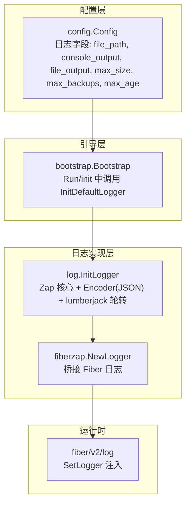
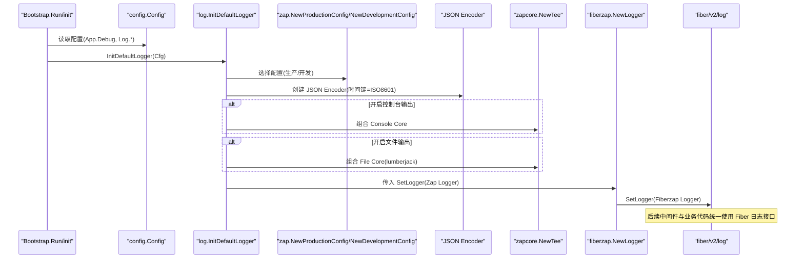
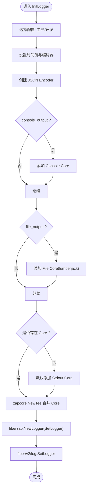
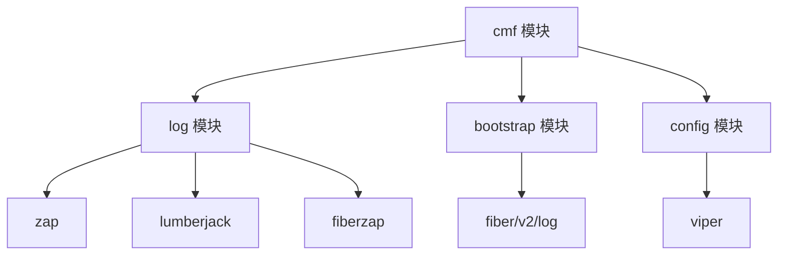

# 日志系统

<cite>
**本文引用的文件**
- [log/log.go](file://log/log.go)
- [bootstrap/bootstrap.go](file://bootstrap/bootstrap.go)
- [config/config.go](file://config/config.go)
- [go.mod](file://go.mod)
</cite>

## 目录
1. [简介](#简介)
2. [项目结构](#项目结构)
3. [核心组件](#核心组件)
4. [架构总览](#架构总览)
5. [详细组件分析](#详细组件分析)
6. [依赖分析](#依赖分析)
7. [性能考虑](#性能考虑)
8. [故障排查指南](#故障排查指南)
9. [结论](#结论)
10. [附录](#附录)

## 简介
本文件面向 CMF 项目的日志系统，聚焦于基于 Zap 的结构化日志集成与 Fiber 日志记录器的桥接，阐述高性能日志记录与管理的设计理念与实现方式。内容涵盖日志级别、格式化选项、输出目标配置、日志轮转与文件管理、性能优化策略，并提供配置示例与最佳实践，帮助开发者构建完善的可观测性体系。

## 项目结构
日志系统由以下模块协同组成：
- 配置层：通过 Viper 读取与合并环境变量、默认值与配置文件，提供日志相关参数。
- 引导层：在应用启动阶段初始化日志系统，并将日志记录器注入到 Fiber 的日志框架。
- 日志实现层：以 Zap 为核心，结合 lumberjack 实现 JSON 结构化日志与多路输出（控制台与文件），支持按需开启与关闭输出目标。

图表来源
- [config/config.go:50-57](file://config/config.go#L50-L57)
- [bootstrap/bootstrap.go:228-242](file://bootstrap/bootstrap.go#L228-L242)
- [log/log.go:22-77](file://log/log.go#L22-L77)

章节来源
- [config/config.go:50-57](file://config/config.go#L50-L57)
- [bootstrap/bootstrap.go:228-242](file://bootstrap/bootstrap.go#L228-L242)
- [log/log.go:22-77](file://log/log.go#L22-L77)

## 核心组件
- 日志初始化函数：根据配置创建 Zap Logger，选择生产或开发配置，设置时间编码，构造 JSON Encoder，并按需组合控制台与文件输出 Core，最终通过 fiberzap 桥接到 Fiber 日志框架。
- 默认初始化入口：InitDefaultLogger 统一从全局配置对象读取日志参数，简化调用。
- 配置模型：Config.Log 字段承载日志输出路径、开关与轮转参数；Viper 在启动时提供默认值与环境变量覆盖。

章节来源
- [log/log.go:14-83](file://log/log.go#L14-L83)
- [config/config.go:50-57](file://config/config.go#L50-L57)

## 架构总览
下图展示了从应用启动到日志生效的关键流程，以及日志输出的多路分发与轮转机制：

图表来源
- [bootstrap/bootstrap.go:228-242](file://bootstrap/bootstrap.go#L228-L242)
- [log/log.go:22-77](file://log/log.go#L22-L77)

## 详细组件分析

### 日志初始化流程（InitLogger）
- 配置选择：优先使用生产配置；当 App.Debug 为真时切换为开发配置。
- 时间编码：将时间键命名为 time，并采用 ISO8601 时间编码器。
- 输出目标：
  - 控制台：当 console_output 为真时，将 JSON Encoder 与 os.Stdout 绑定为 Core。
  - 文件：当 file_output 为真时，使用 lumberjack.Logger 作为同步写入器，配合 JSON Encoder 生成 Core。
  - 默认回退：若均未开启，则默认输出到标准输出。
- 多路合并：使用 zapcore.NewTee 将多个 Core 合并为单一 Logger。
- 桥接 Fiber：通过 fiberzap.NewLogger 包装 Zap Logger，并调用 fiber/v2/log.SetLogger 完成注入。

图表来源
- [log/log.go:22-77](file://log/log.go#L22-L77)

章节来源
- [log/log.go:22-77](file://log/log.go#L22-L77)

### 默认初始化入口（InitDefaultLogger）
- 从全局配置对象读取 Debug、ConsoleOutput、FileOutput、FilePath、MaxSize、MaxBackups、MaxAge 等参数。
- 调用 InitLogger 完成初始化。

章节来源
- [log/log.go:79-83](file://log/log.go#L79-L83)
- [config/config.go:50-57](file://config/config.go#L50-L57)

### 配置模型与默认值
- Config.Log 字段：
  - file_path：日志文件路径
  - console_output：是否输出到控制台
  - file_output：是否输出到文件
  - max_size：单文件最大大小（MB）
  - max_backups：保留的旧日志文件数量
  - max_age：保留的旧日志文件最大天数
- Viper 默认值：
  - 默认开启控制台与文件输出
  - 默认文件大小 10MB、保留 10 个备份、保留 180 天
  - 默认文件路径 ./data/logs/app.log

章节来源
- [config/config.go:50-57](file://config/config.go#L50-L57)
- [config/config.go:164-170](file://config/config.go#L164-L170)

### Fiber 日志集成
- 在引导阶段，Bootstrap 在 init() 中调用 InitDefaultLogger，随后在 Run() 中注册 recover、logger、requestid 等中间件。
- 由于日志记录器已在 init() 阶段注入，后续中间件与业务代码均可通过 fiber/v2/log 接口进行结构化日志记录。

章节来源
- [bootstrap/bootstrap.go:228-242](file://bootstrap/bootstrap.go#L228-L242)
- [bootstrap/bootstrap.go:189-193](file://bootstrap/bootstrap.go#L189-L193)

## 依赖分析
- 外部库依赖：
  - go.uber.org/zap：高性能结构化日志库
  - gopkg.in/natefinch/lumberjack.v2：日志轮转与压缩
  - github.com/gofiber/contrib/fiberzap/v2：将 Zap 桥接到 Fiber 日志
  - github.com/gofiber/fiber/v2/log：Fiber 日志框架
  - github.com/spf13/viper：配置读取与默认值管理
- 模块耦合：
  - log 模块仅依赖 zap、lumberjack、fiberzap 与 config，保持低耦合
  - bootstrap 仅在启动阶段调用日志初始化，避免运行时耦合
  - config 模块集中管理日志参数，便于集中配置与覆盖

图表来源
- [go.mod:5-26](file://go.mod#L5-L26)
- [log/log.go:3-12](file://log/log.go#L3-L12)
- [bootstrap/bootstrap.go:14](file://bootstrap/bootstrap.go#L14)
- [config/config.go:3-8](file://config/config.go#L3-L8)

章节来源
- [go.mod:5-26](file://go.mod#L5-L26)
- [log/log.go:3-12](file://log/log.go#L3-L12)
- [bootstrap/bootstrap.go:14](file://bootstrap/bootstrap.go#L14)
- [config/config.go:3-8](file://config/config.go#L3-L8)

## 性能考虑
- 结构化日志与 JSON 编码：使用 JSON Encoder 便于日志聚合与检索，但会增加序列化开销；在高吞吐场景下建议评估字段数量与层级深度。
- 多路输出（Tee）：同时向控制台与文件输出会带来额外 IO 成本；建议在生产环境关闭不必要的输出目标，或仅在调试阶段开启控制台输出。
- 轮转策略：lumberjack 的 MaxSize、MaxBackups、MaxAge 参数直接影响磁盘占用与 IO 峰值；应结合业务日志量与磁盘容量合理配置。
- 同步写入：当前实现使用 AddSync 包装输出器，属于同步写入；在极高 QPS 下可考虑异步队列或批量刷盘策略（需自行扩展）。
- 时间编码：ISO8601 时间编码器性能稳定，适合生产环境；如对 CPU 占用敏感，可评估更轻量的时间格式。
- 开发/生产配置切换：开发配置通常包含更丰富的字段与更宽松的级别过滤，生产环境建议使用生产配置以降低开销。

## 故障排查指南
- 日志未输出到文件
  - 检查 file_output 是否开启，以及 file_path 是否可写且存在父目录
  - 确认 max_size、max_backups、max_age 参数是否合理
- 日志未输出到控制台
  - 检查 console_output 是否开启
- 日志级别不符合预期
  - 确认 App.Debug 的值，开发配置与生产配置的行为差异
- 日志轮转异常
  - 检查 lumberjack 的 Filename、MaxSize、MaxBackups、MaxAge 配置
  - 确认文件权限与磁盘空间
- Fiber 日志未生效
  - 确认 InitDefaultLogger 已在 Bootstrap.init() 中被调用
  - 确认 fiberzap.NewLogger 已通过 fiber/v2/log.SetLogger 注入

章节来源
- [log/log.go:42-64](file://log/log.go#L42-L64)
- [bootstrap/bootstrap.go:228-242](file://bootstrap/bootstrap.go#L228-L242)

## 结论
CMF 的日志系统以 Zap 为核心，结合 lumberjack 实现高性能、可轮转的结构化日志；通过 fiberzap 桥接，使 Fiber 中间件与业务代码统一使用结构化日志接口。配置层通过 Viper 提供灵活的默认值与覆盖能力。建议在生产环境中关闭不必要的输出目标、合理配置轮转参数，并结合业务流量与磁盘容量进行性能优化与容量规划。

## 附录

### 配置项说明与示例
- file_path：日志文件绝对或相对路径
- console_output：是否输出到控制台（布尔）
- file_output：是否输出到文件（布尔）
- max_size：单文件最大大小（MB）
- max_backups：保留的旧日志文件数量
- max_age：保留的旧日志文件最大天数（天）

默认值参考
- console_output: true
- file_output: true
- max_size: 10
- max_backups: 10
- max_age: 180
- file_path: ./data/logs/app.log

章节来源
- [config/config.go:164-170](file://config/config.go#L164-L170)
- [config/config.go:50-57](file://config/config.go#L50-L57)