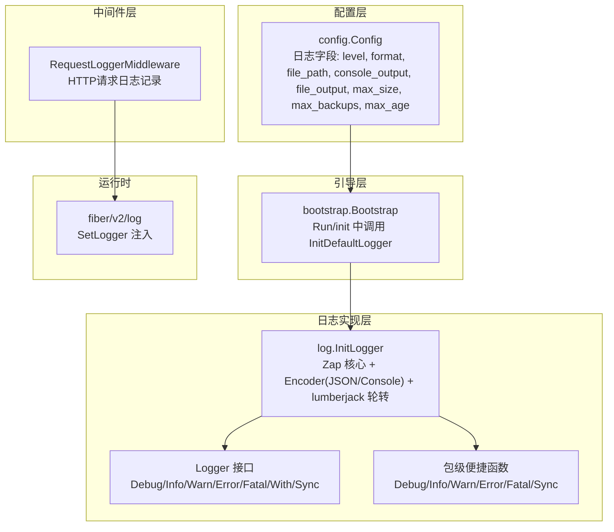
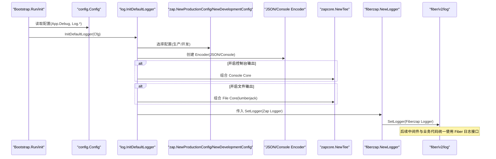
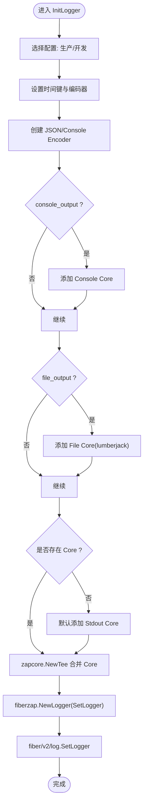
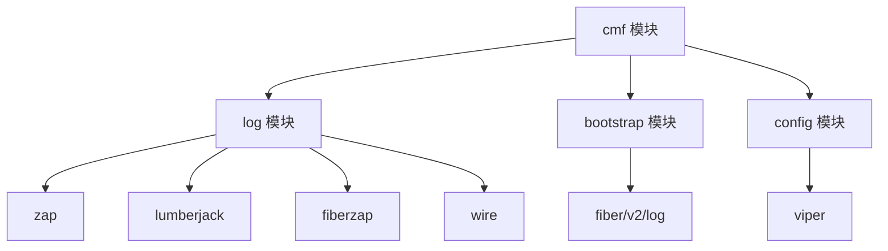

# 日志系统

<cite>
**本文引用的文件**
- [log/log.go](file://log/log.go)
- [bootstrap/bootstrap.go](file://bootstrap/bootstrap.go)
- [config/config.go](file://config/config.go)
- [go.mod](file://go.mod)
- [casbin/casbin.go](file://casbin/casbin.go)
- [casbin/enforcer_manager.go](file://casbin/enforcer_manager.go)
</cite>

## 更新摘要
**变更内容**
- 从Fiber内置日志完全迁移到zap日志库
- 新增结构化日志支持（JSON和console格式）
- 实现文件轮转功能（lumberjack）
- 添加请求级日志中间件
- 支持依赖注入（wire框架）
- 提供统一的Logger接口和包级便捷函数
- 保持向后兼容性

## 目录
1. [简介](#简介)
2. [项目结构](#项目结构)
3. [核心组件](#核心组件)
4. [架构总览](#架构总览)
5. [详细组件分析](#详细组件分析)
6. [依赖分析](#依赖分析)
7. [性能考虑](#性能考虑)
8. [故障排查指南](#故障排查指南)
9. [结论](#结论)
10. [附录](#附录)

## 简介
本文件面向 CMF 项目的日志系统，详细介绍基于 Zap 的结构化日志集成与 Fiber 日志记录器的桥接。系统实现了高性能的日志记录与管理，涵盖日志级别、格式化选项、输出目标配置、日志轮转与文件管理、性能优化策略，并提供配置示例与最佳实践，帮助开发者构建完善的可观测性体系。

**更新** 本版本完全重构了日志系统，从Fiber内置日志迁移到zap日志库，新增了结构化日志、文件轮转、请求级日志中间件等核心功能。

## 项目结构
日志系统由以下模块协同组成：
- **配置层**：通过 Viper 读取与合并环境变量、默认值与配置文件，提供日志相关参数。
- **引导层**：在应用启动阶段初始化日志系统，并将日志记录器注入到 Fiber 的日志框架。
- **日志实现层**：以 Zap 为核心，结合 lumberjack 实现 JSON 结构化日志与多路输出（控制台与文件），支持按需开启与关闭输出目标。
- **中间件层**：提供请求级日志中间件，记录每个HTTP请求的详细信息。



**图表来源**
- [config/config.go:54-63](file://config/config.go#L54-L63)
- [bootstrap/bootstrap.go:274-284](file://bootstrap/bootstrap.go#L274-L284)
- [log/log.go:18-27](file://log/log.go#L18-L27)
- [log/log.go:220-242](file://log/log.go#L220-L242)

**章节来源**
- [config/config.go:54-63](file://config/config.go#L54-L63)
- [bootstrap/bootstrap.go:274-284](file://bootstrap/bootstrap.go#L274-L284)
- [log/log.go:18-27](file://log/log.go#L18-L27)
- [log/log.go:220-242](file://log/log.go#L220-L242)

## 核心组件
- **日志接口**：Logger 接口定义了统一的日志记录方法，包括 Debug、Info、Warn、Error、Fatal、With、Sync 等方法。
- **zapLogger实现**：Logger 接口的zap实现，封装了zap.Logger实例，提供线程安全的日志记录功能。
- **全局日志管理**：SetDefault 和 GetDefault 函数提供全局默认日志实例的设置和获取。
- **包级便捷函数**：提供 Debug、Info、Warn、Error、Fatal、Sync 等包级函数，简化日常使用。
- **配置解析**：parseLevel 函数将字符串级别的配置转换为zapcore.Level。
- **依赖注入支持**：ProviderSet 提供Wire依赖注入所需的provider集合。
- **请求日志中间件**：RequestLoggerMiddleware 记录每个HTTP请求的详细信息。

**章节来源**
- [log/log.go:18-77](file://log/log.go#L18-L77)
- [log/log.go:84-99](file://log/log.go#L84-L99)
- [log/log.go:102-125](file://log/log.go#L102-L125)
- [log/log.go:127-142](file://log/log.go#L127-L142)
- [log/log.go:174-175](file://log/log.go#L174-L175)
- [log/log.go:220-242](file://log/log.go#L220-L242)

## 架构总览
下图展示了从应用启动到日志生效的关键流程，以及日志输出的多路分发与轮转机制：



**图表来源**
- [bootstrap/bootstrap.go:274-284](file://bootstrap/bootstrap.go#L274-L284)
- [log/log.go:177-218](file://log/log.go#L177-L218)

## 详细组件分析

### 日志初始化流程（InitLogger）
- **配置选择**：优先使用生产配置；当 App.Debug 为真时切换为开发配置。
- **时间编码**：将时间键命名为 time，并采用 ISO8601 时间编码器。
- **输出目标**：
  - 控制台：当 console_output 为真时，将 Encoder 与 os.Stdout 绑定为 Core。
  - 文件：当 file_output 为真时，使用 lumberjack.Logger 作为同步写入器，配合 Encoder 生成 Core。
  - 默认回退：若均未开启，则默认输出到标准输出。
- **多路合并**：使用 zapcore.NewTee 将多个 Core 合并为单一 Logger。
- **桥接 Fiber**：通过 fiberzap.NewLogger 包装 Zap Logger，并调用 fiber/v2/log.SetLogger 完成注入。



**图表来源**
- [log/log.go:244-284](file://log/log.go#L244-L284)

**章节来源**
- [log/log.go:244-284](file://log/log.go#L244-L284)

### 请求日志中间件（RequestLoggerMiddleware）
- **功能**：记录每个HTTP请求的详细信息，包括请求方法、路径、状态码、耗时、客户端IP等。
- **实现**：在中间件中记录请求开始时间，调用下一个处理器，计算处理耗时，然后记录请求日志。
- **字段**：包含 method、path、status、duration、ip 等结构化字段。
- **集成**：可直接注册到Fiber应用中，提供统一的HTTP请求日志记录。

**章节来源**
- [log/log.go:220-242](file://log/log.go#L220-L242)

### 全局日志接口（Logger）
- **接口设计**：定义了统一的日志记录接口，包括 Debug、Info、Warn、Error、Fatal、With、Sync 方法。
- **实现**：zapLogger 结构体实现了 Logger 接口，封装了 zap.Logger 实例。
- **线程安全**：通过互斥锁保护全局日志实例的访问。
- **便捷函数**：提供包级函数，简化日常使用，无需显式获取默认日志实例。

**章节来源**
- [log/log.go:18-77](file://log/log.go#L18-L77)
- [log/log.go:84-125](file://log/log.go#L84-L125)

### 配置模型与默认值
- **Config.Log 字段**：
  - level：日志级别（debug、info、warn、error、fatal）
  - format：输出格式（json 或 console）
  - file_path：日志文件路径
  - console_output：是否输出到控制台
  - file_output：是否输出到文件
  - max_size：单文件最大大小（MB）
  - max_backups：保留的旧日志文件数量
  - max_age：保留的旧日志文件最大天数
- **Viper 默认值**：
  - 默认开启控制台与文件输出
  - 默认文件大小 10MB、保留 10 个备份、保留 180 天
  - 默认文件路径 ./data/logs/app.log
  - 默认日志级别 info，格式 json

**章节来源**
- [config/config.go:54-63](file://config/config.go#L54-L63)
- [config/config.go:170-178](file://config/config.go#L170-L178)

### Fiber 日志集成
- **双向兼容**：既支持新的zap日志接口，也保持与Fiber内置日志的兼容。
- **初始化流程**：在引导阶段，Bootstrap 在 init() 中调用 InitDefaultLogger，随后在 Run() 中注册 recover、logger、requestid 等中间件。
- **日志记录**：由于日志记录器已在 init() 阶段注入，后续中间件与业务代码均可通过 fiber/v2/log 接口进行结构化日志记录。

**章节来源**
- [bootstrap/bootstrap.go:274-284](file://bootstrap/bootstrap.go#L274-L284)
- [bootstrap/bootstrap.go:192-196](file://bootstrap/bootstrap.go#L192-L196)

## 依赖分析
- **外部库依赖**：
  - go.uber.org/zap：高性能结构化日志库
  - gopkg.in/natefinch/lumberjack.v2：日志轮转与压缩
  - github.com/gofiber/contrib/fiberzap/v2：将 Zap 桥接到 Fiber 日志
  - github.com/gofiber/fiber/v2/log：Fiber 日志框架
  - github.com/spf13/viper：配置读取与默认值管理
  - github.com/google/wire：依赖注入框架
- **模块耦合**：
  - log 模块仅依赖 zap、lumberjack、fiberzap 与 config，保持低耦合
  - bootstrap 仅在启动阶段调用日志初始化，避免运行时耦合
  - config 模块集中管理日志参数，便于集中配置与覆盖



**图表来源**
- [go.mod:5-27](file://go.mod#L5-L27)
- [log/log.go:3-16](file://log/log.go#L3-L16)
- [bootstrap/bootstrap.go:13-22](file://bootstrap/bootstrap.go#L13-L22)
- [config/config.go:3-8](file://config/config.go#L3-L8)

**章节来源**
- [go.mod:5-27](file://go.mod#L5-L27)
- [log/log.go:3-16](file://log/log.go#L3-L16)
- [bootstrap/bootstrap.go:13-22](file://bootstrap/bootstrap.go#L13-L22)
- [config/config.go:3-8](file://config/config.go#L3-L8)

## 性能考虑
- **结构化日志与 JSON 编码**：使用 JSON Encoder 便于日志聚合与检索，但会增加序列化开销；在高吞吐场景下建议评估字段数量与层级深度。
- **多路输出（Tee）**：同时向控制台与文件输出会带来额外 IO 成本；建议在生产环境关闭不必要的输出目标，或仅在调试阶段开启控制台输出。
- **轮转策略**：lumberjack 的 MaxSize、MaxBackups、MaxAge 参数直接影响磁盘占用与 IO 峰值；应结合业务日志量与磁盘容量合理配置。
- **同步写入**：当前实现使用 AddSync 包装输出器，属于同步写入；在极高 QPS 下可考虑异步队列或批量刷盘策略（需自行扩展）。
- **时间编码**：ISO8601 时间编码器性能稳定，适合生产环境；如对 CPU 占用敏感，可评估更轻量的时间格式。
- **开发/生产配置切换**：开发配置通常包含更丰富的字段与更宽松的级别过滤，生产环境建议使用生产配置以降低开销。
- **中间件性能**：请求日志中间件会增加每个请求的处理时间，建议在生产环境谨慎使用或限制日志级别。

## 故障排查指南
- **日志未输出到文件**
  - 检查 file_output 是否开启，以及 file_path 是否可写且存在父目录
  - 确认 max_size、max_backups、max_age 参数是否合理
- **日志未输出到控制台**
  - 检查 console_output 是否开启
- **日志级别不符合预期**
  - 确认 App.Debug 的值，开发配置与生产配置的行为差异
  - 检查 log.level 配置是否正确
- **日志轮转异常**
  - 检查 lumberjack 的 Filename、MaxSize、MaxBackups、MaxAge 配置
  - 确认文件权限与磁盘空间
- **Fiber 日志未生效**
  - 确认 InitDefaultLogger 已在 Bootstrap.init() 中被调用
  - 确认 fiberzap.NewLogger 已通过 fiber/v2/log.SetLogger 注入
- **请求日志中间件问题**
  - 检查中间件是否正确注册到Fiber应用
  - 确认日志级别设置是否允许记录请求日志
- **依赖注入问题**
  - 确认 wire 生成的代码是否正确编译
  - 检查 ProviderSet 是否正确注册

**章节来源**
- [log/log.go:177-218](file://log/log.go#L177-L218)
- [bootstrap/bootstrap.go:274-284](file://bootstrap/bootstrap.go#L274-L284)
- [log/log.go:220-242](file://log/log.go#L220-L242)

## 结论
CMF 的日志系统以 Zap 为核心，结合 lumberjack 实现高性能、可轮转的结构化日志；通过 fiberzap 桥接，使 Fiber 中间件与业务代码统一使用结构化日志接口。新增的请求日志中间件提供了完整的HTTP请求追踪能力。配置层通过 Viper 提供灵活的默认值与覆盖能力。建议在生产环境中关闭不必要的输出目标、合理配置轮转参数，并结合业务流量与磁盘容量进行性能优化与容量规划。依赖注入的支持使得日志系统更加灵活和可测试。

## 附录

### 配置项说明与示例
- **level**：日志级别（debug、info、warn、error、fatal）
- **format**：输出格式（json 或 console）
- **file_path**：日志文件绝对或相对路径
- **console_output**：是否输出到控制台（布尔）
- **file_output**：是否输出到文件（布尔）
- **max_size**：单文件最大大小（MB）
- **max_backups**：保留的旧日志文件数量
- **max_age**：保留的旧日志文件最大天数（天）

默认值参考
- level: info
- format: json
- console_output: true
- file_output: true
- max_size: 10
- max_backups: 10
- max_age: 180
- file_path: ./data/logs/app.log

**章节来源**
- [config/config.go:54-63](file://config/config.go#L54-L63)
- [config/config.go:170-178](file://config/config.go#L170-L178)

### 使用示例
- **基础使用**：
  ```go
  log.Info("应用启动", zap.String("name", "cmf"), zap.Int("port", 3000))
  ```
- **请求日志中间件**：
  ```go
  app.Use(log.RequestLoggerMiddleware(log.GetDefault()))
  ```
- **自定义日志级别**：
  ```go
  logger := log.NewLoggerFromConfig(log.LogConfig{
      Level: "debug",
      Format: "console",
  })
  ```

### 最佳实践
- **生产环境**：使用 JSON 格式，开启文件输出，设置合适的日志级别
- **开发环境**：使用 console 格式，开启控制台输出，设置 debug 级别
- **性能优化**：避免在高频路径中记录大量字段，合理使用 With 方法
- **日志轮转**：根据业务量调整 max_size、max_backups、max_age 参数
- **中间件使用**：谨慎使用请求日志中间件，避免影响性能