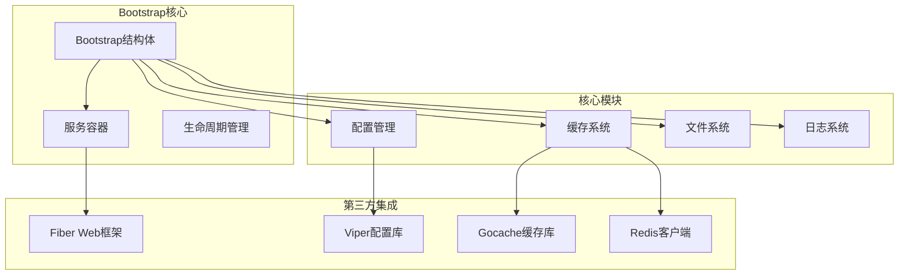
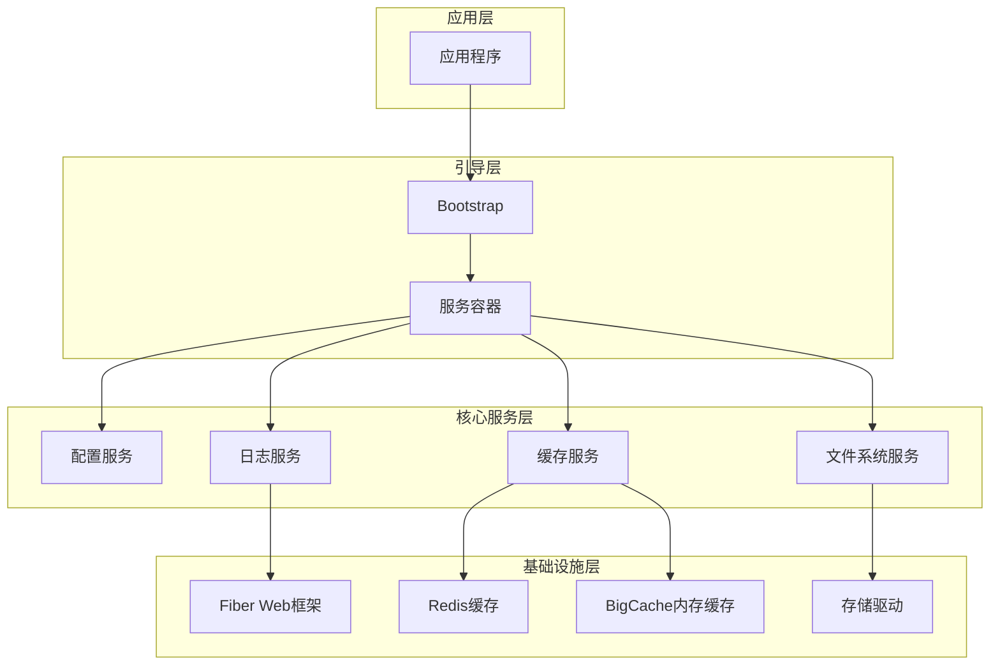
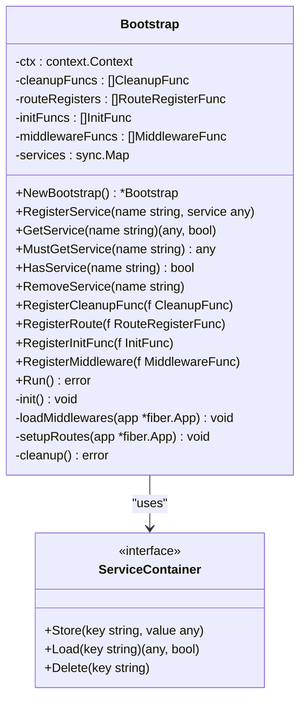
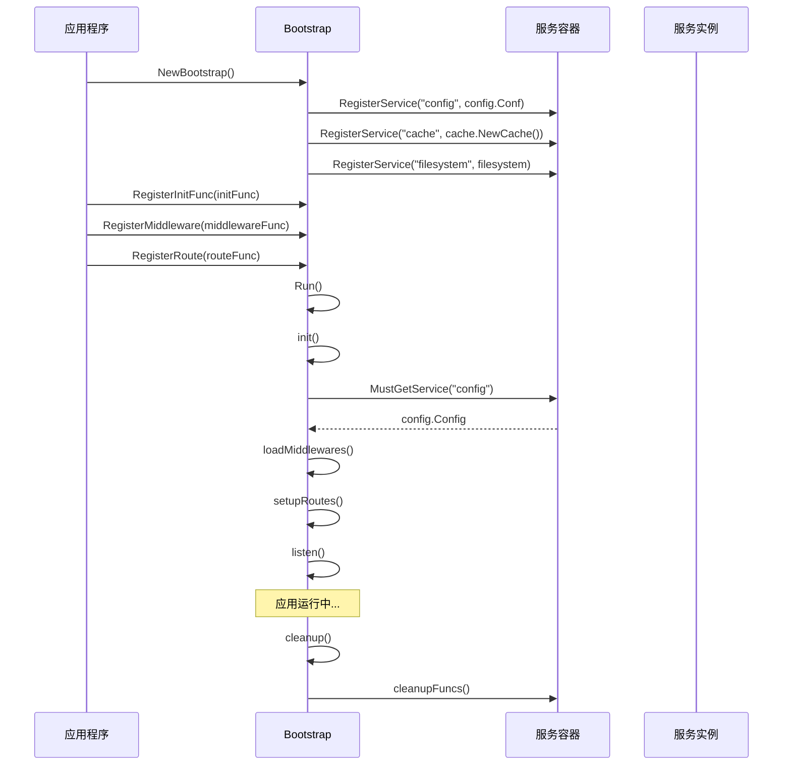
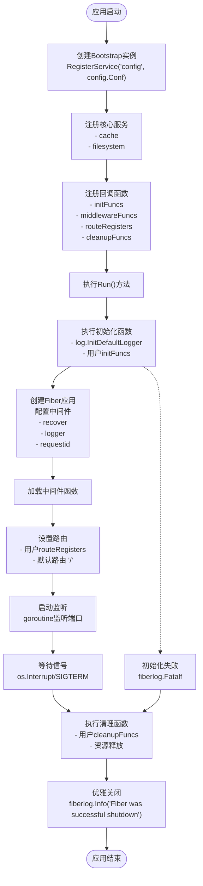
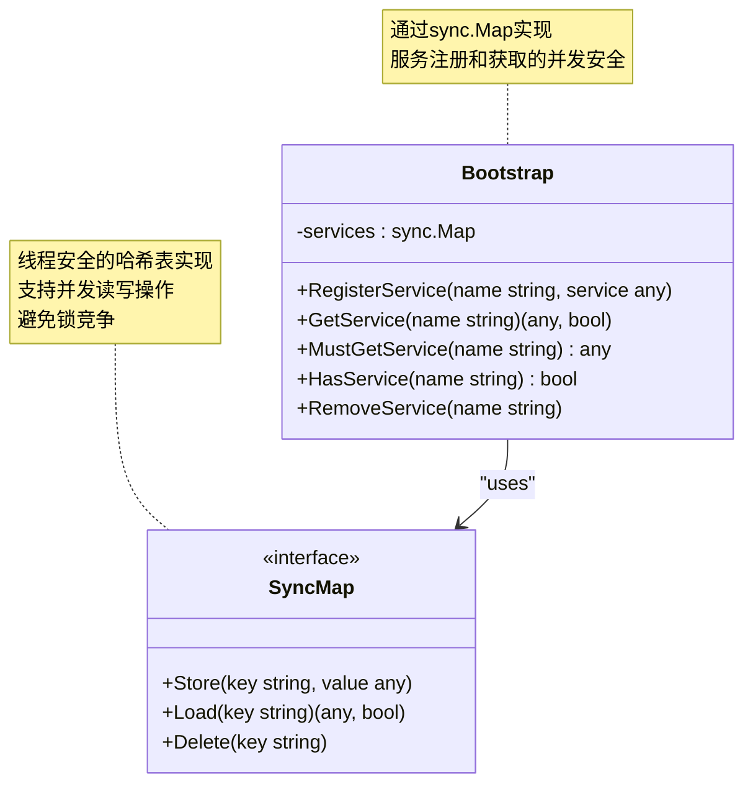
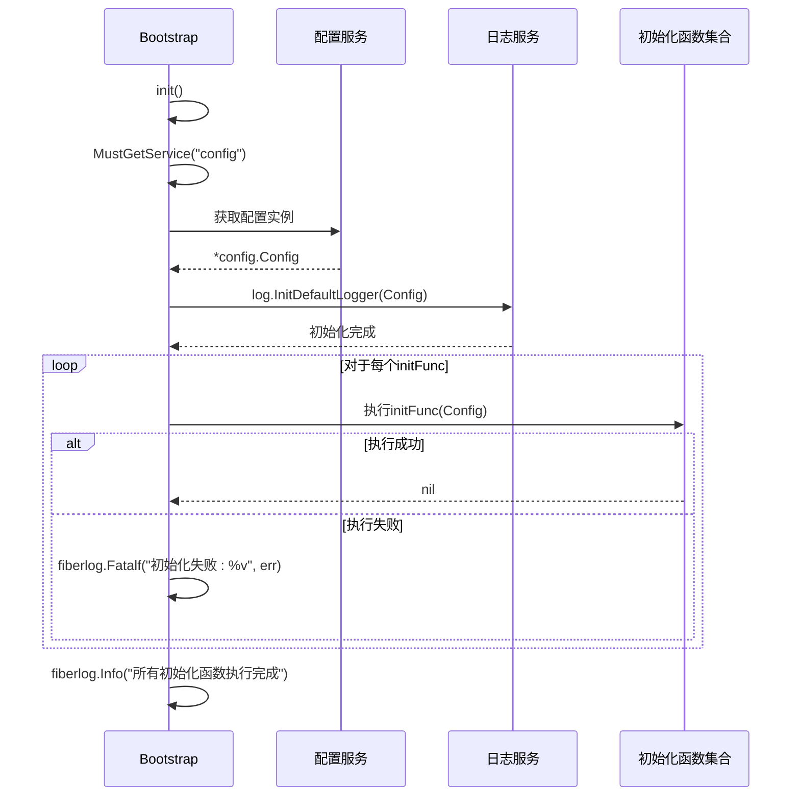
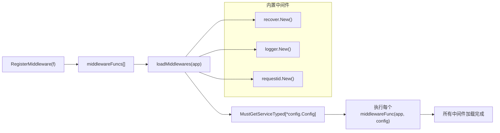
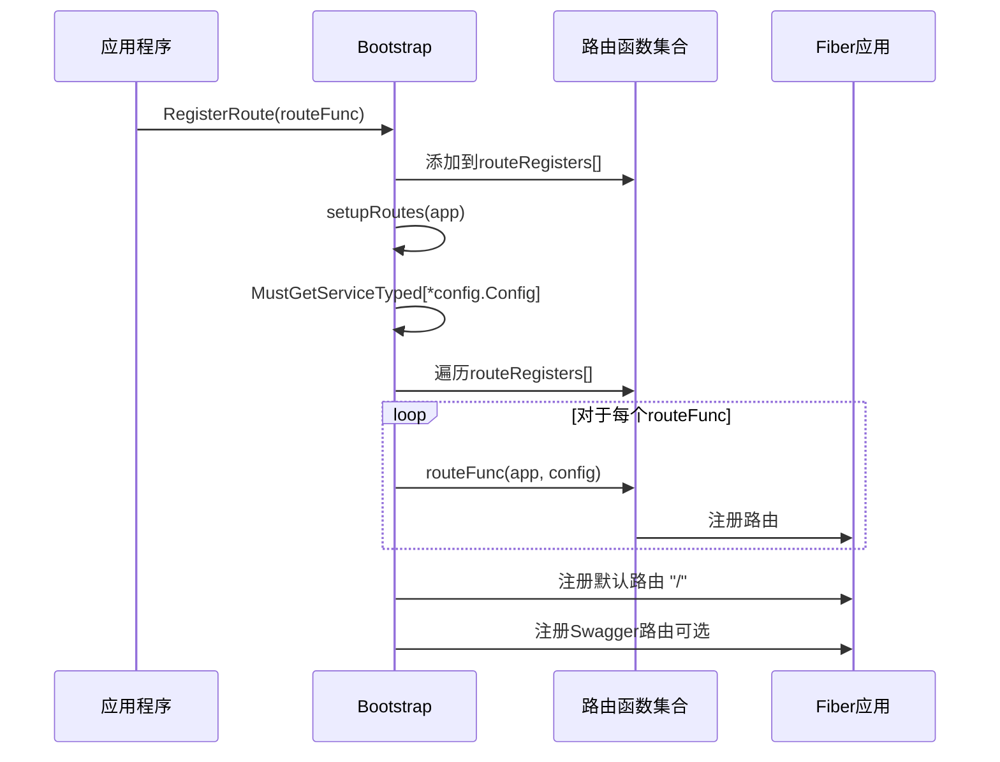
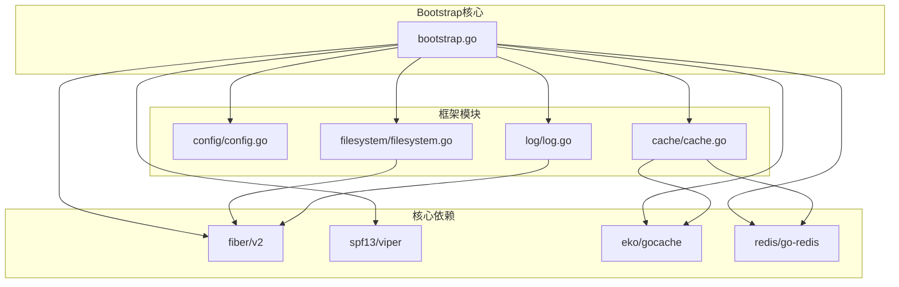

# Bootstrap引导系统

<cite>
**本文档引用的文件**
- [bootstrap.go](file://bootstrap/bootstrap.go)
- [config.go](file://config/config.go)
- [cache.go](file://cache/cache.go)
- [filesystem.go](file://filesystem/filesystem.go)
- [log.go](file://log/log.go)
- [bigcache.go](file://cache/driver/bigcache.go)
- [redis.go](file://cache/driver/redis.go)
- [README.md](file://README.md)
- [go.mod](file://go.mod)
</cite>

## 目录
1. [简介](#简介)
2. [项目结构](#项目结构)
3. [核心组件](#核心组件)
4. [架构概览](#架构概览)
5. [详细组件分析](#详细组件分析)
6. [依赖关系分析](#依赖关系分析)
7. [性能考虑](#性能考虑)
8. [故障排除指南](#故障排除指南)
9. [结论](#结论)

## 简介

CMF框架的Bootstrap引导系统是一个基于Go语言开发的模块化Web应用框架核心组件。该系统提供了完整的应用启动、服务注册、依赖注入和生命周期管理功能。Bootstrap结构体作为整个框架的中枢控制器，实现了服务容器、中间件管理和路由注册等功能，为CMF框架提供了强大的基础设施支持。

该系统采用模块化设计理念，支持多种缓存存储（内存和Redis）、文件系统抽象、配置管理、日志记录等核心功能，并通过统一的服务容器实现了松耦合的依赖管理。

## 项目结构

CMF框架采用清晰的模块化组织结构，每个核心功能都被封装在独立的包中：

**图表来源**
- [bootstrap.go:37-45](file://bootstrap/bootstrap.go#L37-L45)
- [config.go:102-106](file://config/config.go#L102-L106)

**章节来源**
- [README.md:55-75](file://README.md#L55-L75)
- [go.mod:1-26](file://go.mod#L1-L26)

## 核心组件

Bootstrap引导系统的核心由以下关键组件构成：

### Bootstrap结构体
Bootstrap结构体是整个系统的中枢控制器，负责协调各个模块的工作。其主要职责包括：
- 服务注册和管理
- 生命周期事件处理
- 中间件和路由管理
- 资源清理和优雅关闭

### 服务容器
采用sync.Map实现的线程安全服务容器，支持：
- 单例模式的服务注册
- 类型安全的服务获取
- 并发环境下的安全访问
- 动态服务发现和管理

### 生命周期管理
完整的应用生命周期管理，包括：
- 初始化阶段（initFuncs）
- 运行阶段（中间件和路由）
- 关闭阶段（cleanupFuncs）

**章节来源**
- [bootstrap.go:37-45](file://bootstrap/bootstrap.go#L37-L45)
- [bootstrap.go:88-153](file://bootstrap/bootstrap.go#L88-L153)

## 架构概览

Bootstrap引导系统采用分层架构设计，实现了高度的模块化和可扩展性：

**图表来源**
- [bootstrap.go:47-66](file://bootstrap/bootstrap.go#L47-L66)
- [cache.go:24-55](file://cache/cache.go#L24-L55)
- [filesystem.go:157-190](file://filesystem/filesystem.go#L157-L190)

## 详细组件分析

### Bootstrap结构体设计

Bootstrap结构体采用了精心设计的数据结构来支持其核心功能：

**图表来源**
- [bootstrap.go:37-45](file://bootstrap/bootstrap.go#L37-L45)
- [bootstrap.go:88-153](file://bootstrap/bootstrap.go#L88-L153)

#### 服务注册机制

Bootstrap系统实现了完整的服务注册机制，支持多种服务类型：

**章节来源**
- [bootstrap.go:47-66](file://bootstrap/bootstrap.go#L47-L66)
- [bootstrap.go:88-91](file://bootstrap/bootstrap.go#L88-L91)

### 依赖注入模式

系统采用依赖注入模式，通过服务容器实现松耦合的组件交互：

**图表来源**
- [bootstrap.go:155-215](file://bootstrap/bootstrap.go#L155-L215)
- [bootstrap.go:228-242](file://bootstrap/bootstrap.go#L228-L242)

### 单例模式应用

系统在多个关键组件中应用了单例模式，确保资源的有效管理和避免重复创建：

**章节来源**
- [bootstrap.go:47-66](file://bootstrap/bootstrap.go#L47-L66)
- [filesystem.go:88-144](file://filesystem/filesystem.go#L88-L144)

### 生命周期管理流程

Bootstrap系统实现了完整的应用生命周期管理，包括启动、运行和关闭三个阶段：

**图表来源**
- [bootstrap.go:155-215](file://bootstrap/bootstrap.go#L155-L215)
- [bootstrap.go:217-277](file://bootstrap/bootstrap.go#L217-L277)

**章节来源**
- [bootstrap.go:155-277](file://bootstrap/bootstrap.go#L155-L277)

### 服务容器并发安全实现

Bootstrap系统使用sync.Map实现了线程安全的服务容器，支持高并发环境下的服务管理：

**图表来源**
- [bootstrap.go:44](file://bootstrap/bootstrap.go#L44)
- [bootstrap.go:88-153](file://bootstrap/bootstrap.go#L88-L153)

#### 类型安全设计

系统提供了多种类型安全的服务获取方法：

**章节来源**
- [bootstrap.go:93-141](file://bootstrap/bootstrap.go#L93-L141)

### 初始化函数执行流程

初始化函数在整个系统启动过程中扮演着关键角色：

**图表来源**
- [bootstrap.go:228-242](file://bootstrap/bootstrap.go#L228-L242)

**章节来源**
- [bootstrap.go:228-242](file://bootstrap/bootstrap.go#L228-L242)

### 中间件函数加载机制

中间件系统提供了灵活的中间件注册和执行机制：

**图表来源**
- [bootstrap.go:83-86](file://bootstrap/bootstrap.go#L83-L86)
- [bootstrap.go:217-226](file://bootstrap/bootstrap.go#L217-L226)

**章节来源**
- [bootstrap.go:217-226](file://bootstrap/bootstrap.go#L217-L226)

### 路由注册函数机制

路由系统支持动态路由注册和管理：

**图表来源**
- [bootstrap.go:73-76](file://bootstrap/bootstrap.go#L73-L76)
- [bootstrap.go:258-277](file://bootstrap/bootstrap.go#L258-L277)

**章节来源**
- [bootstrap.go:258-277](file://bootstrap/bootstrap.go#L258-L277)

## 依赖关系分析

Bootstrap引导系统与各个模块之间建立了清晰的依赖关系：

**图表来源**
- [bootstrap.go:3-23](file://bootstrap/bootstrap.go#L3-L23)
- [go.mod:5-26](file://go.mod#L5-L26)

### 第三方库集成

系统集成了多个高质量的第三方库来提供核心功能：

**章节来源**
- [go.mod:5-26](file://go.mod#L5-L26)

## 性能考虑

Bootstrap引导系统在设计时充分考虑了性能优化：

### 并发安全优化
- 使用sync.Map替代互斥锁，提高并发访问性能
- 服务容器的线程安全设计避免了锁竞争
- 异步监听模式支持高并发请求处理

### 内存管理
- 单例模式避免重复对象创建
- 缓存服务的智能存储选择
- 资源及时清理机制

### 启动性能
- 延迟初始化策略
- 按需加载中间件
- 配置预加载机制

## 故障排除指南

### 常见问题及解决方案

**服务未注册错误**
- 症状：`panic: 服务 'service-name' 未注册`
- 解决方案：确保在应用启动前正确注册服务

**类型不匹配错误**
- 症状：`panic: 服务 'service-name' 的类型与请求的类型不匹配`
- 解决方案：检查服务注册时的类型一致性

**初始化失败**
- 症状：`fiberlog.Fatalf("初始化失败: %v", err)`
- 解决方案：检查配置文件和依赖服务状态

**章节来源**
- [bootstrap.go:120-141](file://bootstrap/bootstrap.go#L120-L141)
- [bootstrap.go:237-239](file://bootstrap/bootstrap.go#L237-L239)

## 结论

CMF框架的Bootstrap引导系统是一个设计精良、功能完备的应用启动框架。其核心特点包括：

1. **模块化设计**：清晰的组件分离和职责划分
2. **依赖注入**：灵活的服务管理和类型安全的依赖解析
3. **生命周期管理**：完整的应用生命周期控制
4. **并发安全**：基于sync.Map的线程安全实现
5. **扩展性**：支持动态注册和插件化的功能扩展

该系统为CMF框架提供了坚实的基础设施，使得开发者能够专注于业务逻辑的实现，而无需担心底层的基础设施管理。通过统一的服务容器和标准化的生命周期管理，Bootstrap系统确保了应用的稳定性、可维护性和高性能。