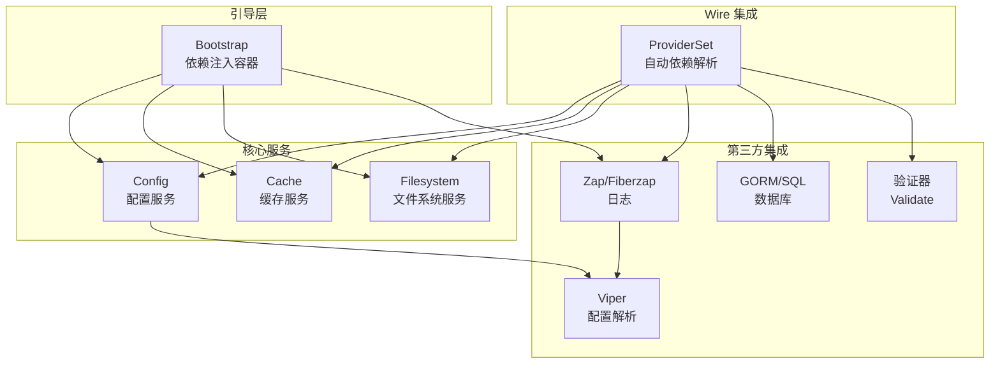
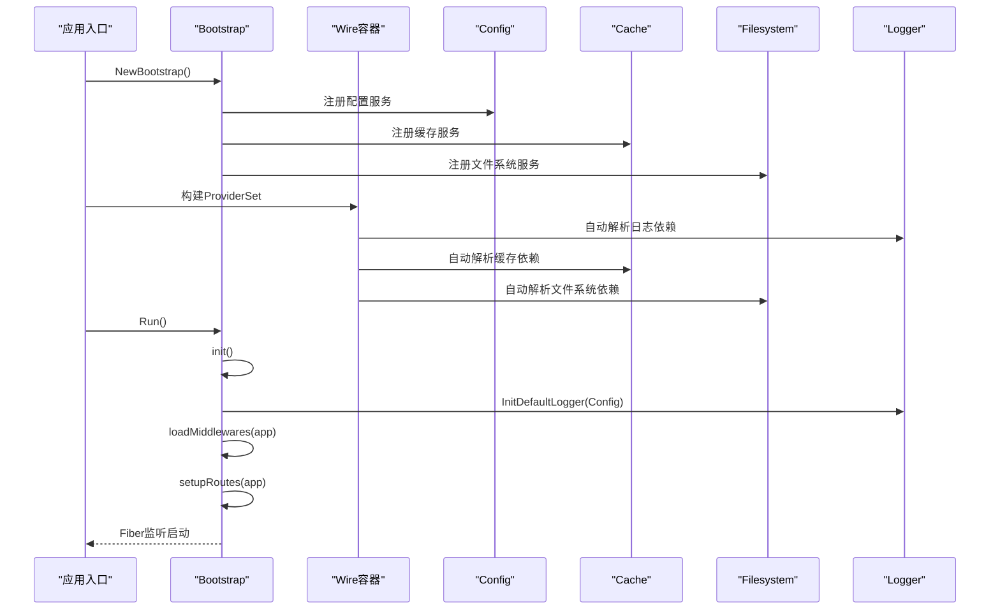
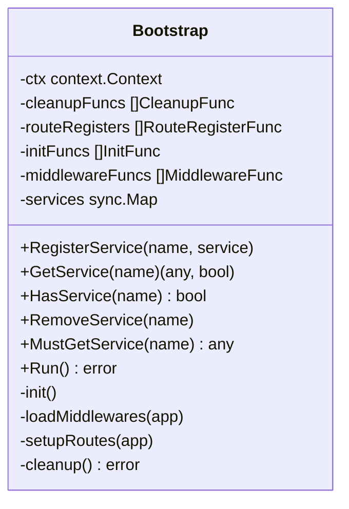
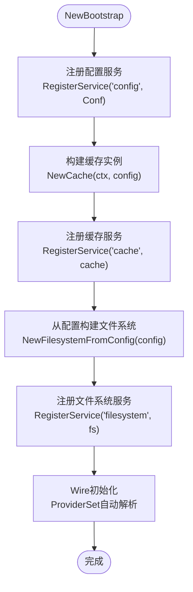
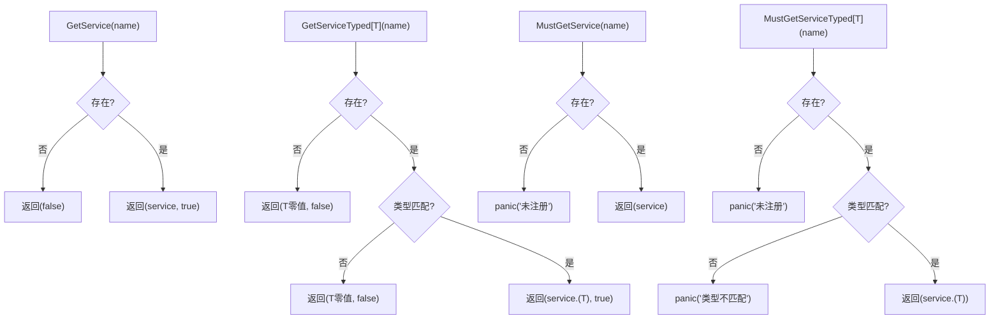
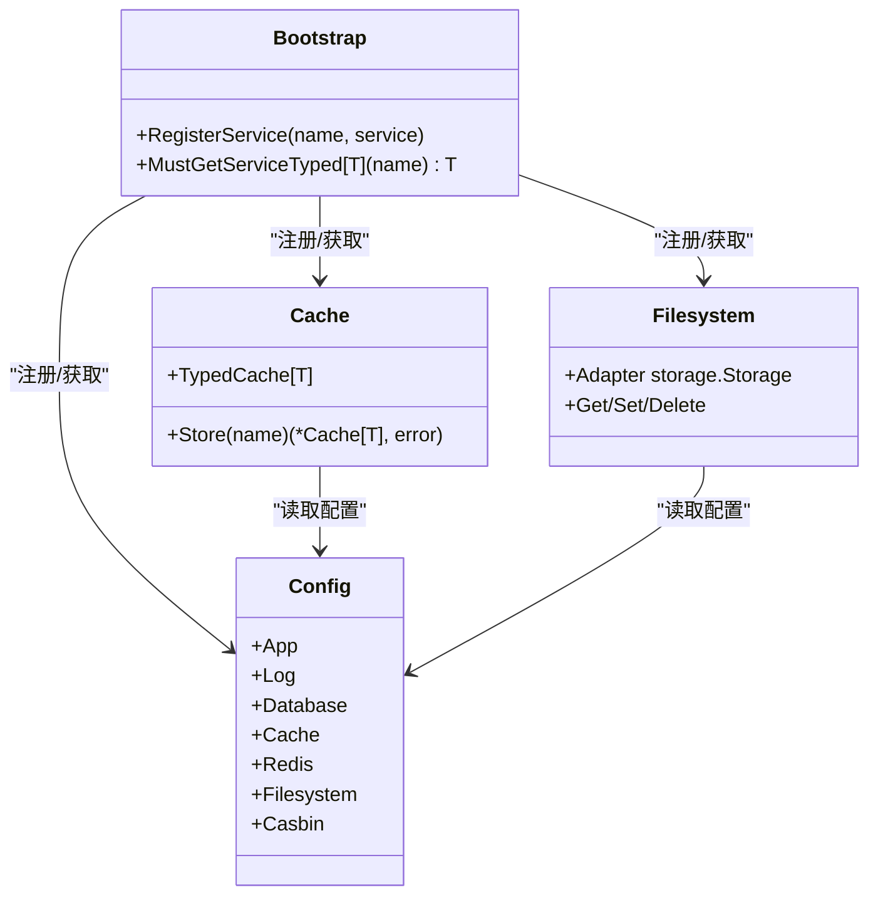
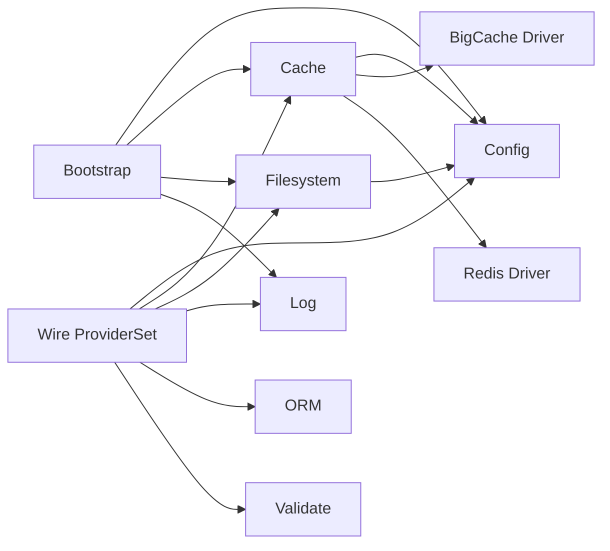

# 依赖注入机制

<cite>
**本文引用的文件**
- [bootstrap.go](file://bootstrap/bootstrap.go)
- [config.go](file://config/config.go)
- [cache.go](file://cache/cache.go)
- [filesystem.go](file://filesystem/filesystem.go)
- [bigcache.go](file://cache/driver/bigcache.go)
- [redis.go](file://cache/driver/redis.go)
- [log.go](file://log/log.go)
- [orm.go](file://orm/orm.go)
- [provider.go](file://validate/provider.go)
- [README.md](file://README.md)
</cite>

## 更新摘要
**变更内容**
- 新增 Google Wire 集成章节，介绍 ProviderSet 集合的自动依赖解析机制
- 更新核心组件部分，增加 Wire Provider 集合的说明
- 新增 Wire 集成最佳实践和使用场景
- 更新架构图，展示 Wire 与传统依赖注入的协同工作模式

## 目录
1. [简介](#简介)
2. [项目结构](#项目结构)
3. [核心组件](#核心组件)
4. [架构总览](#架构总览)
5. [详细组件分析](#详细组件分析)
6. [Google Wire 集成](#google-wire-集成)
7. [依赖关系分析](#依赖关系分析)
8. [性能考量](#性能考量)
9. [故障排查指南](#故障排查指南)
10. [结论](#结论)
11. [附录](#附录)

## 简介
本文件围绕 CMF 框架的依赖注入机制展开，重点解释 Bootstrap 如何实现 IoC 容器功能，详细描述 RegisterService 方法的单例模式与 sync.Map 的并发安全设计；阐述服务注册、查找、类型转换的完整流程，并对比泛型服务获取（GetServiceTyped、MustGetServiceTyped）在安全性与便利性方面的差异；分析服务依赖关系的管理方式及如何通过依赖注入实现模块间的解耦；**新增 Google Wire 集成章节，介绍 ProviderSet 集合的自动依赖解析机制**；最后给出服务注册的最佳实践与常见使用场景，包括核心服务（config、cache、filesystem）的自动注册机制。

## 项目结构
CMF 采用模块化设计，核心依赖注入位于 bootstrap 包，配合 config、cache、filesystem 等模块完成服务的自动注册与运行时获取。**新增 Google Wire 集成支持，各模块通过 ProviderSet 提供自动依赖解析能力**。README 明确指出"依赖注入：使用 Bootstrap 结构体和服务注册模式（RegisterService、GetService、MustGetServiceTyped）管理依赖"。



**图表来源**
- [bootstrap.go:47-66](file://bootstrap/bootstrap.go#L47-L66)
- [config.go:102-106](file://config/config.go#L102-L106)
- [cache.go:17-18](file://cache/cache.go#L17-L18)
- [log.go:174-175](file://log/log.go#L174-L175)
- [orm.go:13-14](file://orm/orm.go#L13-L14)
- [provider.go:5-6](file://validate/provider.go#L5-L6)

**章节来源**
- [README.md:28-32](file://README.md#L28-L32)
- [bootstrap.go:47-66](file://bootstrap/bootstrap.go#L47-L66)

## 核心组件
- Bootstrap：应用引导程序，充当 IoC 容器，负责服务注册、查找、生命周期管理（init、middleware、routes、cleanup）。
- Config：全局配置服务，提供应用、日志、数据库、缓存、Redis、文件系统、Casbin 等配置项。
- Cache：缓存服务，支持内存与 Redis 存储，提供类型安全的 TypedCache。
- Filesystem：文件系统抽象，支持本地与 S3，提供双写（主存储+本地）能力。
- **ProviderSet：Google Wire 集合，提供自动依赖解析和模块化服务注册能力**。

**章节来源**
- [bootstrap.go:37-45](file://bootstrap/bootstrap.go#L37-L45)
- [config.go:37-97](file://config/config.go#L37-L97)
- [cache.go:15-21](file://cache/cache.go#L15-L21)
- [filesystem.go:62-65](file://filesystem/filesystem.go#L62-L65)

## 架构总览
Bootstrap 通过 RegisterService 将核心服务注册为单例，随后在 Run、init、loadMiddlewares、setupRoutes 等阶段通过 MustGetServiceTyped 获取强类型服务实例，实现模块间解耦与集中管理。**新增 Wire 集成后，模块可通过 ProviderSet 实现自动依赖解析，简化复杂依赖的管理**。



**图表来源**
- [bootstrap.go:47-66](file://bootstrap/bootstrap.go#L47-L66)
- [bootstrap.go:155-215](file://bootstrap/bootstrap.go#L155-L215)
- [bootstrap.go:217-242](file://bootstrap/bootstrap.go#L217-L242)
- [log.go:174-175](file://log/log.go#L174-L175)
- [cache.go:17-18](file://cache/cache.go#L17-L18)

## 详细组件分析

### Bootstrap 容器与单例模式
- 容器结构：包含服务字典（sync.Map）、清理函数、路由注册函数、初始化函数、中间件函数等。
- 单例注册：RegisterService(name, service) 使用 sync.Map.Store(name, service)，实现线程安全的单例注册。
- 并发安全：sync.Map 的 Load/Store/Delete 原子操作，避免竞态条件，适合高并发场景。
- 生命周期：
  - init：根据配置初始化日志，依次执行注册的 InitFunc。
  - loadMiddlewares：按顺序调用注册的 MiddlewareFunc。
  - setupRoutes：按顺序调用注册的 RouteRegisterFunc，并注册默认路由与 Swagger 文档路由。
  - cleanup：依次执行注册的 CleanupFunc。



**图表来源**
- [bootstrap.go:37-45](file://bootstrap/bootstrap.go#L37-L45)
- [bootstrap.go:88-153](file://bootstrap/bootstrap.go#L88-L153)
- [bootstrap.go:155-256](file://bootstrap/bootstrap.go#L155-L256)

**章节来源**
- [bootstrap.go:37-45](file://bootstrap/bootstrap.go#L37-L45)
- [bootstrap.go:88-91](file://bootstrap/bootstrap.go#L88-L91)
- [bootstrap.go:155-256](file://bootstrap/bootstrap.go#L155-L256)

### 服务注册与自动注册机制
- 自动注册：NewBootstrap() 在构造时自动注册以下核心服务：
  - config：将全局配置对象注册为"config"服务。
  - cache：基于配置创建缓存实例并注册为"cache"服务。
  - filesystem：从配置创建文件系统实例并注册为"filesystem"服务。
- 注册时机：在应用启动前完成，确保后续模块可通过 MustGetServiceTyped 获取强类型服务。
- **Wire 集成**：各模块通过 ProviderSet 提供自动依赖解析，简化复杂依赖的管理。



**图表来源**
- [bootstrap.go:47-66](file://bootstrap/bootstrap.go#L47-L66)
- [config.go:102-106](file://config/config.go#L102-L106)
- [cache.go:24-55](file://cache/cache.go#L24-L55)
- [filesystem.go:156-190](file://filesystem/filesystem.go#L156-L190)

**章节来源**
- [bootstrap.go:47-66](file://bootstrap/bootstrap.go#L47-L66)

### 服务查找与类型转换
- GetService(name)：返回 (any, bool)，若服务不存在则返回 false；适合防御式编程。
- MustGetService(name)：若服务不存在则 panic，适用于"必须存在"的场景。
- GetServiceTyped[T](name)：泛型版本，返回 (T, bool)，在服务存在且类型匹配时返回 true；否则返回零值与 false。
- MustGetServiceTyped[T](name)：泛型版本，若服务不存在或类型不匹配则 panic，提供类型安全与便利性的平衡。



**图表来源**
- [bootstrap.go:93-98](file://bootstrap/bootstrap.go#L93-L98)
- [bootstrap.go:100-116](file://bootstrap/bootstrap.go#L100-L116)
- [bootstrap.go:118-126](file://bootstrap/bootstrap.go#L118-L126)
- [bootstrap.go:128-141](file://bootstrap/bootstrap.go#L128-L141)

**章节来源**
- [bootstrap.go:93-141](file://bootstrap/bootstrap.go#L93-L141)

### 泛型服务获取的安全性与便利性对比
- GetServiceTyped[T]：类型安全 + 防御式，适合需要显式处理"不存在/类型不匹配"的场景。
- MustGetServiceTyped[T]：类型安全 + 便利式，适合"确定存在且类型正确"的场景，简化调用链。
- 对比建议：
  - 在关键路径上优先使用 MustGetServiceTyped[T]，以减少分支判断。
  - 在边界条件或可选依赖上使用 GetServiceTyped[T]，便于优雅降级或错误处理。

**章节来源**
- [bootstrap.go:100-116](file://bootstrap/bootstrap.go#L100-L116)
- [bootstrap.go:128-141](file://bootstrap/bootstrap.go#L128-L141)

### 服务依赖关系管理与模块解耦
- 依赖注入实现：
  - 通过 RegisterService 注册核心服务（config、cache、filesystem）。
  - 通过 MustGetServiceTyped 获取强类型依赖，避免硬编码导入。
  - 通过 init/middleware/routes/cleanup 回调机制，模块仅需注册回调即可参与生命周期。
- 解耦效果：
  - 模块无需直接 import 其他模块的具体实现，仅依赖服务名与类型。
  - 通过配置驱动缓存/文件系统等服务的切换，提升可扩展性。

**章节来源**
- [bootstrap.go:217-242](file://bootstrap/bootstrap.go#L217-L242)
- [bootstrap.go:258-277](file://bootstrap/bootstrap.go#L258-L277)

### 核心服务：Config、Cache、Filesystem 的自动注册
- Config：
  - 初始化环境变量与默认配置，导出全局配置对象。
  - 在 Bootstrap 中注册为"config"服务，供其他模块读取。
- Cache：
  - 根据配置选择内存或 Redis 存储，创建缓存实例。
  - 支持 Store 切换与 TypedCache 类型安全封装。
- Filesystem：
  - 根据配置选择本地或 S3 驱动，支持主存储+本地双写。
  - 使用 sync.Map 实现驱动单例，避免重复创建。



**图表来源**
- [config.go:37-97](file://config/config.go#L37-L97)
- [cache.go:15-21](file://cache/cache.go#L15-L21)
- [filesystem.go:62-65](file://filesystem/filesystem.go#L62-L65)
- [bootstrap.go:54-64](file://bootstrap/bootstrap.go#L54-L64)

**章节来源**
- [config.go:102-106](file://config/config.go#L102-L106)
- [cache.go:24-55](file://cache/cache.go#L24-L55)
- [filesystem.go:156-190](file://filesystem/filesystem.go#L156-L190)
- [bootstrap.go:54-64](file://bootstrap/bootstrap.go#L54-L64)

## Google Wire 集成

### ProviderSet 概述
CMF 框架集成了 Google Wire 依赖注入框架，为各模块提供自动依赖解析能力。每个模块通过 ProviderSet 暴露其服务提供者，Wire 可以自动解析和注入依赖关系。

### ProviderSet 定义模式
各模块均采用统一的 ProviderSet 定义模式：

```go
// ProviderSet 缓存模块的 Wire Provider 集合
var ProviderSet = wire.NewSet(NewCache)
```

### 已集成的模块 ProviderSet
- **Cache 模块**：提供 NewCache 函数的 ProviderSet
- **Log 模块**：提供 NewLogger 函数的 ProviderSet  
- **ORM 模块**：提供 NewDBManager 函数的 ProviderSet
- **Validate 模块**：提供 NewValidator 函数的 ProviderSet

### 自动依赖解析机制
Wire 通过 ProviderSet 实现以下自动解析功能：

1. **依赖发现**：Wire 分析 ProviderSet 中函数的参数类型，自动发现依赖关系
2. **实例创建**：根据配置和依赖关系自动创建服务实例
3. **类型匹配**：确保返回类型与 ProviderSet 声明的类型一致
4. **循环依赖检测**：自动检测并报告循环依赖问题

### Wire 集成优势
- **声明式配置**：通过 ProviderSet 明确声明服务依赖关系
- **编译时检查**：Wire 在编译时验证依赖关系的完整性
- **减少样板代码**：自动处理复杂的依赖注入逻辑
- **类型安全**：编译时类型检查确保运行时安全

### 使用示例
```go
// 在应用入口处构建完整的依赖图
wire.Build(
    bootstrap.ProviderSet,
    cache.ProviderSet,
    log.ProviderSet,
    orm.ProviderSet,
    validate.ProviderSet,
)
```

**章节来源**
- [cache.go:17-18](file://cache/cache.go#L17-L18)
- [log.go:174-175](file://log/log.go#L174-L175)
- [orm.go:13-14](file://orm/orm.go#L13-L14)
- [provider.go:5-6](file://validate/provider.go#L5-L6)

## 依赖关系分析
- Bootstrap 依赖 config、cache、filesystem、log 等模块，但模块之间通过服务名与类型解耦。
- Cache 依赖 config 与具体驱动（bigcache/redis），通过配置动态选择。
- Filesystem 依赖 config 与具体驱动（local/s3），支持双写适配器。
- 日志初始化依赖配置，统一由 Bootstrap 在 init 阶段完成。
- **Wire 集成后，模块间依赖关系通过 ProviderSet 自动解析，支持更复杂的依赖图管理**。



**图表来源**
- [bootstrap.go:19-22](file://bootstrap/bootstrap.go#L19-L22)
- [cache.go:13-13](file://cache/cache.go#L13-L13)
- [cache.go:33-41](file://cache/cache.go#L33-L41)
- [bigcache.go:13-20](file://cache/driver/bigcache.go#L13-L20)
- [redis.go:13-24](file://cache/driver/redis.go#L13-L24)
- [filesystem.go:114-134](file://filesystem/filesystem.go#L114-L134)

**章节来源**
- [bootstrap.go:19-22](file://bootstrap/bootstrap.go#L19-L22)
- [cache.go:33-41](file://cache/cache.go#L33-L41)
- [filesystem.go:114-134](file://filesystem/filesystem.go#L114-L134)

## 性能考量
- sync.Map 的并发安全：Load/Store/Delete 原子操作，适合高并发读写场景；注意在高频写入时的内存增长与锁竞争。
- 缓存驱动选择：内存缓存适合低延迟场景，Redis 适合分布式共享缓存；通过配置切换，避免硬编码。
- 文件系统驱动：本地存储适合单机部署，S3 适合云原生场景；双写适配器在可靠性与一致性上需权衡。
- 日志输出：生产环境建议关闭控制台输出，开启文件切割，降低 IO 压力。
- **Wire 集成性能**：ProviderSet 在编译时解析，运行时开销极小；复杂依赖图的构建在编译时完成。

## 故障排查指南
- 服务未注册：
  - 症状：MustGetServiceTyped panic："服务 'xxx' 未注册"
  - 排查：确认是否在 NewBootstrap 或模块初始化阶段调用 RegisterService；确认服务名拼写一致。
- 类型不匹配：
  - 症状：MustGetServiceTyped panic："服务 'xxx' 的类型与请求的类型不匹配"
  - 排查：确认注册时的类型与获取时的泛型类型一致；必要时使用 GetServiceTyped[T] 进行类型检查。
- 缓存/文件系统初始化失败：
  - 症状：NewCache/NewFilesystemFromConfig 返回错误或 panic
  - 排查：核对配置项（driver、default_ttl、options 等）；检查 Redis/本地路径权限；查看日志输出。
- **Wire 集成问题**：
  - 症状：编译时 Wire 错误或运行时依赖注入失败
  - 排查：确认 ProviderSet 定义正确；检查函数签名与返回类型；验证依赖关系完整性。

**章节来源**
- [bootstrap.go:128-141](file://bootstrap/bootstrap.go#L128-L141)
- [bootstrap.go:57-64](file://bootstrap/bootstrap.go#L57-L64)
- [cache.go:28-30](file://cache/cache.go#L28-L30)
- [filesystem.go:100-103](file://filesystem/filesystem.go#L100-L103)

## 结论
Bootstrap 通过 sync.Map 实现线程安全的单例容器，结合 RegisterService、GetService、MustGetServiceTyped 等方法，提供类型安全与便利性的双重保障。核心服务（config、cache、filesystem）在启动阶段自动注册，模块通过服务名与类型解耦，实现清晰的依赖注入与模块化架构。**新增的 Google Wire 集成功能进一步增强了依赖注入能力，通过 ProviderSet 提供自动依赖解析和模块化服务注册，简化了复杂依赖的管理，提升了开发效率和代码质量**。配合配置驱动的缓存与文件系统切换，CMF 能够在不同部署环境下灵活适配。

## 附录

### 最佳实践
- 服务命名：使用语义化名称（如"config"、"cache"、"filesystem"），避免冲突。
- 类型安全：优先使用 MustGetServiceTyped[T] 获取核心服务，减少类型断言风险。
- 防御式获取：对可选服务使用 GetServiceTyped[T]，并在返回 false 时进行降级处理。
- 生命周期：将初始化逻辑放入 InitFunc，中间件放入 MiddlewareFunc，路由放入 RouteRegisterFunc，清理放入 CleanupFunc。
- 配置驱动：通过配置切换缓存/文件系统驱动，避免硬编码；确保默认值合理。
- **Wire 集成**：为新模块添加 ProviderSet 定义，遵循统一的依赖注入模式；利用 Wire 的编译时检查提升代码质量。

### 常见使用场景
- 获取配置：在模块初始化时使用 MustGetServiceTyped[*config.Config] 获取强类型配置。
- 缓存读写：通过 cache.NewCache(ctx, cfg) 注册缓存服务，使用 TypedCache[T] 进行类型安全的读写。
- 文件存储：通过 filesystem.NewFilesystemFromConfig(cfg) 注册文件系统服务，支持本地与 S3；必要时启用双写适配器。
- **Wire 集成场景**：使用 ProviderSet 管理复杂依赖关系；通过 wire.Build 构建完整的依赖图；利用 Wire 的自动依赖解析简化配置。

**章节来源**
- [bootstrap.go:159](file://bootstrap/bootstrap.go#L159)
- [cache.go:101-106](file://cache/cache.go#L101-L106)
- [filesystem.go:156-190](file://filesystem/filesystem.go#L156-L190)