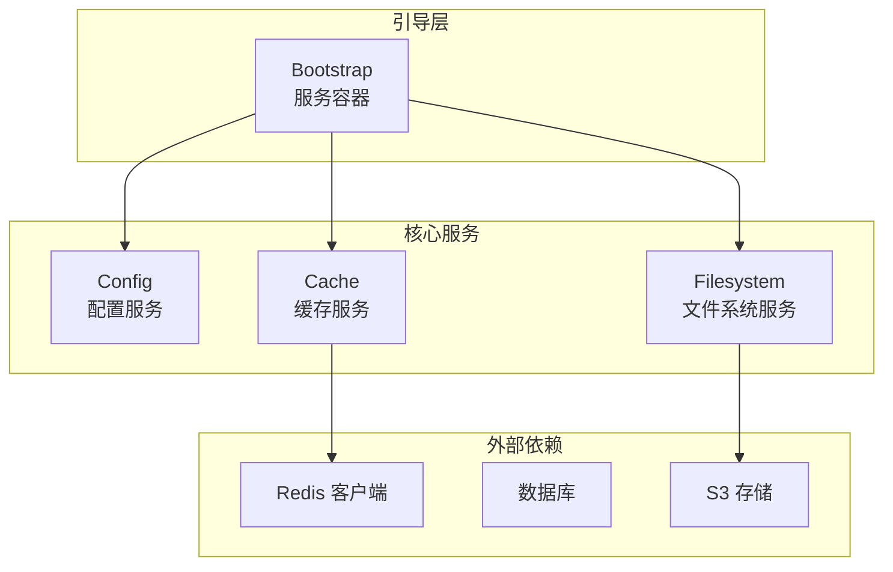
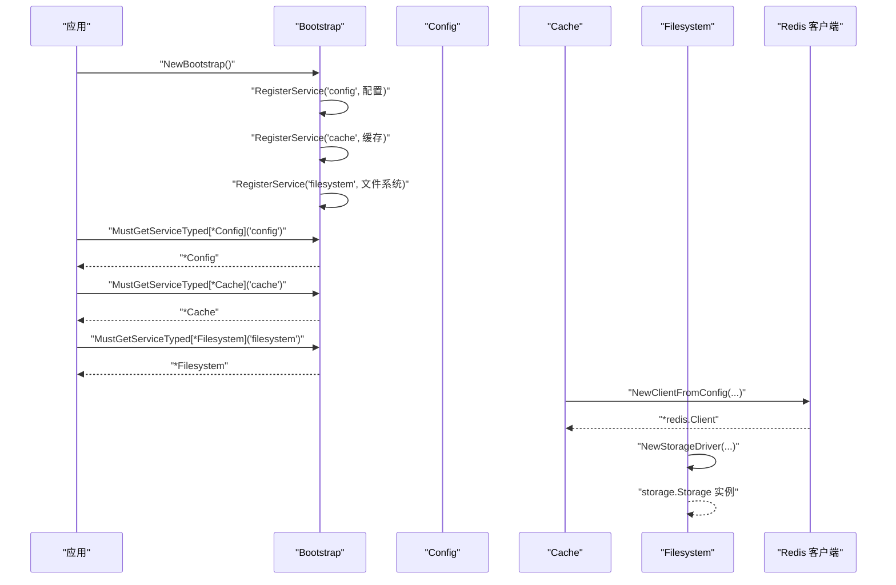
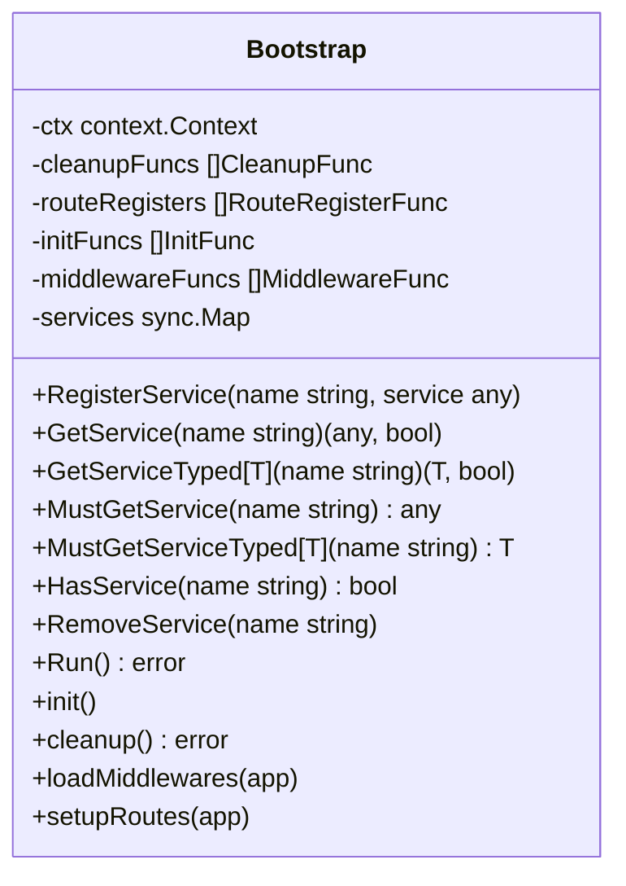
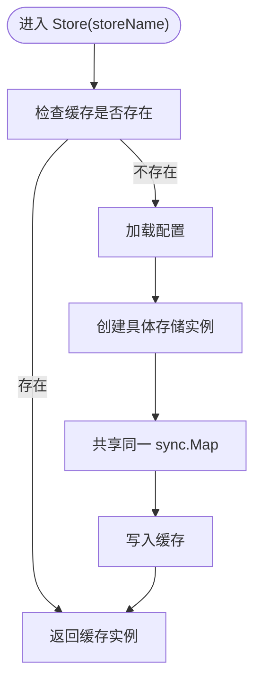
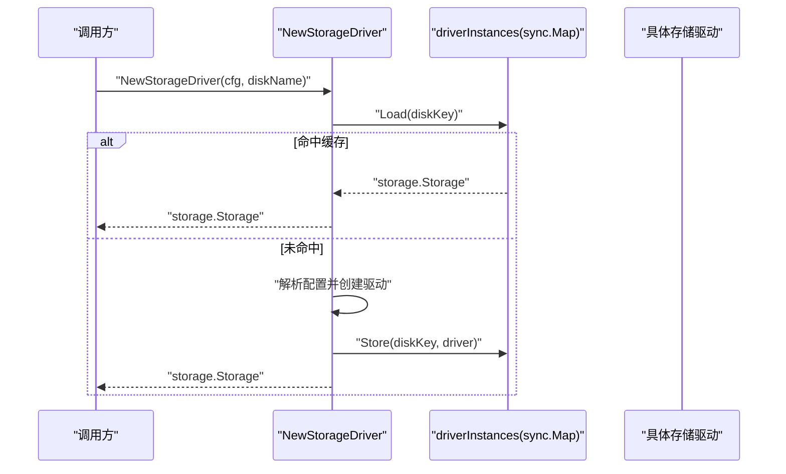
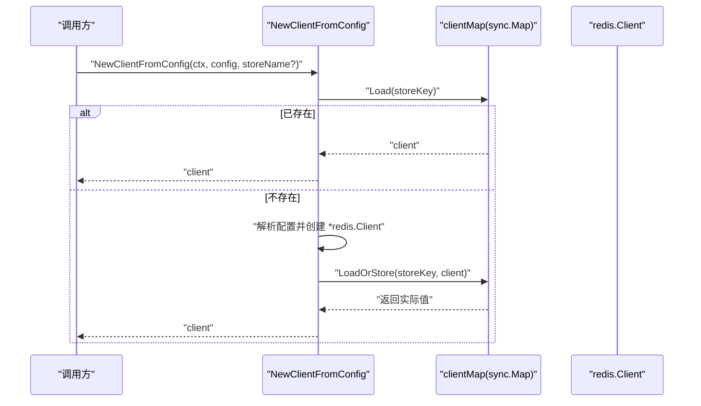
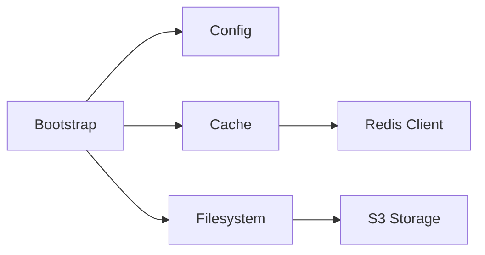

# 服务容器

<cite>
**本文引用的文件**
- [bootstrap.go](file://bootstrap/bootstrap.go)
- [cache.go](file://cache/cache.go)
- [filesystem.go](file://filesystem/filesystem.go)
- [client.go](file://redis/client.go)
- [config.go](file://config/config.go)
- [README.md](file://README.md)
</cite>

## 目录
1. [简介](#简介)
2. [项目结构](#项目结构)
3. [核心组件](#核心组件)
4. [架构总览](#架构总览)
5. [详细组件分析](#详细组件分析)
6. [依赖关系分析](#依赖关系分析)
7. [性能考量](#性能考量)
8. [故障排查指南](#故障排查指南)
9. [结论](#结论)
10. [附录](#附录)

## 简介
本文件围绕 CMF 框架的服务容器进行深入技术文档编写，重点阐释：
- 服务容器的设计目标与实现原理
- sync.Map 在服务容器中的应用及其带来的并发安全与性能优势
- 类型安全的服务注册与获取机制
- HasService、RemoveService 等辅助方法的使用场景与注意事项
- 服务命名规范、依赖声明与生命周期管理最佳实践
- 为什么选择 sync.Map 而非传统 map，以及其带来的收益

## 项目结构
CMF 框架采用模块化设计，服务容器主要位于引导层（bootstrap），并通过配置驱动其他模块（缓存、文件系统、Redis 等）的初始化与单例化。关键文件如下：
- 引导与服务容器：bootstrap/bootstrap.go
- 缓存模块：cache/cache.go（内部也使用 sync.Map 管理多存储实例）
- 文件系统模块：filesystem/filesystem.go（使用 sync.Map 实现驱动单例）
- Redis 客户端：redis/client.go（使用 sync.Map 实现客户端单例）
- 配置模块：config/config.go（提供各类服务的配置结构）

**图表来源**
- [bootstrap.go:37-66](file://bootstrap/bootstrap.go#L37-L66)
- [cache.go:15-55](file://cache/cache.go#L15-L55)
- [filesystem.go:62-86](file://filesystem/filesystem.go#L62-L86)
- [client.go:56-118](file://redis/client.go#L56-L118)

**章节来源**
- [README.md:55-75](file://README.md#L55-L75)
- [bootstrap.go:37-66](file://bootstrap/bootstrap.go#L37-L66)

## 核心组件
- 服务容器（Bootstrap）：提供服务注册、获取、类型安全获取、存在性检查与移除等能力；内部以 sync.Map 作为并发安全的存储后端。
- 缓存服务（Cache[T]）：支持多存储切换，内部以 sync.Map 缓存已创建的存储实例，避免重复创建。
- 文件系统服务（Filesystem）：根据配置创建存储驱动，使用 sync.Map 保证同一磁盘配置仅创建一次实例。
- Redis 客户端（Redis Client）：根据配置创建 Redis 客户端，使用 sync.Map 保证同一连接配置仅创建一次实例。

**章节来源**
- [bootstrap.go:37-153](file://bootstrap/bootstrap.go#L37-L153)
- [cache.go:15-93](file://cache/cache.go#L15-L93)
- [filesystem.go:14-144](file://filesystem/filesystem.go#L14-L144)
- [client.go:32-118](file://redis/client.go#L32-L118)

## 架构总览
服务容器的整体交互流程如下：
- 应用启动时，Bootstrap 初始化并注册核心服务（配置、缓存、文件系统）。
- 业务模块通过 GetService/MustGetServiceTyped 获取所需服务。
- 对于需要单例化的外部依赖（如 Redis、不同存储驱动），通过各自模块内的 sync.Map 实现单例化，避免重复创建与资源浪费。

**图表来源**
- [bootstrap.go:47-66](file://bootstrap/bootstrap.go#L47-L66)
- [bootstrap.go:159-159](file://bootstrap/bootstrap.go#L159-L159)
- [cache.go:24-55](file://cache/cache.go#L24-L55)
- [filesystem.go:157-190](file://filesystem/filesystem.go#L157-L190)
- [client.go:56-118](file://redis/client.go#L56-L118)

## 详细组件分析

### Bootstrap 服务容器
- 设计目标
  - 单例化核心服务，统一管理生命周期。
  - 提供并发安全的服务注册与获取。
  - 支持类型安全的服务获取，降低运行时类型转换风险。
- 关键实现
  - 使用 sync.Map 作为内部存储，保证并发安全。
  - 提供 RegisterService、GetService、GetServiceTyped、MustGetService、MustGetServiceTyped、HasService、RemoveService 等方法。
- 并发安全机制
  - Store/Load/Delete 原子操作，避免竞态条件。
  - LoadOrStore 可用于单例化场景（见 Redis 模块）。
- 类型安全保证
  - 泛型版本的 GetServiceTyped/MustGetServiceTyped 在编译期约束类型，运行时无需显式断言。
- 性能优化
  - sync.Map 在高并发读多写少场景下具有更好的吞吐表现。
  - 通过单例化避免重复创建昂贵对象。

**图表来源**
- [bootstrap.go:37-153](file://bootstrap/bootstrap.go#L37-L153)

**章节来源**
- [bootstrap.go:37-153](file://bootstrap/bootstrap.go#L37-L153)

### 缓存模块（Cache[T]）
- 设计目标
  - 支持多存储（内存、Redis）切换，统一缓存接口。
  - 通过 sync.Map 缓存已创建的存储实例，避免重复创建。
- 关键实现
  - stores 字段为 *sync.Map，用于缓存不同存储实例。
  - Store 方法先尝试从缓存中获取，不存在则创建并写入缓存。
- 并发安全与性能
  - 读多写少场景下，sync.Map 提供更好的性能。
  - 共享同一 sync.Map，减少内存占用与重复初始化成本。

**图表来源**
- [cache.go:57-93](file://cache/cache.go#L57-L93)

**章节来源**
- [cache.go:15-93](file://cache/cache.go#L15-L93)

### 文件系统模块（Filesystem）
- 设计目标
  - 根据配置动态创建存储驱动（本地、S3），支持“主存储+本地”双写模式。
  - 使用 sync.Map 实现驱动单例，避免重复创建昂贵的存储实例。
- 关键实现
  - driverInstances 为全局 sync.Map，键为“应用名_磁盘名”，值为 storage.Storage 实例。
  - NewStorageDriver 先尝试从缓存获取，不存在再创建并写入缓存。
- 并发安全与性能
  - 通过 sync.Map 保证并发安全，避免重复初始化。
  - 单例化显著降低资源消耗与初始化开销。

**图表来源**
- [filesystem.go:88-144](file://filesystem/filesystem.go#L88-L144)

**章节来源**
- [filesystem.go:14-144](file://filesystem/filesystem.go#L14-L144)

### Redis 客户端（Redis）
- 设计目标
  - 从配置创建 Redis 客户端，支持 TLS、连接池等参数。
  - 使用 sync.Map 实现客户端单例，避免重复创建与连接浪费。
- 关键实现
  - clientMap 为全局 sync.Map，键为连接配置名，值为 *redis.Client。
  - NewClientFromConfig 先尝试从缓存获取，不存在则创建并使用 LoadOrStore 写入缓存。
- 并发安全与性能
  - LoadOrStore 原子操作，保证并发安全与一致性。
  - 单例化减少连接数与初始化成本。

**图表来源**
- [client.go:56-118](file://redis/client.go#L56-L118)

**章节来源**
- [client.go:32-118](file://redis/client.go#L32-L118)

### 服务命名规范与类型安全
- 命名规范
  - 服务名称应语义明确、稳定，便于跨模块引用。
  - 建议使用小写、短横线或下划线分隔，避免特殊字符。
- 类型安全
  - 优先使用 MustGetServiceTyped/GetServiceTyped 获取服务，避免运行时断言失败。
  - 对于必须存在的服务，使用 MustGetService/MustGetServiceTyped，以便在缺失时快速暴露问题。
- 辅助方法
  - HasService：在不确定服务是否注册时，先检查再获取，避免不必要的 panic。
  - RemoveService：谨慎使用，通常不建议在运行时移除单例服务，除非有特殊需求（如热插拔、测试隔离）。

**章节来源**
- [bootstrap.go:88-153](file://bootstrap/bootstrap.go#L88-L153)

## 依赖关系分析
- Bootstrap 依赖 config.Config 提供的配置信息，初始化缓存与文件系统服务。
- Cache 依赖 Redis 或 BigCache 等底层存储，内部通过 sync.Map 缓存存储实例。
- Filesystem 依赖配置中的 filesystem.disks，根据驱动类型创建本地或 S3 存储。
- Redis 客户端依赖配置中的 redis.connections，通过 sync.Map 实现单例。

**图表来源**
- [bootstrap.go:47-66](file://bootstrap/bootstrap.go#L47-L66)
- [cache.go:24-55](file://cache/cache.go#L24-L55)
- [filesystem.go:157-190](file://filesystem/filesystem.go#L157-L190)
- [client.go:56-118](file://redis/client.go#L56-L118)

**章节来源**
- [bootstrap.go:47-66](file://bootstrap/bootstrap.go#L47-L66)
- [cache.go:24-55](file://cache/cache.go#L24-L55)
- [filesystem.go:157-190](file://filesystem/filesystem.go#L157-L190)
- [client.go:56-118](file://redis/client.go#L56-L118)

## 性能考量
- 为什么选择 sync.Map
  - 读多写少场景：sync.Map 在高并发读取时具有更低的锁竞争与更高的吞吐。
  - 原子操作：Store/Load/Delete/LoadOrStore 提供原子性，避免竞态条件。
  - 单例化：通过缓存已创建的昂贵对象（Redis、存储驱动、缓存存储），显著降低初始化成本与内存占用。
- 与传统 map 的对比
  - 传统 map 需要互斥锁保护，写入频繁时锁竞争会成为瓶颈。
  - sync.Map 在并发读取场景下性能更优，适合服务容器的典型使用模式。
- 最佳实践
  - 对于需要单例化的服务，优先使用 sync.Map 缓存实例。
  - 将服务名称与配置键保持一致，便于定位与调试。
  - 对于高频读取的服务，尽量避免在运行时频繁注册/移除。

[本节为通用性能讨论，不直接分析特定文件]

## 故障排查指南
- 服务未注册
  - 症状：MustGetService/MustGetServiceTyped 抛出异常。
  - 排查：确认服务是否在引导阶段正确注册；使用 HasService 检查是否存在。
- 类型不匹配
  - 症状：GetServiceTyped 返回 false 或 panic。
  - 排查：确认服务注册时的类型与获取时的类型一致；优先使用泛型版本。
- 单例冲突
  - 症状：重复创建昂贵对象或连接数过多。
  - 排查：检查是否正确使用 sync.Map 缓存实例；避免在多处重复初始化。
- 配置缺失
  - 症状：NewStorageDriver/NewClientFromConfig 报错。
  - 排查：确认配置文件中对应连接或存储配置是否存在；核对键名与类型。

**章节来源**
- [bootstrap.go:118-153](file://bootstrap/bootstrap.go#L118-L153)
- [filesystem.go:90-144](file://filesystem/filesystem.go#L90-L144)
- [client.go:56-118](file://redis/client.go#L56-L118)

## 结论
CMF 框架的服务容器通过 Bootstrap 提供统一的并发安全服务管理能力，并结合 sync.Map 在多模块中实现单例化与高性能。配合类型安全的获取接口与完善的生命周期管理，服务容器既满足了高并发场景下的稳定性，又兼顾了易用性与可维护性。对于扩展与定制，建议遵循命名规范、类型安全与单例化原则，确保服务在复杂场景下依然可靠高效。

[本节为总结性内容，不直接分析特定文件]

## 附录

### 服务容器扩展指南
- 自定义服务注册
  - 在引导阶段调用 RegisterService(name, service) 注册服务。
  - 服务名称需全局唯一，建议使用模块名前缀。
- 服务依赖声明
  - 在 init 阶段或业务逻辑中，使用 MustGetServiceTyped 获取强类型依赖。
  - 对于可选依赖，使用 GetService/GetServiceTyped 并自行处理不存在的情况。
- 服务生命周期管理
  - 通过 RegisterCleanupFunc 注册清理函数，在应用退出时统一释放资源。
  - 对于单例化服务（Redis、存储驱动），避免在运行时 RemoveService，除非有明确的热插拔需求。

**章节来源**
- [bootstrap.go:68-86](file://bootstrap/bootstrap.go#L68-L86)
- [bootstrap.go:248-256](file://bootstrap/bootstrap.go#L248-L256)