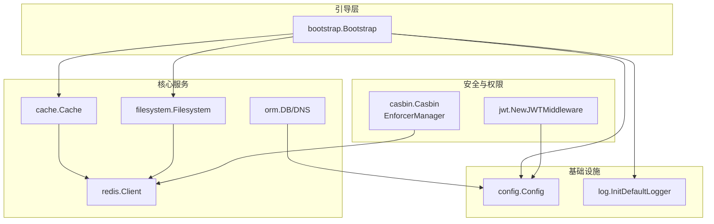
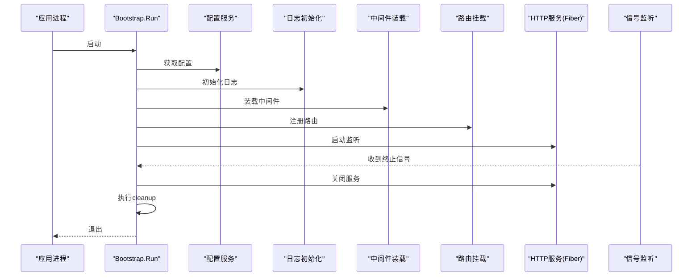
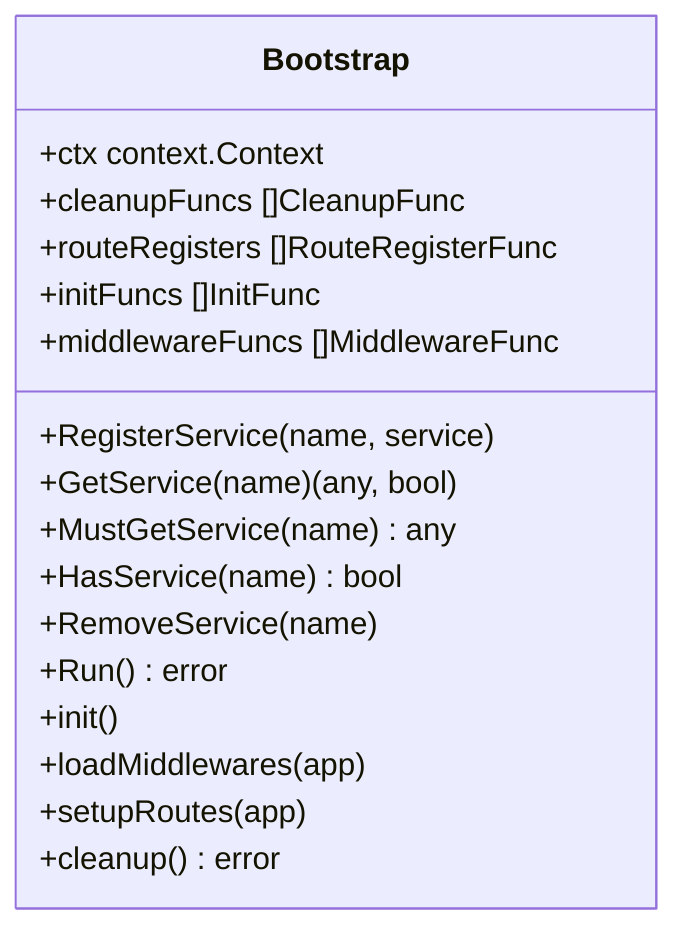
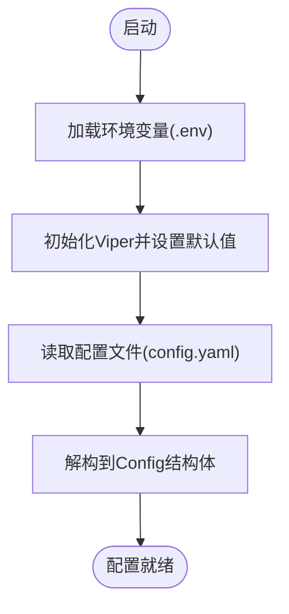
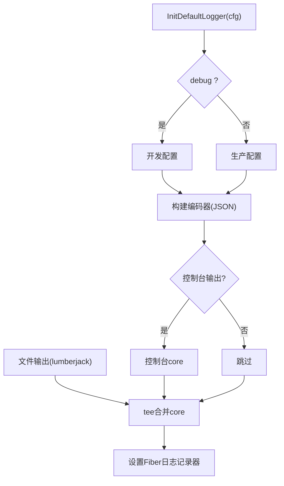
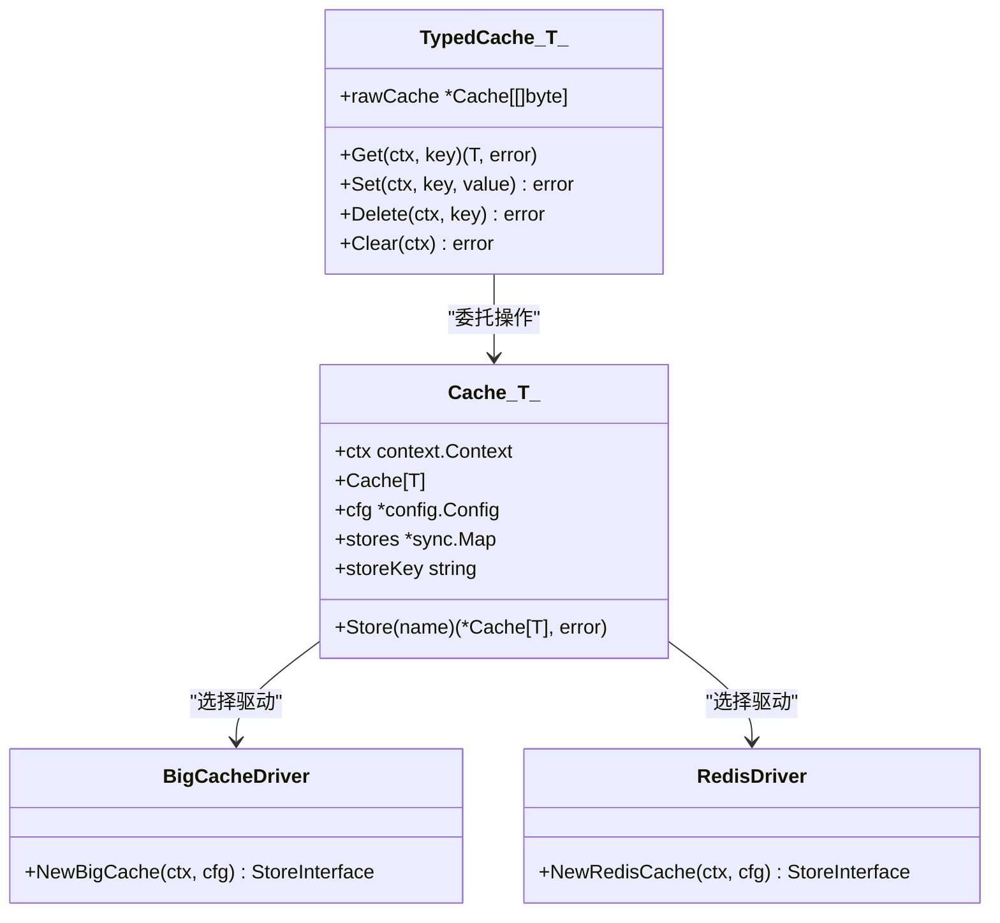
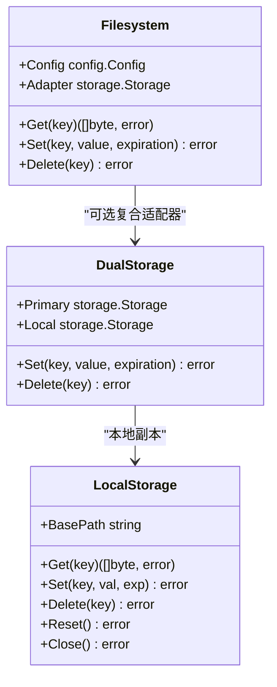
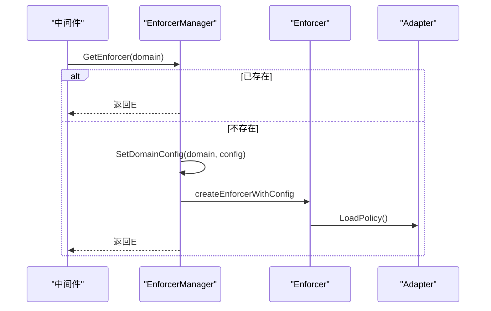

# 核心架构

<cite>
**本文引用的文件**
- [bootstrap/bootstrap.go](file://bootstrap/bootstrap.go)
- [config/config.go](file://config/config.go)
- [log/log.go](file://log/log.go)
- [cache/cache.go](file://cache/cache.go)
- [cache/driver/bigcache.go](file://cache/driver/bigcache.go)
- [cache/driver/redis.go](file://cache/driver/redis.go)
- [filesystem/filesystem.go](file://filesystem/filesystem.go)
- [storage/local/local.go](file://storage/local/local.go)
- [casbin/casbin.go](file://casbin/casbin.go)
- [casbin/enforcer_manager.go](file://casbin/enforcer_manager.go)
- [jwt/jwt.go](file://jwt/jwt.go)
- [orm/orm.go](file://orm/orm.go)
- [redis/client.go](file://redis/client.go)
- [README.md](file://README.md)
- [go.mod](file://go.mod)
</cite>

## 目录
1. [简介](#简介)
2. [项目结构](#项目结构)
3. [核心组件](#核心组件)
4. [架构总览](#架构总览)
5. [详细组件分析](#详细组件分析)
6. [依赖分析](#依赖分析)
7. [性能考虑](#性能考虑)
8. [故障排查指南](#故障排查指南)
9. [结论](#结论)
10. [附录](#附录)

## 简介
本文件面向CMF框架的核心架构，系统性阐述模块化设计原则、包分离策略、依赖注入机制与Bootstrap引导程序的工作原理；详解服务注册、生命周期管理与中间件系统；分析组件交互关系与数据流向，涵盖配置管理、日志系统等基础设施服务的设计与实现。文档提供架构图与组件关系图，帮助开发者快速理解整体设计思路与技术决策。

## 项目结构
CMF采用“按功能分包”的模块化组织方式，核心包包括：
- 引导与容器：bootstrap
- 配置管理：config
- 日志系统：log
- 缓存：cache（含驱动：bigcache、redis）
- 文件系统：filesystem（含本地存储实现：storage/local）
- 权限控制：casbin
- 认证：jwt
- ORM/数据库：orm
- Redis客户端：redis

**图表来源**
- [bootstrap/bootstrap.go:37-66](file://bootstrap/bootstrap.go#L37-L66)
- [config/config.go:37-97](file://config/config.go#L37-L97)
- [cache/cache.go:24-55](file://cache/cache.go#L24-L55)
- [filesystem/filesystem.go:157-191](file://filesystem/filesystem.go#L157-L191)
- [redis/client.go:56-119](file://redis/client.go#L56-L119)
- [casbin/casbin.go:48-79](file://casbin/casbin.go#L48-L79)
- [jwt/jwt.go:9-25](file://jwt/jwt.go#L9-L25)
- [orm/orm.go:10-63](file://orm/orm.go#L10-L63)

**章节来源**
- [README.md:55-75](file://README.md#L55-L75)
- [go.mod:1-26](file://go.mod#L1-L26)

## 核心组件
- Bootstrap引导器：负责初始化、注册服务、装载中间件、挂载路由、生命周期管理与优雅退出。
- 配置中心：统一读取环境变量与配置文件，提供默认值与动态保存能力。
- 日志系统：基于Zap与Fiber Zap中间件，支持控制台与文件输出、滚动切割。
- 缓存系统：抽象统一接口，支持内存与Redis两种存储驱动，提供类型安全的TypedCache。
- 文件系统：抽象存储适配器，支持本地与S3，可配置“双写”保障一致性。
- 权限控制：基于Casbin的EnforcerManager，支持多域/多租户模型与延迟加载。
- 认证：基于JWT的中间件与令牌签发工具。
- ORM/数据库：根据配置生成DSN，支持MySQL、PostgreSQL、SQLite。
- Redis客户端：单例客户端管理，支持TLS与连接池配置。

**章节来源**
- [bootstrap/bootstrap.go:37-154](file://bootstrap/bootstrap.go#L37-L154)
- [config/config.go:99-220](file://config/config.go#L99-L220)
- [log/log.go:14-84](file://log/log.go#L14-L84)
- [cache/cache.go:15-144](file://cache/cache.go#L15-L144)
- [filesystem/filesystem.go:62-191](file://filesystem/filesystem.go#L62-L191)
- [casbin/casbin.go:12-79](file://casbin/casbin.go#L12-L79)
- [casbin/enforcer_manager.go:19-226](file://casbin/enforcer_manager.go#L19-L226)
- [jwt/jwt.go:9-25](file://jwt/jwt.go#L9-L25)
- [orm/orm.go:10-63](file://orm/orm.go#L10-L63)
- [redis/client.go:14-119](file://redis/client.go#L14-L119)

## 架构总览
CMF采用“引导器+服务容器+中间件+路由”的经典Web应用架构。Bootstrap在启动阶段完成：
- 服务注册：配置、缓存、文件系统等核心服务注册为单例
- 初始化：日志、中间件、自定义init函数
- 路由挂载：内置默认路由与Swagger文档路由
- 生命周期：监听信号，优雅关闭并执行cleanup

**图表来源**
- [bootstrap/bootstrap.go:155-215](file://bootstrap/bootstrap.go#L155-L215)
- [bootstrap/bootstrap.go:217-242](file://bootstrap/bootstrap.go#L217-L242)
- [bootstrap/bootstrap.go:258-277](file://bootstrap/bootstrap.go#L258-L277)

## 详细组件分析

### 引导器与依赖注入
- 服务容器：使用并发安全的map存储服务实例，提供注册、获取、类型安全获取、存在性检查与移除。
- 生命周期钩子：init、middleware、route、cleanup四类函数注册与顺序执行。
- 单例服务：配置、缓存、文件系统在引导阶段注册为单例，供后续模块通过服务名获取。
- 中间件与路由：内置恢复、日志、请求ID中间件，支持外部模块注册自定义中间件与路由。

**图表来源**
- [bootstrap/bootstrap.go:37-154](file://bootstrap/bootstrap.go#L37-L154)

**章节来源**
- [bootstrap/bootstrap.go:37-154](file://bootstrap/bootstrap.go#L37-L154)
- [bootstrap/bootstrap.go:155-277](file://bootstrap/bootstrap.go#L155-L277)

### 配置管理
- 支持.env与YAML配置，环境变量前缀可定制，自动注入。
- 提供默认值集合，覆盖应用、日志、数据库、缓存、Redis、文件系统、Casbin等。
- 提供读取与保存配置的能力，支持动态更新并写回配置文件。

**图表来源**
- [config/config.go:102-130](file://config/config.go#L102-L130)
- [config/config.go:131-202](file://config/config.go#L131-L202)
- [config/config.go:214-220](file://config/config.go#L214-L220)

**章节来源**
- [config/config.go:102-220](file://config/config.go#L102-L220)
- [config/config.go:246-287](file://config/config.go#L246-L287)

### 日志系统
- 基于Zap生产/开发配置，支持控制台与文件输出，文件滚动切割。
- 通过Fiber Zap中间件设置为Fiber日志记录器，统一结构化日志输出。
- 默认使用配置中的日志参数初始化。

**图表来源**
- [log/log.go:14-84](file://log/log.go#L14-L84)

**章节来源**
- [log/log.go:14-84](file://log/log.go#L14-L84)

### 缓存系统
- 统一Cache接口，支持内存(BigCache)与Redis两种驱动。
- 默认存储由配置选择，支持切换不同store并复用底层存储实例。
- TypedCache提供类型安全的JSON序列化/反序列化封装。

**图表来源**
- [cache/cache.go:15-144](file://cache/cache.go#L15-L144)
- [cache/driver/bigcache.go:13-21](file://cache/driver/bigcache.go#L13-L21)
- [cache/driver/redis.go:13-25](file://cache/driver/redis.go#L13-L25)

**章节来源**
- [cache/cache.go:15-144](file://cache/cache.go#L15-L144)
- [cache/driver/bigcache.go:13-21](file://cache/driver/bigcache.go#L13-L21)
- [cache/driver/redis.go:13-25](file://cache/driver/redis.go#L13-L25)

### 文件系统与本地存储
- 抽象Storage接口，支持本地与S3驱动，单例缓存避免重复创建。
- 支持“主存储+本地存储”的双写模式，提升可靠性。
- 本地存储实现提供过期时间管理与元数据文件。

**图表来源**
- [filesystem/filesystem.go:62-191](file://filesystem/filesystem.go#L62-L191)
- [storage/local/local.go:11-219](file://storage/local/local.go#L11-L219)

**章节来源**
- [filesystem/filesystem.go:62-191](file://filesystem/filesystem.go#L62-L191)
- [storage/local/local.go:11-219](file://storage/local/local.go#L11-L219)

### 权限控制（Casbin）与中间件
- 提供Casbin中间件与Enforcer工厂方法，支持从文件或文本创建模型。
- EnforcerManager管理多域Enforcer，支持延迟加载、并发安全与配置管理。

**图表来源**
- [casbin/casbin.go:16-45](file://casbin/casbin.go#L16-L45)
- [casbin/enforcer_manager.go:97-143](file://casbin/enforcer_manager.go#L97-L143)
- [casbin/enforcer_manager.go:189-216](file://casbin/enforcer_manager.go#L189-L216)

**章节来源**
- [casbin/casbin.go:12-79](file://casbin/casbin.go#L12-L79)
- [casbin/enforcer_manager.go:19-226](file://casbin/enforcer_manager.go#L19-L226)

### 认证（JWT）
- 提供JWT中间件工厂与令牌签发、用户数据提取工具。
- 依赖配置中的Secret与过期时间参数。

**章节来源**
- [jwt/jwt.go:9-25](file://jwt/jwt.go#L9-L25)

### ORM与数据库
- 根据配置生成数据库DSN，支持MySQL、PostgreSQL、SQLite。
- 提供表前缀与连接选择逻辑。

**章节来源**
- [orm/orm.go:10-63](file://orm/orm.go#L10-L63)

### Redis客户端
- 单例客户端管理，支持TLS、连接池与超时配置。
- 通过配置解析连接参数并Ping校验连通性。

**章节来源**
- [redis/client.go:56-119](file://redis/client.go#L56-L119)

## 依赖分析
- 外部依赖集中在Web框架、配置、日志、缓存、存储、认证、授权与数据库等生态。
- 包内耦合低，通过Bootstrap服务容器与接口抽象实现松耦合。

```mermaid
graph TB
CMF["github.com/wuwuseo/cmf"]
Fiber["github.com/gofiber/fiber/v2"]
Viper["github.com/spf13/viper"]
DotEnv["github.com/joho/godotenv"]
Zap["go.uber.org/zap"]
GCache["github.com/eko/gocache"]
BigCache["github.com/allegro/bigcache"]
Redis["github.com/redis/go-redis"]
S3["github.com/gofiber/storage/s3"]
Casbin["github.com/casbin/casbin/v2"]
JWT["github.com/golang-jwt/jwt"]
Validator["github.com/go-playground/validator"]
Swagger["github.com/gofiber/swagger"]
CMF --> Fiber
CMF --> Viper
CMF --> DotEnv
CMF --> Zap
CMF --> GCache
CMF --> BigCache
CMF --> Redis
CMF --> S3
CMF --> Casbin
CMF --> JWT
CMF --> Validator
CMF --> Swagger
```

**图表来源**
- [go.mod:5-26](file://go.mod#L5-L26)

**章节来源**
- [go.mod:1-103](file://go.mod#L1-L103)

## 性能考虑
- Web层使用高性能Fiber，中间件链路短、开销低。
- 缓存层支持内存与Redis，结合TypedCache减少序列化成本。
- 文件系统支持双写与异步过期清理，兼顾可靠性与性能。
- 日志采用结构化JSON与滚动切割，避免阻塞与IO瓶颈。
- Redis客户端单例与连接池配置，降低连接建立开销。

## 故障排查指南
- 启动失败：检查配置文件与环境变量是否正确加载，查看日志初始化是否成功。
- 缓存不可用：确认默认缓存驱动与Redis连接配置，检查NewRedisCache与NewBigCache初始化流程。
- 文件系统异常：核对磁盘驱动与选项，确认本地根路径与S3凭据配置。
- 权限控制失效：检查Casbin模型路径/文本与策略加载，确认EnforcerManager域配置。
- JWT鉴权问题：核对Secret与过期时间配置，检查中间件注册顺序。
- 数据库连接失败：核对DSN生成逻辑与连接参数。

**章节来源**
- [bootstrap/bootstrap.go:232-242](file://bootstrap/bootstrap.go#L232-L242)
- [cache/cache.go:24-55](file://cache/cache.go#L24-L55)
- [filesystem/filesystem.go:157-191](file://filesystem/filesystem.go#L157-L191)
- [casbin/enforcer_manager.go:47-95](file://casbin/enforcer_manager.go#L47-L95)
- [jwt/jwt.go:9-25](file://jwt/jwt.go#L9-L25)
- [orm/orm.go:18-34](file://orm/orm.go#L18-L34)

## 结论
CMF通过清晰的模块化设计与Bootstrap服务容器，实现了高内聚、低耦合的基础设施层。配置、日志、缓存、文件系统、权限与认证等核心能力以接口抽象与单例注册的方式融入系统，配合中间件与路由机制，形成稳定高效的Web应用骨架。该架构便于扩展与维护，适合构建可演进的内容管理框架。

## 附录
- 项目规范与约定：模块化、依赖注入、中间件、单例服务等。
- 技术栈概览：Fiber、Viper、Zap、GCache、BigCache、Redis、Casbin、JWT、S3等。

**章节来源**
- [README.md:19-49](file://README.md#L19-L49)
- [README.md:5-18](file://README.md#L5-L18)