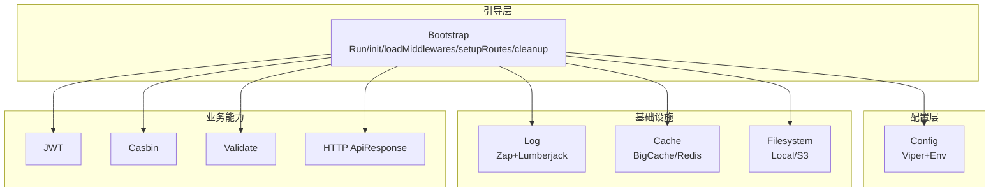
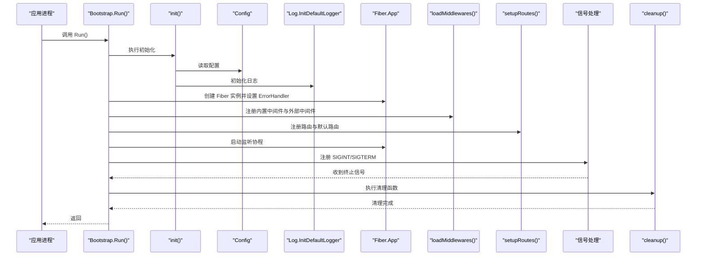
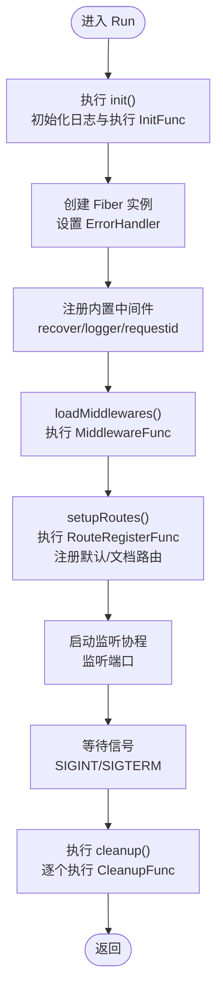
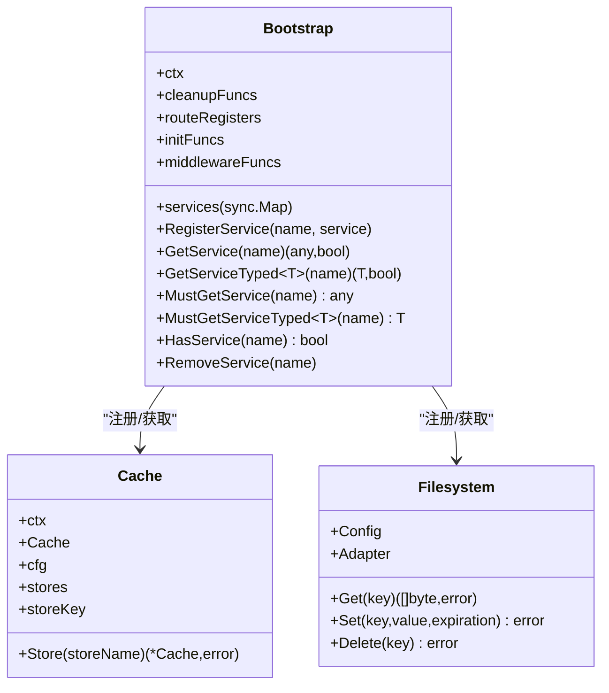
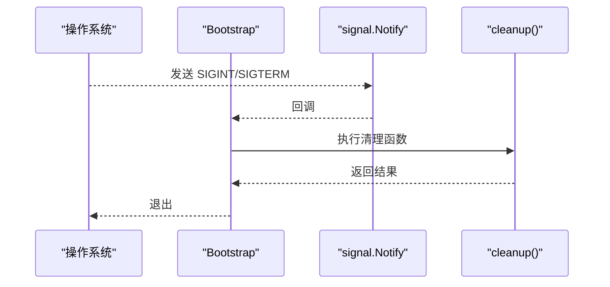
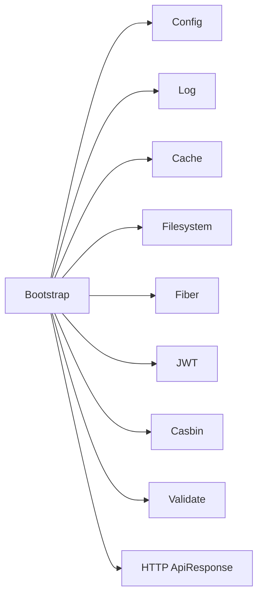

# 生命周期管理

<cite>
**本文引用的文件**
- [bootstrap.go](file://bootstrap/bootstrap.go)
- [config.go](file://config/config.go)
- [log.go](file://log/log.go)
- [cache.go](file://cache/cache.go)
- [filesystem.go](file://filesystem/filesystem.go)
- [ApiResponse.go](file://http/ApiResponse.go)
- [casbin.go](file://casbin/casbin.go)
- [jwt.go](file://jwt/jwt.go)
- [validate.go](file://validate/validate.go)
- [README.md](file://README.md)
</cite>

## 目录
1. [简介](#简介)
2. [项目结构](#项目结构)
3. [核心组件](#核心组件)
4. [架构总览](#架构总览)
5. [详细组件分析](#详细组件分析)
6. [依赖分析](#依赖分析)
7. [性能考虑](#性能考虑)
8. [故障排查指南](#故障排查指南)
9. [结论](#结论)
10. [附录](#附录)

## 简介
本文件聚焦于 CMF 框架的生命周期管理，围绕应用启动流程（Run 方法）展开，系统阐述初始化函数执行、中间件加载、路由设置与服务器启动的时序关系；并深入解析优雅关闭机制（信号处理、清理函数执行与资源释放）；同时分析 init、loadMiddlewares、setupRoutes、cleanup 等关键方法的作用与执行顺序，给出错误处理机制（含自定义 ErrorHandler 的实现与错误响应处理逻辑），最后提供各阶段的监控点与调试技巧，帮助开发者理解并优化应用的启动与关闭过程。

## 项目结构
CMF 采用模块化设计，核心入口位于 bootstrap 包，负责应用引导、服务注册与生命周期编排；配置由 config 包统一管理；日志、缓存、文件系统、JWT、Casbin、验证等能力以服务形式注入；HTTP 层提供统一响应封装。

图表来源
- [bootstrap.go:155-215](file://bootstrap/bootstrap.go#L155-L215)
- [config.go:102-106](file://config/config.go#L102-L106)
- [log.go:14-83](file://log/log.go#L14-L83)
- [cache.go:24-55](file://cache/cache.go#L24-L55)
- [filesystem.go:157-191](file://filesystem/filesystem.go#L157-L191)
- [jwt.go:9-25](file://jwt/jwt.go#L9-L25)
- [casbin.go:16-45](file://casbin/casbin.go#L16-L45)
- [validate.go:16-58](file://validate/validate.go#L16-L58)
- [ApiResponse.go:7-44](file://http/ApiResponse.go#L7-L44)

章节来源
- [README.md:55-75](file://README.md#L55-L75)
- [bootstrap.go:47-66](file://bootstrap/bootstrap.go#L47-L66)
- [config.go:102-106](file://config/config.go#L102-L106)

## 核心组件
- 引导器 Bootstrap：负责应用生命周期编排，包含初始化、中间件加载、路由注册、服务器启动与优雅关闭。
- 配置 Config：集中管理应用、日志、数据库、缓存、Redis、文件系统、Casbin 等配置，并提供默认值与环境变量支持。
- 日志 Log：基于 Zap 的结构化日志，支持控制台与文件输出，结合 Lumberjack 实现日志切割。
- 缓存 Cache：抽象缓存接口，支持 BigCache 与 Redis 驱动，提供类型安全的 TypedCache。
- 文件系统 Filesystem：支持本地与 S3 存储，提供双写适配器（可选）。
- HTTP 响应 ApiResponse：统一响应结构封装。
- JWT/Casbin/Validate：认证、授权与参数校验的基础能力。

章节来源
- [bootstrap.go:37-45](file://bootstrap/bootstrap.go#L37-L45)
- [config.go:37-97](file://config/config.go#L37-L97)
- [log.go:14-83](file://log/log.go#L14-L83)
- [cache.go:15-21](file://cache/cache.go#L15-L21)
- [filesystem.go:62-65](file://filesystem/filesystem.go#L62-L65)
- [ApiResponse.go:7-44](file://http/ApiResponse.go#L7-L44)
- [jwt.go:9-25](file://jwt/jwt.go#L9-L25)
- [casbin.go:12-14](file://casbin/casbin.go#L12-L14)
- [validate.go:10-17](file://validate/validate.go#L10-L17)

## 架构总览
下图展示应用启动到运行再到优雅关闭的全生命周期时序，涵盖初始化、中间件、路由、服务器监听、信号接收与清理。

图表来源
- [bootstrap.go:155-215](file://bootstrap/bootstrap.go#L155-L215)
- [bootstrap.go:228-242](file://bootstrap/bootstrap.go#L228-L242)
- [bootstrap.go:217-226](file://bootstrap/bootstrap.go#L217-L226)
- [bootstrap.go:258-277](file://bootstrap/bootstrap.go#L258-L277)
- [bootstrap.go:248-256](file://bootstrap/bootstrap.go#L248-L256)
- [log.go:80-83](file://log/log.go#L80-L83)
- [config.go:102-106](file://config/config.go#L102-L106)

## 详细组件分析

### 启动流程（Run 方法）与执行顺序
- 初始化阶段
  - 执行 init()：初始化日志系统，随后依次调用所有注册的初始化函数（InitFunc）。任一初始化失败将导致致命错误退出。
- 服务器构建阶段
  - 从服务容器获取配置，创建 Fiber 实例并设置 ErrorHandler。
  - 注册内置中间件（recover、logger、requestid）。
  - 调用 loadMiddlewares()：遍历并执行所有注册的中间件函数（MiddlewareFunc）。
  - 调用 setupRoutes()：遍历并执行所有注册的路由函数（RouteRegisterFunc），并在末尾注册默认根路由与 Swagger 文档路由（当配置开启）。
- 服务器启动阶段
  - 在独立 goroutine 中启动监听，监听端口。
- 信号与优雅关闭
  - 注册 SIGINT/SIGTERM 信号。
  - 收到信号后，记录清理开始日志，依次执行 cleanup() 中的所有清理函数（CleanupFunc），最后输出成功关闭日志并返回。

图表来源
- [bootstrap.go:155-215](file://bootstrap/bootstrap.go#L155-L215)
- [bootstrap.go:217-226](file://bootstrap/bootstrap.go#L217-L226)
- [bootstrap.go:228-242](file://bootstrap/bootstrap.go#L228-L242)
- [bootstrap.go:258-277](file://bootstrap/bootstrap.go#L258-L277)
- [bootstrap.go:248-256](file://bootstrap/bootstrap.go#L248-L256)

章节来源
- [bootstrap.go:155-215](file://bootstrap/bootstrap.go#L155-L215)
- [bootstrap.go:217-226](file://bootstrap/bootstrap.go#L217-L226)
- [bootstrap.go:228-242](file://bootstrap/bootstrap.go#L228-L242)
- [bootstrap.go:258-277](file://bootstrap/bootstrap.go#L258-L277)
- [bootstrap.go:248-256](file://bootstrap/bootstrap.go#L248-L256)

### 关键方法详解

#### init()
- 作用：初始化日志系统与执行所有注册的初始化函数。
- 行为：
  - 读取配置并初始化默认日志（控制台与文件输出，按配置切割）。
  - 遍历 initFuncs 并依次执行，任一失败即致命错误退出。
- 复杂度：O(N)，N 为注册的初始化函数数量。

章节来源
- [bootstrap.go:228-242](file://bootstrap/bootstrap.go#L228-L242)
- [log.go:80-83](file://log/log.go#L80-L83)

#### loadMiddlewares(app)
- 作用：加载并注册中间件。
- 行为：
  - 从服务容器获取配置。
  - 遍历 middlewareFuncs 并调用每个函数传入 app 与 config。
- 复杂度：O(M)，M 为注册的中间件函数数量。

章节来源
- [bootstrap.go:217-226](file://bootstrap/bootstrap.go#L217-L226)

#### setupRoutes(app)
- 作用：注册路由。
- 行为：
  - 从服务容器获取配置。
  - 遍历 routeRegisters 并调用每个函数传入 app 与 config。
  - 注册默认根路由与 Swagger 文档路由（当配置开启）。
- 复杂度：O(R)，R 为注册的路由函数数量。

章节来源
- [bootstrap.go:258-277](file://bootstrap/bootstrap.go#L258-L277)

#### cleanup()
- 作用：优雅关闭时执行清理。
- 行为：
  - 依次执行 cleanupFuncs 中的清理函数，遇到错误立即返回。
- 复杂度：O(K)，K 为注册的清理函数数量。

章节来源
- [bootstrap.go:248-256](file://bootstrap/bootstrap.go#L248-L256)

#### ErrorHandler（Fiber）
- 作用：全局错误处理。
- 行为：
  - 从错误中提取自定义状态码（若为 *fiber.Error）。
  - 尝试发送对应状态码的静态页面；若失败则返回通用内部错误字符串。
- 影响：统一错误响应格式，便于前端与运维处理。

章节来源
- [bootstrap.go:168-187](file://bootstrap/bootstrap.go#L168-L187)

### 服务注册与依赖注入
- Bootstrap 提供服务容器（sync.Map），支持注册、获取、类型安全获取与断言获取。
- 启动时默认注册以下服务：
  - config：全局配置实例。
  - cache：缓存服务（根据配置选择 BigCache 或 Redis 驱动）。
  - filesystem：文件系统服务（支持本地与 S3，可选双写）。
- 服务获取：
  - MustGetService/MustGetServiceTyped：在缺失或类型不匹配时 panic。
  - GetService/GetServiceTyped：返回值与存在性判断，适合容错场景。

图表来源
- [bootstrap.go:37-45](file://bootstrap/bootstrap.go#L37-L45)
- [bootstrap.go:88-141](file://bootstrap/bootstrap.go#L88-L141)
- [cache.go:15-21](file://cache/cache.go#L15-L21)
- [filesystem.go:62-65](file://filesystem/filesystem.go#L62-L65)

章节来源
- [bootstrap.go:47-66](file://bootstrap/bootstrap.go#L47-L66)
- [bootstrap.go:88-141](file://bootstrap/bootstrap.go#L88-L141)
- [cache.go:24-55](file://cache/cache.go#L24-L55)
- [filesystem.go:157-191](file://filesystem/filesystem.go#L157-L191)

### 优雅关闭机制
- 信号处理：监听 SIGINT/SIGTERM，收到信号后进入清理流程。
- 清理流程：依次执行 cleanupFuncs，遇到错误立即返回，最终输出成功关闭日志。
- 资源释放：依赖各模块自身实现的 Close/Reset 等接口（例如文件系统适配器）。

图表来源
- [bootstrap.go:204-214](file://bootstrap/bootstrap.go#L204-L214)
- [bootstrap.go:248-256](file://bootstrap/bootstrap.go#L248-L256)

章节来源
- [bootstrap.go:204-214](file://bootstrap/bootstrap.go#L204-L214)
- [bootstrap.go:248-256](file://bootstrap/bootstrap.go#L248-L256)

### 错误处理机制
- 自定义 ErrorHandler：
  - 优先从错误中提取状态码（*fiber.Error）。
  - 尝试发送对应状态码的静态页面；若失败则返回通用内部错误字符串。
- 建议：
  - 在业务层抛出 *fiber.Error 以传递语义化状态码。
  - 准备对应状态码的静态页面，提升用户体验与可观测性。

章节来源
- [bootstrap.go:168-187](file://bootstrap/bootstrap.go#L168-L187)

### 监控点与调试技巧
- 启动阶段
  - 观察日志：init() 会输出“执行初始化函数...”与“所有初始化函数执行完成”，确认初始化链路。
  - 配置校验：确保配置文件与环境变量正确加载，可通过读取 Config.App.* 字段验证。
- 中间件阶段
  - 观察日志：loadMiddlewares() 输出“加载中间件...”与“所有中间件加载完成”，确认中间件注册顺序。
- 路由阶段
  - 观察日志：setupRoutes() 输出“注册默认/文档路由”，可验证默认根路由与 Swagger 是否生效。
- 运行阶段
  - 观察日志：Fiber 启动监听后，可通过访问根路径与文档路径验证服务可用性。
- 优雅关闭阶段
  - 观察日志：收到信号后输出“Running cleanup tasks...”，随后输出“Fiber was successful shutdown.”，确认清理链路。
- 调试建议
  - 使用 Debug 模式（Config.App.Debug）切换开发/生产日志配置。
  - 在初始化函数中加入关键步骤的日志输出，定位初始化失败原因。
  - 在中间件函数中打印请求 ID（requestid 中间件已注册），便于追踪请求链路。

章节来源
- [bootstrap.go:228-242](file://bootstrap/bootstrap.go#L228-L242)
- [bootstrap.go:217-226](file://bootstrap/bootstrap.go#L217-L226)
- [bootstrap.go:258-277](file://bootstrap/bootstrap.go#L258-L277)
- [bootstrap.go:209-213](file://bootstrap/bootstrap.go#L209-L213)
- [log.go:80-83](file://log/log.go#L80-L83)
- [config.go:131-141](file://config/config.go#L131-L141)

## 依赖分析
- 组件耦合
  - Bootstrap 与 Config 强耦合：Run/Init/LoadMiddlewares/SetupRoutes 均依赖配置。
  - Bootstrap 与 Log：InitDefaultLogger 依赖 Config。
  - Bootstrap 与 Cache/Filesystem：在 NewBootstrap 中注册为服务，供后续模块使用。
  - Bootstrap 与 Fiber：Run 构建 Fiber 实例并设置 ErrorHandler。
- 外部依赖
  - Fiber v2：Web 框架。
  - Viper/godotenv：配置管理与环境变量。
  - Zap/Lumberjack：日志与日志切割。
  - gocache/bigcache/redis：缓存。
  - gofiber/storage/s3：S3 存储。
  - gofiber/contrib/jwt/casbin：认证与授权。
  - go-playground/validator：参数校验。

图表来源
- [bootstrap.go:47-66](file://bootstrap/bootstrap.go#L47-L66)
- [config.go:102-106](file://config/config.go#L102-L106)
- [log.go:80-83](file://log/log.go#L80-L83)
- [cache.go:24-55](file://cache/cache.go#L24-L55)
- [filesystem.go:157-191](file://filesystem/filesystem.go#L157-L191)
- [jwt.go:9-25](file://jwt/jwt.go#L9-L25)
- [casbin.go:16-45](file://casbin/casbin.go#L16-L45)
- [validate.go:16-58](file://validate/validate.go#L16-L58)
- [ApiResponse.go:7-44](file://http/ApiResponse.go#L7-L44)

章节来源
- [bootstrap.go:47-66](file://bootstrap/bootstrap.go#L47-L66)
- [config.go:102-106](file://config/config.go#L102-L106)
- [README.md:5-17](file://README.md#L5-L17)

## 性能考虑
- 中间件顺序：内置 recover/logger/requestid 的顺序会影响性能与可观测性，建议保持现有顺序或按需调整。
- 缓存策略：根据业务选择 BigCache 或 Redis，合理设置 TTL 与连接池参数。
- 日志切割：Lumberjack 的大小、备份与保留天数需结合业务流量与磁盘空间权衡。
- 监听协程：Run 中将监听置于独立 goroutine，避免阻塞主线程，确保信号处理及时。

## 故障排查指南
- 启动失败
  - 检查配置文件与环境变量是否正确加载（Config.App.*）。
  - 查看 init() 日志，确认初始化函数是否全部成功执行。
- 中间件异常
  - 检查 loadMiddlewares() 日志，确认中间件注册顺序与执行情况。
- 路由无效
  - 检查 setupRoutes() 日志，确认路由函数是否被执行；验证默认根路由与 Swagger 路由是否按预期注册。
- 优雅关闭失败
  - 检查 cleanup() 日志，定位首个失败的清理函数；修复其错误后重试。
- 错误响应不符合预期
  - 确认业务层是否抛出 *fiber.Error；检查对应状态码的静态页面是否存在。

章节来源
- [bootstrap.go:228-242](file://bootstrap/bootstrap.go#L228-L242)
- [bootstrap.go:217-226](file://bootstrap/bootstrap.go#L217-L226)
- [bootstrap.go:258-277](file://bootstrap/bootstrap.go#L258-L277)
- [bootstrap.go:248-256](file://bootstrap/bootstrap.go#L248-L256)
- [bootstrap.go:168-187](file://bootstrap/bootstrap.go#L168-L187)

## 结论
CMF 框架通过 Bootstrap 将初始化、中间件、路由与服务器启动串联为清晰的生命周期流程，并以信号处理与清理函数实现优雅关闭。配合服务注册与依赖注入，开发者可按模块化方式扩展初始化、中间件与路由。建议在各阶段增加必要的日志与监控点，以便快速定位问题并持续优化启动与关闭性能。

## 附录
- 配置要点
  - 应用：名称、端口、调试模式、空闲超时、Swagger 开关、密钥与过期时间等。
  - 日志：文件路径、控制台输出、文件输出、切割参数。
  - 缓存：默认存储、驱动与 TTL。
  - Redis：连接参数与连接池配置。
  - 文件系统：默认磁盘、是否与本地双写、S3 参数。
  - Casbin：默认域、域列表与模型配置。
- 常见扩展点
  - 注册初始化函数（InitFunc）：用于数据库连接、权限策略加载等。
  - 注册中间件函数（MiddlewareFunc）：用于鉴权、限流、跨域等。
  - 注册路由函数（RouteRegisterFunc）：按模块组织路由。
  - 注册清理函数（CleanupFunc）：用于释放数据库连接、关闭文件句柄等。

章节来源
- [config.go:37-97](file://config/config.go#L37-L97)
- [bootstrap.go:68-86](file://bootstrap/bootstrap.go#L68-L86)
- [bootstrap.go:217-226](file://bootstrap/bootstrap.go#L217-L226)
- [bootstrap.go:258-277](file://bootstrap/bootstrap.go#L258-L277)
- [bootstrap.go:68-86](file://bootstrap/bootstrap.go#L68-L86)