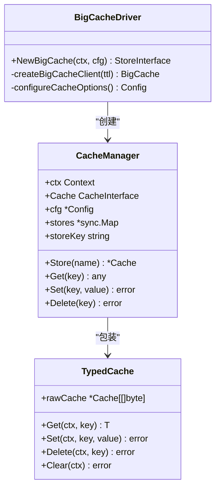
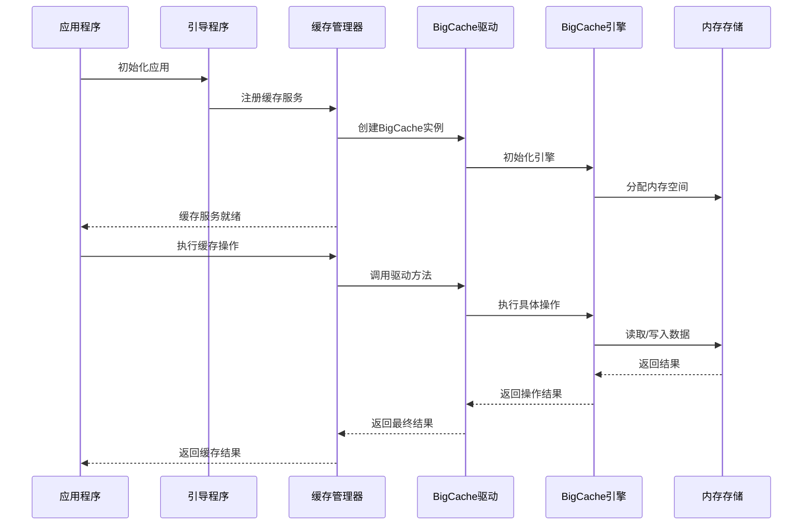
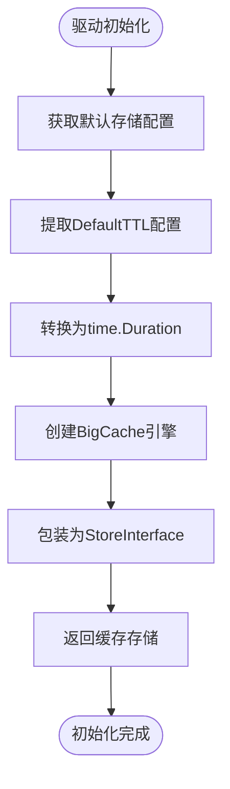
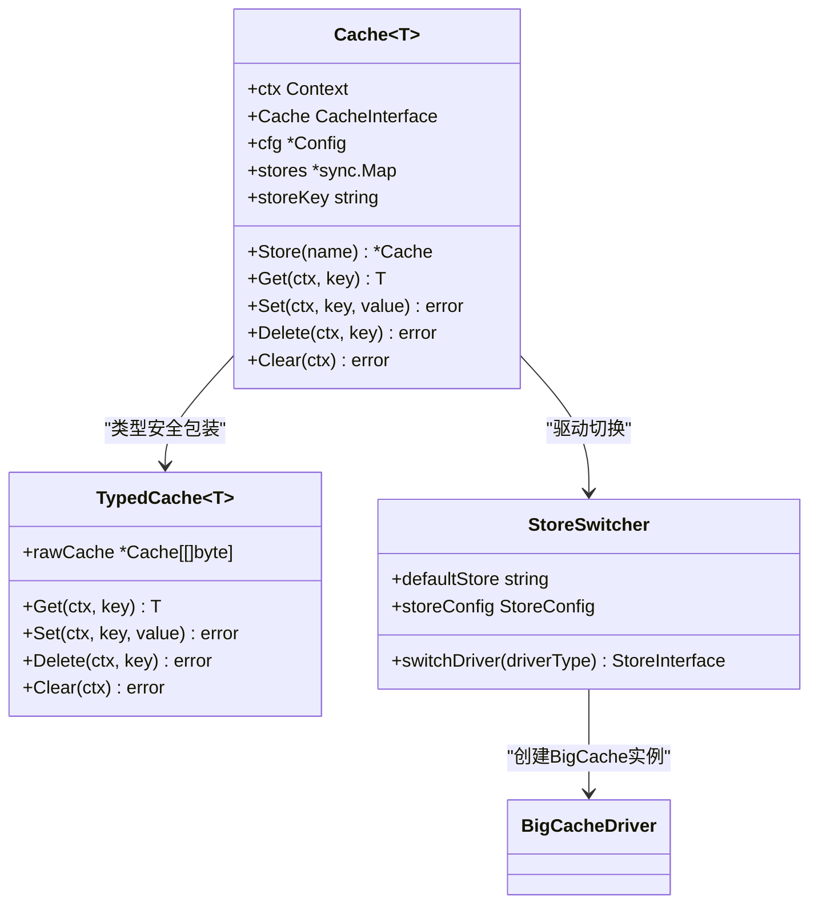
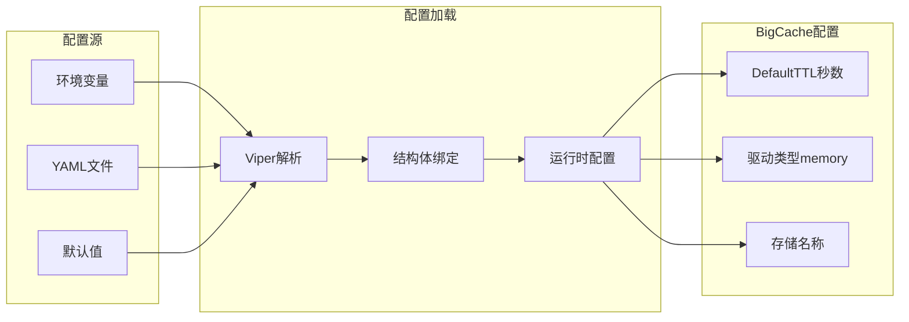
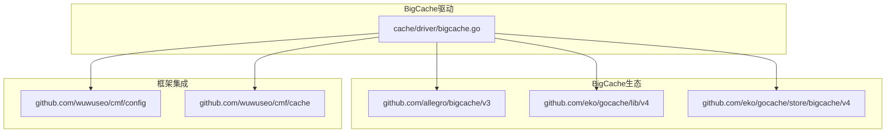
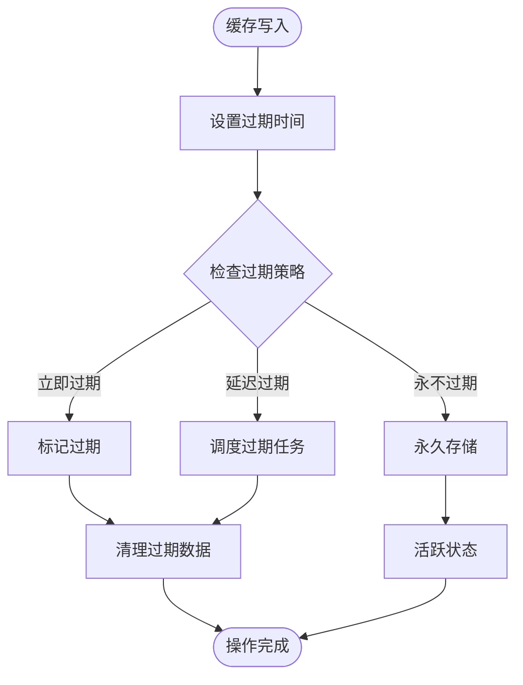

# BigCache内存缓存驱动

<cite>
**本文档引用的文件**
- [cache/driver/bigcache.go](file://cache/driver/bigcache.go)
- [cache/cache.go](file://cache/cache.go)
- [config/config.go](file://config/config.go)
- [bootstrap/bootstrap.go](file://bootstrap/bootstrap.go)
- [go.mod](file://go.mod)
- [README.md](file://README.md)
- [cache/driver/redis.go](file://cache/driver/redis.go)
</cite>

## 目录
1. [简介](#简介)
2. [项目结构](#项目结构)
3. [核心组件](#核心组件)
4. [架构概览](#架构概览)
5. [详细组件分析](#详细组件分析)
6. [依赖分析](#依赖分析)
7. [性能考虑](#性能考虑)
8. [故障排除指南](#故障排除指南)
9. [结论](#结论)
10. [附录](#附录)

## 简介

BigCache内存缓存驱动是CMF框架中的高性能本地缓存解决方案，基于Allegro BigCache库构建。该驱动提供了零GC开销的内存缓存能力，专为高并发场景设计，能够实现微秒级的缓存访问延迟。

### 主要特性

- **零GC开销**：采用固定大小的环形缓冲区，避免运行时垃圾回收
- **高性能**：基于内存映射和预分配策略，提供极低延迟的缓存访问
- **线程安全**：内置并发安全机制，支持高并发读写操作
- **内存友好**：智能内存回收和过期数据清理机制
- **类型安全**：通过泛型提供类型安全的缓存操作接口

### 适用场景

- 高频读取的热点数据缓存
- 会话状态存储
- 配置数据缓存
- 临时数据存储
- 需要极低延迟的业务场景

## 项目结构

CMF框架采用模块化设计，BigCache驱动位于缓存模块的驱动层：

```mermaid
graph TB
subgraph "缓存模块"
A[cache/cache.go] --> B[Cache[T] 结构]
A --> C[TypedCache[T] 结构]
D[cache/driver/] --> E[bigcache.go]
D --> F[redis.go]
end
subgraph "配置模块"
G[config/config.go] --> H[Cache配置结构]
end
subgraph "引导模块"
I[bootstrap/bootstrap.go] --> J[服务注册]
end
B --> E
C --> A
E --> H
F --> H
I --> B
```

**图表来源**
- [cache/cache.go:15-21](file://cache/cache.go#L15-L21)
- [cache/driver/bigcache.go:13-19](file://cache/driver/bigcache.go#L13-L19)
- [config/config.go:64-72](file://config/config.go#L64-L72)

**章节来源**
- [cache/cache.go:1-144](file://cache/cache.go#L1-L144)
- [cache/driver/bigcache.go:1-21](file://cache/driver/bigcache.go#L1-L21)
- [config/config.go:64-72](file://config/config.go#L64-L72)

## 核心组件

### BigCache驱动初始化

BigCache驱动通过工厂函数创建，支持动态配置和类型安全的缓存操作：



**图表来源**
- [cache/driver/bigcache.go:13-19](file://cache/driver/bigcache.go#L13-L19)
- [cache/cache.go:15-21](file://cache/cache.go#L15-L21)
- [cache/cache.go:97-99](file://cache/cache.go#L97-L99)

### 配置管理

BigCache驱动的配置完全由框架的配置系统管理，支持环境变量和文件配置：

| 配置项 | 类型 | 默认值 | 描述 |
|--------|------|--------|------|
| cache.default | string | "memory" | 默认缓存存储名称 |
| cache.stores.memory.driver | string | "memory" | 缓存驱动类型 |
| cache.stores.memory.default_ttl | int | 3600 | 默认过期时间（秒） |
| cache.stores.redis.driver | string | "redis" | Redis驱动类型 |
| cache.stores.redis.default_ttl | int | 3600 | Redis默认过期时间 |

**章节来源**
- [config/config.go:64-72](file://config/config.go#L64-L72)
- [config/config.go:142-147](file://config/config.go#L142-L147)

## 架构概览

BigCache驱动采用分层架构设计，实现了缓存抽象、驱动实现和配置管理的清晰分离：



**图表来源**
- [bootstrap/bootstrap.go:57-65](file://bootstrap/bootstrap.go#L57-L65)
- [cache/cache.go:24-54](file://cache/cache.go#L24-L54)
- [cache/driver/bigcache.go:13-19](file://cache/driver/bigcache.go#L13-L19)

### 组件关系图

```mermaid
graph TB
subgraph "应用层"
A[业务逻辑]
B[HTTP处理器]
end
subgraph "缓存管理层"
C[Cache[T]]
D[TypedCache[T]]
E[Store切换器]
end
subgraph "驱动层"
F[BigCache驱动]
G[Redis驱动]
end
subgraph "BigCache引擎"
H[RingBuffer]
I[EntryQueue]
J[Shards]
end
subgraph "存储层"
K[内存映射]
L[字节缓冲区]
end
A --> C
B --> C
C --> F
C --> G
F --> H
H --> I
I --> J
J --> K
K --> L
```

**图表来源**
- [cache/cache.go:15-21](file://cache/cache.go#L15-L21)
- [cache/driver/bigcache.go:13-19](file://cache/driver/bigcache.go#L13-L19)
- [cache/driver/redis.go:13-24](file://cache/driver/redis.go#L13-L24)

## 详细组件分析

### BigCache驱动实现

BigCache驱动的核心实现非常简洁，主要负责将框架配置转换为BigCache引擎的初始化参数：



**图表来源**
- [cache/driver/bigcache.go:13-19](file://cache/driver/bigcache.go#L13-L19)

#### 关键实现要点

1. **配置提取**：从全局配置中获取默认存储的TTL设置
2. **类型转换**：将整数秒数转换为Go的时间Duration类型
3. **引擎创建**：使用BigCache的DefaultConfig工厂方法创建引擎
4. **接口包装**：将底层BigCache客户端包装为通用StoreInterface

**章节来源**
- [cache/driver/bigcache.go:13-19](file://cache/driver/bigcache.go#L13-L19)

### 缓存管理器设计

缓存管理器提供了统一的缓存操作接口，并支持多存储后端切换：



**图表来源**
- [cache/cache.go:15-21](file://cache/cache.go#L15-L21)
- [cache/cache.go:97-99](file://cache/cache.go#L97-L99)
- [cache/cache.go:57-93](file://cache/cache.go#L57-L93)

#### 类型安全机制

TypedCache通过JSON序列化提供类型安全的缓存操作：

1. **序列化存储**：将任意类型数据序列化为[]byte存储
2. **反序列化读取**：从缓存读取后反序列化为目标类型
3. **泛型支持**：编译时类型检查，运行时类型安全

**章节来源**
- [cache/cache.go:97-143](file://cache/cache.go#L97-L143)

### 配置系统集成

BigCache驱动完全集成到框架的配置系统中，支持多种配置源：



**图表来源**
- [config/config.go:142-147](file://config/config.go#L142-L147)
- [config/config.go:214-220](file://config/config.go#L214-L220)

**章节来源**
- [config/config.go:64-72](file://config/config.go#L64-L72)
- [config/config.go:142-147](file://config/config.go#L142-L147)

## 依赖分析

### 外部依赖关系

BigCache驱动依赖于多个开源库，形成了完整的缓存生态系统：



**图表来源**
- [go.mod:6-9](file://go.mod#L6-L9)
- [cache/driver/bigcache.go:7-10](file://cache/driver/bigcache.go#L7-L10)

### 版本兼容性

| 依赖包 | 版本 | 用途 | 兼容性 |
|--------|------|------|--------|
| bigcache/v3 | v3.1.0 | 核心BigCache引擎 | ✓ |
| gocache/lib/v4 | v4.2.2 | 缓存抽象层 | ✓ |
| gocache/store/bigcache/v4 | v4.2.3 | BigCache存储适配器 | ✓ |
| viper | v1.21.0 | 配置管理 | ✓ |

**章节来源**
- [go.mod:6-26](file://go.mod#L6-L26)

## 性能考虑

### 内存分配策略

BigCache采用预分配和零GC的设计理念：

1. **固定大小缓冲区**：启动时分配固定大小的内存空间
2. **环形缓冲区**：使用环形队列避免内存碎片
3. **对象池**：重用内部对象减少分配开销

### 过期时间管理



**图表来源**
- [cache/driver/bigcache.go:18](file://cache/driver/bigcache.go#L18)

### 并发性能优化

1. **分片锁**：将缓存分成多个分片，减少锁竞争
2. **无锁读取**：读操作不使用互斥锁，提高并发性能
3. **批量操作**：支持批量读写操作，减少系统调用开销

### 适用场景对比

| 特性 | BigCache | 传统内存缓存 | Redis |
|------|----------|---------------|-------|
| 吞吐量 | 极高 | 高 | 中等 |
| 延迟 | 微秒级 | 微秒级 | 毫秒级 |
| 内存占用 | 最少 | 中等 | 中等 |
| 持久化 | 不支持 | 不支持 | 支持 |
| 分布式 | 不支持 | 不支持 | 支持 |
| 数据类型 | 任意 | 任意 | 丰富 |

## 故障排除指南

### 常见问题诊断

#### 内存不足问题

**症状**：缓存操作频繁失败，出现内存分配错误

**解决方案**：
1. 检查系统可用内存
2. 调整BigCache的内存分配策略
3. 优化缓存数据大小
4. 实施更严格的过期策略

#### 性能下降问题

**症状**：缓存命中率下降，响应时间增加

**诊断步骤**：
1. 检查缓存键的数量和分布
2. 分析热点数据访问模式
3. 监控内存使用情况
4. 评估并发访问负载

#### 配置错误问题

**症状**：缓存初始化失败或行为异常

**排查方法**：
1. 验证配置文件格式
2. 检查环境变量设置
3. 确认配置项的有效性
4. 查看启动日志输出

**章节来源**
- [cache/driver/bigcache.go:13-19](file://cache/driver/bigcache.go#L13-L19)
- [config/config.go:142-147](file://config/config.go#L142-L147)

### 监控指标

建议监控以下关键指标来评估BigCache性能：

1. **命中率**：缓存命中次数与总请求次数的比率
2. **内存使用率**：当前内存使用量与总容量的比率
3. **操作延迟**：平均读写操作的响应时间
4. **过期数据比例**：过期但未清理的数据占比
5. **并发度**：同时进行的缓存操作数量

## 结论

BigCache内存缓存驱动为CMF框架提供了高性能、低延迟的本地缓存解决方案。通过精心设计的架构和优化的实现，该驱动能够在高并发场景下提供卓越的性能表现。

### 主要优势

1. **极致性能**：零GC开销和预分配策略确保了最佳的性能表现
2. **简单易用**：与框架无缝集成，配置和使用都非常简单
3. **类型安全**：通过泛型和JSON序列化提供完整的类型安全保障
4. **内存友好**：智能的内存管理和过期清理机制

### 适用建议

- 优先用于高频读取的热点数据缓存
- 适合对延迟敏感的应用场景
- 作为Redis等分布式缓存的本地加速层
- 在内存充足的环境中部署以获得最佳效果

## 附录

### 配置示例

```yaml
# config/config.go中的默认配置
cache:
  default: "memory"
  stores:
    memory:
      driver: "memory"
      default_ttl: 3600
    redis:
      driver: "redis"
      default_ttl: 3600
```

### 使用示例

#### 基本操作
```go
// 获取默认缓存实例
cache := cache.NewCache(ctx, config)

// 设置缓存值
err := cache.Set(ctx, "key", []byte("value"))

// 获取缓存值
value, err := cache.Get(ctx, "key")

// 删除缓存值
err := cache.Delete(ctx, "key")
```

#### 类型安全操作
```go
// 创建类型化缓存
typedCache := cache.NewTypedCache[User](rawCache)

// 设置类型化值
user := User{Name: "John", Age: 30}
err := typedCache.Set(ctx, "user:1", user)

// 获取类型化值
user, err := typedCache.Get(ctx, "user:1")
```

#### 多存储切换
```go
// 切换到Redis存储
redisCache, err := cache.Store("redis")

// 切换回内存存储
memoryCache, err := cache.Store("memory")
```

**章节来源**
- [cache/cache.go:24-54](file://cache/cache.go#L24-L54)
- [cache/cache.go:101-143](file://cache/cache.go#L101-L143)
- [cache/cache.go:57-93](file://cache/cache.go#L57-L93)