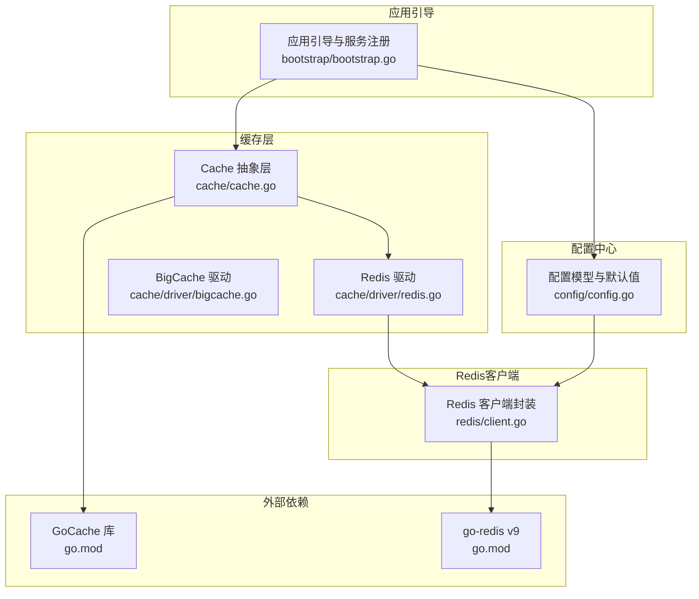
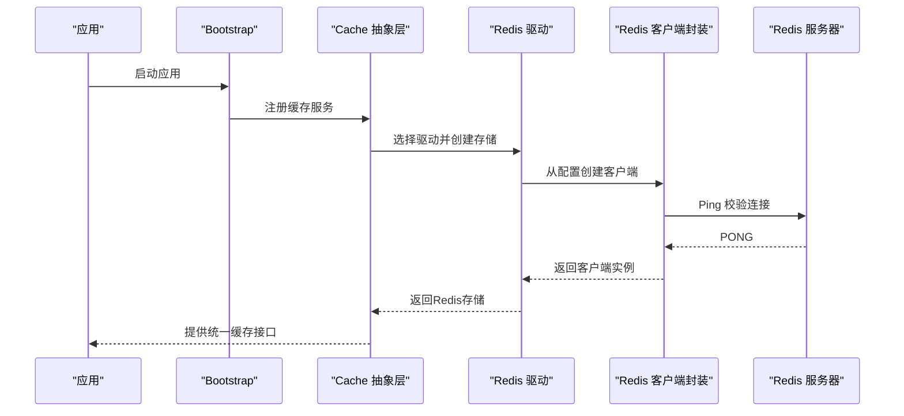
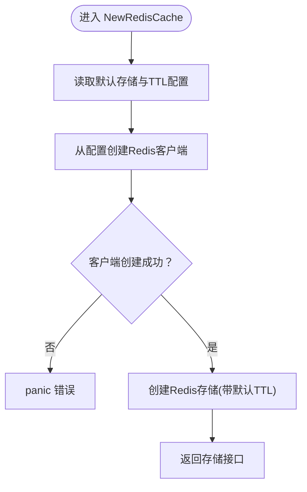
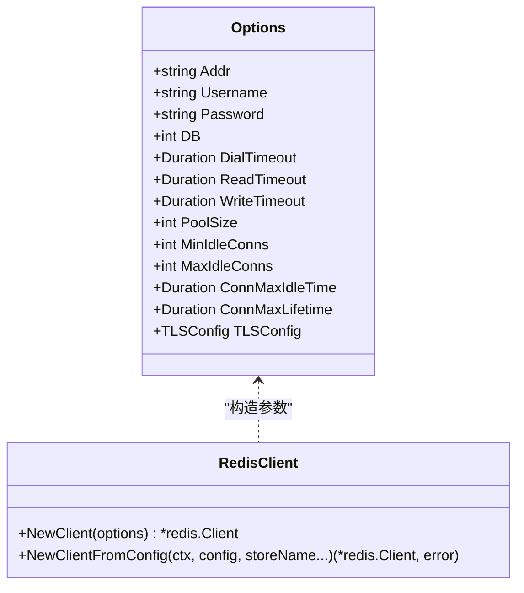
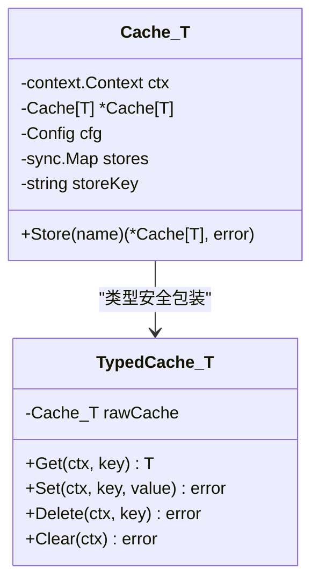
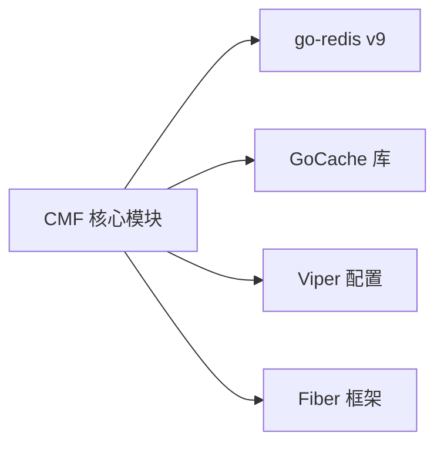

# Redis分布式缓存驱动

<cite>
**本文引用的文件**
- [cache/driver/redis.go](file://cache/driver/redis.go)
- [redis/client.go](file://redis/client.go)
- [cache/cache.go](file://cache/cache.go)
- [config/config.go](file://config/config.go)
- [bootstrap/bootstrap.go](file://bootstrap/bootstrap.go)
- [go.mod](file://go.mod)
- [README.md](file://README.md)
</cite>

## 目录
1. [简介](#简介)
2. [项目结构](#项目结构)
3. [核心组件](#核心组件)
4. [架构总览](#架构总览)
5. [详细组件分析](#详细组件分析)
6. [依赖关系分析](#依赖关系分析)
7. [性能考量](#性能考量)
8. [故障排查指南](#故障排查指南)
9. [结论](#结论)
10. [附录](#附录)

## 简介
本技术文档围绕Redis分布式缓存驱动展开，系统性阐述连接配置与连接池管理机制（含连接超时、重试策略与连接复用）、分布式特性与适用场景、与本地内存缓存的对比、配置选项详解、使用示例（基础操作、管道执行与事务处理）、过期策略与内存淘汰机制、持久化配置、集群部署建议、性能优化技巧以及故障排查方法。目标是帮助开发者构建稳定可靠的分布式缓存系统。

## 项目结构
该项目采用模块化设计，Redis缓存驱动位于独立模块中，通过配置中心统一管理连接参数，并由缓存层抽象对外提供统一接口。核心目录与职责如下：
- cache/driver：缓存驱动实现，包含Redis与本地BigCache驱动
- redis：Redis客户端封装，负责连接创建、单例管理与连接池配置
- cache：缓存抽象层，提供统一的缓存接口与类型安全包装
- config：配置模型与默认值，支持环境变量与YAML配置
- bootstrap：应用引导，注册缓存服务为单例
- go.mod：依赖声明，明确Redis客户端与缓存库版本

图表来源
- [cache/cache.go:24-55](file://cache/cache.go#L24-L55)
- [cache/driver/redis.go:13-24](file://cache/driver/redis.go#L13-L24)
- [redis/client.go:56-118](file://redis/client.go#L56-L118)
- [config/config.go:142-202](file://config/config.go#L142-L202)
- [bootstrap/bootstrap.go:57-66](file://bootstrap/bootstrap.go#L57-L66)
- [go.mod:5-26](file://go.mod#L5-L26)

章节来源
- [README.md:55-75](file://README.md#L55-L75)
- [go.mod:5-26](file://go.mod#L5-L26)

## 核心组件
- Redis驱动工厂：根据配置创建Redis缓存存储，设置默认TTL
- Redis客户端封装：从配置生成连接参数，单例化管理，Ping校验，支持TLS
- 缓存抽象层：统一的缓存接口，支持多存储切换与类型安全包装
- 配置模型：集中定义Redis连接参数与默认值，支持环境变量覆盖
- 应用引导：将缓存服务注册为单例，供业务模块使用

章节来源
- [cache/driver/redis.go:13-24](file://cache/driver/redis.go#L13-L24)
- [redis/client.go:56-118](file://redis/client.go#L56-L118)
- [cache/cache.go:24-93](file://cache/cache.go#L24-L93)
- [config/config.go:142-202](file://config/config.go#L142-L202)
- [bootstrap/bootstrap.go:57-66](file://bootstrap/bootstrap.go#L57-L66)

## 架构总览
Redis驱动的整体调用链路如下：应用通过Bootstrap注册缓存服务；缓存抽象层根据配置选择Redis驱动；Redis驱动通过客户端封装创建Redis连接；最终由GoCache的Redis存储实现提供统一的缓存能力。

图表来源
- [bootstrap/bootstrap.go:57-66](file://bootstrap/bootstrap.go#L57-L66)
- [cache/cache.go:24-55](file://cache/cache.go#L24-L55)
- [cache/driver/redis.go:13-24](file://cache/driver/redis.go#L13-L24)
- [redis/client.go:104-107](file://redis/client.go#L104-L107)

## 详细组件分析

### Redis驱动工厂
- 负责从配置中读取默认存储与TTL，创建Redis存储实例
- 通过GoCache的Redis存储实现提供统一接口
- 错误处理：创建失败直接panic，便于快速暴露问题

图表来源
- [cache/driver/redis.go:13-24](file://cache/driver/redis.go#L13-L24)

章节来源
- [cache/driver/redis.go:13-24](file://cache/driver/redis.go#L13-L24)

### Redis客户端封装
- Options结构体定义连接参数：地址、用户名、密码、数据库索引、超时、连接池大小、空闲连接数、连接生命周期、TLS配置
- 单例管理：使用sync.Map按storeKey保存客户端实例，避免重复创建
- Ping校验：创建后立即Ping，失败则返回错误
- TLS支持：当配置启用TLS时，填充TLSConfig

图表来源
- [redis/client.go:16-30](file://redis/client.go#L16-L30)
- [redis/client.go:37-54](file://redis/client.go#L37-L54)
- [redis/client.go:56-118](file://redis/client.go#L56-L118)

章节来源
- [redis/client.go:16-30](file://redis/client.go#L16-L30)
- [redis/client.go:37-54](file://redis/client.go#L37-L54)
- [redis/client.go:56-118](file://redis/client.go#L56-L118)

### 缓存抽象层
- 支持多存储切换：根据配置选择redis或memory驱动
- 类型安全包装：TypedCache通过JSON序列化/反序列化支持任意类型
- 单例缓存实例：内部使用sync.Map缓存不同存储实例，避免重复创建

图表来源
- [cache/cache.go:15-21](file://cache/cache.go#L15-L21)
- [cache/cache.go:95-143](file://cache/cache.go#L95-L143)

章节来源
- [cache/cache.go:24-93](file://cache/cache.go#L24-L93)
- [cache/cache.go:95-143](file://cache/cache.go#L95-L143)

### 配置模型与默认值
- Redis结构体字段覆盖连接参数与超时、连接池、生命周期、TLS开关
- 缓存结构体定义默认存储与各存储的默认TTL
- 默认值集中在InitConfig中，支持环境变量覆盖

章节来源
- [config/config.go:10-24](file://config/config.go#L10-L24)
- [config/config.go:64-77](file://config/config.go#L64-L77)
- [config/config.go:142-202](file://config/config.go#L142-L202)

### 应用引导与服务注册
- Bootstrap在启动时注册配置与缓存服务为单例
- 缓存服务通过NewCache创建，默认使用配置中的默认存储

章节来源
- [bootstrap/bootstrap.go:57-66](file://bootstrap/bootstrap.go#L57-L66)
- [cache/cache.go:24-55](file://cache/cache.go#L24-L55)

## 依赖关系分析
- Redis客户端依赖go-redis v9
- 缓存存储依赖GoCache的Redis存储实现
- 配置解析依赖Viper与godotenv
- 应用框架依赖Fiber

图表来源
- [go.mod:5-26](file://go.mod#L5-L26)

章节来源
- [go.mod:5-26](file://go.mod#L5-L26)

## 性能考量
- 连接池参数
  - PoolSize：连接池大小，建议根据并发QPS与RTT调整
  - MinIdleConns/MaxIdleConns：维持空闲连接数量，降低频繁建立连接的开销
  - ConnMaxIdleTime/ConnMaxLifetime：控制连接生命周期，避免长时间占用资源
- 超时配置
  - DialTimeout：连接建立超时
  - ReadTimeout/WriteTimeout：读写超时，避免阻塞线程
- TTL与过期策略
  - 默认TTL在缓存层设置，结合业务合理设置键的过期时间
- 并发与单例
  - 客户端封装使用单例，减少重复创建与上下文切换
- 类型安全与序列化
  - TypedCache通过JSON序列化，注意序列化/反序列化的性能与兼容性

章节来源
- [redis/client.go:16-30](file://redis/client.go#L16-L30)
- [redis/client.go:85-93](file://redis/client.go#L85-L93)
- [cache/driver/redis.go:20-23](file://cache/driver/redis.go#L20-L23)

## 故障排查指南
- 连接失败
  - 检查Redis地址、端口、密码、用户名与数据库索引
  - 查看DialTimeout、ReadTimeout、WriteTimeout是否合理
  - 若启用TLS，确认TLS配置正确
- 单例冲突
  - 确认storeKey唯一，避免多个存储共享同一客户端
- Ping校验失败
  - 确认Redis服务可达，网络连通性与防火墙策略
- 连接池耗尽
  - 检查PoolSize与MinIdleConns，适当增大
  - 关注ConnMaxIdleTime与ConnMaxLifetime，避免连接过早回收
- 类型序列化异常
  - 检查TypedCache使用的类型是否可JSON序列化
- 缓存未命中
  - 检查键空间与TTL设置，确认过期策略符合预期

章节来源
- [redis/client.go:56-118](file://redis/client.go#L56-L118)
- [config/config.go:142-202](file://config/config.go#L142-L202)

## 结论
本Redis分布式缓存驱动通过清晰的分层设计与完善的配置体系，实现了高性能、可扩展的缓存能力。结合连接池管理、单例客户端与类型安全包装，能够满足大多数分布式场景的需求。建议在生产环境中根据实际QPS与延迟要求调优连接池参数，并配合合理的过期策略与监控体系，持续优化缓存命中率与系统稳定性。

## 附录

### 配置选项一览
- Redis连接参数
  - addr：Redis服务器地址，格式为“host:port”
  - username/password：认证凭据
  - db：数据库索引
  - dial_timeout/read_timeout/write_timeout：超时（秒）
  - pool_size/min_idle_conns/max_idle_conns：连接池参数
  - conn_max_idle_time/conn_max_lifetime：连接生命周期（分钟/小时）
  - use_tls：是否启用TLS
- 缓存默认配置
  - cache.default：默认缓存存储
  - cache.stores.<name>.driver：驱动类型（redis/memory）
  - cache.stores.<name>.default_ttl：默认TTL（秒）

章节来源
- [config/config.go:10-24](file://config/config.go#L10-L24)
- [config/config.go:64-77](file://config/config.go#L64-L77)
- [config/config.go:142-202](file://config/config.go#L142-L202)

### 使用示例（步骤说明）
- 基本操作
  - 通过Bootstrap获取缓存服务
  - 使用Cache接口进行Get/Set/Delete/Clear
  - 使用TypedCache进行类型安全的读写
- 管道执行
  - 通过底层Redis客户端支持管道命令，提升批量操作吞吐
- 事务处理
  - 通过底层Redis客户端支持MULTI/EXEC事务，保证原子性

章节来源
- [bootstrap/bootstrap.go:57-66](file://bootstrap/bootstrap.go#L57-L66)
- [cache/cache.go:108-143](file://cache/cache.go#L108-L143)

### 过期策略与内存淘汰机制
- 过期策略
  - 缓存层默认TTL由配置决定，键过期后自动失效
- 内存淘汰
  - 由Redis服务器根据maxmemory与策略决定，需结合业务合理设置
- 持久化
  - 支持RDB与AOF持久化，需结合业务需求权衡一致性和性能

章节来源
- [cache/driver/redis.go:20-23](file://cache/driver/redis.go#L20-L23)
- [config/config.go:142-202](file://config/config.go#L142-L202)

### 集群部署建议
- 主从复制与哨兵：提高可用性与读扩展
- 分片集群：水平扩展，提升容量与吞吐
- 连接池与超时：根据集群规模与网络状况调整
- 监控与告警：关注慢查询、内存使用、连接数与错误率

章节来源
- [README.md:50-54](file://README.md#L50-L54)