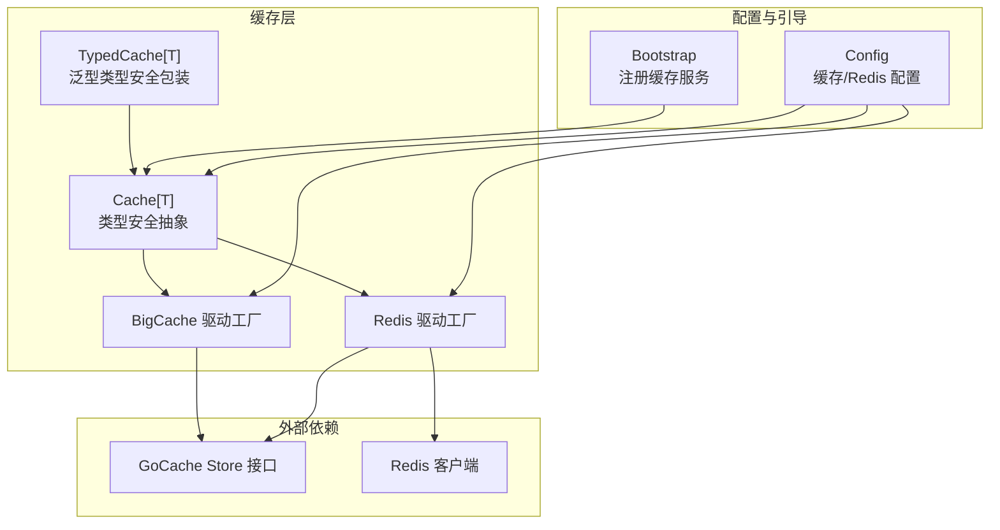
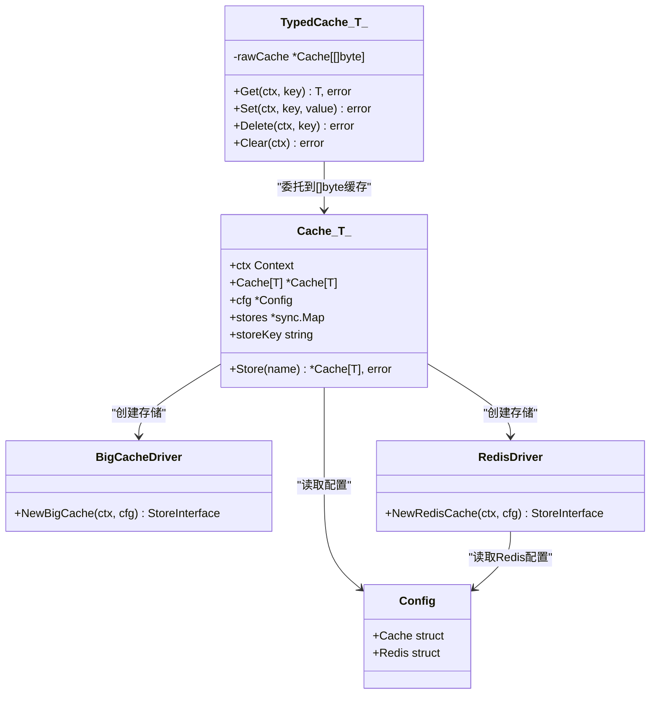
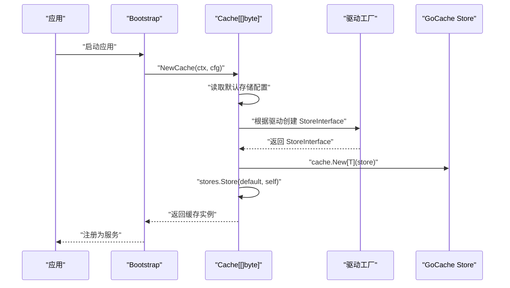
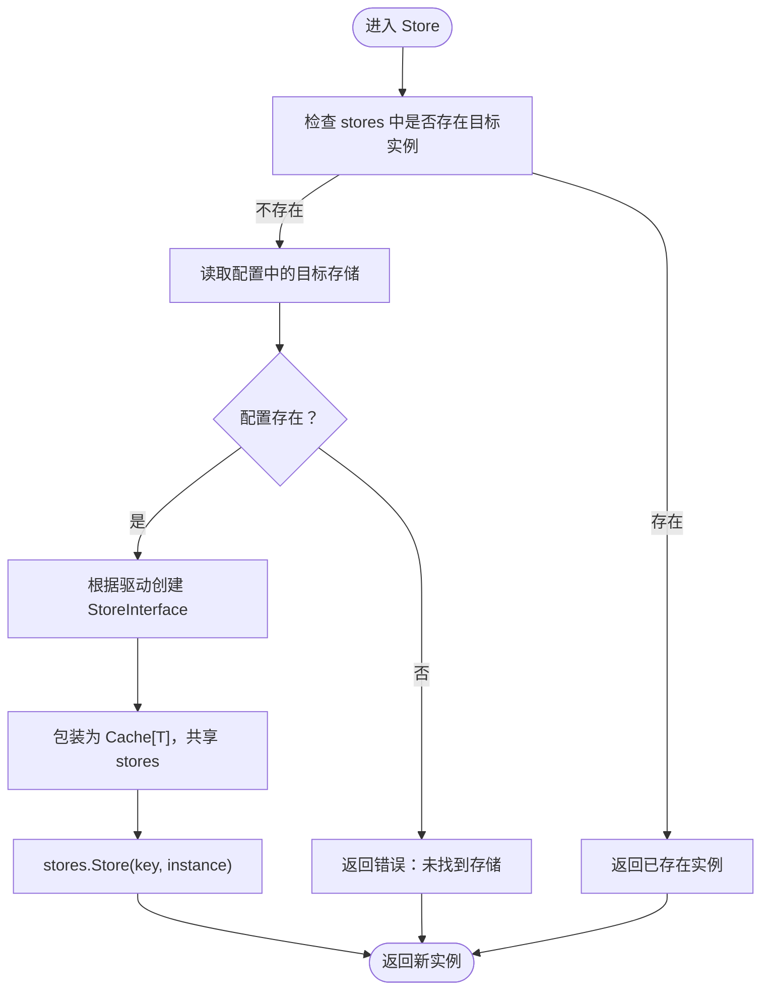
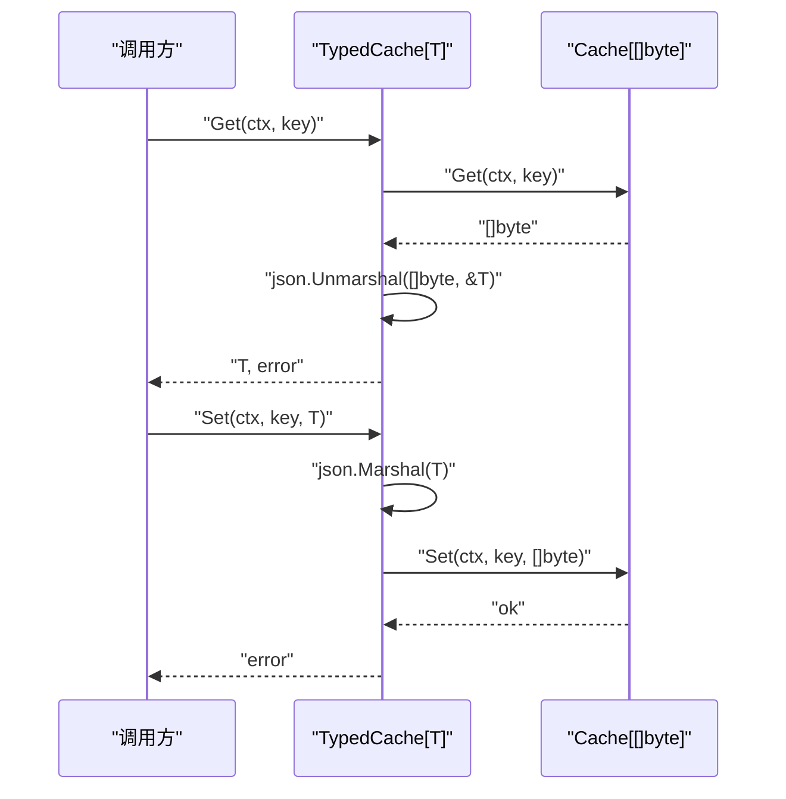
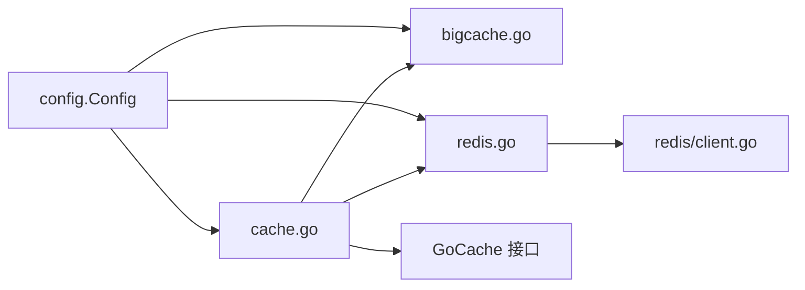

# 缓存接口与统一抽象

<cite>
**本文引用的文件**
- [cache.go](file://cache/cache.go)
- [bigcache.go](file://cache/driver/bigcache.go)
- [redis.go](file://cache/driver/redis.go)
- [config.go](file://config/config.go)
- [bootstrap.go](file://bootstrap/bootstrap.go)
- [client.go](file://redis/client.go)
- [README.md](file://README.md)
</cite>

## 目录
1. [简介](#简介)
2. [项目结构](#项目结构)
3. [核心组件](#核心组件)
4. [架构总览](#架构总览)
5. [详细组件分析](#详细组件分析)
6. [依赖分析](#依赖分析)
7. [性能考虑](#性能考虑)
8. [故障排查指南](#故障排查指南)
9. [结论](#结论)
10. [附录](#附录)

## 简介
本文件围绕 CMF 缓存接口与统一抽象展开，重点阐释以下内容：
- Cache[T] 泛型结构体的设计理念与实现机制
- 类型安全缓存 TypedCache[T] 的设计思路与 JSON 自动序列化/反序列化
- NewCache 初始化流程、默认存储配置加载与存储实例创建
- Store 方法的存储切换机制与 sync.Map 并发安全实现
- 使用示例与最佳实践，帮助开发者在不同场景下选择合适的缓存类型

## 项目结构
缓存子系统由以下关键部分组成：
- cache/cache.go：缓存接口与统一抽象，包含泛型 Cache[T]、TypedCache[T]、NewCache、Store 等
- cache/driver/bigcache.go：内存缓存 BigCache 驱动工厂
- cache/driver/redis.go：Redis 缓存驱动工厂
- config/config.go：配置模型与默认值设置，含缓存与 Redis 配置
- bootstrap/bootstrap.go：应用引导器，负责注册缓存服务为单例
- redis/client.go：Redis 客户端工厂，提供单例与连接测试
- README.md：项目概览与技术栈说明

图表来源
- [cache.go:15-93](file://cache/cache.go#L15-L93)
- [bigcache.go:13-20](file://cache/driver/bigcache.go#L13-L20)
- [redis.go:13-24](file://cache/driver/redis.go#L13-L24)
- [config.go:64-77](file://config/config.go#L64-L77)
- [bootstrap.go:57-66](file://bootstrap/bootstrap.go#L57-L66)
- [client.go:56-118](file://redis/client.go#L56-L118)

章节来源
- [README.md:55-75](file://README.md#L55-L75)
- [config.go:64-77](file://config/config.go#L64-L77)
- [bootstrap.go:57-66](file://bootstrap/bootstrap.go#L57-L66)

## 核心组件
- Cache[T]：泛型缓存抽象，内部持有 GoCache 的 Cache[T] 实例，封装存储切换与并发存储实例缓存
- TypedCache[T]：类型安全包装器，对任意类型 T 提供 JSON 序列化/反序列化，屏蔽底层字节细节
- NewCache：根据配置创建默认存储实例，并将默认实例加入并发缓存
- Store：按存储名称切换到指定存储，若未创建则按配置动态创建并缓存
- 驱动工厂：BigCache 与 Redis 驱动工厂，分别创建对应 StoreInterface 实例

章节来源
- [cache.go:15-93](file://cache/cache.go#L15-L93)
- [cache.go:95-143](file://cache/cache.go#L95-L143)

## 架构总览
缓存架构采用“统一抽象 + 驱动工厂”的分层设计：
- 统一抽象层：Cache[T]/TypedCache[T] 对外暴露一致的缓存 API
- 驱动层：BigCache/Redis 驱动工厂负责创建具体 StoreInterface 实例
- 配置层：config.Config 提供缓存与 Redis 的默认值与运行时配置
- 引导层：Bootstrap 在应用启动时注册缓存服务为单例

图表来源
- [cache.go:15-93](file://cache/cache.go#L15-L93)
- [cache.go:95-143](file://cache/cache.go#L95-L143)
- [bigcache.go:13-20](file://cache/driver/bigcache.go#L13-L20)
- [redis.go:13-24](file://cache/driver/redis.go#L13-L24)
- [config.go:64-77](file://config/config.go#L64-L77)

## 详细组件分析

### Cache[T] 泛型缓存抽象
- 设计理念
  - 通过泛型 T 暴露统一的缓存 API，屏蔽底层存储差异
  - 通过嵌入 GoCache 的 Cache[T]，直接复用其缓存能力
  - 通过 sync.Map 缓存不同存储实例，避免重复创建
- 关键字段
  - ctx：上下文
  - Cache[T]：GoCache 的缓存实例
  - cfg：配置指针
  - stores：并发存储实例缓存
  - storeKey：当前使用的存储键
- 初始化流程（NewCache）
  - 读取默认存储名称
  - 根据配置选择驱动（redis/memory），创建 StoreInterface
  - 包装为 Cache[T]，并将默认实例放入 stores
- 存储切换（Store）
  - 若已存在则直接返回
  - 否则按配置创建 StoreInterface，包装为 Cache[T]，并缓存
- 并发安全
  - stores 使用 sync.Map，保证多协程安全
  - Cache[T] 内部的 Cache[T] 由 GoCache 提供，遵循其并发语义

图表来源
- [bootstrap.go:57-66](file://bootstrap/bootstrap.go#L57-L66)
- [cache.go:24-55](file://cache/cache.go#L24-L55)
- [bigcache.go:13-20](file://cache/driver/bigcache.go#L13-L20)
- [redis.go:13-24](file://cache/driver/redis.go#L13-L24)

章节来源
- [cache.go:15-93](file://cache/cache.go#L15-L93)

### Store 方法的存储切换机制
- 逻辑流程
  - 优先从 stores 中查找目标存储实例
  - 若不存在，读取配置并创建对应驱动实例
  - 包装为 Cache[T]，共享同一 sync.Map，设置 storeKey
  - 返回新实例
- 并发安全
  - 使用 sync.Map 的 Load/Store 保证线程安全
  - 多个协程可并发调用 Store，不会产生竞态

图表来源
- [cache.go:57-93](file://cache/cache.go#L57-L93)

章节来源
- [cache.go:57-93](file://cache/cache.go#L57-L93)

### TypedCache[T] 类型安全缓存
- 设计思路
  - 以 []byte 作为底层存储，避免类型耦合
  - 对外暴露 T 类型的 Get/Set/Delete/Clear，内部自动 JSON 序列化/反序列化
  - 通过 NewTypedCache[T] 从已有的 Cache[[]byte] 构建
- 实现要点
  - Get：先从底层缓存读取 []byte，再反序列化为 T
  - Set：先序列化 T 为 []byte，再写入底层缓存
  - Delete/Clear：委托到底层缓存
- 类型安全
  - 通过泛型约束，确保编译期类型正确性
  - 反序列化失败时返回错误，避免隐式转换

图表来源
- [cache.go:108-133](file://cache/cache.go#L108-L133)

章节来源
- [cache.go:95-143](file://cache/cache.go#L95-L143)

### NewCache 初始化过程
- 默认存储配置加载
  - 从 config.Config.Cache.Default 读取默认存储名称
  - 从 config.Config.Cache.Stores[name] 读取驱动与 TTL
- 存储实例创建
  - redis：通过 redis.NewClientFromConfig 获取客户端，再创建 Redis Store
  - memory：通过 bigcache.New 创建 BigCache 实例，再创建 BigCache Store
- 实例缓存
  - 将默认实例存入 stores，键为默认存储名称
- 错误处理
  - 未找到驱动或配置时抛出异常

章节来源
- [cache.go:24-55](file://cache/cache.go#L24-L55)
- [config.go:64-77](file://config/config.go#L64-L77)
- [redis.go:13-24](file://cache/driver/redis.go#L13-L24)
- [bigcache.go:13-20](file://cache/driver/bigcache.go#L13-L20)
- [client.go:56-118](file://redis/client.go#L56-L118)

### 驱动工厂与存储实现
- BigCache 驱动
  - 从配置读取默认 TTL，创建 BigCache 实例
  - 包装为 GoCache BigCache Store
- Redis 驱动
  - 从配置读取 Redis 连接参数，创建 Redis 客户端
  - 包装为 GoCache Redis Store，并设置默认过期时间
- 单例与连接测试
  - redis.NewClientFromConfig 使用 sync.Map 保证单例
  - 创建后执行 Ping 测试连接可用性

章节来源
- [bigcache.go:13-20](file://cache/driver/bigcache.go#L13-L20)
- [redis.go:13-24](file://cache/driver/redis.go#L13-L24)
- [client.go:56-118](file://redis/client.go#L56-L118)

## 依赖分析
- 组件耦合
  - Cache[T] 依赖 config.Config 与驱动工厂
  - TypedCache[T] 依赖 Cache[[]byte]
  - 驱动工厂依赖 config.Config 与 redis 客户端
- 外部依赖
  - GoCache：提供统一的缓存接口与存储适配
  - BigCache：内存缓存实现
  - go-redis：Redis 客户端
- 循环依赖
  - 未发现循环依赖；驱动工厂仅依赖配置与 Redis 客户端

图表来源
- [cache.go:1-13](file://cache/cache.go#L1-L13)
- [bigcache.go:1-11](file://cache/driver/bigcache.go#L1-L11)
- [redis.go:1-11](file://cache/driver/redis.go#L1-L11)
- [client.go:1-12](file://redis/client.go#L1-L12)
- [config.go:1-97](file://config/config.go#L1-L97)

章节来源
- [cache.go:1-13](file://cache/cache.go#L1-L13)
- [config.go:64-77](file://config/config.go#L64-L77)

## 性能考虑
- 并发安全
  - 使用 sync.Map 缓存存储实例，避免锁竞争
  - GoCache 的 Cache[T] 本身具备良好的并发语义
- 序列化开销
  - TypedCache[T] 的 JSON 序列化/反序列化带来 CPU 开销
  - 对频繁读写的热数据，建议评估序列化成本
- 过期时间
  - 驱动工厂按配置设置默认 TTL，避免无限缓存占用内存
- 连接管理
  - Redis 客户端使用单例，减少连接创建与销毁开销

[本节为通用性能讨论，无需特定文件来源]

## 故障排查指南
- “未找到缓存驱动”
  - 检查 config.Config.Cache.Stores 中的 driver 字段是否正确
  - 确认默认存储名称与配置项一致
- “未找到缓存存储”
  - Store 方法传入的存储名称在配置中不存在
- “Redis 连接失败”
  - 检查 redis.NewClientFromConfig 的连接参数
  - 确认 Redis 服务可达与认证信息正确
- “JSON 序列化/反序列化错误”
  - 检查目标类型 T 的 JSON 可序列化性
  - 确保缓存中的数据格式与类型一致

章节来源
- [cache.go:28-41](file://cache/cache.go#L28-L41)
- [cache.go:66-78](file://cache/cache.go#L66-L78)
- [client.go:104-107](file://redis/client.go#L104-L107)
- [cache.go:118-120](file://cache/cache.go#L118-L120)

## 结论
CMF 的缓存接口与统一抽象通过泛型与驱动工厂实现了高内聚、低耦合的缓存体系：
- Cache[T] 提供统一的缓存 API 与并发安全的存储实例缓存
- TypedCache[T] 在不牺牲易用性的前提下，提供类型安全与自动序列化
- 驱动工厂与配置解耦，便于扩展新的存储后端
- Bootstrap 将缓存注册为单例服务，便于在整个应用中使用

## 附录

### 使用示例与最佳实践
- 获取默认缓存
  - 通过 Bootstrap 获取缓存服务，得到 Cache[[]byte] 实例
- 使用类型安全缓存
  - 从 Cache[[]byte] 创建 TypedCache[T]，对任意可 JSON 序列化的类型进行缓存
- 切换存储
  - 调用 Store 方法切换到其他存储（如从 memory 切换到 redis）
- 最佳实践
  - 对热数据优先使用内存缓存（memory）以降低延迟
  - 对跨进程/集群场景使用 Redis 缓存（redis）
  - 对复杂对象使用 TypedCache[T]，避免手动序列化
  - 合理设置 TTL，避免内存泄漏
  - 在高并发场景下，利用 Store 的并发缓存特性，避免重复创建实例

章节来源
- [bootstrap.go:57-66](file://bootstrap/bootstrap.go#L57-L66)
- [cache.go:101-106](file://cache/cache.go#L101-L106)
- [cache.go:57-93](file://cache/cache.go#L57-L93)
- [config.go:142-147](file://config/config.go#L142-L147)