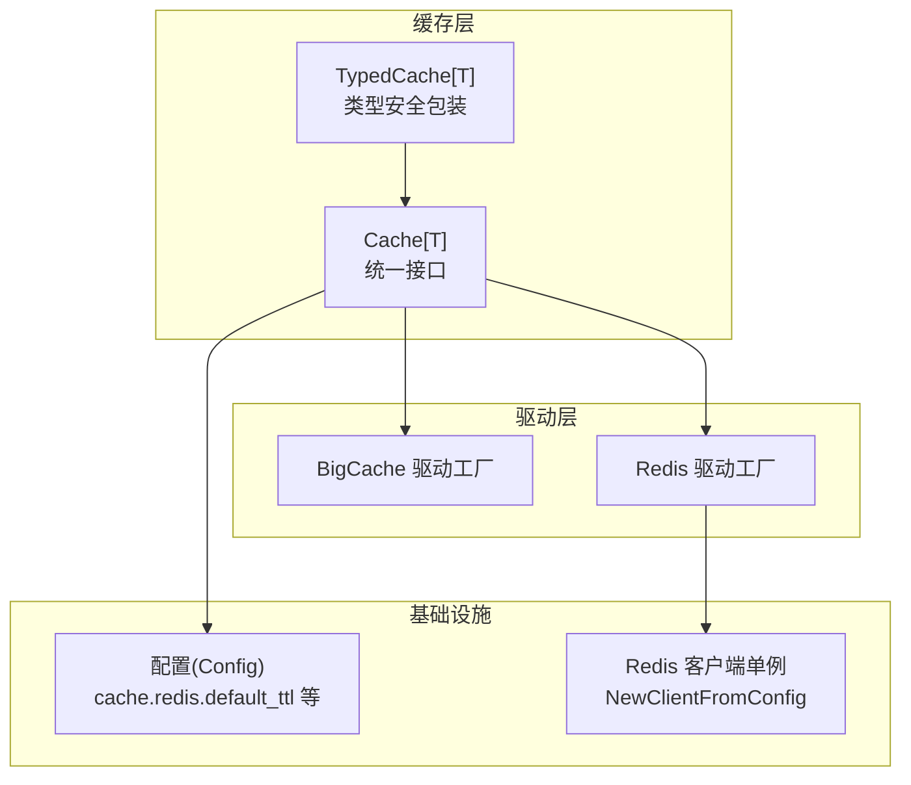
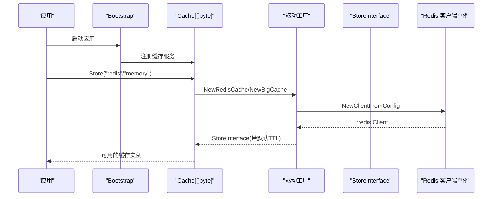
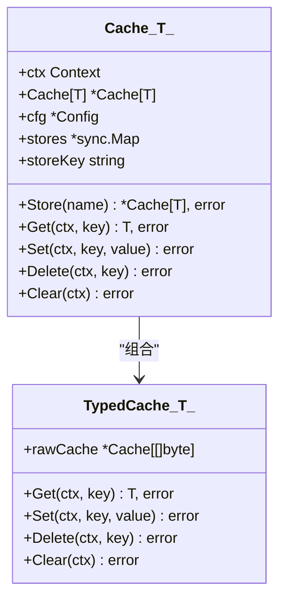
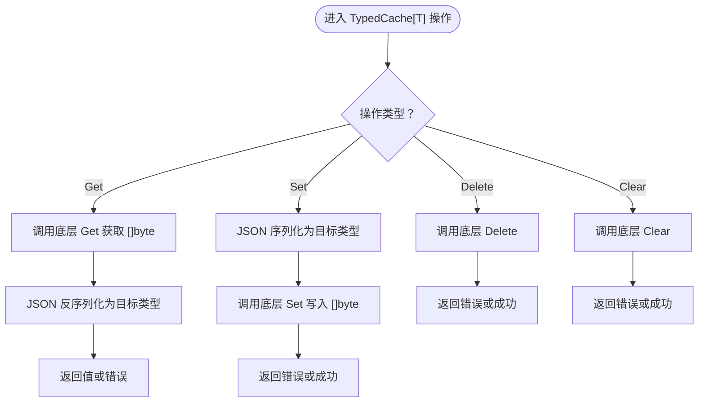
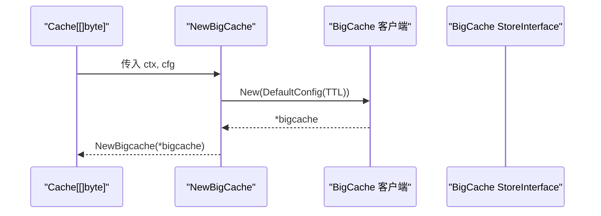
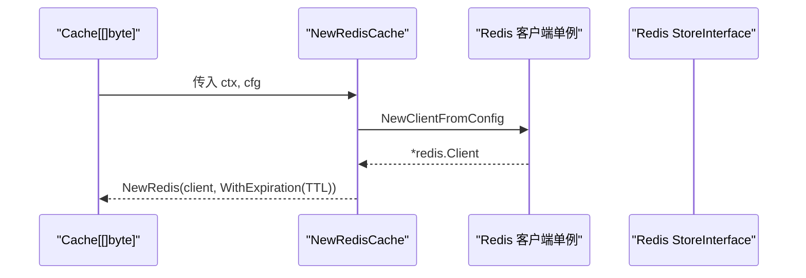
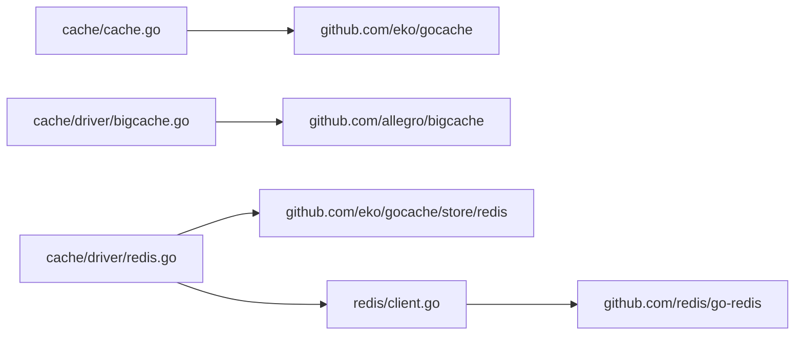

# 缓存系统

<cite>
**本文引用的文件**
- [cache/cache.go](file://cache/cache.go)
- [cache/driver/bigcache.go](file://cache/driver/bigcache.go)
- [cache/driver/redis.go](file://cache/driver/redis.go)
- [redis/client.go](file://redis/client.go)
- [config/config.go](file://config/config.go)
- [bootstrap/bootstrap.go](file://bootstrap/bootstrap.go)
- [README.md](file://README.md)
</cite>

## 目录
1. [简介](#简介)
2. [项目结构](#项目结构)
3. [核心组件](#核心组件)
4. [架构总览](#架构总览)
5. [详细组件分析](#详细组件分析)
6. [依赖分析](#依赖分析)
7. [性能考虑](#性能考虑)
8. [故障排查指南](#故障排查指南)
9. [结论](#结论)
10. [附录](#附录)

## 简介
本文件面向开发者，系统性阐述 CMF 缓存系统的架构设计与统一接口实现，重点覆盖：
- 统一缓存接口与类型安全缓存的设计理念与实现机制
- 内存缓存（BigCache）与 Redis 缓存两种驱动的特性与适用场景
- 缓存键值管理、过期策略与内存优化技术
- 缓存驱动扩展指南（如何实现自定义缓存后端）
- 性能优化建议、缓存命中率监控与故障处理策略

## 项目结构
缓存子系统由以下关键模块组成：
- cache/cache.go：统一缓存接口、类型安全包装、多存储切换
- cache/driver/bigcache.go：BigCache 驱动工厂
- cache/driver/redis.go：Redis 驱动工厂
- redis/client.go：Redis 客户端单例与连接配置
- config/config.go：缓存与 Redis 的配置模型与默认值
- bootstrap/bootstrap.go：应用启动时注册缓存服务
- README.md：技术栈与模块化背景

图表来源
- [cache/cache.go:15-143](file://cache/cache.go#L15-L143)
- [cache/driver/bigcache.go:13-20](file://cache/driver/bigcache.go#L13-L20)
- [cache/driver/redis.go:13-24](file://cache/driver/redis.go#L13-L24)
- [redis/client.go:56-118](file://redis/client.go#L56-L118)
- [config/config.go:64-97](file://config/config.go#L64-L97)

章节来源
- [README.md:50-75](file://README.md#L50-L75)
- [bootstrap/bootstrap.go:57](file://bootstrap/bootstrap.go#L57)

## 核心组件
- 统一缓存接口：Cache[T] 提供通用的 Get/Set/Delete/Clear 等能力，并支持多存储实例共享与切换。
- 类型安全缓存：TypedCache[T] 通过 JSON 序列化/反序列化实现任意类型的安全缓存操作。
- 驱动工厂：BigCache 与 Redis 驱动工厂负责根据配置创建具体 StoreInterface 实例，并设置默认过期时间。
- 配置模型：Config.Cache 与 Config.Redis 提供默认存储、驱动类型、默认 TTL、连接参数等。
- 启动集成：Bootstrap 在应用启动时注册缓存服务，便于全局注入使用。

章节来源
- [cache/cache.go:15-143](file://cache/cache.go#L15-L143)
- [cache/driver/bigcache.go:13-20](file://cache/driver/bigcache.go#L13-L20)
- [cache/driver/redis.go:13-24](file://cache/driver/redis.go#L13-L24)
- [config/config.go:64-97](file://config/config.go#L64-L97)
- [bootstrap/bootstrap.go:57](file://bootstrap/bootstrap.go#L57)

## 架构总览
CMF 缓存系统采用“统一接口 + 多驱动”的分层架构：
- 上层：Cache[T] 与 TypedCache[T] 对外暴露一致的缓存 API
- 中层：驱动工厂根据配置选择 BigCache 或 Redis
- 下层：BigCache 与 Redis 驱动分别对接本地内存与远程 Redis
- 基础设施：配置与 Redis 客户端单例保障一致性与性能

图表来源
- [bootstrap/bootstrap.go:57](file://bootstrap/bootstrap.go#L57)
- [cache/cache.go:57-93](file://cache/cache.go#L57-L93)
- [cache/driver/redis.go:13-24](file://cache/driver/redis.go#L13-L24)
- [redis/client.go:56-118](file://redis/client.go#L56-L118)

## 详细组件分析

### 统一缓存接口：Cache[T]
- 设计要点
  - 通过泛型支持任意类型数据，内部以 []byte 存储，配合 TypedCache[T] 实现类型安全
  - 支持多存储实例共享与切换，内部使用 sync.Map 缓存已创建的存储实例
  - 默认过期时间来自配置的 stores[*].default_ttl
- 关键方法
  - NewCache：根据默认存储驱动创建缓存实例
  - Store：按存储名称切换或创建新实例
  - Get/Set/Delete/Clear：委托底层 StoreInterface 执行
- 并发与一致性
  - 使用 sync.Map 保证多存储实例的并发安全
  - 驱动工厂创建 Store 时传入默认 TTL，避免重复设置

图表来源
- [cache/cache.go:15-143](file://cache/cache.go#L15-L143)

章节来源
- [cache/cache.go:23-93](file://cache/cache.go#L23-L93)

### 类型安全缓存：TypedCache[T]
- 设计理念
  - 通过 JSON 序列化/反序列化实现任意类型的安全缓存
  - 保持与底层 Cache[[]byte] 的一致性，避免重复实现
- 实现机制
  - Get：先从底层获取 []byte，再反序列化为目标类型
  - Set：先序列化为目标类型，再写入底层
  - Delete/Clear：直接委托底层
- 错误处理
  - JSON 序列化/反序列化失败时返回错误
  - 底层 Get 失败时返回零值与错误

图表来源
- [cache/cache.go:108-143](file://cache/cache.go#L108-L143)

章节来源
- [cache/cache.go:95-143](file://cache/cache.go#L95-L143)

### BigCache 驱动：内存缓存
- 特性
  - 本地内存缓存，低延迟、高吞吐
  - 基于 BigCache v3，支持默认 TTL 配置
- 实现
  - NewBigCache：根据默认存储配置创建 BigCache 客户端，并包装为 StoreInterface
  - 默认 TTL 来自 stores[*].default_ttl
- 适用场景
  - 单机应用、热点数据、低延迟要求高的场景
  - 无需跨进程/跨节点共享的缓存需求

图表来源
- [cache/driver/bigcache.go:13-20](file://cache/driver/bigcache.go#L13-L20)

章节来源
- [cache/driver/bigcache.go:13-20](file://cache/driver/bigcache.go#L13-L20)
- [config/config.go:142-147](file://config/config.go#L142-L147)

### Redis 驱动：分布式缓存
- 特性
  - 分布式缓存，支持跨节点共享
  - 通过 gocache 的 redis store 实现，支持默认 TTL
- 实现
  - NewRedisCache：从配置创建 Redis 客户端单例，包装为 StoreInterface
  - 默认 TTL 来自 stores[*].default_ttl
- 适用场景
  - 多实例部署、需要跨节点共享缓存
  - 需要持久化或与消息队列/发布订阅结合的场景

图表来源
- [cache/driver/redis.go:13-24](file://cache/driver/redis.go#L13-L24)
- [redis/client.go:56-118](file://redis/client.go#L56-L118)

章节来源
- [cache/driver/redis.go:13-24](file://cache/driver/redis.go#L13-L24)
- [redis/client.go:56-118](file://redis/client.go#L56-L118)
- [config/config.go:142-147](file://config/config.go#L142-L147)

### 配置与启动集成
- 配置模型
  - Config.Cache：包含 default 与 stores 映射，每项含 driver 与 default_ttl
  - Config.Redis：包含 default 与 connections 映射，用于 Redis 客户端单例
- 默认值
  - cache.default 默认 memory
  - cache.stores.memory.default_ttl 默认 3600 秒
  - cache.stores.redis.default_ttl 默认 3600 秒
  - redis.connections.redis.* 默认连接参数
- 启动集成
  - Bootstrap 在启动时注册缓存服务，便于全局注入使用

章节来源
- [config/config.go:64-97](file://config/config.go#L64-L97)
- [config/config.go:142-163](file://config/config.go#L142-L163)
- [bootstrap/bootstrap.go:57](file://bootstrap/bootstrap.go#L57)

## 依赖分析
- 组件耦合
  - Cache[T] 依赖 gocache 的 Cache[T] 与 StoreInterface
  - 驱动工厂依赖对应存储的 gocache store 包
  - Redis 驱动依赖 redis/client.go 的客户端单例
- 外部依赖
  - BigCache v3、GoCache v4、Redis go-redis v9
- 潜在循环依赖
  - 未发现循环依赖；驱动工厂仅依赖配置与 Redis 客户端单例

图表来源
- [cache/cache.go:9-12](file://cache/cache.go#L9-L12)
- [cache/driver/bigcache.go:7-10](file://cache/driver/bigcache.go#L7-L10)
- [cache/driver/redis.go:7-11](file://cache/driver/redis.go#L7-L11)
- [redis/client.go:10](file://redis/client.go#L10)

章节来源
- [cache/cache.go:9-12](file://cache/cache.go#L9-L12)
- [cache/driver/bigcache.go:7-10](file://cache/driver/bigcache.go#L7-L10)
- [cache/driver/redis.go:7-11](file://cache/driver/redis.go#L7-L11)
- [redis/client.go:10](file://redis/client.go#L10)

## 性能考虑
- 默认 TTL 与过期策略
  - stores[*].default_ttl 控制缓存过期时间，合理设置可平衡内存占用与命中率
  - 建议：热点数据设置较短 TTL，冷数据设置较长 TTL
- BigCache 内存优化
  - BigCache 默认配置适合大多数场景；可根据数据分布调整容量与回收策略
  - 建议：监控内存使用，必要时调整默认 TTL 与容量
- Redis 连接与池化
  - redis/client.go 提供连接池参数（PoolSize、MinIdleConns、MaxIdleConns 等），建议根据并发与延迟需求调优
  - 建议：开启 TLS 时评估 CPU 开销；合理设置 DialTimeout/ReadTimeout/WriteTimeout
- 类型安全与序列化开销
  - TypedCache[T] 使用 JSON 序列化/反序列化，建议对频繁读写的热数据考虑二进制序列化或自定义编码
- 命中率监控
  - 建议：在业务层统计 Get/Hit/Miss 次数，结合指标系统观察趋势
  - 建议：针对不同存储（memory vs redis）分别统计命中率，定位瓶颈

[本节为通用性能建议，不直接分析具体文件]

## 故障排查指南
- 缓存驱动未找到
  - 现象：NewCache 或 Store 调用时 panic 或返回错误
  - 排查：确认 config.cache.stores[*].driver 是否为 "memory" 或 "redis"
- Redis 连接失败
  - 现象：NewClientFromConfig 返回错误或 panic
  - 排查：核对 redis.connections[*] 的 addr、username、password、db、pool_size 等参数；确认 Redis 服务可达
- JSON 序列化/反序列化错误
  - 现象：TypedCache[T] 的 Get/Set 返回错误
  - 排查：确认目标类型可被 JSON 序列化；避免不可导出字段
- 多存储实例一致性
  - 现象：不同 Store 切换后行为不一致
  - 排查：确认各 stores[*].default_ttl 与 driver 配置一致；避免混用不同 TTL 的存储

章节来源
- [cache/cache.go:28-30](file://cache/cache.go#L28-L30)
- [cache/cache.go:66-68](file://cache/cache.go#L66-L68)
- [cache/cache.go:78](file://cache/cache.go#L78)
- [cache/driver/redis.go:15-17](file://cache/driver/redis.go#L15-L17)
- [redis/client.go:105-107](file://redis/client.go#L105-L107)

## 结论
CMF 缓存系统通过统一接口与类型安全包装，实现了对 BigCache 与 Redis 的无缝切换；借助配置驱动与客户端单例，兼顾了易用性与性能。开发者可依据场景选择合适驱动，并通过合理的 TTL、连接池与监控策略持续优化缓存表现。

[本节为总结性内容，不直接分析具体文件]

## 附录

### 缓存驱动扩展指南：实现自定义缓存后端
- 步骤
  - 实现 NewXxxCache(ctx, cfg) 工厂函数，返回 gostore.StoreInterface
  - 在 Cache.Store 中增加分支，支持新的 driver 名称
  - 在 config.cache.stores[*].driver 中配置新驱动
- 注意事项
  - 保持默认 TTL 与过期策略的一致性
  - 如需连接池或单例，请参考 redis/client.go 的单例模式
  - 为新驱动编写单元测试，覆盖 Get/Set/Delete/Clear

章节来源
- [cache/cache.go:33-41](file://cache/cache.go#L33-L41)
- [cache/cache.go:71-79](file://cache/cache.go#L71-L79)
- [config/config.go:64-72](file://config/config.go#L64-L72)

### 配置项速查
- cache.default：默认存储名称
- cache.stores.<name>.driver：存储驱动（"memory" 或 "redis"）
- cache.stores.<name>.default_ttl：默认过期时间（秒）
- redis.default：Redis 连接名称
- redis.connections.<name>.addr/username/password/db/pool_size 等：Redis 连接参数

章节来源
- [config/config.go:64-97](file://config/config.go#L64-L97)
- [config/config.go:142-163](file://config/config.go#L142-L163)