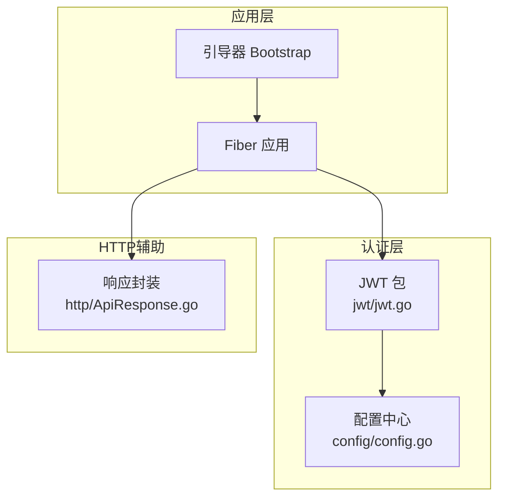
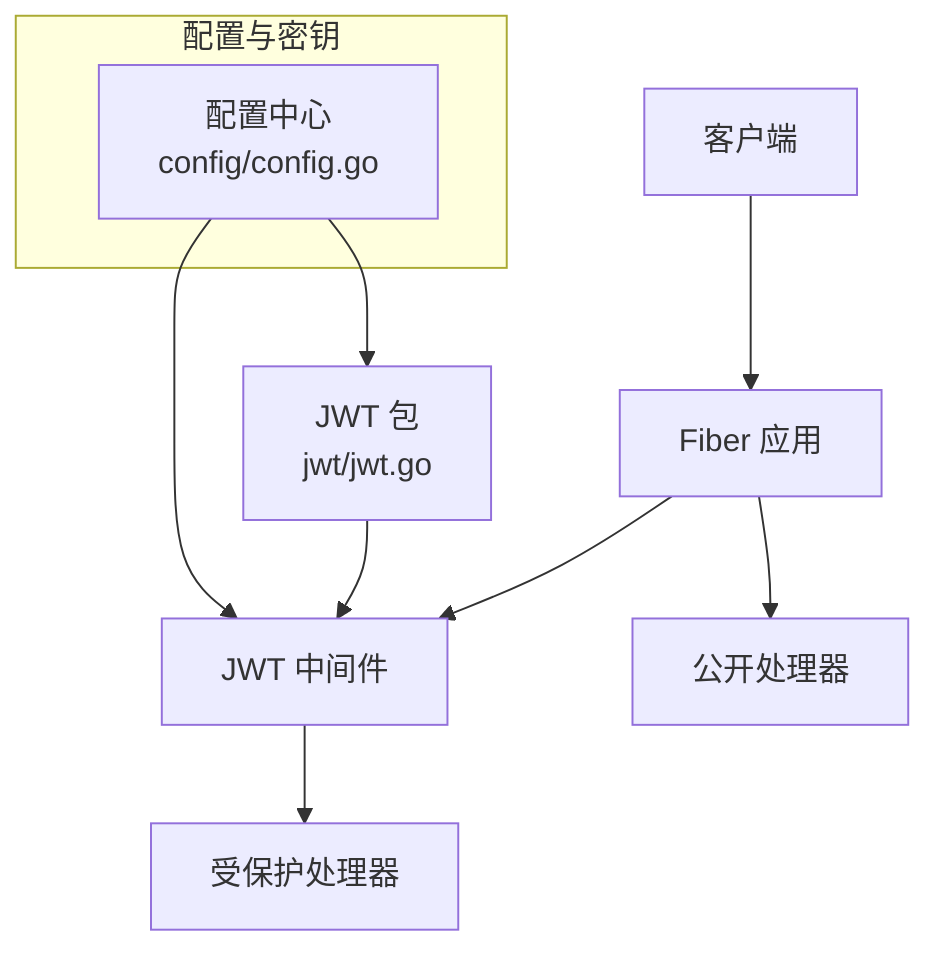
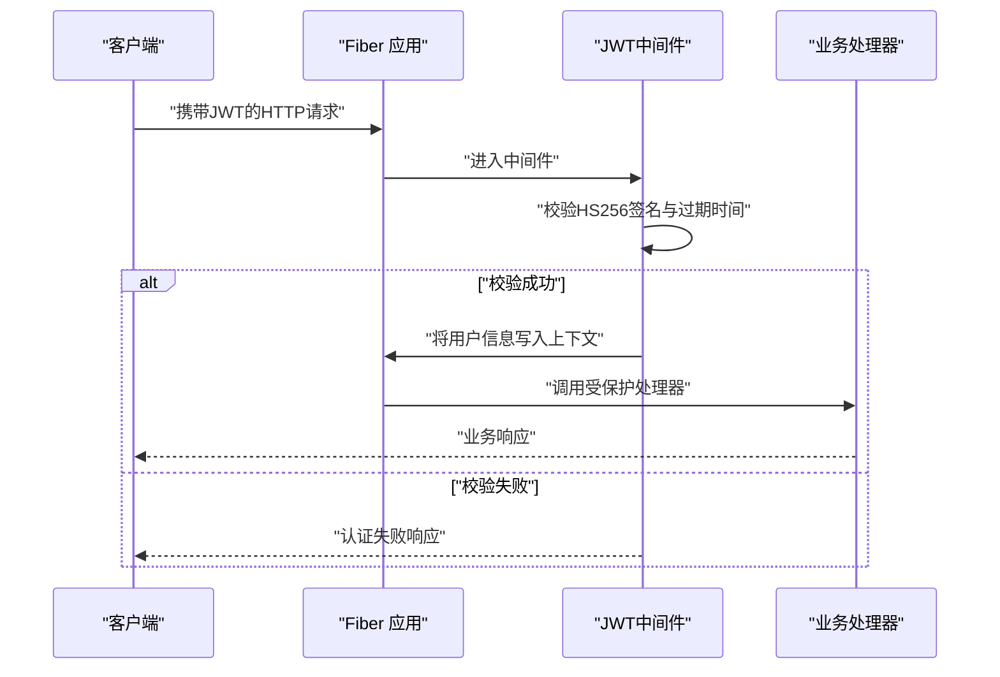
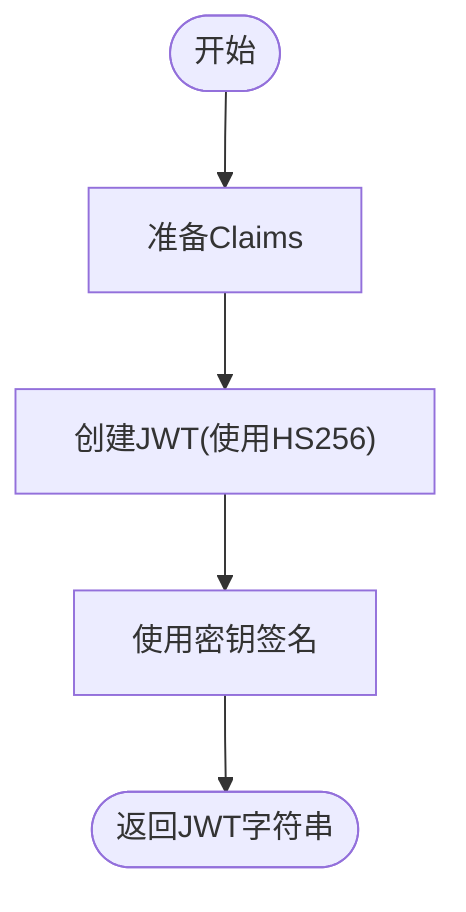
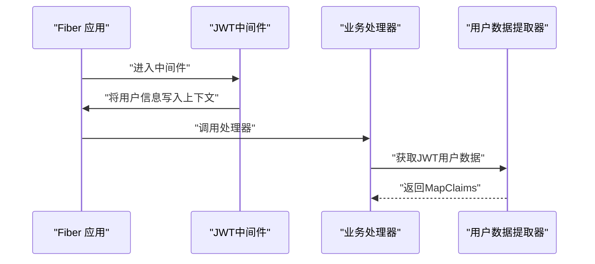
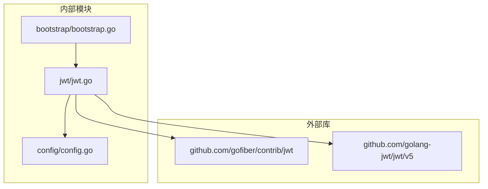

# JWT认证

<cite>
**本文引用的文件**
- [jwt.go](file://jwt/jwt.go)
- [bootstrap.go](file://bootstrap/bootstrap.go)
- [config.go](file://config/config.go)
- [ApiResponse.go](file://http/ApiResponse.go)
- [go.mod](file://go.mod)
- [README.md](file://README.md)
</cite>

## 目录
1. [简介](#简介)
2. [项目结构](#项目结构)
3. [核心组件](#核心组件)
4. [架构总览](#架构总览)
5. [详细组件分析](#详细组件分析)
6. [依赖分析](#依赖分析)
7. [性能考虑](#性能考虑)
8. [故障排查指南](#故障排查指南)
9. [结论](#结论)
10. [附录](#附录)

## 简介
本文件面向开发者，系统性阐述本仓库中的JWT认证子系统。内容涵盖JWT中间件实现原理、令牌签名算法、密钥管理、中间件配置、令牌生成流程、Claims结构设计、用户数据提取机制、路由保护与错误处理实践、以及安全注意事项与最佳实践。文档以代码为依据，结合架构图与流程图，帮助快速集成与正确使用JWT认证功能。

## 项目结构
JWT认证相关代码位于 jwt 包，配合配置中心 config 提供密钥与过期时间等运行参数，并通过 Bootstrap 引导器在应用启动阶段注册中间件与路由。HTTP响应封装位于 http 包，便于统一输出。

图表来源
- [bootstrap.go:155-215](file://bootstrap/bootstrap.go#L155-L215)
- [jwt.go:1-24](file://jwt/jwt.go#L1-L24)
- [config.go:37-48](file://config/config.go#L37-L48)
- [ApiResponse.go:1-44](file://http/ApiResponse.go#L1-L44)

章节来源
- [README.md:50-75](file://README.md#L50-L75)
- [go.mod:14-19](file://go.mod#L14-L19)

## 核心组件
- JWT中间件工厂：负责创建基于 HS256 的认证中间件，使用配置中心提供的密钥。
- 令牌签发器：基于 HS256 签名算法与给定 Claims 生成JWT字符串。
- 用户数据提取器：从请求上下文中提取已解析的JWT Claims，便于后续业务逻辑使用。
- 配置中心：提供应用密钥与登录过期间等配置项，支撑JWT中间件与签发流程。

章节来源
- [jwt.go:9-24](file://jwt/jwt.go#L9-L24)
- [config.go:37-48](file://config/config.go#L37-L48)

## 架构总览
JWT认证在本系统中的位置如下：

图表来源
- [bootstrap.go:188-194](file://bootstrap/bootstrap.go#L188-L194)
- [jwt.go:9-13](file://jwt/jwt.go#L9-L13)
- [config.go:139-141](file://config/config.go#L139-L141)

## 详细组件分析

### 组件一：JWT中间件
- 职责
  - 对进入的请求进行JWT校验，校验通过后将解析出的用户信息放入上下文，供后续处理器使用。
  - 使用 HS256 签名算法与配置中心提供的密钥进行验证。
- 关键点
  - 中间件由工厂方法创建，参数为密钥字符串。
  - 密钥来源于配置中心的 app.secret 字段。
  - 中间件作为全局中间件在引导器中注册。

图表来源
- [jwt.go:9-13](file://jwt/jwt.go#L9-L13)
- [bootstrap.go:188-194](file://bootstrap/bootstrap.go#L188-L194)

章节来源
- [jwt.go:9-13](file://jwt/jwt.go#L9-L13)
- [bootstrap.go:188-194](file://bootstrap/bootstrap.go#L188-L194)

### 组件二：令牌签发器
- 职责
  - 基于 HS256 算法与给定的 Claims 生成JWT字符串。
- 关键点
  - 使用配置中心提供的密钥进行签名。
  - 返回的字符串可用于登录成功后的响应体或Cookie设置。

图表来源
- [jwt.go:15-18](file://jwt/jwt.go#L15-L18)
- [config.go:139](file://config/config.go#L139)

章节来源
- [jwt.go:15-18](file://jwt/jwt.go#L15-L18)
- [config.go:139](file://config/config.go#L139)

### 组件三：用户数据提取器
- 职责
  - 从请求上下文中取出已解析的JWT Token及其Claims，返回Map形式的Claims以便业务使用。
- 关键点
  - 依赖中间件已将用户信息写入上下文。
  - 返回类型为MapClaims，便于直接读取声明字段。

图表来源
- [jwt.go:20-24](file://jwt/jwt.go#L20-L24)

章节来源
- [jwt.go:20-24](file://jwt/jwt.go#L20-L24)

### 组件四：配置中心与密钥管理
- 职责
  - 提供JWT密钥、登录过期时间等配置项。
- 关键点
  - app.secret：JWT签名密钥。
  - app.login_expires：登录态过期秒数（默认约24小时）。
  - app.refresh_expires：刷新令牌过期秒数（默认约7天）。
- 环境变量与默认值
  - 支持通过环境变量覆盖默认值，便于不同环境区分密钥与过期策略。

章节来源
- [config.go:37-48](file://config/config.go#L37-L48)
- [config.go:139-141](file://config/config.go#L139-L141)
- [config.go:204-212](file://config/config.go#L204-L212)

### 组件五：HTTP响应封装
- 职责
  - 统一输出JSON响应，便于在登录成功或失败时返回JWT字符串或错误信息。
- 关键点
  - 提供Success/Error/Result等便捷方法，简化控制器代码。

章节来源
- [ApiResponse.go:15-43](file://http/ApiResponse.go#L15-L43)

## 依赖分析
- 外部依赖
  - gofiber/contrib/jwt：提供JWT中间件实现。
  - golang-jwt/jwt/v5：提供HS256签名与令牌解析能力。
- 内部依赖
  - 配置中心为JWT中间件与签发器提供密钥与过期时间。
  - 引导器在应用启动时注册中间件与路由。

图表来源
- [go.mod:14-19](file://go.mod#L14-L19)
- [jwt.go:3-7](file://jwt/jwt.go#L3-L7)
- [bootstrap.go:188-194](file://bootstrap/bootstrap.go#L188-L194)

章节来源
- [go.mod:14-19](file://go.mod#L14-L19)
- [jwt.go:3-7](file://jwt/jwt.go#L3-L7)
- [bootstrap.go:188-194](file://bootstrap/bootstrap.go#L188-L194)

## 性能考虑
- 中间件开销
  - JWT中间件在每次请求都会进行签名验证与过期检查，建议合理设置过期时间，避免频繁刷新导致额外开销。
- 密钥长度与算法
  - HS256算法计算开销低，适合高并发场景；密钥长度建议使用足够强度的随机字符串。
- 缓存与降级
  - 对频繁访问的公开接口可考虑缓存响应；对认证失败的请求可快速短路，减少链路开销。
- 并发安全
  - 中间件与签发器均为纯函数式调用，无需额外锁；但需确保密钥在进程内共享且只读。

## 故障排查指南
- 常见问题
  - 401 未授权：检查请求头是否携带有效的JWT，确认签名算法与密钥一致。
  - 419 会话过期：检查登录过期时间配置，必要时缩短或增加刷新逻辑。
  - 中间件未生效：确认引导器中已注册JWT中间件，且顺序正确。
- 排查步骤
  - 启用调试日志，观察中间件是否被调用。
  - 校验配置中心的app.secret是否与签发时一致。
  - 使用统一响应封装输出错误信息，便于前端定位问题。

章节来源
- [bootstrap.go:168-187](file://bootstrap/bootstrap.go#L168-L187)
- [config.go:139](file://config/config.go#L139)

## 结论
本JWT认证子系统以简洁的API实现了HS256签名的中间件与令牌签发，配合配置中心提供灵活的密钥与过期时间管理。通过引导器注册中间件与路由，开发者可快速实现路由保护与用户信息提取。建议在生产环境中强化密钥管理、严格控制过期时间，并结合刷新令牌策略提升用户体验与安全性。

## 附录

### 使用示例（步骤说明）
- 步骤1：在引导器中注册JWT中间件
  - 在应用启动时，将JWT中间件注册为全局中间件，确保受保护路由生效。
  - 参考路径：[bootstrap.go:188-194](file://bootstrap/bootstrap.go#L188-L194)
- 步骤2：签发JWT
  - 准备Claims，调用签发器生成JWT字符串。
  - 参考路径：[jwt.go:15-18](file://jwt/jwt.go#L15-L18)
- 步骤3：返回响应
  - 使用统一响应封装返回JWT字符串或错误信息。
  - 参考路径：[ApiResponse.go:15-43](file://http/ApiResponse.go#L15-L43)
- 步骤4：在受保护处理器中获取用户数据
  - 从上下文中提取MapClaims，读取用户标识等字段。
  - 参考路径：[jwt.go:20-24](file://jwt/jwt.go#L20-L24)

### 安全考虑与最佳实践
- 密钥管理
  - 使用强随机字符串作为app.secret，定期轮换；在不同环境使用不同的密钥。
  - 参考路径：[config.go:139](file://config/config.go#L139)
- 令牌过期处理
  - 合理设置app.login_expires与app.refresh_expires，避免长期有效令牌带来的风险。
  - 参考路径：[config.go:140-141](file://config/config.go#L140-L141)
- 重放攻击防护
  - 使用短期有效的JWT；对关键操作可引入一次性票据或二次验证。
- 传输安全
  - 建议仅通过HTTPS传输JWT，防止中间人窃听。
- 错误处理
  - 对认证失败与过期场景返回明确状态码与消息，避免泄露敏感信息。
  - 参考路径：[bootstrap.go:168-187](file://bootstrap/bootstrap.go#L168-L187)