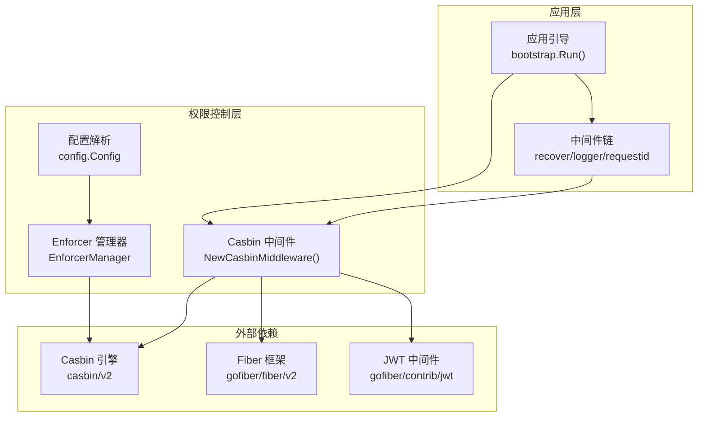
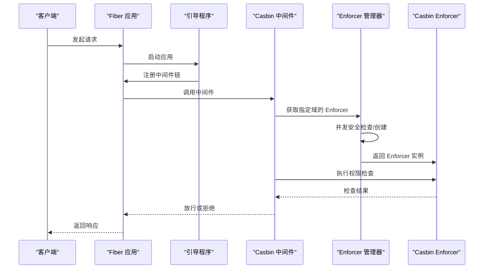
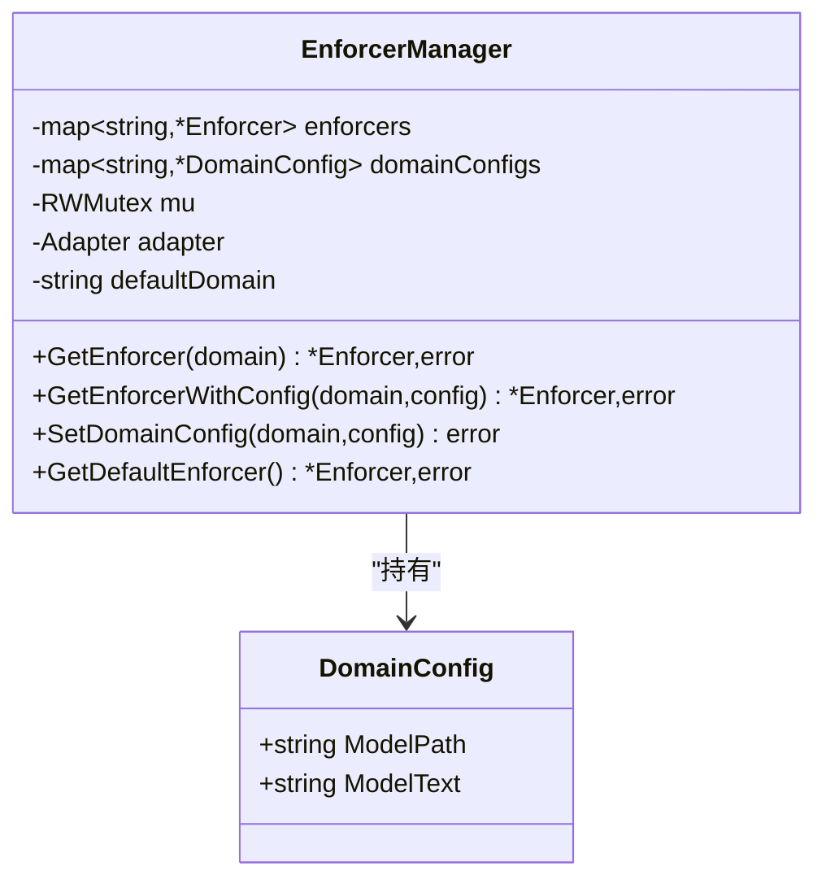
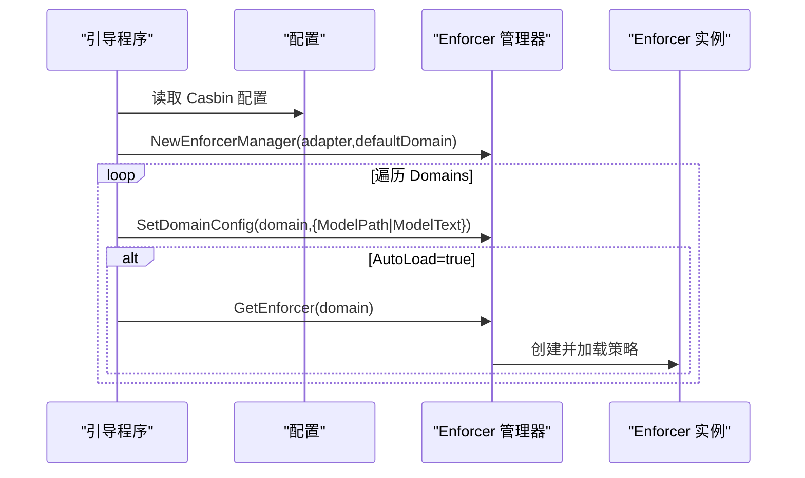
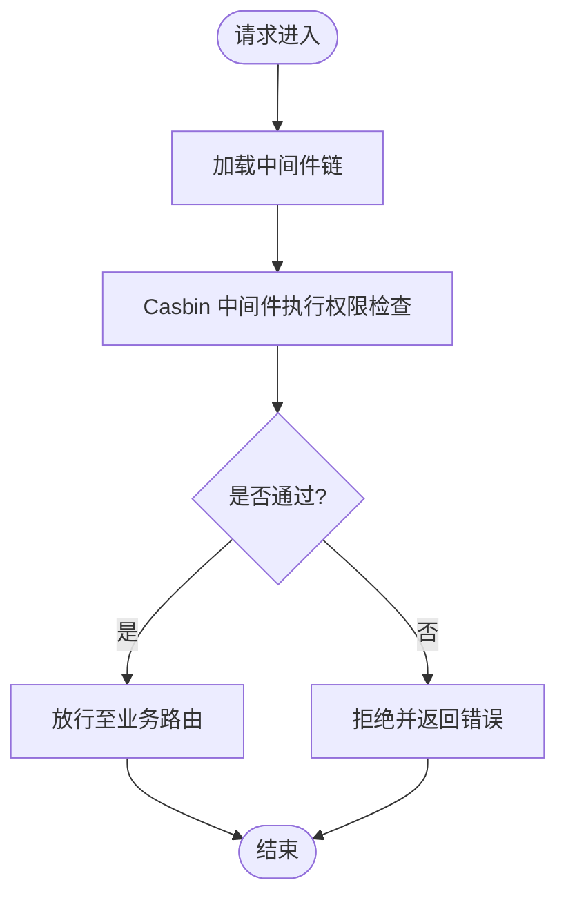
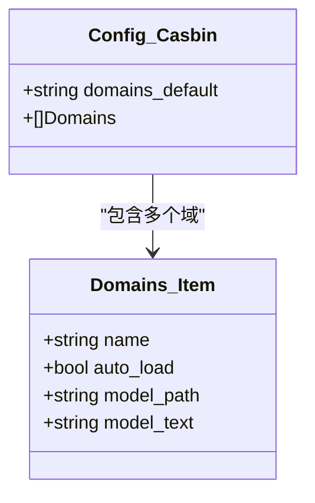
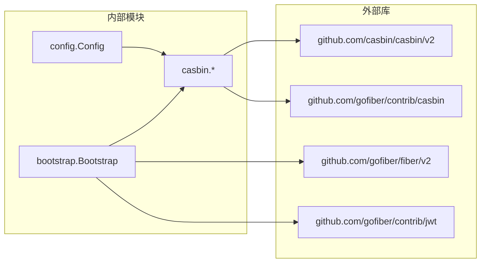
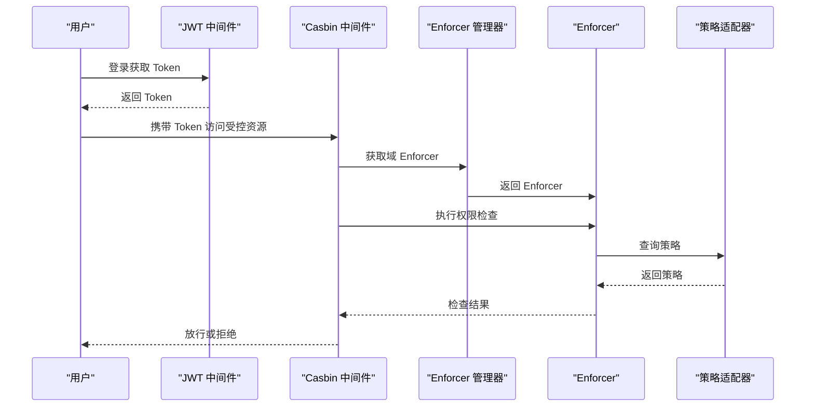

# RBAC权限控制

<cite>
**本文引用的文件**
- [casbin.go](file://casbin/casbin.go)
- [enforcer_manager.go](file://casbin/enforcer_manager.go)
- [errors.go](file://casbin/errors.go)
- [config.go](file://config/config.go)
- [bootstrap.go](file://bootstrap/bootstrap.go)
- [jwt.go](file://jwt/jwt.go)
- [ApiResponse.go](file://http/ApiResponse.go)
- [go.mod](file://go.mod)
- [README.md](file://README.md)
</cite>

## 目录
1. [简介](#简介)
2. [项目结构](#项目结构)
3. [核心组件](#核心组件)
4. [架构总览](#架构总览)
5. [详细组件分析](#详细组件分析)
6. [依赖分析](#依赖分析)
7. [性能考虑](#性能考虑)
8. [故障排查指南](#故障排查指南)
9. [结论](#结论)
10. [附录](#附录)

## 简介
本文件面向基于 Casbin 的 RBAC 权限控制系统，系统采用多域/多租户架构，结合 Fiber 中间件与策略适配器，提供灵活的企业级权限控制能力。文档涵盖：
- Casbin 集成架构：Enforcer 管理、策略适配器与权限模型设计
- 多域权限管理：角色-权限映射与资源访问控制
- 权限检查流程、中间件集成方式与错误处理机制
- 完整的权限控制示例：用户授权、角色分配与动态权限更新
- 策略文件格式、权限模型设计与性能优化建议

## 项目结构
围绕 RBAC 的核心目录与文件如下：
- casbin：封装 Casbin Enforcer 管理、中间件与错误定义
- config：配置解析与默认值，含 Casbin 多域配置
- bootstrap：应用引导、中间件装载与路由注册
- jwt：JWT 中间件与令牌签发
- http：统一响应封装
- go.mod：外部依赖声明（含 Casbin、Fiber、JWT 等）

**图表来源**
- [bootstrap.go:155-215](file://bootstrap/bootstrap.go#L155-L215)
- [casbin.go:16-21](file://casbin/casbin.go#L16-L21)
- [config.go:88-96](file://config/config.go#L88-L96)

**章节来源**
- [README.md:55-75](file://README.md#L55-L75)
- [go.mod:5-26](file://go.mod#L5-L26)

## 核心组件
- EnforcerManager：多域 Enforcer 管理，支持延迟创建、并发安全与配置热切换
- Casbin 中间件：基于 gofiber/contrib/casbin 的中间件封装，支持模型文件路径与策略适配器
- 配置系统：通过 Viper 解析 Casbin 多域配置，默认域与自动加载策略
- 错误体系：集中定义与导出错误常量，便于上层统一处理
- 统一响应：HTTP 响应封装，便于权限相关接口的一致输出

**章节来源**
- [enforcer_manager.go:19-36](file://casbin/enforcer_manager.go#L19-L36)
- [casbin.go:16-21](file://casbin/casbin.go#L16-L21)
- [config.go:88-96](file://config/config.go#L88-L96)
- [errors.go:5-24](file://casbin/errors.go#L5-L24)
- [ApiResponse.go:7-44](file://http/ApiResponse.go#L7-L44)

## 架构总览
系统通过 Bootstrap 启动应用，加载中间件链，随后注册 Casbin 中间件。配置模块负责解析 Casbin 多域配置，EnforcerManager 负责按需创建与缓存 Enforcer 实例，最终由 Casbin 中间件在请求处理链中执行权限检查。

**图表来源**
- [bootstrap.go:188-194](file://bootstrap/bootstrap.go#L188-L194)
- [casbin.go:16-21](file://casbin/casbin.go#L16-L21)
- [enforcer_manager.go:99-143](file://casbin/enforcer_manager.go#L99-L143)

## 详细组件分析

### EnforcerManager 组件分析
- 设计要点
  - 域配置 DomainConfig：支持模型文件路径或模型文本两种来源，后者优先级更高
  - 并发安全：读写锁保护 enforcers 与 domainConfigs 映射，采用双重检查锁定模式创建 Enforcer
  - 延迟创建：首次访问指定域时才创建 Enforcer，避免启动时的资源浪费
  - 自动加载：配置中可开启 AutoLoad，在初始化阶段即创建对应域的 Enforcer
- 关键流程
  - GetEnforcer：校验域 -> 读锁命中 -> 写锁创建（双重检查）-> 加载策略 -> 缓存
  - SetDomainConfig：仅允许在 Enforcer 未创建前设置配置
  - GetEnforcerWithConfig：强制新建且不允许覆盖已存在域

**图表来源**
- [enforcer_manager.go:19-36](file://casbin/enforcer_manager.go#L19-L36)
- [enforcer_manager.go:13-17](file://casbin/enforcer_manager.go#L13-L17)

**章节来源**
- [enforcer_manager.go:47-95](file://casbin/enforcer_manager.go#L47-L95)
- [enforcer_manager.go:97-143](file://casbin/enforcer_manager.go#L97-L143)
- [enforcer_manager.go:150-187](file://casbin/enforcer_manager.go#L150-L187)
- [enforcer_manager.go:189-225](file://casbin/enforcer_manager.go#L189-L225)

### Casbin 中间件与 Enforcer 初始化
- 中间件封装：NewCasbinMiddleware 接收策略适配器与模型文件路径，交由 gofiber/contrib/casbin 实现
- Enforcer 初始化：InitEnforcerManager 依据配置创建 EnforcerManager，并按 Domains 列表设置域配置与自动加载
- 模型来源：优先使用 ModelText；若为空则使用 ModelPath

**图表来源**
- [casbin.go:47-78](file://casbin/casbin.go#L47-L78)
- [config.go:88-96](file://config/config.go#L88-L96)

**章节来源**
- [casbin.go:16-21](file://casbin/casbin.go#L16-L21)
- [casbin.go:33-45](file://casbin/casbin.go#L33-L45)
- [casbin.go:47-78](file://casbin/casbin.go#L47-L78)

### 权限检查流程与中间件集成
- 中间件注册：在 Bootstrap 中间件链中加入 Casbin 中间件，确保在业务路由之前执行
- 请求处理：中间件根据当前请求的域信息获取对应 Enforcer，执行权限判断
- 错误处理：中间件内部错误通过 Fiber 的 ErrorHandler 统一处理，返回静态页面或错误信息

**图表来源**
- [bootstrap.go:188-194](file://bootstrap/bootstrap.go#L188-L194)
- [casbin.go:16-21](file://casbin/casbin.go#L16-L21)

**章节来源**
- [bootstrap.go:155-215](file://bootstrap/bootstrap.go#L155-L215)
- [bootstrap.go:217-226](file://bootstrap/bootstrap.go#L217-L226)

### 多域权限管理与模型设计
- 多域配置：config.Config.Casbin.Domains 支持为不同域配置独立的模型文件或模型文本
- 默认域：DomainsDefault 指定默认域；未配置时回退为 "default"
- 模型来源优先级：ModelText > ModelPath
- 自动加载：AutoLoad 为 true 时在初始化阶段即创建对应域的 Enforcer

**图表来源**
- [config.go:88-96](file://config/config.go#L88-L96)

**章节来源**
- [config.go:192-201](file://config/config.go#L192-L201)
- [casbin.go:48-78](file://casbin/casbin.go#L48-L78)

### JWT 集成与用户上下文
- JWT 中间件：NewJWTMiddleware 基于 Secret 对请求进行鉴权
- 用户数据提取：GetJWTUserData 从上下文 Locals 中获取用户 Claims
- 与权限控制配合：JWT 中间件在 Casbin 中间件之前执行，确保 Enforcer 可以从上下文中读取用户身份

**章节来源**
- [jwt.go:9-24](file://jwt/jwt.go#L9-L24)

### 统一响应与错误处理
- 统一响应：ApiResponse 提供 Result/Success/Error/ToResponse 等方法，便于权限相关接口输出一致格式
- 错误处理：Bootstrap 的 ErrorHandler 将错误转换为状态码与页面响应

**章节来源**
- [ApiResponse.go:7-44](file://http/ApiResponse.go#L7-L44)
- [bootstrap.go:168-187](file://bootstrap/bootstrap.go#L168-L187)

## 依赖分析
- 外部依赖
  - Casbin：权限引擎与模型/策略管理
  - Fiber：Web 框架与中间件生态
  - gofiber/contrib/casbin：Fiber 专用 Casbin 中间件
  - gofiber/contrib/jwt：JWT 中间件
  - gofiber/swagger：API 文档
- 内部依赖
  - config 为 casbin 提供多域配置
  - bootstrap 负责中间件装载与应用启动

**图表来源**
- [go.mod:5-26](file://go.mod#L5-L26)
- [casbin.go:3-10](file://casbin/casbin.go#L3-L10)
- [bootstrap.go:13-23](file://bootstrap/bootstrap.go#L13-L23)

**章节来源**
- [go.mod:5-26](file://go.mod#L5-L26)

## 性能考虑
- 延迟创建与缓存：EnforcerManager 首次访问才创建 Enforcer，减少启动开销
- 并发安全：读写锁与双重检查锁定降低锁竞争，提升高并发下的吞吐
- 自动加载：对热点域启用 AutoLoad，避免运行时首次创建的抖动
- 模型来源：优先使用 ModelText 可减少文件 IO；必要时使用 ModelPath 便于集中管理
- 中间件顺序：将 JWT 放在 Casbin 之前，减少无效权限检查次数

## 故障排查指南
- 常见错误
  - 无效域名：ErrInvalidDomain，检查请求域参数
  - Enforcer 已存在：ErrEnforcerAlreadyExists，避免重复创建
  - 配置已设置：ErrConfigAlreadySet，确保在创建前设置配置
  - 策略加载失败：ErrPolicyLoadFail，检查策略适配器与策略数据
- 排查步骤
  - 检查配置：确认 Domains、DomainsDefault、AutoLoad、ModelPath/ModelText 是否正确
  - 日志定位：查看 EnforcerManager 的创建与加载日志
  - 中间件链：确认 JWT 与 Casbin 中间件顺序与配置
  - 统一错误：通过 Bootstrap 的 ErrorHandler 观察错误响应

**章节来源**
- [errors.go:5-24](file://casbin/errors.go#L5-L24)
- [enforcer_manager.go:39-45](file://casbin/enforcer_manager.go#L39-L45)
- [enforcer_manager.go:167-171](file://casbin/enforcer_manager.go#L167-L171)
- [enforcer_manager.go:205-210](file://casbin/enforcer_manager.go#L205-L210)

## 结论
本系统通过 EnforcerManager 实现多域/多租户的灵活权限控制，结合 Casbin 中间件与配置驱动，形成“按域隔离、按需加载”的高性能架构。配合 JWT 中间件与统一响应，可快速构建企业级 RBAC 权限体系。建议在生产环境中启用 AutoLoad、合理设置模型来源，并通过中间件顺序与错误处理机制保障稳定性与可观测性。

## 附录

### 权限控制示例（流程说明）
- 用户授权
  - 登录成功后签发 JWT，携带用户身份信息
  - Casbin 中间件根据用户身份与域信息获取 Enforcer，执行权限检查
- 角色分配
  - 通过策略适配器写入角色-权限映射，Enforcer 加载策略后生效
- 动态权限更新
  - 更新策略后重新加载策略，或在运行时通过适配器刷新策略

**图表来源**
- [jwt.go:9-24](file://jwt/jwt.go#L9-L24)
- [casbin.go:16-21](file://casbin/casbin.go#L16-L21)
- [enforcer_manager.go:99-143](file://casbin/enforcer_manager.go#L99-L143)