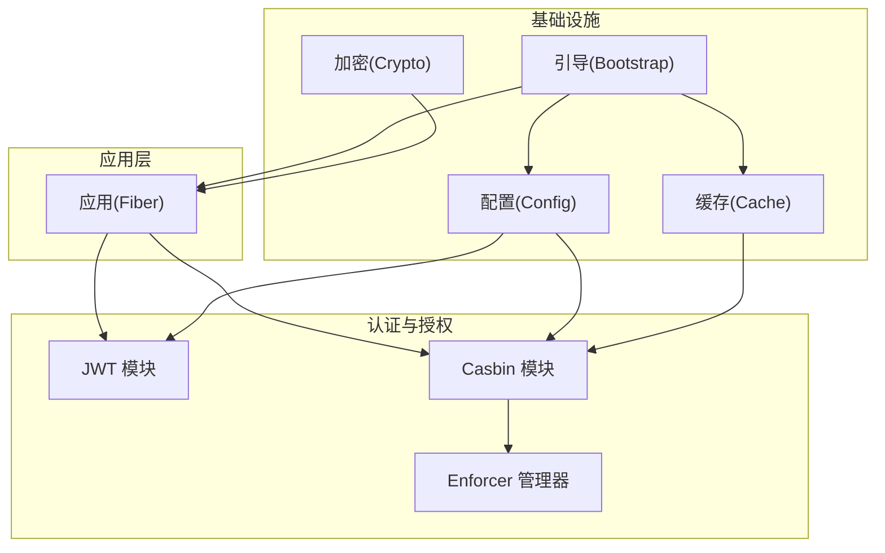
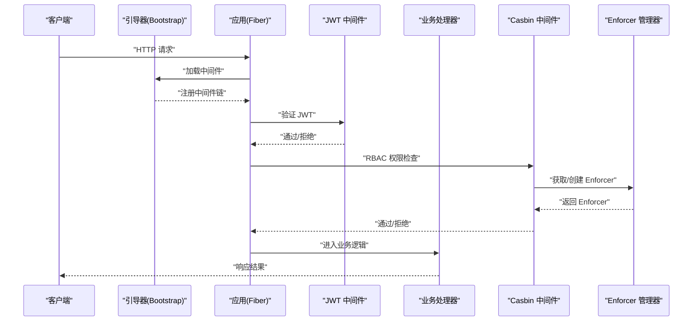
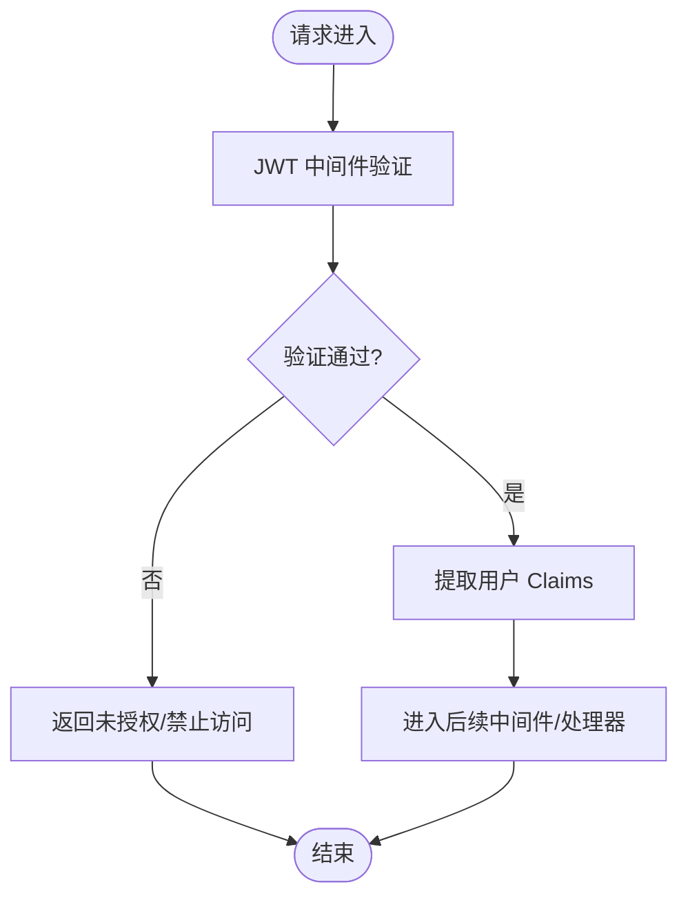
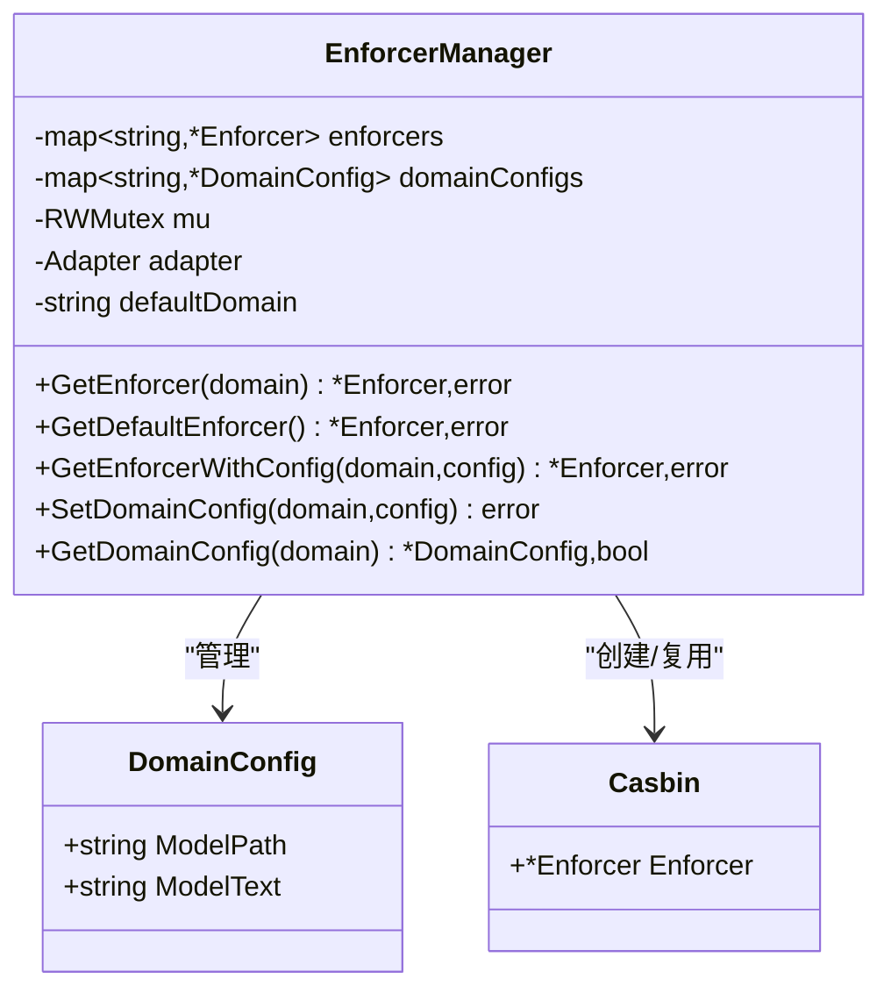
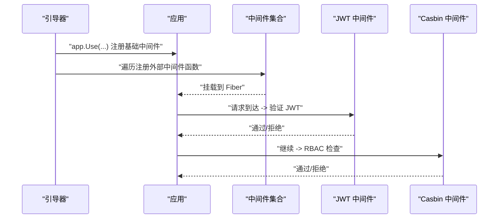
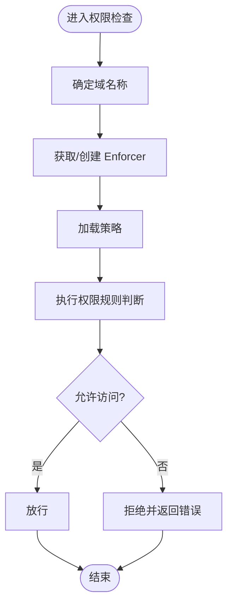
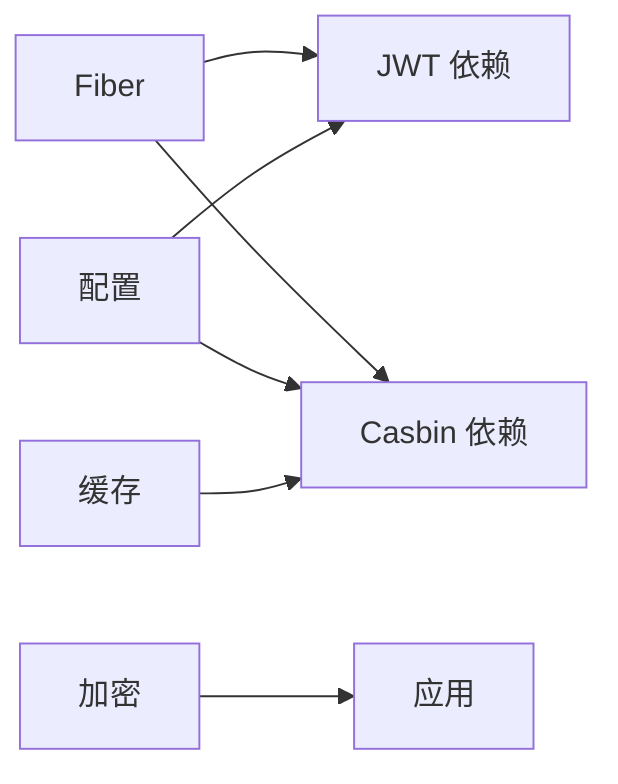

# 认证与授权

<cite>
**本文引用的文件**
- [jwt.go](file://jwt/jwt.go)
- [casbin.go](file://casbin/casbin.go)
- [enforcer_manager.go](file://casbin/enforcer_manager.go)
- [errors.go](file://casbin/errors.go)
- [config.go](file://config/config.go)
- [bootstrap.go](file://bootstrap/bootstrap.go)
- [cache.go](file://cache/cache.go)
- [crypto.go](file://crypto/crypto.go)
- [go.mod](file://go.mod)
- [README.md](file://README.md)
</cite>

## 目录
1. [简介](#简介)
2. [项目结构](#项目结构)
3. [核心组件](#核心组件)
4. [架构总览](#架构总览)
5. [组件详解](#组件详解)
6. [依赖关系分析](#依赖关系分析)
7. [性能考量](#性能考量)
8. [故障排查指南](#故障排查指南)
9. [结论](#结论)
10. [附录](#附录)

## 简介
本文件面向开发者，系统性阐述 CMF 认证与授权体系的设计与实现，重点覆盖：
- JWT 认证机制：令牌生成、验证与中间件集成
- 基于 Casbin 的 RBAC 权限控制：多域权限管理、策略适配器与权限检查
- 中间件工作流程与集成方式
- 安全注意事项、令牌刷新策略与权限设计模式
- 实战示例与最佳实践

## 项目结构
CMF 采用模块化设计，认证与授权相关的核心模块如下：
- jwt：封装 JWT 中间件与令牌生成/解析工具
- casbin：封装 Casbin 中间件与 Enforcer 管理器，支持多域模型
- config：集中式配置，含应用、缓存、Redis、文件系统与 Casbin 多域配置
- bootstrap：应用引导器，负责中间件注册、路由装配与服务注册
- cache：通用缓存抽象，支持内存与 Redis 后端
- crypto：密码哈希与校验工具
- go.mod：依赖清单
- README.md：技术栈与模块概览

图表来源
- [bootstrap.go:155-215](file://bootstrap/bootstrap.go#L155-L215)
- [config.go:37-97](file://config/config.go#L37-L97)
- [jwt.go:9-24](file://jwt/jwt.go#L9-L24)
- [casbin.go:16-45](file://casbin/casbin.go#L16-L45)
- [enforcer_manager.go:28-36](file://casbin/enforcer_manager.go#L28-L36)
- [cache.go:24-55](file://cache/cache.go#L24-L55)
- [crypto.go:19-79](file://crypto/crypto.go#L19-L79)

章节来源
- [README.md:50-75](file://README.md#L50-L75)
- [go.mod:5-26](file://go.mod#L5-L26)

## 核心组件
- JWT 中间件与工具
  - 提供认证中间件工厂、令牌签名与用户数据提取
- Casbin 中间件与 Enforcer 管理器
  - 提供中间件工厂、基于适配器的策略加载、多域模型管理
- 配置中心
  - 统一管理应用、缓存、Redis、文件系统与 Casbin 多域配置
- 引导器
  - 负责中间件注册、路由装配、服务注册与优雅关闭
- 缓存与加密
  - 通用缓存抽象与密码哈希工具

章节来源
- [jwt.go:9-24](file://jwt/jwt.go#L9-L24)
- [casbin.go:16-45](file://casbin/casbin.go#L16-L45)
- [enforcer_manager.go:28-36](file://casbin/enforcer_manager.go#L28-L36)
- [config.go:37-97](file://config/config.go#L37-L97)
- [bootstrap.go:47-66](file://bootstrap/bootstrap.go#L47-L66)
- [cache.go:24-55](file://cache/cache.go#L24-L55)
- [crypto.go:19-79](file://crypto/crypto.go#L19-L79)

## 架构总览
下图展示了认证与授权在应用启动与请求处理中的整体交互：

图表来源
- [bootstrap.go:217-226](file://bootstrap/bootstrap.go#L217-L226)
- [jwt.go:9-13](file://jwt/jwt.go#L9-L13)
- [casbin.go:16-21](file://casbin/casbin.go#L16-L21)
- [enforcer_manager.go:98-143](file://casbin/enforcer_manager.go#L98-L143)

## 组件详解

### JWT 认证机制
- 中间件集成
  - 通过工厂函数创建基于密钥的 JWT 中间件，统一接入 Fiber 中间件链
- 令牌生成
  - 使用 HS256 签名算法与应用密钥生成令牌
- 用户数据提取
  - 从请求上下文中提取 JWT Claims，便于后续鉴权与业务使用

图表来源
- [jwt.go:9-24](file://jwt/jwt.go#L9-L24)
- [bootstrap.go:189-193](file://bootstrap/bootstrap.go#L189-L193)

章节来源
- [jwt.go:9-24](file://jwt/jwt.go#L9-L24)
- [bootstrap.go:189-193](file://bootstrap/bootstrap.go#L189-L193)

### RBAC 权限控制（Casbin）
- 中间件与适配器
  - 提供 Casbin 中间件工厂，结合策略适配器与模型文件/文本进行权限检查
- 多域模型
  - 支持多域/多租户，每个域可独立配置模型路径或模型文本
- Enforcer 管理器
  - 并发安全地管理多个 Enforcer 实例，支持延迟创建与自动加载

图表来源
- [enforcer_manager.go:13-26](file://casbin/enforcer_manager.go#L13-L26)
- [enforcer_manager.go:28-36](file://casbin/enforcer_manager.go#L28-L36)
- [casbin.go:12-14](file://casbin/casbin.go#L12-L14)

章节来源
- [casbin.go:16-45](file://casbin/casbin.go#L16-L45)
- [enforcer_manager.go:98-143](file://casbin/enforcer_manager.go#L98-L143)
- [enforcer_manager.go:189-216](file://casbin/enforcer_manager.go#L189-L216)

### 中间件工作流程与集成
- 引导器负责：
  - 注册全局中间件（恢复、日志、请求 ID）
  - 加载外部注册的中间件函数（含认证与授权）
  - 装配路由与文档接口
- 认证与授权中间件的典型顺序：
  - JWT 中间件在前，确保请求携带合法令牌
  - Casbin 中间件在后，基于用户身份与域模型进行权限判定

图表来源
- [bootstrap.go:189-193](file://bootstrap/bootstrap.go#L189-L193)
- [bootstrap.go:217-226](file://bootstrap/bootstrap.go#L217-L226)

章节来源
- [bootstrap.go:189-193](file://bootstrap/bootstrap.go#L189-L193)
- [bootstrap.go:217-226](file://bootstrap/bootstrap.go#L217-L226)

### 权限检查流程（算法）

图表来源
- [enforcer_manager.go:98-143](file://casbin/enforcer_manager.go#L98-L143)
- [casbin.go:16-21](file://casbin/casbin.go#L16-L21)

章节来源
- [enforcer_manager.go:98-143](file://casbin/enforcer_manager.go#L98-L143)
- [casbin.go:16-21](file://casbin/casbin.go#L16-L21)

### 安全考虑与最佳实践
- 密钥管理
  - 应用密钥由配置中心提供，避免硬编码；生产环境建议使用环境变量与密钥管理服务
- 令牌策略
  - 登录过期与刷新过期时间由配置项控制；建议短令牌+刷新令牌的组合，严格限制刷新令牌有效期
- 权限设计
  - 使用最小权限原则；将权限细化到资源与动作；利用多域隔离不同租户或业务线
- 中间件顺序
  - JWT 中间件应在最前，确保后续中间件仅处理已认证请求
- 错误处理
  - 对无效域、策略加载失败等情况进行明确错误返回与日志记录

章节来源
- [config.go:38-48](file://config/config.go#L38-L48)
- [config.go:88-96](file://config/config.go#L88-L96)
- [errors.go:6-24](file://casbin/errors.go#L6-L24)

### 令牌刷新策略
- 建议采用“短期访问令牌 + 长期刷新令牌”的双令牌模型
  - 访问令牌：较短有效期，用于日常请求
  - 刷新令牌：较长有效期，仅在服务端安全存储，刷新时校验并签发新访问令牌
- 刷新流程要点
  - 仅在刷新接口启用 JWT 中间件，避免循环依赖
  - 刷新成功后撤销旧刷新令牌，发放新刷新令牌
  - 对异常登录行为（频繁刷新、跨域刷新）进行风控与审计

章节来源
- [config.go:46-47](file://config/config.go#L46-L47)

### 权限设计模式
- 基于角色的访问控制（RBAC）
  - 用户-角色-权限：通过策略适配器持久化用户与角色、角色与权限的关系
- 多域/多租户
  - 不同域使用独立模型与策略，实现强隔离
- 资源-动作-域
  - 将域作为权限作用域，提升权限表达力与安全性

章节来源
- [casbin.go:48-78](file://casbin/casbin.go#L48-L78)
- [enforcer_manager.go:13-26](file://casbin/enforcer_manager.go#L13-L26)

## 依赖关系分析
- 外部依赖
  - Fiber：Web 框架与中间件生态
  - JWT：令牌生成与验证
  - Casbin：RBAC 引擎与策略适配器
  - Viper/godotenv：配置管理
  - GoCache/BigCache/Redis：缓存
  - bcrypt：密码哈希
- 内部耦合
  - 引导器与配置中心耦合度低，通过服务注册解耦
  - Casbin 与配置中心通过多域配置耦合，支持运行时动态加载

图表来源
- [go.mod:5-26](file://go.mod#L5-L26)
- [config.go:37-97](file://config/config.go#L37-L97)

章节来源
- [go.mod:5-26](file://go.mod#L5-L26)
- [config.go:37-97](file://config/config.go#L37-L97)

## 性能考量
- 中间件链路
  - 将恢复、日志、请求 ID 等轻量中间件前置，减少异常开销
- 缓存策略
  - 使用通用缓存抽象，结合内存与 Redis 后端，降低重复计算与 IO
- 并发安全
  - Enforcer 管理器使用读写锁与双重检查锁定，保障高并发场景下的稳定性
- 策略加载
  - 支持自动加载与延迟创建，避免启动阻塞

章节来源
- [bootstrap.go:189-193](file://bootstrap/bootstrap.go#L189-L193)
- [cache.go:24-55](file://cache/cache.go#L24-L55)
- [enforcer_manager.go:98-143](file://casbin/enforcer_manager.go#L98-L143)

## 故障排查指南
- 常见错误与定位
  - 无效域：检查域名称与配置项
  - 策略加载失败：检查模型文件路径或模型文本
  - Enforcer 已存在：避免重复创建同一域的 Enforcer
- 日志与监控
  - 启用 Fiber 日志中间件，结合结构化日志输出定位问题
  - 对中间件执行耗时进行埋点，识别瓶颈
- 配置校验
  - 使用配置中心提供的默认值与校验逻辑，确保关键字段完整

章节来源
- [errors.go:6-24](file://casbin/errors.go#L6-L24)
- [bootstrap.go:232-242](file://bootstrap/bootstrap.go#L232-L242)

## 结论
CMF 的认证与授权体系以 Fiber 为基础，结合 JWT 与 Casbin，实现了简洁而强大的安全能力。通过引导器与配置中心的解耦设计，开发者可以灵活地集成认证与授权中间件，并借助多域模型与缓存机制获得良好的性能与可维护性。建议在生产环境中强化密钥管理、令牌策略与权限设计，持续优化中间件链路与日志监控。

## 附录
- 快速集成步骤
  - 在引导器中注册 JWT 中间件与 Casbin 中间件
  - 在配置中心设置应用密钥、Casbin 多域模型与自动加载策略
  - 在业务路由中按需启用授权中间件
- 示例参考
  - JWT 工具函数与中间件工厂：[jwt.go:9-24](file://jwt/jwt.go#L9-L24)
  - Casbin 中间件与 Enforcer 管理器：[casbin.go:16-45](file://casbin/casbin.go#L16-L45)、[enforcer_manager.go:98-143](file://casbin/enforcer_manager.go#L98-L143)
  - 配置项与默认值：[config.go:38-96](file://config/config.go#L38-L96)
  - 引导器与中间件注册：[bootstrap.go:189-193](file://bootstrap/bootstrap.go#L189-L193)、[bootstrap.go:217-226](file://bootstrap/bootstrap.go#L217-L226)