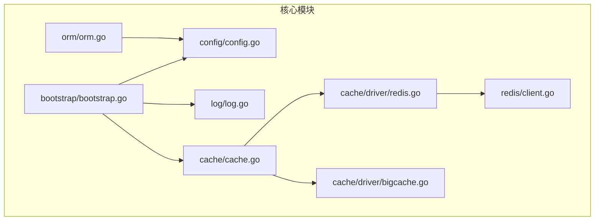
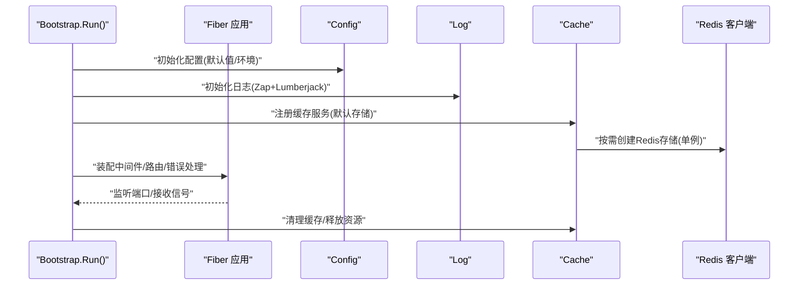
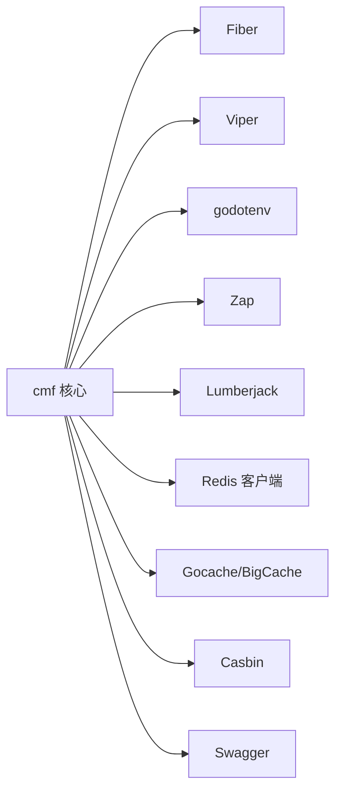

# 部署与运维

<cite>
**本文引用的文件**
- [README.md](file://README.md)
- [go.mod](file://go.mod)
- [config/config.go](file://config/config.go)
- [bootstrap/bootstrap.go](file://bootstrap/bootstrap.go)
- [log/log.go](file://log/log.go)
- [cache/cache.go](file://cache/cache.go)
- [cache/driver/redis.go](file://cache/driver/redis.go)
- [cache/driver/bigcache.go](file://cache/driver/bigcache.go)
- [redis/client.go](file://redis/client.go)
- [orm/orm.go](file://orm/orm.go)
</cite>

## 目录
1. [简介](#简介)
2. [项目结构](#项目结构)
3. [核心组件](#核心组件)
4. [架构总览](#架构总览)
5. [详细组件分析](#详细组件分析)
6. [依赖分析](#依赖分析)
7. [性能考虑](#性能考虑)
8. [故障排查指南](#故障排查指南)
9. [结论](#结论)
10. [附录](#附录)

## 简介
本指南面向使用 CMF 框架的开发者与运维人员，围绕“多环境部署策略、配置管理最佳实践、性能优化、监控与告警、容器化与编排、安全加固、备份与灾备”等方面，结合代码库中的实际实现，给出可落地的部署与运维方案。CMF 框架采用模块化设计，核心能力包括配置管理、缓存、数据库、文件系统、日志、Redis 客户端、ORM 辅助、以及基于 Fiber 的 Web 服务引导。

## 项目结构
CMF 仓库采用按功能域分层的模块化组织方式，关键目录与职责如下：
- bootstrap：应用引导、中间件与路由装配、优雅停机
- config：统一配置模型与默认值、环境变量与 .env 文件加载
- log：基于 Zap 的结构化日志初始化与输出策略
- cache：缓存抽象与多存储后端（内存 BigCache、Redis）
- redis：Redis 客户端封装与连接池配置
- orm：数据库连接 DSN 生成与表前缀辅助
- 其他：jwt、casbin、filesystem、storage/local、validate、http 等

图表来源
- [bootstrap/bootstrap.go:155-215](file://bootstrap/bootstrap.go#L155-L215)
- [config/config.go:102-220](file://config/config.go#L102-L220)
- [log/log.go:14-84](file://log/log.go#L14-L84)
- [cache/cache.go:23-55](file://cache/cache.go#L23-L55)
- [cache/driver/redis.go:13-24](file://cache/driver/redis.go#L13-L24)
- [cache/driver/bigcache.go:13-20](file://cache/driver/bigcache.go#L13-L20)
- [redis/client.go:56-118](file://redis/client.go#L56-L118)
- [orm/orm.go:18-57](file://orm/orm.go#L18-L57)

章节来源
- [README.md:55-75](file://README.md#L55-L75)
- [go.mod:1-26](file://go.mod#L1-L26)

## 核心组件
- 配置管理：支持 .env 与多环境文件、Viper 默认值、结构化解析、运行时写回配置
- 引导与服务容器：Bootstrap 提供服务注册、中间件与路由装配、优雅停机
- 日志：Zap JSON 输出、Lumberjack 文件轮转、可配置控制台与文件输出
- 缓存：抽象 Cache[T]，支持内存 BigCache 与 Redis 后端，类型安全 TypedCache
- Redis：连接池、超时、TLS、单例客户端
- ORM：根据配置生成数据库 DSN，支持多连接与表前缀

章节来源
- [config/config.go:102-220](file://config/config.go#L102-L220)
- [bootstrap/bootstrap.go:37-141](file://bootstrap/bootstrap.go#L37-L141)
- [log/log.go:14-84](file://log/log.go#L14-L84)
- [cache/cache.go:15-144](file://cache/cache.go#L15-L144)
- [redis/client.go:14-118](file://redis/client.go#L14-L118)
- [orm/orm.go:10-63](file://orm/orm.go#L10-L63)

## 架构总览
下图展示了应用启动流程与关键组件交互：

图表来源
- [bootstrap/bootstrap.go:155-215](file://bootstrap/bootstrap.go#L155-L215)
- [bootstrap/bootstrap.go:228-242](file://bootstrap/bootstrap.go#L228-L242)
- [log/log.go:79-84](file://log/log.go#L79-L84)
- [cache/cache.go:23-55](file://cache/cache.go#L23-L55)
- [redis/client.go:56-118](file://redis/client.go#L56-L118)

## 详细组件分析

### 配置管理与多环境部署
- 环境文件加载顺序：优先加载通用 .env；再按 CMF_APP_ENV 加载 .env.development 或 .env.production
- 默认值覆盖：通过 Viper SetDefault 为应用、缓存、Redis、日志、数据库、文件系统、Casbin 等模块设置合理默认值
- 结构化解析：Config 结构体映射 viper 配置，支持嵌套字段与多连接配置
- 运行时写回：SaveConfig 支持按 section/key 写回配置文件，便于动态调整（注意仅写回持久化配置）

多环境部署建议
- 开发环境：CMF_APP_ENV=development，启用 Debug、Swagger，日志输出到控制台与文件，Redis/DB 使用本地或容器内服务
- 测试环境：CMF_APP_ENV=staging，禁用 Debug，开启文件日志轮转，数据库与缓存指向测试集群
- 生产环境：CMF_APP_ENV=production，严格最小权限，禁用 Debug/Swagger，启用 TLS，集中化日志与监控

章节来源
- [config/config.go:204-212](file://config/config.go#L204-L212)
- [config/config.go:131-202](file://config/config.go#L131-L202)
- [config/config.go:246-287](file://config/config.go#L246-L287)
- [README.md:77-80](file://README.md#L77-L80)

### 日志与监控指标
- 日志初始化：支持开发/生产两种配置，控制台与文件双输出，Lumberjack 轮转策略
- 监控指标：框架未内置指标导出，可在业务侧集成 Prometheus 客户端，结合 Fiber 中间件统计请求耗时、QPS、错误码分布

章节来源
- [log/log.go:14-84](file://log/log.go#L14-L84)
- [bootstrap/bootstrap.go:189-193](file://bootstrap/bootstrap.go#L189-L193)

### 缓存与性能优化
- 缓存抽象：Cache[T] 提供统一接口，支持 Store 切换与 TypedCache 类型安全
- 后端选择：内存 BigCache 适合低延迟、高吞吐场景；Redis 适合分布式共享与持久化
- 连接池与 TTL：Redis 客户端支持连接池大小、空闲连接、生命周期与超时；缓存默认 TTL 可配置

章节来源
- [cache/cache.go:15-144](file://cache/cache.go#L15-L144)
- [cache/driver/redis.go:13-24](file://cache/driver/redis.go#L13-L24)
- [cache/driver/bigcache.go:13-20](file://cache/driver/bigcache.go#L13-L20)
- [redis/client.go:56-118](file://redis/client.go#L56-L118)

### 数据库与连接管理
- DSN 生成：根据 driver 自动生成 DSN，支持 mysql/postgres/sqlite3
- 多连接：通过连接名选择数据库，未命中时回退首个可用连接
- 表前缀：统一表前缀，便于多租户隔离

章节来源
- [orm/orm.go:18-63](file://orm/orm.go#L18-L63)

### 引导与优雅停机
- 中间件：recover、logger、requestid
- 错误处理：自定义错误页面模板（状态码.html），便于运维定位
- 优雅停机：监听 SIGTERM，执行清理函数，确保资源释放

章节来源
- [bootstrap/bootstrap.go:166-193](file://bootstrap/bootstrap.go#L166-L193)
- [bootstrap/bootstrap.go:155-215](file://bootstrap/bootstrap.go#L155-L215)
- [bootstrap/bootstrap.go:248-256](file://bootstrap/bootstrap.go#L248-L256)

## 依赖分析
- 外部依赖：Fiber、Viper、godotenv、Zap、Lumberjack、Redis 客户端、Gocache、BigCache、Casbin、Swagger 等
- 版本与兼容性：Go 1.25+，各模块版本在 go.mod 中声明

图表来源
- [go.mod:5-26](file://go.mod#L5-L26)

章节来源
- [go.mod:1-103](file://go.mod#L1-L103)

## 性能考虑
- 应用层
  - 启用合适的 IdleTimeout，避免长连接占用资源
  - 在开发环境开启 Swagger 便于联调，生产禁用
- 缓存层
  - 优先使用内存缓存提升热点数据访问速度；跨节点共享使用 Redis
  - 合理设置连接池大小、空闲连接与生命周期，避免连接抖动
- 数据库层
  - 使用连接池与 DSN 参数优化；根据业务选择合适驱动
  - 表前缀配合多租户隔离，减少跨租户干扰
- 日志层
  - 生产环境建议仅文件输出或集中化采集，避免控制台输出带来的额外开销

章节来源
- [bootstrap/bootstrap.go:166-168](file://bootstrap/bootstrap.go#L166-L168)
- [config/config.go:131-202](file://config/config.go#L131-L202)
- [redis/client.go:56-118](file://redis/client.go#L56-L118)
- [orm/orm.go:18-34](file://orm/orm.go#L18-L34)
- [log/log.go:48-64](file://log/log.go#L48-L64)

## 故障排查指南
- 启动失败
  - 检查 .env 与 CMF_APP_ENV 对应的环境文件是否存在与语法正确
  - 查看日志初始化是否成功，确认控制台/文件输出开关
- 缓存异常
  - 确认缓存驱动与默认 TTL 配置；切换 Store 时检查对应后端连通性
- Redis 连接问题
  - 校验连接参数（地址、用户名、密码、DB、超时、TLS）；查看连接池状态
- 数据库连接问题
  - 校验 DSN 生成逻辑与驱动参数；确认连接名与默认连接映射
- 优雅停机
  - 观察清理函数执行日志，排查资源释放阻塞

章节来源
- [config/config.go:204-212](file://config/config.go#L204-L212)
- [log/log.go:79-84](file://log/log.go#L79-L84)
- [cache/cache.go:57-93](file://cache/cache.go#L57-L93)
- [redis/client.go:56-118](file://redis/client.go#L56-L118)
- [orm/orm.go:18-57](file://orm/orm.go#L18-L57)
- [bootstrap/bootstrap.go:204-214](file://bootstrap/bootstrap.go#L204-L214)

## 结论
通过统一的配置中心、模块化的缓存与数据库抽象、完善的日志与引导机制，CMF 框架为多环境部署与运维提供了坚实基础。结合本文的多环境策略、性能优化建议与故障排查清单，可快速搭建稳定、可观测、可扩展的生产级运行体系。

## 附录

### Docker 容器化部署要点
- 基础镜像：使用官方 Go 镜像构建，再复制二进制至精简镜像
- 环境变量：通过 CMF_APP_ENV 切换开发/测试/生产；其他参数由 .env 或环境变量注入
- 健康检查：暴露 HTTP 健康端点（如 /health），结合容器健康检查探针
- 日志：将日志输出到 stdout/stderr 并由容器编排系统收集；同时可保留文件轮转
- 缓存与数据库：通过网络或卷挂载连接 Redis 与数据库

[本节为概念性指导，不直接分析具体源码文件]

### Kubernetes 部署配置要点
- Deployment：副本数、滚动更新策略、资源限制与请求
- Service：ClusterIP/NodePort/LB，暴露端口与健康检查端口
- ConfigMap/Secret：注入 .env 与敏感配置；避免硬编码
- PersistentVolume：挂载日志与存储目录（如需要）
- HPA：基于 CPU/自定义指标弹性扩缩容

[本节为概念性指导，不直接分析具体源码文件]

### 安全加固建议
- 网络
  - 限制对外暴露端口，仅开放必要端口；使用网络策略隔离
- 配置
  - 将密钥放入 Secret，避免提交到仓库；定期轮换
- 认证与授权
  - 使用 JWT 与 Casbin 实施细粒度权限控制；启用 HTTPS/TLS
- 日志与审计
  - 集中化日志采集与留存；开启审计日志

[本节为概念性指导，不直接分析具体源码文件]

### 备份与灾难恢复
- 数据库备份：定时快照/逻辑备份，验证恢复流程
- 配置备份：.env 与配置文件纳入版本管理或密文存储
- 缓存与文件：Redis 持久化策略；对象存储与本地存储双写（可选）
- DR 计划：跨可用区/多活部署，演练故障切换

[本节为概念性指导，不直接分析具体源码文件]