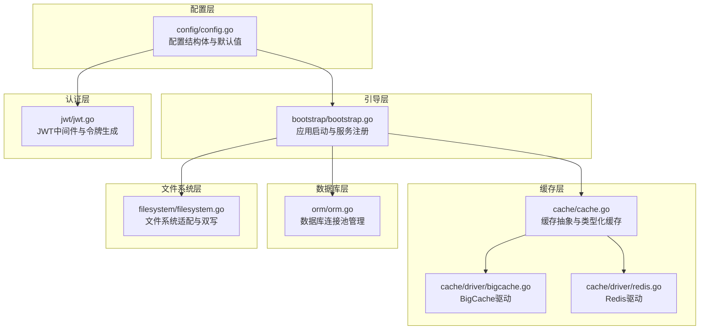
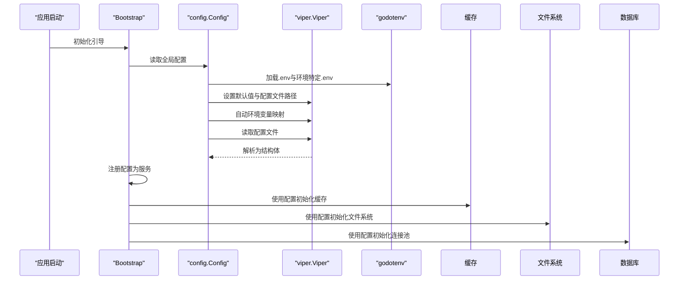
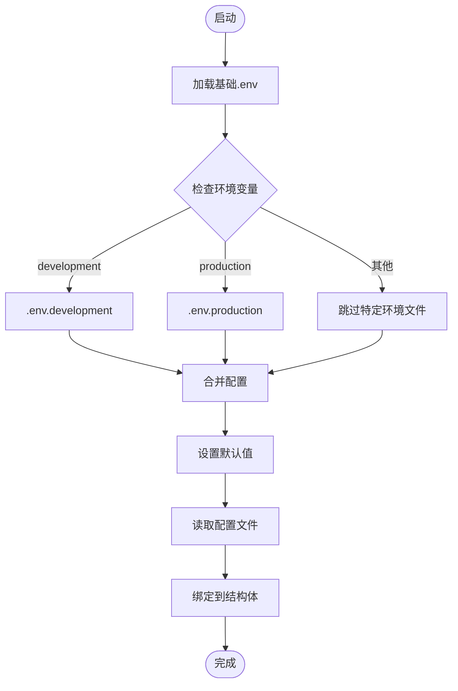
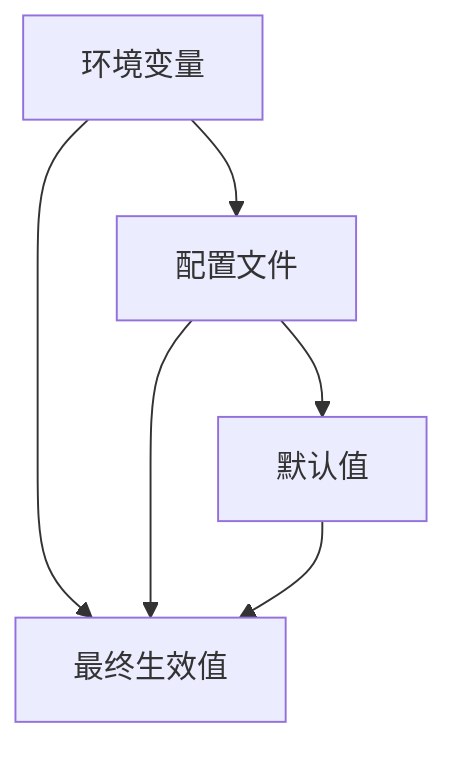
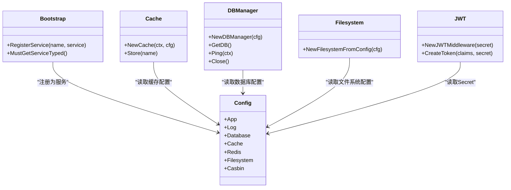
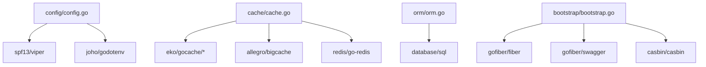

# 配置管理

<cite>
**本文引用的文件**
- [config.go](file://config/config.go)
- [bootstrap.go](file://bootstrap/bootstrap.go)
- [cache.go](file://cache/cache.go)
- [bigcache.go](file://cache/driver/bigcache.go)
- [redis.go](file://cache/driver/redis.go)
- [orm.go](file://orm/orm.go)
- [filesystem.go](file://filesystem/filesystem.go)
- [jwt.go](file://jwt/jwt.go)
- [go.mod](file://go.mod)
- [README.md](file://README.md)
</cite>

## 更新摘要
**变更内容**
- 新增数据库连接池配置参数（最大连接数、空闲连接数、连接生命周期）
- 新增Redis连接池配置参数（最小空闲连接数、最大空闲连接数、连接空闲时间限制）
- 完善缓存配置选项，支持更灵活的缓存驱动配置
- 更新配置默认值和使用示例

## 目录
1. [简介](#简介)
2. [项目结构](#项目结构)
3. [核心组件](#核心组件)
4. [架构总览](#架构总览)
5. [详细组件分析](#详细组件分析)
6. [依赖分析](#依赖分析)
7. [性能考虑](#性能考虑)
8. [故障排查指南](#故障排查指南)
9. [结论](#结论)
10. [附录](#附录)

## 简介
本文件面向开发者与运维人员，系统化阐述 CMF 配置管理系统的架构设计与使用方法。重点覆盖以下方面：
- 多环境配置支持与环境变量处理
- 配置文件格式（YAML、ENV）与加载顺序
- 关键配置项与默认值说明（应用、数据库、缓存、Redis、日志、文件系统、Casbin 等）
- 配置热更新机制与最佳实践
- 在不同环境中管理配置参数的方法

## 项目结构
CMF 的配置管理围绕 config 包展开，并通过 Bootstrap 在应用启动时统一注入到各子系统中；缓存、文件系统、JWT 等模块均以配置为驱动。

**图表来源**
- [config.go:37-97](file://config/config.go#L37-L97)
- [bootstrap.go:47-66](file://bootstrap/bootstrap.go#L47-L66)
- [cache.go:24-55](file://cache/cache.go#L24-L55)
- [bigcache.go:13-20](file://cache/driver/bigcache.go#L13-L20)
- [redis.go:13-24](file://cache/driver/redis.go#L13-L24)
- [orm.go:16-50](file://orm/orm.go#L16-L50)
- [filesystem.go:157-190](file://filesystem/filesystem.go#L157-L190)
- [jwt.go:9-13](file://jwt/jwt.go#L9-L13)

**章节来源**
- [README.md:55-75](file://README.md#L55-L75)
- [config.go:102-121](file://config/config.go#L102-L121)
- [bootstrap.go:47-66](file://bootstrap/bootstrap.go#L47-L66)

## 核心组件
- 配置结构体与默认值：集中定义应用、数据库、缓存、Redis、日志、文件系统、Casbin 等配置段，并在初始化阶段设置默认值。
- Viper 集成：通过 Viper 支持 YAML 配置文件与 ENV 环境变量，自动环境变量映射与默认值合并。
- 环境变量加载：根据环境变量选择性加载 .env、.env.development、.env.production。
- 配置持久化：提供保存配置到配置文件的能力，便于运行时修改与持久化。
- 引导与注入：Bootstrap 在启动时将配置作为服务注入缓存、文件系统、数据库等模块。

**章节来源**
- [config.go:37-97](file://config/config.go#L37-L97)
- [config.go:131-202](file://config/config.go#L131-L202)
- [config.go:204-212](file://config/config.go#L204-L212)
- [config.go:246-287](file://config/config.go#L246-L287)
- [bootstrap.go:54-66](file://bootstrap/bootstrap.go#L54-L66)

## 架构总览
配置系统采用"默认值 + 文件 + 环境变量"的分层加载策略，最终通过结构化解析绑定到全局配置对象，供各模块读取。

**图表来源**
- [bootstrap.go:54-66](file://bootstrap/bootstrap.go#L54-L66)
- [config.go:102-121](file://config/config.go#L102-L121)
- [config.go:204-212](file://config/config.go#L204-L212)
- [config.go:131-202](file://config/config.go#L131-L202)

## 详细组件分析

### 配置结构与默认值
配置结构体按功能划分为多个嵌套结构，涵盖应用、日志、数据库、缓存、Redis、文件系统、Casbin 等。默认值在初始化阶段集中设置，确保最小可用配置。

- 应用配置（App）
  - 名称、端口、调试模式、空闲超时、预取 fork、Swagger 文档开关、密钥、登录与刷新过期时间等。
- 日志配置（Log）
  - 输出到控制台与文件、日志文件路径、单文件最大大小、备份数量、保留天数等。
- 数据库配置（Database）
  - 默认连接名、连接集合（驱动、主机、端口、用户、密码、库名、SSL 模式、表前缀、连接池参数）。
- 缓存配置（Cache）
  - 默认存储、存储集合（驱动、默认 TTL、选项），内置 memory 与 redis 两种存储。
- Redis 配置（Redis）
  - 默认连接名、连接集合（地址、用户名、密码、DB、超时、连接池、TLS 等）。
- 文件系统配置（Filesystem）
  - 默认磁盘、是否同时本地存储、磁盘集合（驱动、选项），内置 local 与 s3。
- Casbin 配置（Casbin）
  - 默认域与域列表（名称、自动加载、模型路径/文本）。

默认值设置集中在初始化流程中，确保在未提供配置时仍能正常运行。

**章节来源**
- [config.go:37-97](file://config/config.go#L37-L97)
- [config.go:131-202](file://config/config.go#L131-L202)

### 数据库连接池配置
**更新** 新增数据库连接池配置参数，提供更精细的连接管理能力。

数据库连接池配置包含以下关键参数：

- MaxOpenConns：最大打开连接数，默认 25
- MaxIdleConns：最大空闲连接数，默认 10  
- ConnMaxLifetime：连接最大生命周期（秒），默认 3600
- ConnMaxIdleTime：连接最大空闲时间（秒），默认 600

这些参数直接影响数据库连接的生命周期管理和资源消耗，需要根据业务负载和数据库性能进行调优。

**章节来源**
- [config.go:26-39](file://config/config.go#L26-L39)
- [config.go:179-191](file://config/config.go#L179-L191)
- [orm.go:32-44](file://orm/orm.go#L32-L44)

### Redis 连接池配置
**更新** 新增 Redis 连接池配置参数，支持更精细的连接管理。

Redis 连接池配置包含以下关键参数：

- PoolSize：连接池大小，默认 10
- MinIdleConns：最小空闲连接数，默认 5
- MaxIdleConns：最大空闲连接数，默认 10
- ConnMaxIdleTime：连接最大空闲时间（分钟），默认 30
- ConnMaxLifetime：连接最大生命周期（小时），默认 24

这些参数允许开发者根据应用的并发需求和 Redis 服务器性能进行精细化配置，避免连接池过大导致资源浪费或过小导致连接竞争。

**章节来源**
- [config.go:10-24](file://config/config.go#L10-L24)
- [config.go:155-169](file://config/config.go#L155-L169)

### 缓存配置选项
**更新** 缓存配置结构更加完善，支持更灵活的缓存驱动配置。

缓存配置包含以下结构：

- Default：默认缓存存储，默认 "memory"
- Stores：缓存存储集合，包含：
  - memory 驱动：默认 TTL 3600 秒
  - redis 驱动：默认 TTL 3600 秒
  - Options：缓存驱动特定选项

这种设计允许应用在同一系统中使用多种缓存后端，并为每种存储类型配置独立的参数。

**章节来源**
- [config.go:70-78](file://config/config.go#L70-L78)
- [config.go:148-153](file://config/config.go#L148-L153)

### 环境变量与多环境支持
- 环境变量前缀：配置使用统一前缀，便于区分与隔离。
- 配置文件路径：默认从 ./config 目录读取名为 config 的配置文件。
- 环境文件加载：根据环境变量选择加载 .env、.env.development 或 .env.production。
- 自动环境变量映射：启用 AutomaticEnv 后，环境变量会自动映射到配置键。

**图表来源**
- [config.go:204-212](file://config/config.go#L204-L212)
- [config.go:114-121](file://config/config.go#L114-L121)
- [config.go:131-202](file://config/config.go#L131-L202)

**章节来源**
- [config.go:114-121](file://config/config.go#L114-L121)
- [config.go:204-212](file://config/config.go#L204-L212)

### 配置加载顺序与优先级机制
- 环境变量优先：当存在同名环境变量时，其值将覆盖默认值与配置文件中的值。
- 配置文件次之：在未提供环境变量的情况下，使用配置文件中的值。
- 默认值兜底：若两者均未提供，则使用初始化阶段设置的默认值。
- 优先级总结：环境变量 > 配置文件 > 默认值。

**图表来源**
- [config.go:123-129](file://config/config.go#L123-L129)
- [config.go:131-202](file://config/config.go#L131-L202)

**章节来源**
- [config.go:123-129](file://config/config.go#L123-L129)
- [config.go:131-202](file://config/config.go#L131-L202)

### 配置热更新机制与最佳实践
- 运行时保存：提供保存配置到配置文件的能力，适合在运行时调整参数并持久化。
- 注意事项：
  - 仅对支持持久化的配置项进行热更新。
  - 对于影响连接池、缓存、数据库等底层资源的配置，建议重启服务以避免状态不一致。
  - 对于日志级别、Swagger 开关等非关键配置，可在运行时安全更新。
- 最佳实践：
  - 将敏感参数全部放入环境变量，避免提交到版本控制。
  - 使用环境文件区分开发与生产环境，减少误配置风险。
  - 对关键配置（如数据库、Redis、JWT 密钥）建立变更审批流程。

**章节来源**
- [config.go:246-287](file://config/config.go#L246-L287)

### 关键配置项与默认值说明
以下为常用配置项与默认值概览（来源于默认值设置逻辑）：

- 应用（App）
  - 名称：默认值
  - 端口：3000
  - 调试：false
  - 空闲超时：60 秒
  - 预取 fork：false
  - Swagger：false
  - Secret：secret
  - 登录过期：24 小时
  - 刷新过期：7 天
- 缓存（Cache）
  - 默认存储：memory
  - memory 驱动：默认 TTL 3600 秒
  - redis 驱动：默认 TTL 3600 秒
- Redis（Redis）
  - 默认连接：redis
  - 地址：localhost:6379
  - 用户名/密码：空
  - DB：0
  - Dial/Read/Write 超时：5/3/3 秒
  - 连接池：PoolSize=10，最小空闲=5，最大空闲=10
  - 连接最大空闲时间：30 分钟
  - 连接最大生命周期：24 小时
  - TLS：false
- 日志（Log）
  - 控制台输出：true
  - 文件输出：true
  - 单文件最大大小：10MB
  - 备份数量：10
  - 保留天数：180
  - 文件路径：./data/logs/app.log
- 数据库（Database）
  - 默认连接：default
  - 驱动：mysql
  - 主机：localhost
  - 端口：3306
  - 用户：root
  - 密码：123456
  - 库名：cmf
  - SSL 模式：false
  - 表前缀：cmf_
  - 最大打开连接数：25
  - 最大空闲连接数：10
  - 连接最大生命周期：3600 秒
  - 连接最大空闲时间：600 秒
- 文件系统（Filesystem）
  - 默认磁盘：local
  - 是否同时本地存储：false
  - local 磁盘：options.root=./data/storage
  - s3 磁盘：access_key/secret_key/region/bucket/endpoint 均为空
- Casbin（Casbin）
  - 默认域：default
  - domains_default：default
  - 默认域：name=default，auto_load=true，model_path=./config/rbac_model.conf

**章节来源**
- [config.go:131-202](file://config/config.go#L131-L202)

### 配置在各模块中的使用
- Bootstrap 注入：启动时将全局配置注册为服务，供缓存、文件系统、数据库等模块使用。
- 缓存模块：根据默认存储与 TTL 初始化 BigCache 或 Redis 缓存。
- 文件系统模块：根据默认磁盘与是否双写策略创建适配器。
- 数据库模块：根据连接池参数配置 sql.DB 连接池。
- JWT 模块：使用配置中的 Secret 生成与校验令牌。

**图表来源**
- [config.go:37-97](file://config/config.go#L37-L97)
- [bootstrap.go:54-66](file://bootstrap/bootstrap.go#L54-L66)
- [cache.go:24-55](file://cache/cache.go#L24-L55)
- [orm.go:22-50](file://orm/orm.go#L22-L50)
- [filesystem.go:157-190](file://filesystem/filesystem.go#L157-L190)
- [jwt.go:9-13](file://jwt/jwt.go#L9-L13)

**章节来源**
- [bootstrap.go:54-66](file://bootstrap/bootstrap.go#L54-L66)
- [cache.go:24-55](file://cache/cache.go#L24-L55)
- [orm.go:22-50](file://orm/orm.go#L22-L50)
- [filesystem.go:157-190](file://filesystem/filesystem.go#L157-L190)
- [jwt.go:9-13](file://jwt/jwt.go#L9-L13)

## 依赖分析
配置系统依赖的关键库与版本范围如下：
- viper：配置解析与环境变量映射
- godotenv：加载 .env 文件
- gocache 及其存储实现：缓存抽象与 BigCache/Redis 驱动
- gofiber 组件：Web 框架与 Swagger
- casbin：RBAC 权限控制
- redis/go-redis：Redis 客户端
- database/sql：数据库连接池管理

**图表来源**
- [go.mod:5-26](file://go.mod#L5-L26)
- [config.go:3-8](file://config/config.go#L3-L8)
- [cache.go:3-13](file://cache/cache.go#L3-L13)
- [bootstrap.go:13-23](file://bootstrap/bootstrap.go#L13-L23)
- [orm.go:3-11](file://orm/orm.go#L3-L11)

**章节来源**
- [go.mod:5-26](file://go.mod#L5-L26)

## 性能考虑
- 缓存默认 TTL 与连接池：合理设置缓存 TTL 与 Redis 连接池大小，避免频繁重建连接与内存浪费。
- 日志滚动策略：通过单文件大小、备份数量与保留天数平衡磁盘占用与日志保留。
- 数据库连接：根据业务并发与延迟要求调整连接池参数，避免连接不足或过度占用。
- 文件系统双写：在需要高可靠性的场景启用双写，但需权衡写放大与成本。
- 连接池优化：数据库和 Redis 连接池参数需要根据实际负载进行调优，避免资源浪费或连接瓶颈。

## 故障排查指南
- 配置未生效
  - 检查环境变量前缀与键名是否正确。
  - 确认配置文件路径与文件名是否符合约定。
  - 验证环境文件是否被正确加载。
- 缓存异常
  - 检查默认存储与 TTL 设置。
  - 核对 Redis 连接参数与网络连通性。
- 数据库连接问题
  - 检查连接池参数配置是否合理。
  - 验证数据库服务可达性和凭据正确性。
  - 监控连接数使用情况，避免连接池耗尽。
- 文件系统异常
  - 校验默认磁盘与 options 配置。
  - 若启用双写，确认主存储与本地存储均可写。
- JWT 相关问题
  - 确认 Secret 与签名算法一致。
  - 检查令牌过期时间与刷新策略。

**章节来源**
- [config.go:204-212](file://config/config.go#L204-L212)
- [cache.go:24-55](file://cache/cache.go#L24-L55)
- [orm.go:32-44](file://orm/orm.go#L32-L44)
- [filesystem.go:157-190](file://filesystem/filesystem.go#L157-L190)
- [jwt.go:9-13](file://jwt/jwt.go#L9-L13)

## 结论
CMF 的配置管理以 Viper 为核心，结合默认值、配置文件与环境变量，形成清晰的加载与优先级机制。通过 Bootstrap 将配置注入到缓存、文件系统、数据库、JWT 等模块，实现了模块间的解耦与统一管理。新增的数据库和 Redis 连接池配置参数提供了更精细的资源管理能力，建议在实际使用中遵循环境隔离、最小暴露与变更审批的最佳实践，确保配置的安全与稳定。

## 附录
- 配置项清单与默认值详见"关键配置项与默认值说明"。
- 多环境配置与加载顺序详见"环境变量与多环境支持"与"配置加载顺序与优先级机制"。
- 连接池参数调优建议：
  - 数据库连接池：MaxOpenConns 建议设置为 CPU 核心数的 2-4 倍
  - Redis 连接池：PoolSize 建议根据并发需求设置，通常 10-50 之间
  - TTL 设置：根据数据访问模式设置合适的过期时间，避免内存泄漏