# 项目概述

<cite>
**本文引用的文件**
- [README.md](file://README.md)
- [go.mod](file://go.mod)
- [bootstrap/bootstrap.go](file://bootstrap/bootstrap.go)
- [config/config.go](file://config/config.go)
- [cache/cache.go](file://cache/cache.go)
- [cache/driver/bigcache.go](file://cache/driver/bigcache.go)
- [cache/driver/redis.go](file://cache/driver/redis.go)
- [filesystem/filesystem.go](file://filesystem/filesystem.go)
- [jwt/jwt.go](file://jwt/jwt.go)
- [casbin/casbin.go](file://casbin/casbin.go)
- [log/log.go](file://log/log.go)
- [validate/validate.go](file://validate/validate.go)
- [crypto/crypto.go](file://crypto/crypto.go)
- [orm/orm.go](file://orm/orm.go)
- [http/ApiResponse.go](file://http/ApiResponse.go)
</cite>

## 目录
1. [简介](#简介)
2. [项目结构](#项目结构)
3. [核心组件](#核心组件)
4. [架构总览](#架构总览)
5. [详细组件分析](#详细组件分析)
6. [依赖分析](#依赖分析)
7. [性能考虑](#性能考虑)
8. [故障排查指南](#故障排查指南)
9. [结论](#结论)
10. [附录](#附录)

## 简介
CMF Core 是一个面向企业级应用的模块化 Web 应用框架核心，专注于提供高可扩展、易维护的基础设施能力。它以模块化设计为核心理念，围绕依赖注入、中间件模式、单例服务等关键机制组织功能模块，覆盖配置管理、缓存、数据库、文件系统、JWT 认证、RBAC 权限控制、日志、数据验证、加解密与 ORM 等领域。

技术栈选择上，CMF Core 采用 Go 1.25+ 作为运行时，结合高性能 Web 框架 Fiber v2、配置管理 Viper、日志系统 Zap、数据库驱动 database/sql、缓存 BigCache/Redis、JWT 与 Casbin 等成熟生态，兼顾性能与工程化实践。

在企业级应用开发中，CMF Core 提供了统一的启动引导流程、灵活的配置体系、可插拔的中间件与服务容器，以及标准化的响应封装与错误处理，帮助团队快速搭建稳定可靠的业务系统。

章节来源
- [README.md:1-80](file://README.md#L1-L80)
- [go.mod:1-103](file://go.mod#L1-L103)

## 项目结构
仓库采用按功能域划分的模块化目录结构，核心模块包括：
- bootstrap：应用启动引导与服务容器
- config：配置管理与环境变量加载
- cache：缓存抽象与多存储驱动
- filesystem：文件系统抽象与本地/S3 存储
- jwt：JWT 认证中间件与令牌工具
- casbin：RBAC 授权与策略管理
- log：日志初始化与输出配置
- validate：参数验证与错误消息处理
- crypto：密码哈希与校验
- orm：数据库连接与 DSN 生成
- http：统一 API 响应封装
- redis：Redis 客户端封装
- data/logs、data/storage：运行时数据目录

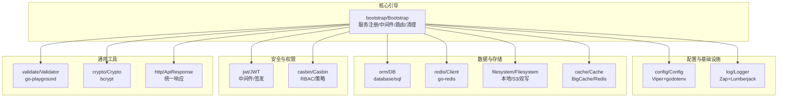

图表来源
- [bootstrap/bootstrap.go:37-66](file://bootstrap/bootstrap.go#L37-L66)
- [config/config.go:37-97](file://config/config.go#L37-L97)
- [cache/cache.go:15-55](file://cache/cache.go#L15-L55)
- [filesystem/filesystem.go:62-86](file://filesystem/filesystem.go#L62-L86)
- [jwt/jwt.go:9-13](file://jwt/jwt.go#L9-L13)
- [casbin/casbin.go:12-31](file://casbin/casbin.go#L12-L31)
- [log/log.go:14-84](file://log/log.go#L14-L84)
- [validate/validate.go:10-58](file://validate/validate.go#L10-L58)
- [crypto/crypto.go:10-80](file://crypto/crypto.go#L10-L80)
- [orm/orm.go:10-63](file://orm/orm.go#L10-L63)
- [http/ApiResponse.go:7-44](file://http/ApiResponse.go#L7-L44)

章节来源
- [README.md:55-79](file://README.md#L55-L79)

## 核心组件
本节聚焦于框架的核心能力与设计理念，帮助初学者快速建立整体认知，同时为资深开发者提供深入的技术要点。

- 启动引导与服务容器
  - Bootstrap 负责应用初始化、中间件装载、路由注册、优雅关闭与清理任务执行；内置服务注册表（单例），支持类型安全获取与泛型辅助。
  - 关键点：并发安全的 sync.Map、类型安全的 MustGetServiceTyped、中间件与路由的延迟注册、错误页渲染与信号监听。

- 配置管理
  - 基于 Viper 与 godotenv，支持 .env 与 YAML 多格式配置，提供默认值、环境变量前缀、自动加载与动态写回能力。
  - 关键点：结构化配置结构体、默认值集中初始化、按需读取与保存配置。

- 缓存抽象
  - 统一 Cache 抽象，支持内存 BigCache 与 Redis 两种存储驱动，TypedCache 提供类型安全的 JSON 序列化/反序列化。
  - 关键点：按存储名称切换 Store、共享 sync.Map 缓存实例、默认 TTL 来源于配置。

- 文件系统抽象
  - 支持本地与 S3 存储，提供双写适配器 DualStorage，确保可靠性与一致性；磁盘驱动单例避免重复创建。
  - 关键点：NewStorageDriver 单例、NewFilesystemFromConfig 组合适配器、IsAndLocal 开关。

- JWT 认证
  - 基于 gofiber/jwt 中间件与 golang-jwt，提供中间件创建、令牌签发与用户 Claims 获取。
  - 关键点：签名密钥配置、HS256 签名算法、中间件注入顺序。

- RBAC 授权
  - 基于 Casbin，支持模型文件路径与模型文本两种方式，支持多域与自动加载。
  - 关键点：EnforcerManager 管理多域、中间件集成、策略适配器注入。

- 日志系统
  - 基于 Zap 与 Lumberjack，支持控制台与文件输出、滚动切割、JSON 编码与 Fiber 集成。
  - 关键点：InitDefaultLogger 默认配置、开发/生产配置切换、输出目标聚合。

- 数据验证
  - 基于 go-playground/validator，支持自定义错误消息映射与结构体实现接口。
  - 关键点：GetValidatorErrorMsg 统一错误拼接、接口化消息映射。

- 加解密
  - 基于 bcrypt 与随机盐值，提供密码哈希与校验能力。
  - 关键点：HashPassword/VerifyPassword 统一接口、成本参数可配置。

- ORM 与数据库
  - 基于 database/sql，提供 DSN 生成与连接配置解析，支持 mysql/postgres/sqlite3。
  - 关键点：GetDatabaseSourceDns 生成连接串、表前缀提取。

- HTTP 响应封装
  - 统一 ApiResponse 结构，提供 Result/Success/Error 三类响应方法。
  - 关键点：状态码与消息封装、JSON 输出。

章节来源
- [bootstrap/bootstrap.go:37-147](file://bootstrap/bootstrap.go#L37-L147)
- [config/config.go:37-220](file://config/config.go#L37-L220)
- [cache/cache.go:15-144](file://cache/cache.go#L15-L144)
- [filesystem/filesystem.go:62-191](file://filesystem/filesystem.go#L62-L191)
- [jwt/jwt.go:9-25](file://jwt/jwt.go#L9-L25)
- [casbin/casbin.go:12-79](file://casbin/casbin.go#L12-L79)
- [log/log.go:14-84](file://log/log.go#L14-L84)
- [validate/validate.go:10-58](file://validate/validate.go#L10-L58)
- [crypto/crypto.go:10-80](file://crypto/crypto.go#L10-L80)
- [orm/orm.go:10-63](file://orm/orm.go#L10-L63)
- [http/ApiResponse.go:7-44](file://http/ApiResponse.go#L7-L44)

## 架构总览
CMF Core 的架构以“启动引导 + 服务容器 + 中间件 + 模块化功能”为主线，形成清晰的控制流与数据流。

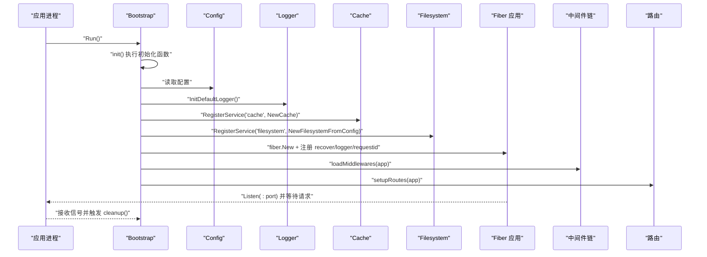

图表来源
- [bootstrap/bootstrap.go:155-278](file://bootstrap/bootstrap.go#L155-L278)
- [config/config.go:102-220](file://config/config.go#L102-L220)
- [log/log.go:80-84](file://log/log.go#L80-L84)
- [cache/cache.go:24-55](file://cache/cache.go#L24-L55)
- [filesystem/filesystem.go:157-191](file://filesystem/filesystem.go#L157-L191)

## 详细组件分析

### 启动引导与服务容器
- 设计要点
  - 服务注册：RegisterService(name, service)，单例模式，线程安全。
  - 类型安全：MustGetServiceTyped[T] 提供编译期友好的类型断言。
  - 生命周期：init()/cleanup() 钩子，中间件与路由延迟注册，优雅退出。
- 典型流程
  - 启动时注册 config、cache、filesystem 服务；运行时通过 MustGetServiceTyped 获取强类型依赖。

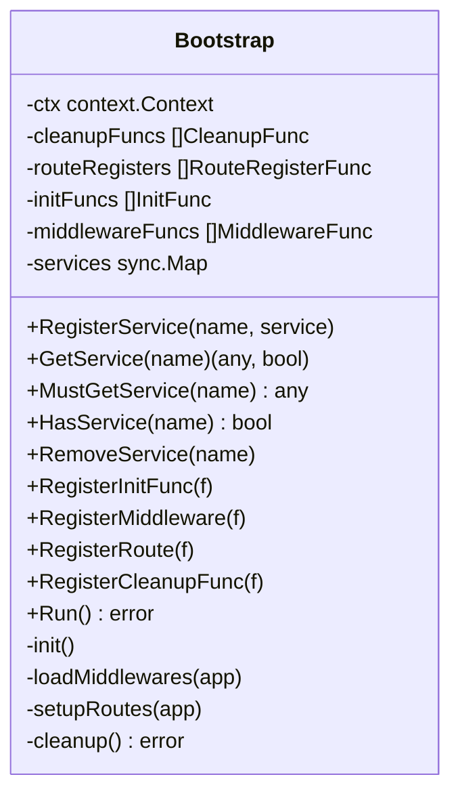

图表来源
- [bootstrap/bootstrap.go:37-147](file://bootstrap/bootstrap.go#L37-L147)

章节来源
- [bootstrap/bootstrap.go:37-147](file://bootstrap/bootstrap.go#L37-L147)

### 配置管理
- 设计要点
  - 多源配置：YAML 文件 + .env 环境变量，支持自动加载与默认值。
  - 结构化模型：App、Log、Database、Cache、Redis、Filesystem、Casbin 等分段配置。
  - 运行时写回：SaveConfig 支持按 section/key 更新并持久化。
- 典型流程
  - initEnv 加载 .env(.development/.production)；NewViperWithOptions 设置前缀与路径；NewConfig 解析为结构体。

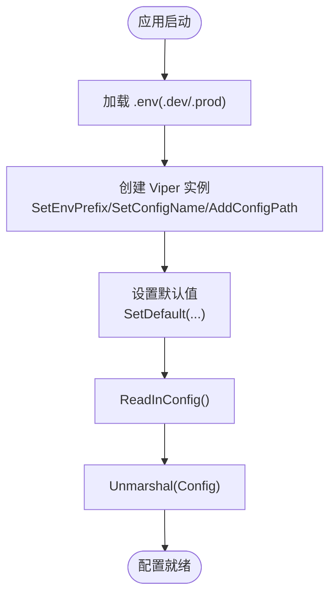

图表来源
- [config/config.go:102-220](file://config/config.go#L102-L220)

章节来源
- [config/config.go:102-220](file://config/config.go#L102-L220)

### 缓存模块
- 设计要点
  - 抽象层：Cache[T] 统一缓存接口；TypedCache[T] 提供类型安全封装。
  - 多驱动：memory(BigCache) 与 redis 驱动，按 store 名称切换。
  - 单例：默认 store 注册为单例，Store(name) 按需创建并缓存。
- 典型流程
  - NewCache 依据配置选择驱动；Store 切换存储；TypedCache 通过 JSON 序列化实现任意类型。

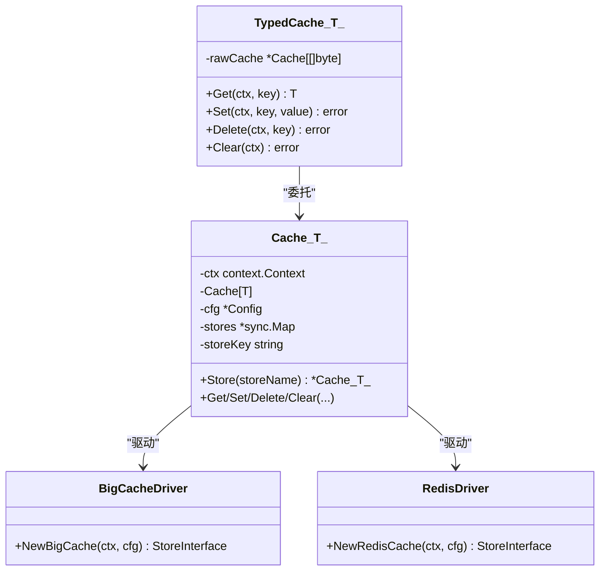

图表来源
- [cache/cache.go:15-144](file://cache/cache.go#L15-L144)
- [cache/driver/bigcache.go:13-21](file://cache/driver/bigcache.go#L13-L21)
- [cache/driver/redis.go:13-25](file://cache/driver/redis.go#L13-L25)

章节来源
- [cache/cache.go:15-144](file://cache/cache.go#L15-L144)
- [cache/driver/bigcache.go:13-21](file://cache/driver/bigcache.go#L13-L21)
- [cache/driver/redis.go:13-25](file://cache/driver/redis.go#L13-L25)

### 文件系统模块
- 设计要点
  - 抽象适配器：storage.Storage 接口屏蔽本地与 S3 差异。
  - 双写适配器：DualStorage 在主存储成功后同步写入本地存储。
  - 单例驱动：driverInstances sync.Map 确保同一磁盘配置仅创建一次实例。
- 典型流程
  - NewStorageDriver 根据配置创建驱动；NewFilesystemFromConfig 组合适配器；IsAndLocal 开启时包装 DualStorage。

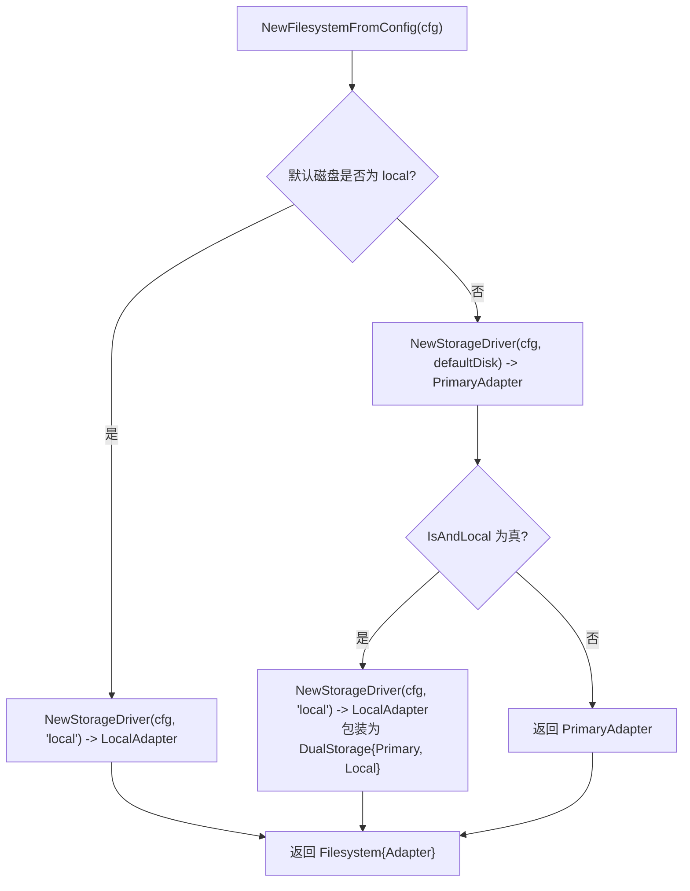

图表来源
- [filesystem/filesystem.go:157-191](file://filesystem/filesystem.go#L157-L191)
- [filesystem/filesystem.go:89-144](file://filesystem/filesystem.go#L89-L144)

章节来源
- [filesystem/filesystem.go:62-191](file://filesystem/filesystem.go#L62-L191)

### JWT 认证
- 设计要点
  - 中间件：NewJWTMiddleware(secret) 注入到 Fiber 中间件链。
  - 令牌：CreateToken 使用 HS256 签发；GetJWTUserData 从上下文提取用户 Claims。
- 典型流程
  - 启动时注册中间件；控制器中通过 c.Locals("user") 获取用户信息。

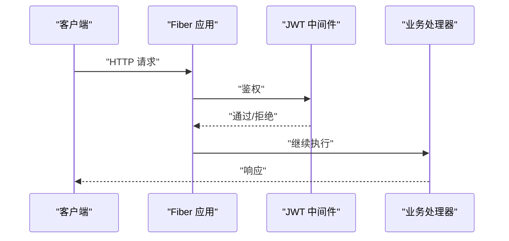

图表来源
- [jwt/jwt.go:9-25](file://jwt/jwt.go#L9-L25)

章节来源
- [jwt/jwt.go:9-25](file://jwt/jwt.go#L9-L25)

### RBAC 授权（Casbin）
- 设计要点
  - 中间件：NewCasbinMiddleware(adapter, modelPath) 集成到 Fiber。
  - 多域：InitEnforcerManager 支持 domains_default 与多域配置，可自动加载。
- 典型流程
  - 启动时根据配置创建 EnforcerManager；中间件按域加载模型与适配器。

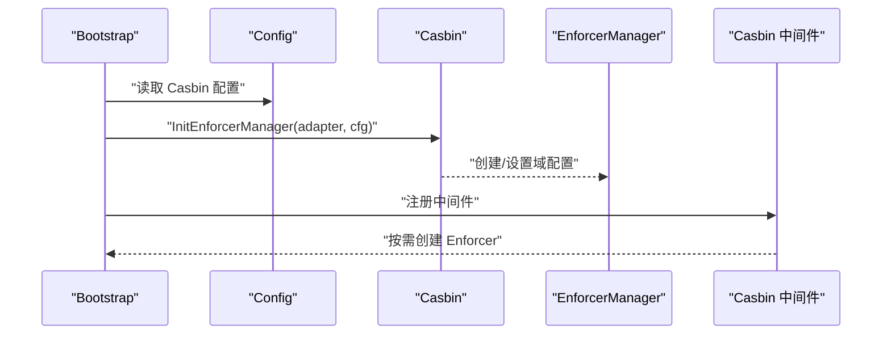

图表来源
- [casbin/casbin.go:48-79](file://casbin/casbin.go#L48-L79)

章节来源
- [casbin/casbin.go:12-79](file://casbin/casbin.go#L12-L79)

### 日志系统
- 设计要点
  - InitLogger 支持控制台与文件输出、滚动切割、JSON 编码；InitDefaultLogger 使用配置默认值。
  - 与 Fiber 集成：fiberzap.NewLogger 设置为 Fiber 日志记录器。
- 典型流程
  - 启动时调用 InitDefaultLogger；业务中使用 fiber.Ctx 或全局日志接口输出。

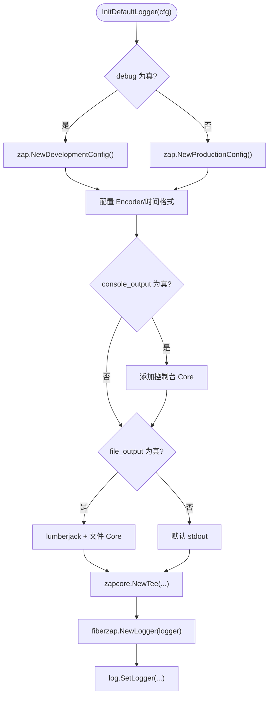

图表来源
- [log/log.go:14-84](file://log/log.go#L14-L84)

章节来源
- [log/log.go:14-84](file://log/log.go#L14-L84)

### 数据验证
- 设计要点
  - Validator 接口允许结构体自定义字段错误消息映射；GetValidatorErrorMsg 统一拼接错误。
- 典型流程
  - 结构体实现 Validator 接口；调用 validator.Validate 进行校验；通过 GetValidatorErrorMsg 获取最终错误字符串。

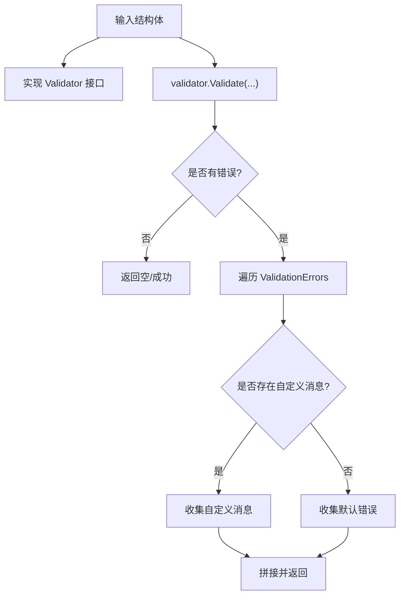

图表来源
- [validate/validate.go:10-58](file://validate/validate.go#L10-L58)

章节来源
- [validate/validate.go:10-58](file://validate/validate.go#L10-L58)

### 加解密
- 设计要点
  - HashPassword 使用 bcrypt 与随机盐值；VerifyPassword 校验密码。
- 典型流程
  - 注册阶段对用户密码进行 HashPassword；登录阶段使用 VerifyPassword 校验。

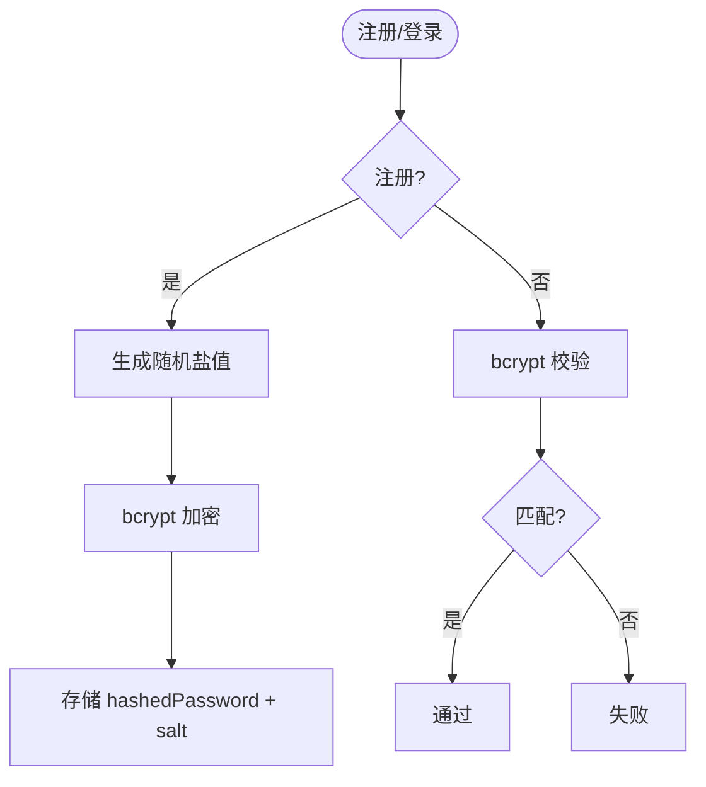

图表来源
- [crypto/crypto.go:10-80](file://crypto/crypto.go#L10-L80)

章节来源
- [crypto/crypto.go:10-80](file://crypto/crypto.go#L10-L80)

### ORM 与数据库
- 设计要点
  - GetDatabaseSourceDns 根据 driver 生成 DSN；GetDatabaseConfig 支持多连接与默认连接。
- 典型流程
  - 通过 config 读取连接配置；根据 driver 选择 DSN 格式；sql.Open 建立连接。

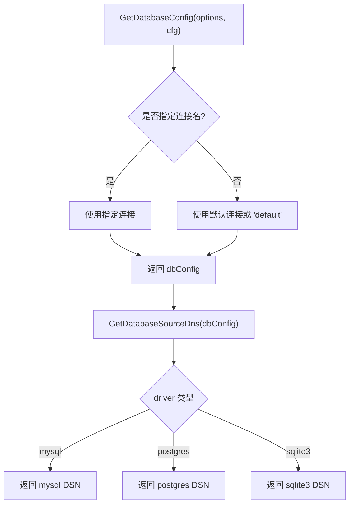

图表来源
- [orm/orm.go:18-63](file://orm/orm.go#L18-L63)

章节来源
- [orm/orm.go:10-63](file://orm/orm.go#L10-L63)

### HTTP 响应封装
- 设计要点
  - ApiResponse 统一返回结构：code/msg/data；Result/Success/Error 三类便捷方法。
- 典型流程
  - 控制器中构造 fiber.Map 数据；调用 Success/Error/Result 输出 JSON。

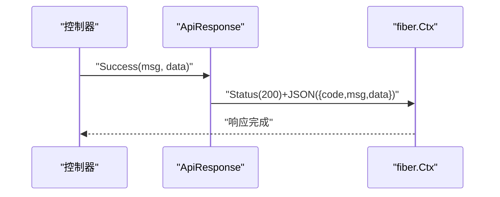

图表来源
- [http/ApiResponse.go:15-44](file://http/ApiResponse.go#L15-L44)

章节来源
- [http/ApiResponse.go:7-44](file://http/ApiResponse.go#L7-L44)

## 依赖分析
- 语言与版本
  - Go 1.25.1，确保现代语法与性能优化。
- 核心依赖
  - Web：Fiber v2
  - 配置：Viper + godotenv
  - 日志：Zap + fiberzap + lumberjack
  - 缓存：BigCache + gocache + go-redis
  - 认证：golang-jwt + gofiber/jwt
  - 授权：Casbin + gofiber/casbin
  - 验证：go-playground/validator
  - 文档：fiber/swagger + swaggo
- 依赖关系图

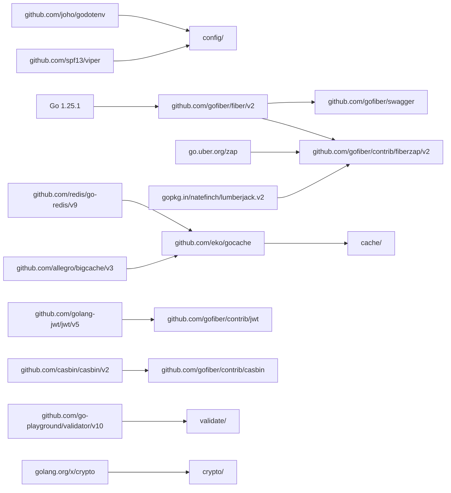

图表来源
- [go.mod:5-26](file://go.mod#L5-L26)

章节来源
- [go.mod:1-103](file://go.mod#L1-L103)

## 性能考虑
- 选择 Fiber v2 作为 Web 框架，具备极低分配与高吞吐特性，适合高并发场景。
- 缓存层采用 BigCache（内存）与 Redis（分布式），默认 TTL 由配置控制，减少数据库压力。
- 日志采用结构化 JSON 与滚动切割，避免阻塞与 IO 放大。
- 文件系统双写适配器在可靠性与性能之间平衡，适合对一致性要求高的场景。
- ORM 层使用 database/sql，避免额外 ORM 层开销，便于直接 SQL 优化。

## 故障排查指南
- 启动失败
  - 检查配置文件与 .env 是否正确加载；确认端口占用与权限。
  - 查看日志初始化是否成功，控制台与文件输出是否开启。
- 缓存不可用
  - 确认 cache.stores.*.driver 与 redis 连接配置；检查默认 TTL 与连接池参数。
- 文件存储异常
  - 校验 filesystem.disks.*.driver 与 options；S3 配置是否正确；IsAndLocal 是否导致双写失败。
- JWT/权限问题
  - 确认 secret 一致；检查中间件注册顺序；Casbin 模型路径与策略适配器。
- 数据库连接
  - 校验 driver 与 DSN；确认主机、端口、账号、密码与 SSL 模式。

章节来源
- [bootstrap/bootstrap.go:155-215](file://bootstrap/bootstrap.go#L155-L215)
- [config/config.go:102-220](file://config/config.go#L102-L220)
- [cache/cache.go:24-55](file://cache/cache.go#L24-L55)
- [filesystem/filesystem.go:157-191](file://filesystem/filesystem.go#L157-L191)
- [jwt/jwt.go:9-25](file://jwt/jwt.go#L9-L25)
- [casbin/casbin.go:48-79](file://casbin/casbin.go#L48-L79)
- [log/log.go:80-84](file://log/log.go#L80-L84)
- [orm/orm.go:18-63](file://orm/orm.go#L18-L63)

## 结论
CMF Core 以模块化与工程化为核心，通过 Bootstrap 服务容器与 Fiber 中间件链路，将配置、缓存、文件系统、认证授权、日志、验证、加解密与 ORM 等能力有机整合，既满足初学者的快速上手需求，也为资深开发者提供了可扩展、可维护的基础设施。配合清晰的默认约定与类型安全的依赖注入，能够高效支撑企业级 Web 应用的开发与演进。

## 附录
- 入门建议
  - 从 bootstrap.Run() 入手，理解初始化、中间件与路由注册流程。
  - 修改 config/*.yaml 与 .env，观察配置生效与日志输出。
  - 使用 cache.TypedCache[T] 与 filesystem.Adapter 快速实现业务功能。
  - 通过 jwt.NewJWTMiddleware 与 casbin.NewCasbinMiddleware 保护路由。
- 最佳实践
  - 将核心服务注册为单例，避免重复初始化。
  - 使用结构化日志与统一响应封装，提升可观测性与一致性。
  - 为敏感配置使用 .env.production，并限制文件权限。
  - 对外暴露的 API 使用 ApiResponse 统一返回格式。